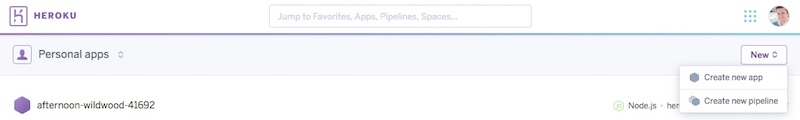
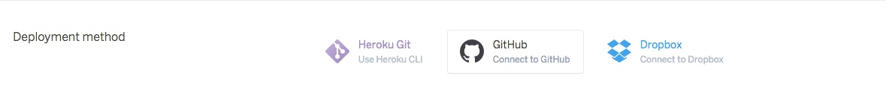
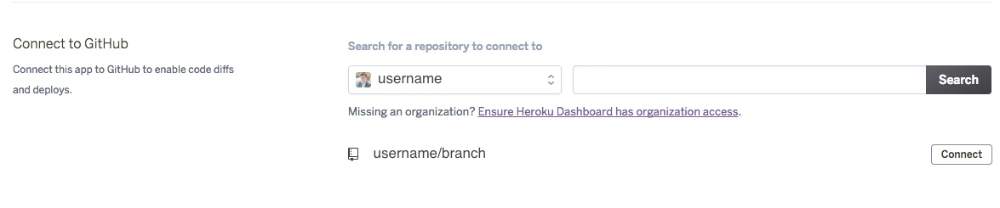
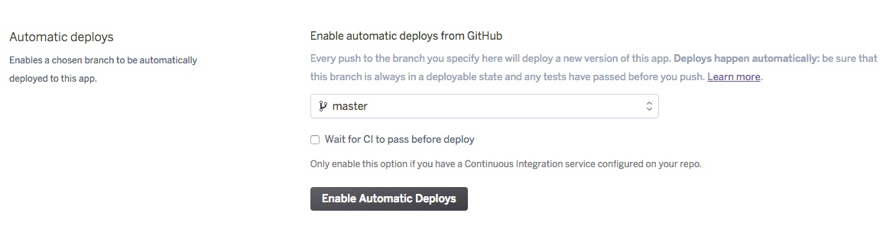
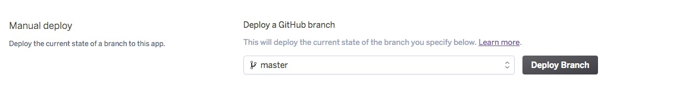
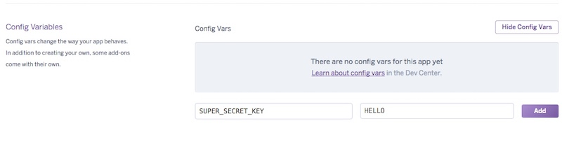

# Platform-as-a-service And Virtual-private-servers  

## Platform-as-a-service  

* A cloud computing model which delivers applications over the internet.

* Users access `PaaS` services through the web browsers and providers charge a flat monthly fee or a per-use fee.

* A `PaaS` provider, such as `Heroku`, delivers a pre-configured `platform` (both the hardware and software tools) needed for the development of applications.

* This makes it possible for developers to include cloud-hosted software logic into their applications.

* This platform is fully managed by the provider. The user does not have control or manages the underlying infrastructure.

* This enables developers to focus on application development without having to worry with the installation and maintenance of in-house hardware and software tools.

* Underlying infrastructure:

  * Hardware: servers, networks, and storage.
  
  * Software: OS, libraries, programming languages, database management system, server software, runtime environments, integration software and security software.
  
* Some of the cloud characteristics of PaaS are: high-availability, scalability, and multi-tenancy.

* PaaS makes it possible for developers to make frequent code changes, even change or upgrade OS features.

* PaaS makes the app development, testing and deployment quicker, simpler and more cost effective.

* The nature of PaaS makes collaboration easier.

* Other benefits:

  * HTTP Caching Server: static contents (CSS, images, etc) are loaded from cache, instead of having to be processed by the application server. This improves performance.
  
  * Redundancy: since resources are spread out geographically over multiple servers, it makes it to overcome failures with little or no downtime.
  
### PaaS providers  

* These are some `PaaS` providers: [Amazonw Web Services](https://aws.amazon.com/), [Heroku](https://www.heroku.com/), 
[Google App Engine](https://cloud.google.com/appengine/), [Azure](https://azure.microsoft.com/en-us/), and [Mendix](https://www.mendix.com/).

###  Virtual-private-servers  

* A `VPS` or a `virtual personal server` is a software-created emulation of a physical server.

* A `VPS` runs from a powerful host server (running Linux, FreeBSD or Windows) making it possible to run several `virtual 
machines` (using virtualization software such as `hypervisor`), each with their own specific configuration (OS, memory, storage, application, etc) and restricted access to a portion of the physical server's resources.

  * **Virtualiztion**:
  
    * `Containers`: it runs on the same OS as the host. It uses software to mimic the functionality of an independent server.

    * `Hardware virtualization`: all hardware components are emulated.
    
  * A dynamic `VPS` makes it possible to upgrade memory, storage, bandwidth, and processor while the server is running.

  * Upon signing up for the service, a user is assigned root administrative privileges and has full control over the server.

    * The user then selects the desired OS and subsequently can customize the server, and install, uninstall or update any OS compatible software.
    
  * **Hosting**:
  
    * A user can host multiple websites, such as a development website and a production website simultaneously.

    * A user can host services such as e-commerce, a mail server, or File Transfer Protocol.

* A `VPS` offers a flexible, scalable and affordable service where users have full control over the server, ranging from root access, IPs assignments, self-service reboots, and flexible OS switching.

* On the flip side, performance can be an issue. In some cases some `VM`'s might consume too many resources affecting the performance of adjacent `VM`'s. Some `VPS` providers may throttle a server's performance in order to maximize the number of `VM`'s running on the server. A `VPS` is also more expensive than `shared hosting`.

* Even though scalable (vertical or horizontal), the process is more involved that with `PaaS`, which can be scaled through a CLI or web portal.

* More importantly, compared to `PaaS`, **the user manages and maintains the system**.

*** VPS providers  

* Some `VPS` providers: [Digital Ocean](https://www.digitalocean.com/), [Linode](https://www.linode.com/).

---

# Deploying A Node application on Heroku  

## Terminology  

`Heroku`: a `cloud platform as a service` used for the deployment of web applications.1

## Heroku Account  

* Create a [Heroku Account](https://signup.heroku.com/).

## Deployment Using The Heroku CLI  

### Prerequisite  

* Create a local repository of your project.

* Install the Heroku Command Line Interface (CLI).

  * Download it [here](https://devcenter.heroku.com/articles/getting-started-with-nodejs#set-up).
  
* Login to Heroku using the Heroku CLI.

```
$ heroku login
Enter your Heroku credentials.
Email: zeke@example.com
Password:
...
```

### Deploying to Heroku  

* `cd` into the project directory.

* Create the app on Heroku:

```
heroku create
```

* This creates a git remote (named `heroku`), which is associated with the local git repository.

* Heroku also generates a random name for the app. To add a name of your choice, simply add it to the end of the command: 
`$ heroku create APP-NAME`

* Then, deploy the app:

```
git push heroku master
```

* Ensure that an instance of the app is running:

```
heroku ps:scale web=1
```

* Open the app:

```
heroku open
```

### Provisioning add-ons and databases  

* [Provisioning add-ons.](https://devcenter.heroku.com/articles/getting-started-with-nodejs#provision-add-ons)

* [Provisioning a database.](https://devcenter.heroku.com/articles/getting-started-with-nodejs#provision-a-database)

## Manual Deployment  

* Login to your Heroku account and then head over to 'apps'.

* Click on new and then, create new app.



* Next, give your app a name or a random name will be generated.

* Select the appropriate 'Deployment method'. Since we covered the `Heroku CLI` method already, select 
**'connect to GitHub'**.



* Search for and select (click on **'connect'**) your repository from **'Connect to GitHub'**.



* Then, select **'Enable Automatic Deploys'** from **'Automatic deploys'**.



* Select **'Deploy Branch'** from **'Manual deploy'**.



* Finally, open your app by selecting **'view'**.

### Provisioning add-ons  

* From the `Heroku` console, select the desired app.

  * Under **'Resources'** look for the desired resource using the 'add-ons' search box, for example: mongo.
  
  * Select, for example, 'mLab MongoDB'.
  
  * Select 'Sandbox -- Free' under **'Plan Name'**.
  
  Then, select **'provision'**.
  
## Configuring And Accessing App Environmental Variables  

Many `APIs` require certain variables in order to operate, such as `API` keys, secrets, tokens, etc. There are two ways to set these variables.

### Heroku CLI  

* Setting variables:

```
$ heroku config:set VARIABLE_NAME=VALUE
```

* Then, do the following to set the variables in the app.

```
$ heroku local
```

* Viewing variables

```
$ heroku config
```

### Manually  

* Select the desired app.

* Under **'Settings'** select **Reveal Config Vars** ('Config Variables')

  * Enter the required configuration variables, such as API key, secrets, etc.
  


### Accessing the variables  

* In this example we created the following environmental variable: API_KEY=foo

Example

```javascript
app.get('/example', function(request, response) {
    var result = ''
    var key = process.env.API_KEY;
    function apiExample(key){
      //Do something with key...
    }
  res.send('Successfully connected to API');
});
```

#### Lesson Footnotes

* 1: [Heroku](https://www.heroku.com/what)

---

# Sending Emails with SendGrid  

## Terminology  

`SendGrid`: cloud-based SMTP provider.

## Setup and Installation  

* Register for a trial [SendGrid account.](https://app.sendgrid.com/signup?id=71713987-9f01-4dea-b3d4-8d0bcd9d53ed&co=true)

  * Login and retrieve your API key from 'settings' in the dashboard.

* Install SendGrid in your project directory: `$ npm install sendgrid --save`

## SendGrid API  

* See [docs](https://sendgrid.com/docs/API_Reference/api_v3.html) for full implementation details.

  * [Node.js implementation with mail helper class and without mail helper class.](https://github.com/sendgrid/sendgrid-nodejs)
  
## Basic Implementation  

* In this example we use the 'mail helper class'.

### Context  

* An app that uses a basic form to send emails.

**Email form:**

sendgrid-send.jpeg

**Confirmation page:**

sendgrid-sent.jpeg

## App Structure  

* `App`

  * `views`

    * index.mustache
    
    * sent.mustache
    
  * app.js
  
  * package.json
  
## Environmental Variable Setup  

```
echo "export SENDGRID_API_KEY='YOUR_API_KEY'" > sendgrid.env
echo "sendgrid.env" >> .gitignore
source ./sendgrid.env
```

## App Setup  

```javascript
var express = require('express');
var path = require('path');
var bodyParser = require('body-parser');
var mustacheExpress = require('mustache-express');
var router = express.Router();

var app = express();

// SendGrid Setup:
var sendgridApiKey = 'your-api-key';
// Recommended:
// In development use the environmental variable:
// var sendgridApiKey = process.env.SENDGRID_API_KEY;
var Sendgrid = require('sendgrid')(sendgridApiKey);
var helper = require('sendgrid').mail;

// Setup view engine:
app.engine('mustache', mustacheExpress());
app.set('views', './views');
app.set('view engine', 'mustache');

// Parse form data:
app.use(bodyParser.json());
app.use(bodyParser.urlencoded({ extended: false }));

app.get('/', function (req, res) {
  // Render email form:
  res.render('index');
})

// Send email on post:

app.post('/email/sent', function(req, res, next){
var fromEmail = new helper.Email(req.body.from);
var toEmail = new helper.Email(req.body.to);
var subject = req.body.subject;
var content = new helper.Content('text/plain', req.body.message); // Two parameters needed: type and value.
// It is possible to set the content to HTML:
//      "type": "text/html",
//      "value": "<html><p>Hello, world!</p></html>"

var mail = new helper.Mail(fromEmail, subject, toEmail, content);
  var sgReq = Sendgrid.emptyRequest({
    method: 'POST',
    path: '/v3/mail/send',
    body: mail.toJSON()
  });

  Sendgrid.API(sgReq, function (err) {
    if (err) {
      next(err);
      return;
    }
    // Render success page:
    res.render('sent', { message: 'Your email was sent!', user: req.body.user })
    return;
  });
});

// Error handlers...

app.listen(3000, function () {
  console.log('Successfully started node application!')
})
```

## Try it!  

SendGrid App Example

---

# Storing and retrieving objects in S3 block storage  

## Terminology  

`S3`: stands for simple storage service.

> Amazon Simple Storage Service (Amazon S3) is object storage with a simple web service interface to store and retrieve any amount of data from anywhere on the web. It is designed to deliver 99.999999999% durability, and scale past trillions of objects worldwide.1

`Bucket`: `AWS S3` storage resource for storing objects.2

* Bucket names are globally unique.

* Buckets are region specific.

## S3 Storage Methods  

### Creating a bucket  

* For the latest method, see the CreateBucket docs.

* Basic bucket creation.

```javascript
var params = {
 Bucket: "examplebucket" /* required */
};
s3.createBucket(params, function(err, data) {
  if (err) console.log(err, err.stack); // an error occurred
  else     console.log(data);           // successful response
})
```

* Advanced bucket creation, specifying access rights and location constraints.

```javascript
var params = {
  Bucket: 'STRING_VALUE', /* required */
  ACL: private | public-read | public-read-write | authenticated-read,
  CreateBucketConfiguration: {
    LocationConstraint: EU | eu-west-1 | us-west-1 | us-west-2 | ap-south-1 | ap-southeast-1 | ap-southeast-2 | ap-northeast-1 | sa-east-1 | cn-north-1 | eu-central-1
  },
  GrantFullControl: 'STRING_VALUE',
  GrantRead: 'STRING_VALUE',
  GrantReadACP: 'STRING_VALUE',
  GrantWrite: 'STRING_VALUE',
  GrantWriteACP: 'STRING_VALUE'
};
s3.createBucket(params, function(err, data) {
  if (err) console.log(err, err.stack); // an error occurred
  else     console.log(data);           // successful response
});
```

Uploading an object  

For the latest method, see the putObject docs.

See 'Implementation' for details about using the Multer / Multer-s3 modules and AWS to upload a file.

var params = {
 Body: <Binary String>,
 Bucket: "examplebucket",
 Key: "HappyFace.jpg"
};
s3.putObject(params, function(err, data) {
  if (err) console.log(err, err.stack); // an error occurred
  else     console.log(data);           // successful response
  /*
  data = {
   ETag: "\"6805f2cfc46c0f04559748bb039d69ae\"",
   VersionId: "tpf3zF08nBplQK1XLOefGskR7mGDwcDk"
  }
  */
});
Retrieving an object  

For the latest method, see the GetObject docs.
var params = {
  Bucket: "examplebucket", /* required */
  Key: "HappyFace.jpg" /* required */
 };
 s3.getObject(params, function(err, data) {
   if (err) console.log(err, err.stack); // an error occurred
   else     console.log(data);           // successful response
   /*
   data = {
    AcceptRanges: "bytes",
    ContentLength: 3191,
    ContentType: "image/jpeg",
    ETag: "\"6805f2cfc46c0f04559748bb039d69ae\"",
    LastModified: <Date Representation>,
    Metadata: {
    },
    TagCount: 2,
    VersionId: "null"
   }
   */
 });
Listing Buckets  

For the latest method, see the ListBuckets docs.
s3.listBuckets(function(err, data) {
  if (err) console.log(err, err.stack); // an error occurred
  else     console.log(data);           // successful response
});
Deleting a Bucket  

For the latest method, see the DeleteBucket docs.
Bucket must be empty first!
var params = {
  Bucket: 'STRING_VALUE' /* required */
};
s3.deleteBucket(params, function(err, data) {
  if (err) console.log(err, err.stack); // an error occurred
  else     console.log(data);           // successful response
});
Deleting an object  

For the latest method, see the DeleteObject docs.
var params = {
 Bucket: "examplebucket", /* required */
 Key: "objectkey.jpg" /* required */
};
s3.deleteObject(params, function(err, data) {
  if (err) console.log(err, err.stack); // an error occurred
  else     console.log(data);           // successful response
  /*
  data = {
  }
  */
});
Implementation  

The following implementation is a basic example of how to use these methods in an Express setting.
Note that this example only covers the basics, so your production implementation should have more robust features such as:
User login.
Authentication.
Input sanitation.
Router.
Error handlers.
etc.
In this basic implementation setting we use specific routes to exemplify each method. This is for demonstration purposes, only.
It would be more useful to have a separate file with all methods in order to call them whenever needed in app.js.
Prerequisite  

Create an AWS free account.
Retrieve your key and secret.
Under your account name, go to My Security Credentials
Retrieve key and secret from 'Access Keys (Access Key ID and Secret Access Key)'.
Setup  

Install Multer, multer-s3, express-handlebars, and aws-sdk  

npm install multer multer-s3 aws-sdk mustache-express --save
Setup s3 config.json file  

Create a file named s3config.json.
Save to your project folder and save your credentials.
{
   "accessKeyId": "access key id goes here",
   "secretAccessKey": "secret access key goes here",
   "region": "us-east-1" // See 'region' note below.
}
Region: find your region here.
App structure  

App
public
css
styles.css
views
layouts
header
view
upload
message
select_create_bucket
delete_bucket
app.js
package.json
s3config.json
app.js  

var express = require( 'express' );
var path = require( 'path' );
var app = express();
var bodyParser = require( 'body-parser' );

// Import mustache
var mustacheExpress = require( 'mustache-express' );


// Import multer and multer-s3
var multer = require( 'multer' );
var multerS3 = require( 'multer-s3' );


// Import, set up AWS and import AWS configuration.
var AWS = require( 'aws-sdk' );
AWS.config.loadFromPath( './s3config.json' );
var s3 = new AWS.S3();


// App use
app.use( express.static( __dirname + '/public' ) );
app.use( bodyParser.json() );
app.use( bodyParser.urlencoded( {
  extended: false
} ) );

// View engine
app.engine( 'mustache', mustacheExpress() );
// Specify layout and layout location
app.set( 'view engine', 'mustache' );
app.set( 'views', __dirname + '/views' );

// Multer/Multer-s3 & AWS upload method
var upload = multer( {
  storage: multerS3( {
    s3: s3,
    bucket: function( req, file, cb ) {
      cb( null, req.body.bucket ) // Save file to selected bucket.
    },
    metadata: function( req, file, cb ) {
      cb( null, {
        fieldName: file.fieldname
      } );
    },
    key: function( req, file, cb ) {
      //console.log( 'file ', file );
      cb( null, file.originalname );
    }
  } )
} );


// Select bucket,  display buckets, create bucket
app.get( '/', function( req, res, next ) {
  s3.listBuckets( {}, function( err, data ) {
    if ( err ) {
      return res.render( 'message', {
        warning: "Error",
        message: err.message,
        code: err.code
      } );
    }
    var buckets = data.Buckets;
    var bucketsCounter = buckets.length;
    var showBuckets = true; // Set render conditions
    if ( bucketsCounter == 0 ) {
      showBuckets = false;
    }
    res.render( 'select_create_bucket', { // Render form and bucket list.
      bucketItems: buckets,
      counter: bucketsCounter,
      showBuckets: showBuckets
    } )
  } );
} );


// Get buckets and upload to selected bucket
app.get( '/bucket/upload', function( req, res, next ) {
  s3.listBuckets( {}, function( err, data ) {
    if ( err ) {
      return res.render( 'message', {
        warning: "Error",
        message: err.message,
        code: err.code
      } );
    }
    var buckets = data.Buckets;
    res.render( 'upload', { // Render form and bucket list.
      buckets: buckets
    } )
  } );
} );

// Get all buckets and display objects from selected bucket
app.get( '/bucket', function( req, res, next ) {
  s3.listBuckets( {}, function( err, data ) {
    if ( err ) {
      return res.render( 'message', {
        warning: "Error",
        message: err.message,
        code: err.code
      } );
    }
    var buckets = data.Buckets;
    res.render( 'selectbucket', { // Render form and bucket list.
      buckets: buckets
    } )
  } );
} );

// Get all buckets and select bucket for deletion
app.get( '/bucket/delete', function( req, res, next ) {
  s3.listBuckets( {}, function( err, data ) {
    if ( err ) {
      return res.render( 'message', {
        warning: "Error",
        message: err.message,
        code: err.code
      } );
    }
    var buckets = data.Buckets;
    res.render( 'delete_bucket', { // Render form and bucket list.
      buckets: buckets
    } )
  } );
} );

// View objects from selected bucket
app.post( '/view', function( req, res, next ) {
  var params = {
    Bucket: req.body.bucket || bucket
  }; // Set Bucket parameter for listObjects()
  s3.listObjects( params, function( err, data ) {
    var bucketContents = data.Contents;
    var show = true; // Set render conditions
    if ( bucketContents == 0 ) {
      show = false;
    }
    var files = []; // Create array to store urls and keys (file names).
    for ( var i = 0; i < bucketContents.length; i++ ) { // Loop over bucketContents
      var urlParams = {
        Bucket: params.Bucket,
        Key: bucketContents[ i ].Key
      };
      s3.getSignedUrl( 'getObject', urlParams, function( err, url, key ) { //Get signed url.
        files.push( bucket = { //Push to array.
          file: urlParams.Key,
          url: url,
        } );
        app.set( 'bucket', params.Bucket )
      } );
    }
    res.render( 'view', {
      files: files,
      bucket: params.Bucket,
      show: show,
    } );
  } );
} )

// Create bucket
app.post( '/', function( req, res, next ) {
  var bucket = req.body.bucket;
  var params = {
    Bucket: bucket
  };
  s3.createBucket( params, function( err, data ) {
    if ( err ) {
      return res.render( 'message', {
        warning: "Error",
        message: err.message,
        code: err.code
      } );
    }
    var location = data.Location;
    res.render( 'view', {
      bucket: bucket
    } ); // Render view after creating bucket
  } );
} );


// File upload to selected bucket
app.post( '/bucket/upload/success', upload.single( 'file' ), function( req, res, next ) {
  var data = req.file.originalname;
  var location = req.file.location;
  var bucket = req.body.bucket;
  res.render( 'message', {
    success: "Success!",
    uploaded: "Successfully uploaded, " + data + " to " + location + " in: ",
    bucket: bucket
  } );
} );

// Delete object from selected bucket
app.post( '/view/delete/', function( req, res, next ) {
  var key = req.body.data;
  var bucket = app.get( 'bucket' );
  var params = {
    Bucket: bucket,
    Key: key
  };

  s3.deleteObject( params, function( err, data ) {
    if ( err ) {
      return res.render( 'message', {
        warning: "Error",
        message: err.message,
        code: err.code,
        bucket: bucket,
      } );
    } else {
      res.render( 'message', {
        success: "Success!",
        deleted: params.Key + " has been deleted!",
        bucket: bucket,
      } );
    }
  } );
} );

// Delete selected bucket
// Bucket must be empty, first!
app.post( '/bucket/delete', function( req, res, next ) {
  var bucket = req.body.bucket;
  //console.log( bucket )
  var params = {
    Bucket: bucket
  };
  s3.listObjects( params, function( err, data ) {
    var bucketContents = data.Contents;
    if ( bucketContents.length >= 1 ) { // If bucket has content, empty it first...
      console.log( "Emptying bucket first..." )
      for ( var i = 0; i < bucketContents.length; i++ ) {
        var params = {
          Bucket: bucket,
          Key: bucketContents[ i ].Key
        };
        s3.deleteObject( params, function( err, data, next ) {
          if ( err ) {
            return res.render( 'message', {
              warning: "Error",
              message: err.message,
              code: err.code
            } );
          } else { // Once it is empty, delete the bucket...
            console.log( 'Deleting bucket...' )
            var params = {
              Bucket: bucket
            }
            s3.deleteBucket( params, function( err, data ) {
              if ( err ) {
                return res.render( 'message', {
                  warning: "Error",
                  message: err.message,
                  code: err.code
                } );
              }
              console.log( 'Done deleting bucket.' )
              res.render( 'message', {
                success: "Success!",
                bucketDelete: bucket + " was successfully delted!"
              } );
            } );
          }
        } );
      }
    } else if ( bucketContents.length == 0 ) { // If bucket is empty, delete it...
      console.log( 'Bucket is empty, deleting...' )
      var params = {
        Bucket: bucket
      }
      s3.deleteBucket( params, function( err, data ) {
        if ( err ) {
          return res.render( 'message', {
            warning: "Error",
            message: err.message,
            code: err.code
          } );
        }
        console.log( 'Done deleting bucket.' )
        res.render( 'message', {
          success: "Success!",
          bucketDelete: bucket + " was successfully delted!"
        } );
      } );
    }
  } );
} );

// Error handlers...


app.listen( 3000, function() {
  console.log( 'Successfully started node application!' )
} )

Try it!  

s3_example.zip (9 MB)

First, create a AWS account, look up your region, and get your key / secret.
Add them to s3config.json.
Then, npm start
Lesson Footnotes
1: AWS - S3
2: AWS - S3 Bucket
Block Level Storage  

Block level storage is a widely used storage system technology

sometimes called a physical record
uses Storage Area Network (SAN) storage
composed of raw volumes of storage or blocks
blocks have a max width
blocks can be controlled as an individual hard drive
blocks controlled by server based operating systems
blocks can be individually formatted with the required file system
Usage  

used in server side processing, with Java, Ruby, .Net, and other programming languages
usually abstracted by a file system or database management system (DBMS)
works well for file systems and databases
provides consistent I/O performance and low-latency connectivity
can be used to store files
data transportation is efficient and reliable
can work for virtual machines
can be used for RAID Volumes, combining multiple disks organized through stripping or mirroring
used in running applications like Oracle, SAP, Microsoft Exchange, and Microsoft SharePoint
supports individual formatting of file systems like NFS, NTFS or SMB (Windows) or VMFS (VMware)
Commonly used Providers  

AWS Elastic Block Storage (EBS)
Rackspace Cloud Block Storage
Azure Premium Storage
Google Persistent Disks
