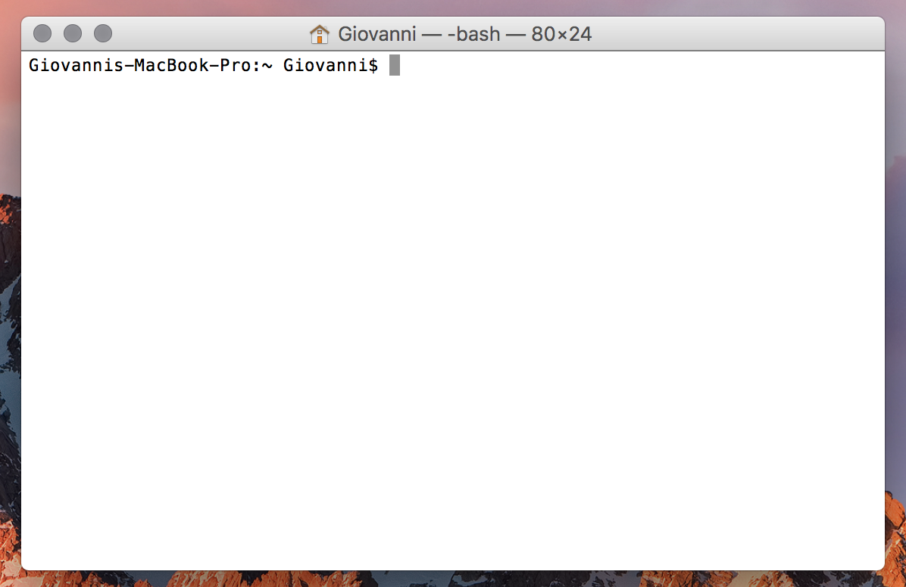
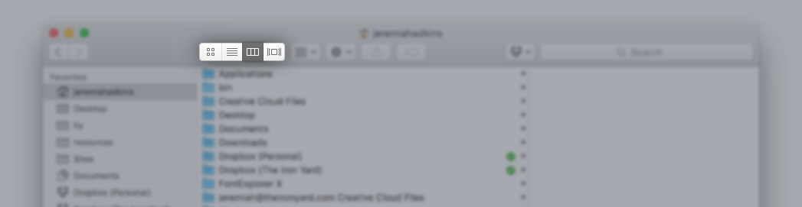

# Introduction

The command line is a powerful interface to the deepest and most powerful features of your computer. The text-based 
interface can seem daunting at first, difficult to understand and hard to follow, but learning to manage it is essential 
for every programmer. In this lesson, you'll learn some of the basic tools and features to get started with the command line.

---

# File System Traversal  

To reach files on your computer, you must learn how to traverse and examine your file system. In UNIX operating systems, directories (also known as folders) are used to organize files in a hierarchical structure. A directory can contain files and other directories. Each of those directories can contain other directories and files; and so on. The Mac operating system is called macOS.

Mac provides two methods for managing and traversing file systems, a Graphical User Interface (GUI) program called Finder and a command line interface (CLI) in Terminal. Finder allows you to view files and folders visually, as lists of icons that can be manipulated with a mouse. The CLI provides a text-based interface that utilizes a special programming language called "Bash." The CLI is considerably more powerful than Finder, and most programmers prefer it for managing projects and for interacting with tools like Git. MacOS is related to a family of operating systems called UNIX.

You can find Terminal in your `Applications` folder. Open Terminal, and you will see an application that somewhat resembles a text editor. Terminal is an application that allows you to enter text commands to the computer. The "prompt" is a short statement that tells you a few things about where you are on your computer and who you are. The following screenshot shows what you might see when you open Terminal.

The prompt is `Giovannis-Macbook-Pro:~ Giovanni$`. The first part of the prompt `Giovannis-Macbook-Pro:` tells us what computer is in use. The second part `~` tells us where we are on the computer. `~` is shorthand for the Home folder. The third part of the prompt is `Giovanni$`. It specifies which user is active.



> The prompt is easily customized to show additional information or to highlight different types of files and folders with different colors. Additionally, other applications can also access the command line interface of the operating system. A popular alternative to Terminal is iTerm 2. You may see examples of Terminal and iTerm in these lessons.

In this lesson, you will learn how to navigate the macOS file system from the command line. To begin, we'll cover some basic terms and concepts.

## Paths  

Paths are a way to describe the location of a file or a folder on a computer's file system. They function as street addresses for your files. Paths are composed of a folder, filenames, and symbols which we will discuss below.

> The term `folder` is synonymous with `directory`, macOS primarily uses `folder` in Finder, but `directory` in Terminal.

### Separators  

The slashes (`/`) are called separators - they break apart a path into the hierarchy of directories to get to the file or subdirectory. For instance, `~/Documents/project/file.html` tells the computer to look in the Home directory - `~` - for a folder called `Documents`. If it finds `Documents`, then it looks inside `Documents` for a folder called `projects`. If it finds `projects` then the computer looks for a file called `file.html`. The / separator tells the computer how to traverse the file system.

### Root Directory  

The "Root Directory" is the base folder for the computer's file systems. The root directory has no parent folder and is indicated by `/`.

If a path starts with a `/`, it starts at the root of the filesystem, which is indicated by a lone `/`. `/Users/jessie` means "start at the root of the filesystem, go into a directory called `Users`, and then go into a directory called `jessie`."

### Current Working Directory  

The "Current Working Directory" is whichever folder Terminal is currently inspecting. The prompt `Giovannis-Macbook-Pro:~ Giovanni$` shows `~` as the current working directory. Any commands we issue will be in this directory.

### Home Directory  

Every user has a "Home Directory." Mac offers a simple alias for that home directory in the character `~`. Because every user has a different user name, it's convenient to have a single character alias to access that folder regardless of the user. When you open a new terminal window, the default working directory is your home directory. The home directory is where the operating system stores documents, settings, and other user-specific information.

For the default prompt, the current working directory (or at least a part of it) is shown before the `$`. You might see a `~` character in your prompt - this is a shortcut for your Home directory. In other words, these two paths are equivalent: `~/projects and /Users/jessie/projects`

## Absolute and Relative Paths  

*Absolute paths start with a leading* `/` and always begin and the root directory.

*Relative paths do not start with a* `/` and begin in the current working directory. If you don't use a leading `/`, the directory is a relative path.

In the prompt `Giovannis-MacBook-Pro:Applications Giovanni$`, the current working directory is `~/Applications`.

If the current working directory is `~/Applications`, the absolute path `/files/file.html` and the relative path `files/file.html` will look for `file.html` in two different places.

`/files/file.html` is an absolute path and will go the the root system folder, find a folder called `files` and look within it for `file.html`.

`files/file.html` is a relative path and will start in the current working directory `~/Applications`. The relative path is looking for `~/Applications/files/file.html`.

### Absolute Path Examples

```sh
/Users/jessie/Downloads
/files/file.html
/Applications/Dropbox
```

### Relative Path Examples

```sh
Downloads/screenshot.png
files/file.html
sandbox/vue_dev
```

## Common Commands  

Dozens of useful commands and tools are available every time you open Terminal. In this section, we will discuss some common commands for navigating around file systems.

The following code samples will be in two parts: the input command and the output. Any line that starts with `$` is an input. That means you type it. You don't need to type the `$`; it's just a stand-in for the prompt. The second part of the code sample is the output from the command. When you issue commands, the computer will often print information to the console.

When practicing the command, type in the command (minus `$`) and press "Return." The output to your console should resemble what the output of the code sample. It might not be *exactly* the same if you've added or removed some files and folders.

### Print Working Directory  

The `pwd` command is used to print the current working directory.

```sh
$ pwd
/Users/<your username>
```

### List Directory  

The `ls` command is used to list the contents of the current working directory, including sub-directories and files. If you are in your Home directory `~`, then you should see a list of the default Mac folders.

```sh
$ ls
Applications    Documents   Library     Music       Public
Desktop     Downloads   Movies      Pictures    projects
```

`ls` has a variety of command-line options. It can print detailed lists, hidden files, recursively listed subdirectories, and so on. These options are attractive, but not necessary. They are listed here as a reference. `ls` is enough 90% of the time.

```sh
$ ls
$ ls -1  // list directory contents one per line
$ ls -l  // use a long listing format
$ ls -a  // all: do not ignore entries starting with . or ..
$ ls -i  // list file's inode index number
$ ls -R  // recursive: list subdirectories recursively
$ ls -la // list long format including hidden files
$ ls -lh // list long format with readable file size
```

### Change Directory  

The `cd` or "change directory" command allows us to change the current working directory by navigating down into subdirectories and up into parent directories.

### Move Down into a Sub-directory

Type `cd` followed by the path to the subdirectory you want to be the current working directory.

```sh
$ cd Downloads
$ ls
someFile.txt   anotherFile.jpg
```

We just took a step into the subdirectory `Downloads`. If we `pwd` now, we'll see that we are in `/Users/<your username>/Downloads`. You may have directories inside the Downloads directory - you can `cd` into these too!

### Move Up into the Parent Directory

`cd ..` is used to move up to the parent directory. Since each folder only has one parent, the cd command to move up is the same regardless of the current working directory. `..` is an alias for "parent directory" (that is, the directory that contains the current working directory).

```sh
$ pwd
/Users/jessie/Downloads
$ cd ..
$ pwd
/Users/jessie
```

You can combine any of these paths to go up and down levels. If we start in the Downloads directory, we can use the command below to go back up to our user directory, then into a directory called projects, and into another directory (a "subdirectory") called "tiy":

```sh
$ pwd
/Users/jessie/Downloads
$ cd ../projects/tiy
$ pwd
/Users/jessie/projects/tiy
```

### The Current Directory
You can access the current directory using a single dot `..`

```sh
$ cd ./jessie/projects
```

### Navigate to the Home Directory

```sh
$ cd ~
```

### Navigate to the Root Directory

```sh
$ cd /
```

## Conclusion  

Understanding the basic commands allows us to traverse our system without Finder. We have the ability to traverse up to parent directories and down into sub directories. We can also print information about the contents of the current working directory and path.

### References  

[IBM - UNIX tips and tricks for a new user](https://www.ibm.com/developerworks/aix/tutorials/au-unixtips1/)

---

# File Manipulation  

It is important to understand the fundamentals of file manipulation via the terminal. These skills enable a user to create, read, update and destroy files, directories and applications. In this article we'll cover creating and deleting files and directories. Well also discuss editing, opening, printing, and writing to files. Finally, we'll cover renaming, copying and moving files and directories, and combining and compressing files and directories.

## Make and Remove  

### Make Directory  

It is possible to make directories from the command line using the `mkdir` command.

`$` represents the placement of the cursor before input through the command line

```sh
$ mkdir tiy
$ cd tiy
$ pwd
/Users/jessie/tiy
$ ls
$ # Nothing here yet because this directory was just created
```

### Remove Directory  

A directory can also be removed with the `rmdir` command.

```sh
$ pwd
/Users/jessie
$ ls
Applications Documents    Library      Music        Public
Desktop      Downloads    Movies       Pictures     repos
$ rmdir repos
$ ls
Applications Documents    Library      Music        Public
Desktop      Downloads    Movies       Pictures
```

### Make File  

You can also create files from the command line. The `touch` command creates a file if it doesn't exist, and also updates its last modified time to the current time (the last time it was touched).

```sh
$ touch newfile.txt
$ ls
newfile.txt
```

### Remove File  

You may want to remove a file using the command line. The `rm` command will remove a specified file at the path provided.

```sh
$ ls
newfile.txt
$ rm newfile.txt
$ ls
$ # Nothing here
```

### Remove Directory and Contents  

If the directory is not empty, you can use `rm -r` to recursively remove the directory and all of its contents. Be very careful using this command. Make sure you want to permanently delete the directory and its entire contents.

## Editing files  

### Write to file  

It's even possible to edit files directly from the command line (though you are best off using a real text editor for any serious editing). You can use the `echo` command, combined with the redirect operator `>`, to write to a file.

> `>` will overwrite the contents of an existing file (or create and write to it) `>>` will append to the content of an existing file (or create and write to it)

```sh
$ echo "Hello world" > newfile.txt
$ ls -la
-rw-r--r--     1 jessie  staff     22 May 11 11:13 newfile.txt
```

### Open a file  

If we want to use the system application to open a particular file, we can use the `open` command:

```sh
$ open newfile.txt
```

This will launch the default system application for `.txt` files. If we wanted to do any serious editing, we probably should use an editor like Atom.

```sh
$ atom newfile.txt
```

But what if we wanted to just look at the contents really quickly, without leaving the terminal?

### Print File Contents  

The `cat` command will simply print out the contents of files we pass it:

```sh
$ cat newfile.txt
Hello world
```

### Print File Contents (Shortened)  

If you have a long file, though, cat can be frustrating, because it will print the WHOLE file. For that, it's often handy to use a program called `less`:

```sh
$ less newfile.txt
```

`less` shows you just one screenful of information at a time. You can use the arrow keys to move around the file. Pressing space will skip down a whole screen. When you're done looking at the file, press the `q` key to quit.

## Copying, Moving, and Renaming  

### Copy Files or Directories  

The `cp` command duplicates one or more files or directories. When we need to copy a directory, we use the `cp -R` which will recursively copy the directory and files it contains.

```sh
$ cp <filename> <directory-it-should-be-copied-to>
$ cp -R <directory> <directory-it-should-be-copied-to>
```

Example:

```sh
$ cp newfile.txt newcopy.txt
$ cat newcopy.txt
Hello world
```

### Moving Files  

The `mv` command can be used to move a files

```sh
$ mv newcopy.txt ..
$ cd ..
$ cat newcopy.txt
Hello world
```

This moves `newcopy.txt` to the parent directory.

### Renaming  

Renaming is as easy as moving because it actually is moving! Rather than specify a directory, though, you specify the new filename you want to use, like this:

```sh
$ mv newcopy.txt specialfile.txt
$ cat specialfile.txt
Hello world
```

## Compressing Files and Directories  

### Tape Archiver  

The tape archiver method, `tar`, can quickly group files together into a single archive (file). Provide options, followed by the name of the new `.tar` file you want to create, followed by the directory you want to combine.

```sh
$ cd ~
$ tar cvf tmp/repos.tar repos
$ cd tmp
$ ls
repos.tar
```

Notice that a new file `repos.tar` exists in our `tmp` directory.

This example uses the command-line options `cvf`:

* `c` stands for create, which tells tar to create a new archive.
* `v` stands for verbose, telling tar to show a listing of each file that goes into the archive.
* `f` stands for file, telling tar to write the archive to a file rather than a device.

### Extract TAR  

Next, extract the contents of the archive:

```sh
$ cd ~/tmp
$ ls
$ tar xvf repos.tar
$ ls
```

Notice the new directory `repos` in the `tmp` folder.

Go ahead and remove the `tmp` folder because you won't need it any further

```sh
$ cd ~
$ rm -rf tmp
$ ls
```

### Compressing  

Once you have a `tar` file, you might want to compress it. A number of compression options are available in most UNIX distributions, but this tutorial focuses on using gzip to create something commonly called a tarball. A tarball is a tar file that has been compressed. Go ahead and create a compressed version of tutorial.tar so that it takes up less space:

```sh
$ cd ~/tmp
$ gzip repos.tar
$ ls
```

Your repos.tar archives are now compressed and renamed `repos.tar.gz`. This is a tarball. To uncompress it, type:

```sh
$ gzip -d repos.tar.gz
```

## Conclusion  

With these simple yet powerful commands we can create, read, update and destroy files and directories. We can create and delete files and directories. We can edit, open, print, and write to files. Lastly, we can rename, copy, move, combine, and compress files and directories. We have complete control over our files and directories from the terminal.

### References  

[IBM - UNIX tips and tricks for a new user](https://www.ibm.com/developerworks/aix/tutorials/au-unixtips1/)

---

# Start Pause and Cancel Scripts  

Let's get to know our shell, Bash, a little better. We can do much more than interface with our machine and run commands from our terminal. We can also start, pause, and cancel scripts (programs).

## Bash and Shell Scripts  

A shell is a user interface which accesses an operating system's services. In general, operating system shells use either a command-line interface (CLI) or graphical user interface (GUI).

### Bash  

The Bash shell is a command language interpreter that executes commands read from the standard input or from a file.

Every time you enter a command into your terminal, Bash will execute that command. But Bash can also execute commands from within a file, allowing us to create re-usable and shareable scripts.

### Shell Scripts  

A shell script is simply a program, typically text in a file, written in a language designed to be interpreted by a shell such as Bash.

The syntax for writing shell scripts is identical to entering commands right into the command-line. For example, I might have a shell script in a file called `script.sh` that looks like this:

```sh
#!/bin/bash
echo 'A man a plan a canal panama'
```

The `#!` symbol is known as a hashbang and tells the command-line interpreter (in this case, sh) what shell to use.

## Executing  

*Note: If you have trouble executing a script, check permissions.*

`$` represents the placement of the cursor before input through the command line

```sh
$ ls -l
-rw-r--r--   1 jessie  admin    35 Apr 10 15:14 script.sh
$ chmod u+x script.sh
$ ls -l
-rwxr--r--   1 jessie  admin    35 Apr 10 15:14 script.sh
```

### Start a Script  

Now you can run this file via the sh command like so:

```sh
$ sh script.sh
A man a plan a canal panama
```

You can do a lot with shell scripts. Here's a simple example of storing fruit in a .txt file and printing only the fruits with `'apple'` in the name.

In `fruits.sh`:

```sh
#!/bin/bash
echo 'apple' >> fruits.txt
echo 'banana' >> fruits.txt
echo 'pineapple' >> fruits.txt
cat fruits.txt | grep apple
```

From your terminal:

```sh
$ sh fruits.sh
apple
pineapple
```

*Note: If there was no `fruits.txt` file before, one will be created by executing `fruits.sh`.*

### Pause a Script  

A script can be told to pause for a specified time with the `sleep` command. `sleep` is followed by a number and an optional suffix.

Suffix options:

* `s` for seconds (the default)

* `m` for minutes.

* `h` for hours.

* `d` for days.

```sh
sleep 2   # Sleep for 2 seconds
sleep 3s  # Sleep for 3 seconds
sleep 5m  # Sleep for 5 minutes
sleep 2d  # Sleep for 2 days
```

In `script.sh`:

```sh
#!/bin/bash
echo 'A man a plan a canal panama'
sleep 2s
echo 'Never odd or even'
```

### Pause and Await User input  

A script can be written to pause at a given point and await user input. Consider the following

In `fruits.sh`:

```sh
#!/bin/bash
echo 'apple' > fruits.txt
echo 'banana' >> fruits.txt
echo 'pineapple' >> fruits.txt
read -p "Press [Enter] key to start show results..."
cat fruits.txt | grep apple
```

The `read` command followed by the `-p` option pauses the script. A message is displayed prompting the user to press [Enter] key to continue. When the user presses [Enter] the results are printed.

### Cancel a Script  

The `exit` command exits the shell.

In `script.sh`:

```sh
#!/bin/bash
echo 'A man a plan a canal panama'
sleep 2s
echo 'Never odd or even'
exit 0
echo 'Lisa Bonet ate no basil'
```

Notice the sentence 'Lisa Bonet ate no basil' was not printed and the script stopped running.

The number following `exit` describes the exit status. This way we can tell other scripts whether our script exited successfully or unsuccessfully. If no number is provided, the exit status is that of the last command executed. If the number is set to 0 it means a normal shell exit occurred. Use other numbers to designate error types at your discretion.

## Conclusion  

Now we can run a shell script with the `sh` command. We can pause a script using `sleep`. And we can cancel a script with `exit`.

---

# Using Mac Finder  

Finder for Mac is a GUI (Graphical User Interface) for finding and organizing documents, media, folders, and files. It is a program that allows you to easily maneuver through your file system.

In this article, you'll learn how to find files and navigate directories (folders). You'll also learn how to organize your files and folders, how to open them, and how to create new folders.

## Open Finder and Files  

Open the Finder application by clicking the Finder icon in your dock (pictured below).


You should see a list of directories in a sidebar on the left within the finder window as well as a list of documents in the main view on the right. Double click on any icon to open it.

## Get to Know Finder  

### Sidebar  

The sidebar in Finder has shortcuts to commonly used folders. They can be opened with a single click. To change items in the sidebar, go to Finder > Preferences within the Finder menu bar. Then by clicking "Sidebar" in the preferences window. You can also drag items in and out of the sidebar for quick reference later on.

### Changing View  

By clicking any of the icons below, within your Finder window, you can change the view to icons, list, columns or Cover Flow.



### Traversing  

Within the main view in a Finder window, we can either click or double-click (depending on your current view) on folders to enter them. Once inside a folder, more folders can be entered and files can be opened along the way.

### Creating New Folders  

To create a new folder, right-click inside the current folder and select "New Folder". You can also add a "New Folder" by clicking on your desktop or another Finder window and going to File > New Folder.

### Change Name  

To change a file name:

* click a file or folder once

* press the Return key

* type a new name

* then press Return again

Another option is to right-click a file or folder and select "Rename". Also, if a file or folder is highlighted, clicking the name once will enable editing. Again, press Return to save the change.

The following folders cannot be renamed:

* Applications

* Desktop

* Documents

* Downloads

* Music

* Pictures

* Movies

### Moving Files and Folders  

Click and drag a file or folder into another folder. It is possible to drag files and folders into other Finder windows, and into your Desktop as well.

### Search  

At the top-right of your Finder window, you will find a search field. In addition, you can use Spotlight, a way to do quick searches on your Mac, by hitting Command (⌘)–Spacebar.

### Delete Files and Folders  

To delete a file or folder click it and drag it to the Trash, or press Command (⌘)-Delete . Another option is to select one or more files and folders and choose File > Move To Trash. Finally, you can right-click a file or folder and select "Move to Trash".

## Conclusion  

We've learned how to traverse our file system, create folders and organize directories in Finder. With this application, we have complete control of our file system.

### References  

* [Directory (computing) - Wikipedia](https://en.wikipedia.org/wiki/Directory_(computing))

* [Get to know the Finder on your Mac](https://support.apple.com/en-us/HT201732)
