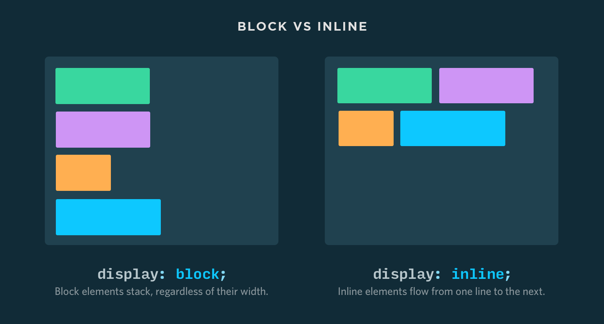

# Padding, Margin, and Border  

This lesson we look at the behavior of three properties: `padding`, `margin`, and `border`. To better understand how these properties affect elements, visualize each element as a rectangle.


The idea that elements in HTML are rectangles is known as [the box model](https://developer.mozilla.org/en-US/docs/Web/CSS/CSS_Box_Model/Introduction_to_the_CSS_box_model). `Padding`, `margin`, and `border` are properties that can be adjusted to control the appearance of a box. Each affects the box differently and can be used together to create vastly different element styles. It is important to understand what each does to understand the box model.

## Border  

Every element has a `border` property, but it is invisible unless it has a color and width. Even if you can't see the border around an element, it is there. The border is used to separate the edge of one box from another.

Several properties affect border styling.

* `border-width` control the width of the border.

* The size of the border is controlled by properties such as `border-top-width`, `border-right-width`, `border-bottom-width`, and `border-left-width`.

* `border-style` controls the visual style of the border and allows for several values: solid, dotted, doubles, and others.

* `border-color` is used to set the color of the lines that represent the border.

The border shorthand allows for styling width, style and color all within one property.

In the following example, the border around the `h1` has` border-width` of `10px`, a `border-style` of `solid`, and a `border-color` of `black`.

```html
<!-- index.html -->
<!DOCTYPE HTML>
<html>
  <head>
    <link ref="stylesheet" type="text/css" href="style.css">
  </head>
  <body>
     <h1>I have a box around me</h1>
  </body>
</html>
```

```css
/* style.css */
h1 {
  border-width: 10px;
  border-style: solid;
  border-color: black;
}

/*
Can also be written as shorthand
h1{
  border: 10px solid black;
}
*/
```
 
## Margin  

The margin sits outside the edge of the border. Setting the width of the margin sets the space between the box of one element and the box of another. By setting the `margin`, you are making a gap between two adjacent elements.

All the boxes have the same styles except for `margin`. The first box has a `margin` of `0px`, the second a `margin` of `20px`, and the third a `margin` of `40px`.

```html
<!-- index.html -->
<!DOCTYPE HTML>
<html>
  <head>
    <link ref="stylesheet" type="text/css" href="style.css">
  </head>
  <body>
     <div class="first-box">I am the first box</div>
     <div class="second-box">I am the second box</div>
     <div class="third-box">I am the third box</div>
  </body>
</html>
```

```css
/* style.css */
.first-box {
  border: 10px solid red;
  margin: 0px;
}

.second-box {
  border: 10px solid red;
  margin: 20px;
}

.third-box {
  border: 10px solid red;
  margin: 40px;
}
```
 
Since the margin property controls the gap between boxes, it is possible to set it from all sides. This is accomplished by setting `margin-top`, `margin-right`, `margin-bottom`, or `margin-left`. Similar to `border`, `margin` allows a shorthand for setting all of these properties. The values are listed clockwise starting with `margin-top`.

The following CSS styles the `h1` element with a `margin-top` of `1px`, a `margin-right` of `10px`, a `margin-bottom` of `20px`, and a `margin-left` of `5px`.

```css
h1 {
  margin-top: 1px;
  margin-right: 10px;
  margin-bottom: 20px;
  margin-left: 5px;
}

//Shorthand version
h1 {
  margin: 1px 10px 20px 5px;
}
```

## Padding  

The `padding` property defines the space between the border of an element and the content inside.

All the boxes are styled the same, except for padding. The first box has a `padding` of `0px`, the second a `padding` of `20px`, and the third a `padding` of `30px`.

```html
<!-- index.html -->
<!DOCTYPE HTML>
<html>
  <head>
    <link ref="stylesheet" type="text/css" href="style.css">
  </head>
  <body>
     <div class="first-box">I am the first box</div>
     <div class="second-box">I am the second box</div>
     <div class="third-box">I am the third box</div>
  </body>
</html>
```

```css
/* style.css */
.first-box {
  font-size: 16px;
  border: 2px dotted red;
  padding: 10px;
}

.second-box {
  font-size: 16px;
  border: 2px dotted red;
  padding: 20px;
}

.third-box {
  font-size: 16px;
  border: 2px dotted red;
  padding: 30px;
}
```
 
Padding can be set from all sides using the properties `padding-top`, `padding-right`, `padding-bottom`, and `padding-left`. Like margin, padding shorthand values are set in clockwise order.

```css
.first-box {
  padding-top: 1px;
  padding-right: 2px;
  padding-bottom: 3px;
  padding-left: 4px;
}

// Shorthand version
.first-box {
  padding: 1px 2px 3px 4px;
}
```

## Closing  

This lesson looked at three properties: `border`, `margin`, and `padding`. These properties are used to affect the appearance of the boxes around the elements. The `border` property separates one box from another. The `margin` property controls the gap between boxes. The `padding` property controls the space between the content inside of a box and its border.

## Additional Resources  

[The Box Model](https://developer.mozilla.org/en-US/docs/Web/CSS/CSS_Box_Model/Introduction_to_the_CSS_box_model)

### Lesson Footnotes
* 1: [W3.org](https://www.w3.org/wiki/File:Layout_fig1.png)

---

# A Comparison of Display Values  

Every HTML element is rendered as a rectangular box by the browser. The `display` property determines the box's behavior. There are three commonly used `display` values which are used to describe this behavior. Let's take a look at how they stack up (or not) with each other.

## Display Property  

The `display` CSS property specifies the type of rendering box used for an element. In HTML, default `display` property values are taken from the HTML specifications or from the browser's user agent stylesheet.

The default value for all elements is `inline`. Most user agent stylesheets (the default styles the browser applies to all sites) reset many elements to `block`. This is why plain HTML documents tend to stack elements vertically.



### Display Inline  

When an element has it's `display` value set to `inline` the element generates one or more inline rendering boxes. This means that `display: inline;` elements can be placed adjacent to one another horizontally if there is enough space.

Some elements remain `display: inline;` by default and are not overwritten to `block` by the user agent style sheets.

* `<span>`

* `<em>`

* `<b>`

Wrapping text in these elements within a string of text doesn't break the flow of the text.

```html
<p>Lorem ipsum dolor sit amet, <span style="color: #6320EE;">consectetur</span> adipiscing el1it.</p>
```

Note: The `<span>` element is *inline* with the rest of the text.

### Display Block  

The element generates a block element box.

Some elements are set to `display: block;` by the browser user agent stylesheet. They are usually container elements, like `<div>`, `<section>`, and `<ul>`. Also, text blocks like `<p>` and `<h1>` are set to `display: block;`. Block level elements do not sit inline but break past them, stacking vertically. By default (without setting a width) they take up as much horizontal space as they can.

```html
<!-- index.html -->
<!DOCTYPE html>
<html>
  <head>
    <meta charset="utf-8">
    <title>Display Compare</title>
    <link rel="stylesheet" href="styles.css">
  </head>
  <body>
    <div></div>
    <div></div>
    <div></div>
  </body>
</html>
```

```css
/* styles.css */ 
div {
  height: 30px;
  border: 2px solid #6320ee;
}
```
 
### Display Inline-Block  

The element generates a block element box that will be followed by surrounding content as if it were a single inline box.

An element set to inline-block is very similar to inline in that it will set inline with the natural flow of text on the baseline. Inline block elements will be placed adjacent to one another horizontally if there is space for them to fit. Where not enough space is available the inline block elements will break a new line. They are much like inline elements except they can have their width and height set by CSS.

```html
<!-- index.html -->
<!DOCTYPE html>
<html>
  <head>
    <meta charset="utf-8">
    <title>Display Compare</title>
    <link rel="stylesheet" href="styles.css">
  </head>
  <body>
    <div></div>
    <div></div>
    <div></div>
    <div></div>
    <div></div>
    <div></div>
    <div></div>
  </body>
</html>
```

```css
/* styles.css */
div {
  display: inline-block;
  width: 30%;
  height: 30px;
  border: 2px solid #6320ee;
}

div:nth-of-type(2) {
  width: 20%;
  height: 10px;
}

div:nth-of-type(3) {
  width: 10%;
  height: 40px;
}

div:nth-of-type(4) {
  width: 70%;
}

div:nth-of-type(5) {
  width: 20%;
  height: 20px;
}

div:nth-of-type(6) {
  width: 40%;
  height: 20px;
}

div:nth-of-type(7) {
  width: 55%;
  height: 15px;
}
```

## Conclusion  

| Display |	More than one per line | Can have height |	Can have width | Can have margin | Can have padding |
| --- | --- | --- | --- | --- | --- |
|display: inline; |	yes |	no | no | left and right only |	padding will be applied but the element will overlap other like  elements vertically |
| display: inline-block; | yes | yes | yes | yes | yes |
| display: block; |	no | yes | yes |	yes |	yes |

### References  

[MDN - CSS Display](https://developer.mozilla.org/en-US/docs/Web/CSS/display)

---

# Background Properties  

In this lesson, we will apply CSS background properties. In CSS, `background` is a shorthand for setting individual background properties. Background properties apply color or images to the background of any element.

## background-color  

This sets the color of an element. It can take any value for color, as well as the transparent keyword.

**All the examples below are ways to express** `background-color`.

```css
h1 {
  background-color: white;
}

h2 {
  background-color: rgb(153, 102, 153);
}

h3 {
  background-color: #777799;
}

body {
  background-color: transparent;
}
```

## background-image  

The `background-image` property applies an image, graphic or gradient to the background of an element. This property uses the `URL()` to set the location for an image to display. The `background-image` property can also have a value of `none`. This will remove any inherited background from that element.

To add an image to the background, you need to map to the path using the URL.

```css
body {
  background: url(sweettexture.jpg);
}
```

To set a gradient as the background, you can use linear

```css
body {
  background: linear-gradient(black, white);
}
```

or radial gradients.

```css
body {
  background: radial-gradient(circle, black, white);
}
```

Each type references the appearance of the gradient, as seen here: [linear gradient](http://openframeworks.cc/documentation/graphics/bkgGradient_linear.png)

[radial gradient](http://www.siwallpaperhd.com/wp-content/uploads/2015/06/radial_gradient_wallpaper_hd_13_color.jpg)

**These examples show valid ways to set the background-image.**

```css
.content {
  background-image: url('ire.png');
  background-image: none;
}
```

## background-position  

The `background-position` property sets the starting position for each background image for the element. It does this by defining the x and y position for the image. If you want this image to be repeated, you can use the background-repeat property.

**These examples of setting the background-image property is:**

```css
.content {
  background-position: 100px 200px;
}

.content {
  background-position: 25% 75%;
}

.content {
  background-position: 1cm 2cm;
}

/*Keyword Values */
.content {
  background-position: top;
}
.content {
  background-position: bottom;
}
.content {
  background-position: left;
}
.content {
  background-position: right;
}
.content {
  background-position: center;
}

/* Multiple values */
.content {
  background-position: 0 0, center;
}

/* Edge offsets values */
.content {
  background-position: bottom 10px right 20px;
}
.content {
  background-position: right 3em bottom 10px;
}
.content {
  background-position: bottom 10px right;
}
.content {
  background-position: top right 10px;
}

/* Global values */
.content {
  background-size: inherit;
}
.content {
  background-size: initial;
}
.content {
  background-size: unset;
}
```

## background-size  

The `background-size` sets the size of the background images. There are many variations and uses for this property. One of the most popular ways to set the size is through keywords.

The `background-size` property is set the same way as background-image, with a few exceptions. The default setting of background size is `auto`, but it can be set to be either `cover` or `contain`, **like these examples:**

```css
.content {
  background-size: cover;
}
.content {
  background-size: contain;
}
```

`auto` tells the browser to automatically calculate the size based on the actual size of the image.

`cover` tells the browser to ensure that the image always covers the entire screen. This could mean stretching the images or cutting off parts of the edges.

`contain` tells the browser to always show the whole image, even if it leaves whitespace.

## background-repeat  

The `background-repeat` property defines how background-images are repeated. Images can be repeated horizontally, vertically or not at all. You can use this property with both single and multiple images, **as shown in the examples below**

```css
/* Single Image */
.content {
  background-image: url("image.png");
  background-repeat: no-repeat;
}

/* Multiple Images */
.content {
  background-image: url("image1.png"), url("image2.png");
  background-repeat: repeat-x, repeat-y;
}
```

## background-origin  

The `background-origin` property specifies where to paint the background in relation to the element's positioning model. This can apply across the element, inside the padding or inside the border.

It differs from `background-clip` because it resizes the background rather than clipping it.

**An example of how to set background-origin is:**

```css
.content {
  background-origin: content-box;
}
```

## background-clip  

The `background-clip` property lets you control how far a `background-image` or b`ackground-color` extends. The default value is `border-box`, allowing for either the image or the color to extend to the border.

Other values include: `padding-box` clips the background at the edge of the element's padding. This means that the image or color won't extend into the border.

`content-box` clips the background at the edge of its content box.

`inherit` applies background-clip to the parent of a selected element.

**An example of how to set background-clip is**

```css
.frame {
  background-clip: padding-box;
}
```

## background-attachment  

The `background-attachment` property sets whether a background image is fixed or will scroll with the content as the page is navigated. There are three values that can be used to set this property.

`fixed` which sets the background image fixed to the viewport. Even when the user scrolls, the image won't move.

`local` means that the background will be fixed to its position within an element. If the element scrolls, that means that as the user scrolls the image will scroll out of view.

`scroll` means that the background image will not scroll with the contents of the element.

## Closing  

In this lesson, we looked at background properties. The `background` and `background-*` properties have several values that apply to the property including, image, attachment, color, position, and repeat.

### Additional Resources  

* [CSS Tricks](https://css-tricks.com/almanac/properties/b/background-image/) 
* [Microsoft](https://msdn.microsoft.com/en-us/library/ms530722(v=vs.85).aspx)

---

# The Browser, Font, and Font-family  

In this lesson, we will discuss how the browser uses font and font-family. We will touch on web safe fonts as well as custom fonts. When a web page loads, the browser is told to write text to the screen using a specified font. This font is usually stored on the computer that the browser is running on.

In most cases, browsers are pulling fonts from the user's machine. When a font is used in a browser, that font has to be included on the user's computer. If the web page is asking for a font that a user does not have installed, it won't render the font. Instead, a default font will be used, which could clash with the styles on the page.

It is possible to load custom fonts so that the browser can use them. But first, let's look at web safe fonts.

## Web Safe Fonts  

In the past, web designers had a small number of fonts that they could use for websites. These fonts were reliable because they could be found on most computers. This fact meant that these fonts were considered web safe.

Fonts that are web safe are fonts that the browser will be able to locate regardless of the machine you are using. Browsers are supposed to support at least one typeface from 5 groups of fonts. These groups include:

* Serif (fonts with extra details on the end of the main strokes of each glyph)

* Sans-Serif (fonts without those extra strokes; used for a clean look)

* Monospace (each glyph in these fonts are the same width)

* Cursive (fonts with joining strokes or cursive characteristics)

* Fantasy (Decorative fonts that are often used for titles)

If the font you want to use is not available, you should stack fonts so that a fallback can be used instead.

## Font Stacking  

Font stacking refers to listing several fonts for the browser. In the event that a font is not available for the browser, it will go to the next in the stack and try to load that one.

An example of a Font Stack:

```css
font-family: Georgia, Times, Times New Roman;
```

In the example above you want the browser to load the font-family named Georgia. But, if that font is not available then it will load Times instead. If not Times, then Times New Roman.

It can be a good idea to stack fonts to ensure that styles on the page are shown the way that you intended. Even when you use web safe fonts, there may be differences between operating systems. Having fallback fonts available allow for the styling to remain similar.

When you are stacking fonts make sure to follow a few rules.

*Consistency*

Make sure that the fonts in your stack look similar to each other. You don't want different users to have radically different fonts displayed. To remain consistent, try to stay within the same type of typeface. Stack serif fonts with other serif fonts, monospace with other monospace fonts, etc.

*Amount*

You don't want to use too many fonts in your stack. You can list as many fonts as you want. But, you should usually have to list no more than 4 to 5 fonts to ensure consistency across browsers.

*Generic*

Always include a generic font in your stack. It is a good rule of thumb to use `serif`, `sans-serif`, and `monospace` as a generic font.

ex: Arial and Helvetica 1 The classic example is Arial and Helvetica. Most, if not all Windows machines have the Arial font installed. Likewise, most, if not all Mac machines have the Helvetica font installed. For the purpose of web safe fonts, Arial and Helvetica are interchangeable by the browser. In most cases, if a web page is requesting Arial and the browser can’t find it on the user’s machine, the browser will automatically substitute Helvetica. This is the same for pages requesting Helvetica when a user only has Arial.

## @font-face  

Using `@font-face` allows for fonts to be added that are not on the user's computer. This rule instructs the browser to download the font you set from where it is hosted on the web. It will then display as specified in the CSS.

This is a great way to add unique font to your page that aren't web safe.

In order to add a custom font to your site, follow the example below:

```css
@font-face {
  font-family: 'MyCustomFont';
  src: url('webfont.woff') format('woff');
}

body {
  font-family: 'MyCustomFont', Fallback, sans-serif;
}
```

## References  

#### Lesson Footnotes

* 1: [How Browsers Manage Fonts](http://www.practicalecommerce.com/How-Browsers-Manage-Fonts)

---

# Rendering of font characters using the font properties  

The font property in CSS sets the font and associated text styling. It is a shorthand property that can set things such as style, family, weight, and size.

## Font family  

Font-family indicates the font used for an element. Font-family refers to what most people mean when they say they are using a font. Common font families are times, sans-serif, helvetica, and monospace.

## Font size  

The font-size specifies the size of the font for an element. There are several ways to set the size.

### PIXELS

```css
h1 {
  font-size: 40px;
}
```

1 px is equal to one dot, a single pixel, on the computer screen. The problem with pixels is that they don't scale up or down for different screen sizes. However, the reader can use the browser zoom tool to zoom in and out.

### EM

```css
h1 {
  font-size: 2.5em; /* 40px/16=2.5em */
}
```

Using em makes it possible to adjust the text size in all browsers. It is a scalable unit that is equal to the current font size. If the size on the screen is 12pt, then 1 em is equal to 12pt. That means that 2em would make the font size 24pt. This unit is very friendly to responsive mobile development.

### POINTS 

Points originated in print media. They are similar to pixels because they cannot scale. These units are fixed in size.

### PERCENTAGE

```css
body {
  font-size: 100%;
}
```

This unit is similar to the em unit. 100 percent is equal to the size of the font on the screen. For example 12pt is equal to 100%. This allows for text to be scaled both up and down to fit different screen sizes.

It is possible to use a combination of pixels, em and percentage for different elements in your CSS file.

### VIEWPORT UNITS

Viewport units set the font-size of an element relative to the dimensions of the viewport. These units are vw for viewport width and vh for viewport height. 1vw = 1% of the viewport width. 1vh = 1% of viewport height.

## Font style  

Font style allows you to set styles between normal, italic and oblique.

```css
.normal {
  font-style: normal;
}

.italic {
  font-style: italic;
}

.oblique {
  font-style: oblique;
}
```

please see more of [this example](https://jsfiddle.net/api/mdn/) at JSFiddle.

## Font Weight  

The font weight specifies the boldness of the font.

**Common weight name mapping1**

The 100 to 900 values roughly correspond to the following common weight names:

* 100 Thin (Hairline)

* 200 Extra Light (Ultra Light)

* 300 Light

* 400 Normal

* 500 Medium

* 600 Semi Bold (Demi Bold)

* 700 Bold

* 800 Extra Bold (Ultra Bold)

* 900 Black (Heavy)

## Closing  

In this lesson, we looked at several font-related properties and the way that they affect HTML elements. These included font-family, font-size, font-style and font-weight.

## Additional Resources  

* [CSS Basics](http://www.cssbasics.com/css-font-properties/)
* [JS Fiddle example](https://jsfiddle.net/api/mdn/)
* [CSS font-size](https://developer.mozilla.org/en-US/docs/Web/CSS/font-size?v=control)

#### Lesson Footnotes

1: [Mozilla CDN](https://developer.mozilla.org/en-US/docs/Web/CSS/font-weight)

---

# Import fonts using @fontface  

The @font-face rule adds custom fonts to a webpage. The rule will allow you to input your custom font to appear on a site, even when it is not installed on the user's computer. The most significant aspect of this rule is that it allows you to use fonts that are not web safe. This provides more choices for web design typography.

## Syntax  

To use @font-face, you will need to provide the font name and where it can be found, such as: [^1]

for an inside source,

```css
@font-face {
  font-family: DeliciousRoman;
  src: url('…/Delicious-Roman.otf');
}
```

for an outside source,

```css
@font-face {
  font-family: DeliciousRoman;
  src: url('http://www.font-face.com/fonts/delicious/Delicious-Roman.otf');
}
```

Then you will need to reference the font in your HTML doc.

```css
p {
  font-family: DeliciousRoman, Helvetica, Arial, sans-serif;
}
```

When using @font-face, it is advisable to add fallback fonts in case there is any issue loading the custom font. In addition, you could use generators like [font-squirrel's generator](https://www.fontsquirrel.com/tools/webfont-generator), to find other fonts that can be used as a fallback. Other sites with custom fonts include [typekit](https://typekit.com/) and [font2web.com](http://www.font2web.com/).

## Closing  

In this lesson we looked at @font-face and went over the syntax required to utilize this property.

## Additional Resources  

[Designmodo](https://designmodo.com/font-face/)
