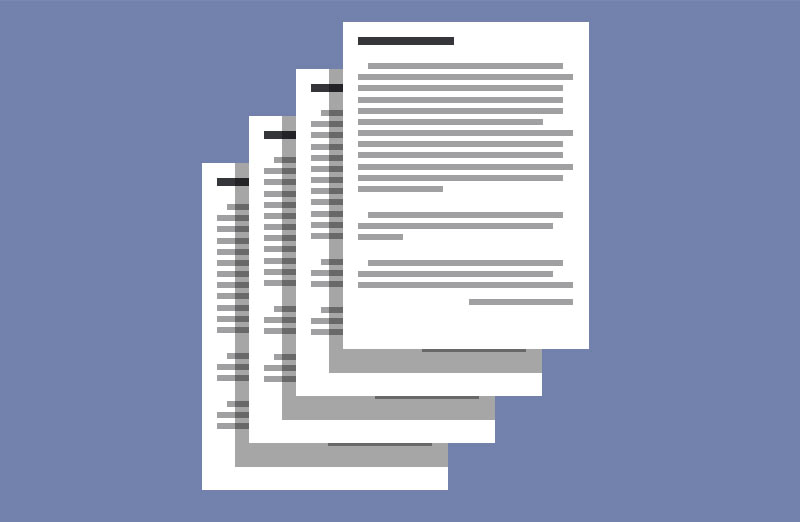
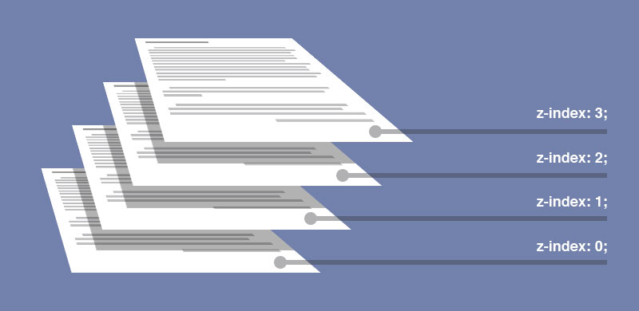
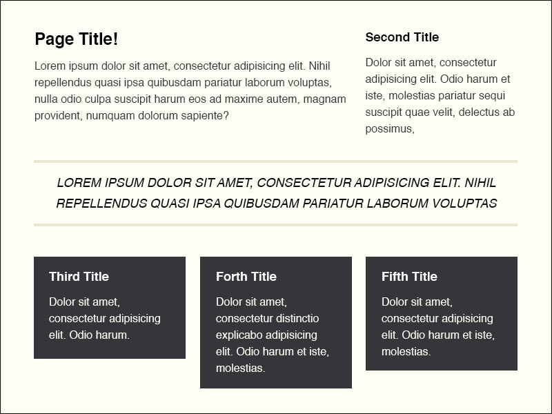
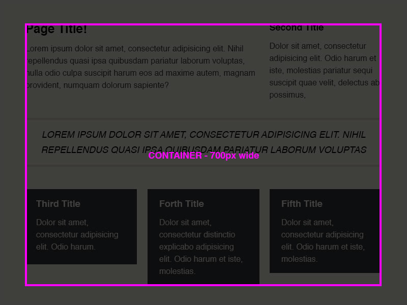
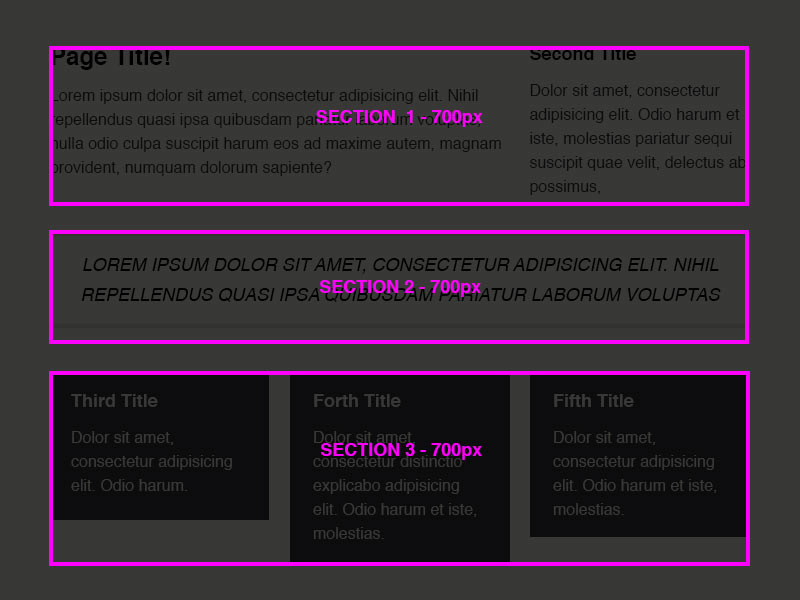
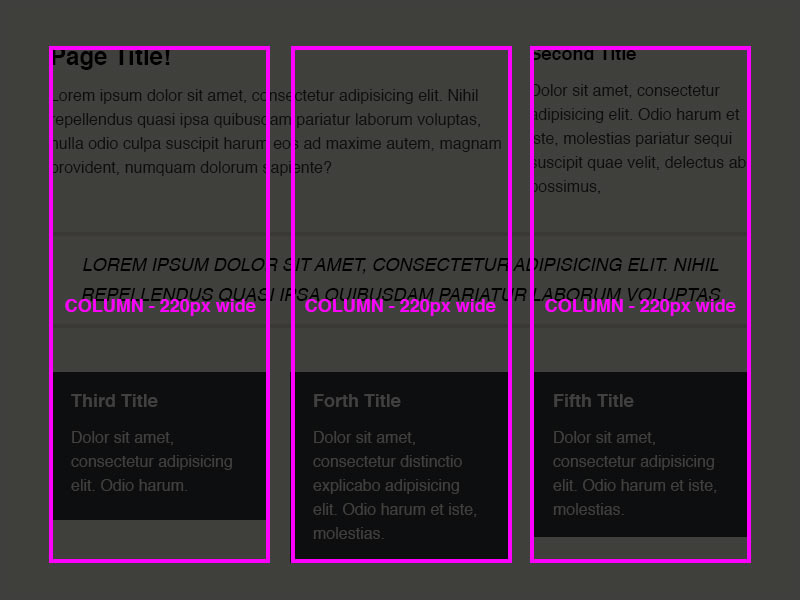
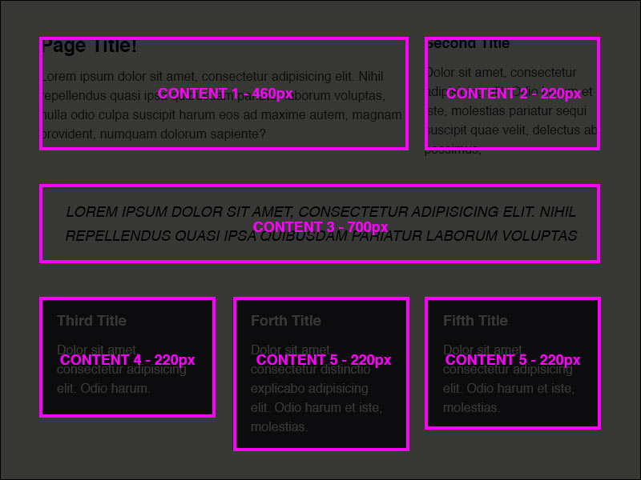

# Adjacent values  

Some properties CSS can be set to multiple adjacent values. These "shorthand" properties set a series of related properties in one declaration.

## Shorthand properties  

Some common shorthand properties are:

* background

* font

* margin

* padding
 
* border

## Syntax  

Using adjacent values allows web developers to write more readable CSS. For instance, instead of writing four individual margin properties with values, we can assign all four values to one margin property.

```css
div {
  margin-top: 1em;
  margin-right: 2em;
  margin-bottom: 3em;
  margin-left: 4em;
}

/* These declarations are equivalent to this one: */
div {
  margin: 1em 2em 3em 4em;
}
```

The same applies to other properties that use adjacent values. Such as:

```css
div {
  background-color: #fff;
  background-image: url(bg.png);
  background-repeat: no-repeat;
  background-attachment: fixed;
  background-position: right top;
}

/* These declarations are equivalent to this one: */
div {
  background: #fff url(bg.png) no-repeat fixed right top;
}
```

## Additional Resources  

* [MDN CSS Shorthand](https://developer.mozilla.org/en-US/docs/Web/CSS/Shorthand_properties)

* [Sitepoint](https://www.sitepoint.com/html-css/css/)

---

# Determining Stacking Order with `z-index`

Sometimes, elements overlap. Its a natural consequence of positioning and layout. If you move things around the page, they might overlap with other elements. Often, we want to control how things overlap and determine which elements come to the front and which fall to the back. The order in which elements render on top of one another is called "stacking order". CSS provide the `z-index` property to control stacking order.

In this article, we will discuss the `z-index` property, how to apply it to elements, and when it is effective.

## Visualizing `z-index`  

Before we start digging into code, let's try to conceptually understand `z-index` by exploring the analogy of a stack of papers.



Imagine a stack of four sheets of papers on a desk. You are looking downward on the pages and can see that they overlap one another. One sheet of paper is on the bottom, and one is on top. The other two pages are somewhere in between. This illustrations of concept of stacking order. You can clearly see that the papers have an order from top to bottom.



Now, imagine that we assign each sheet an integer indicating where it appears in the stack. To keep the ordering simple, we'll give the bottom sheet of paper the lowest number 0. As we move up the stack, we'll give each paper larger numbers until we reach the top sheet of paper. The top sheet of paper will be assigned the largest number. Finally, we'll call these integers "z-index".

> The specific numbers don't matter. We could have assigned the bottom page the number 10 or -1 or 100. So long as the next page up the stack has a larger number it will appear on top. A element with a `z-index` of 101 will appear above of an element with a `z-index` of 100.

Our analogy with pages illustrates how `z-index` works. To determine how elements overlap, we assign them an integer. Larger integers appear on top and smaller integers appear below.

## `z-index` Rules  

`z-index` has a few rules that determine how it affects stacking order, we should go over those ground rules of z-index to give us a firm ground for evaluating the following code samples.

1. The values set to `z-index` should always be an integer (... -2, -1, 0, 1, 2, ...).

2. `z-index` values (other than 0) can only be set on elements that have been positioned `relative`, `absolute`, or `fixed`

3. The default `z-index` value for all elements is 0

4. The higher the `z-index`, the higher an element will appear in the stacking order. i.e. if an element has a `z-index` value of 10 and another element has a `z-index` value of 5, then the first element will appear above the second element.

## The `z-index` Property  

Setting `z-index` is as simple as assigning an element's `z-index` property an integer value. In the following code snippet, every `p` tag has had it's `z-index` set to 4 and the `h1` tags have a `z-index` of 3. `p` has the greater `z-index` value, so if `p` and `h1` tags overlap, the `p` tag will appear on top.

```css
p {
  position: relative;
  z-index: 4;
}
h1 {
  position: relative;
  z-index: 3;
}
```

Now lets look at a few live code examples.

## `z-index` Default Stacking Order  

To begin we'll look at the behavior or stacked elements *before we change any z-index values*. The default `z-index` value of elements is 0. This means that all elements have the same value. When the browser interprets how to render overlapping elements with the same `z-index` value, it looks at where the elements appear in the text document. The elements that appear first (nearer to the top of the document) will appear below the element that appear later (nearer the bottom of the document).

Basically, the browser starts at the top and works it's way down the page rendering each element in turn. This has the effect of placing later elements on top of earlier elements.

In the following example, the three colored squares have all been relatively positioned so that they overlap. The order of overlap is determined by the `z-index` value of the elements. Because, we haven't set an explicit `z-index` value, all the squares default to a `z-index` of 0. If overlapping elements have the same `z-index` value, then the browser will look at the order in which they appear in the HTML document.

In the following example, `#blue` appears first in the document, then `#yellow`, and finally `#green`. This order puts `#blue` on the bottom and `#green` on top.

```html
<!-- index.html -->
<!doctype html>
<html>
<head>
  <meta charset="UTF-8">
  <title>z-index Default</title>
  <link rel="stylesheet" href="style.css">
</head>
<body>
    <section>
        <div id="blue"></div>
        <div id="yellow"></div>
        <div id="green"></div>
    </section>
</body>
</html>
```

```css
/* style.css */
body {
  background: #333;
  margin: 0;
}
section {
  width: 800px;
  margin: 0 auto;
  padding: 50px 0;
  display: flex;
  flex-wrap: wrap;
  justify-content: space-between;
}
div {
  padding-top: 30%;
  flex-basis: 30%;
  flex-shrink: 0;
  flex-grow: 0;
  position: relative;
  box-shadow: 0 8px 16px rgba(0, 0, 0, 0.6);
}
#blue {
  left: 100px;
  top: -20px;
  background: #4499ff;
}
#yellow {
  background: #ffdd66;
}
#green {
  left: -100px;
  top: 20px;
  background: #44ff66;
}
```

## Changing the Stacking Order of Elements  

Without changing the HTML, I want to reshuffle our colored blocks so that `#blue` appears on top and `#green` appears on the bottom. To do this I'll have to give `#blue` the highest z-index value and `#green` the lowest.

Remember: z-index only works if the element has been positioned. In this case, all three blocks have been relatively positioned.
Review the following code sample to see what styles have been added.

```html
<!-- index.html -->
<!doctype html>
<html>
<head>
  <meta charset="UTF-8">
  <title>z-index Default</title>
  <link rel="stylesheet" href="style.css">
</head>
<body>
    <section>
        <div id="blue"></div>
        <div id="yellow"></div>
        <div id="green"></div>
    </section>
</body>
</html>
```

```css
/* style.css */
body {
  background: #333;
  margin: 0;
}
section {
  width: 800px;
  margin: 0 auto;
  padding: 50px 0;
  display: flex;
  flex-wrap: wrap;
  justify-content: space-between;
}
div {
  padding-top: 30%;
  flex-basis: 30%;
  flex-shrink: 0;
  flex-grow: 0;
  position: relative;
  box-shadow: 0 8px 16px rgba(0, 0, 0, 0.6);
}
#blue {
  left: 100px;
  top: -20px;
  background: #4499ff;

  /*
    THE LARGEST VALUE
    */
  z-index: 100;
}
#yellow {
  background: #ffdd66;

  /*
    THE MIDDLE VALUE
    */
  z-index: 50;
}
#green {
  left: -100px;
  top: 20px;
  background: #44ff66;

  /*
    THE SMALLEST VALUE
    */
  z-index: 0;
}
```

## Conclusion  

In this lesson, we learned about the `z-index` property. `z-index` allows us to control the stacking order of page elements that overlap and exert a finer control over how the browser renders page elements. `z-index` can be used to great effect when laying out pages, but it can also get complicated as you start trying to shuffle around multiple elements. Use it sparingly and you should be fine.

## Additional Resources  

* [z-Index Smashing Magazine](https://www.smashingmagazine.com/2009/09/the-z-index-css-property-a-comprehensive-look/)

* [z-Index - MDN](https://developer.mozilla.org/en-US/docs/Web/CSS/z-index?v=example)

---

# Building a Multi Column Layout with Flexbox  

> You may have seen this design in the Layout with Floats lesson. We are walking you through the same mockup again, this time with flexbox, so that you can see how the two layout strategies (floats and flexbox) differ.

In this lesson, we will walk through the creation of a layout, using flexbox as the principle strategy for laying out the page. The purpose of this article is to demonstrate the thought process of constructing a layout and to demonstrate the authoring of CSS in a structured way.

First, we will review the mockup and the HTML. This will allow us to evaluate all of the content and look for clues about how best to style our page.

Once we have a firm understanding of the markup, we'll start adding the styles to lay out the page.

## Reviewing the Mockup  



This is our design. Its a simple 3 column design with 6 content elements. Lets evaluate the major components of this layout to help us decide which items should be styled and flex containers and which items should be styled as flex items.

## Creating the Content Container  



Never forget that everything in HTML is wrapped in a box. Sometimes, the box is obvious and sometimes the box is invisible. In this case, I see a fairly clear box around our entire content area. I look for places where multiple content elements line up. That's usually a good indicator of a common parent. Plus, if we add a common parent to all of the content, then we can move them all around together. I'll need an element to act as this ".wrapper".

## Identifying Content Sections  



Now that I have a common parent, I look for logical breaks in the areas of content. In this case, we have three sections.

1. **SECTION 1** - The top row of content contains two pieces of content, one wide and one narrow. Its at the top of the doc, so will appear first in our HTML. We'll pretend that this section is the "main" content for the page. This section contains two elements that are side-by-side, so it'll be a flex-container.

2. **SECTION 2** - The middle row of content contains one paragraph of text. It has some special styling, so we'll need a way of selecting it independent of the other content areas. Let's pretend that this is a sage quote. This element only contains one child, so it doesn't need to be a flex container. We'll leave it `display:block;`

3. **SECTION 3** - The last row of content contains three pieces of content, all of which are styled in the same manner. We'll identify this as a list of cool things. This section contains three elements that are side-by-side, so it'll be a flex-container.

## Identifying Columns  



When I look at this mockup, I can see three distinct columns. These columns give us a hint about how to style our content. For instance, the div containing "Page Title!" spans two columns. `#quote` spans 3 columns. The other four elements all span 1 column.

The width "220px" (or some multiple of it) will be something that we will need when are styling content.

## Identifying Content Elements  



The mockup contains six content elements which are marked up in various ways. These six elements will be our flex items.

## Reviewing the HTML  

```html
<!doctype html>
<html>
    <head>
        <meta charset="UTF-8">
        <title>CSS Layout with Floats</title>
    </head>
    <body>
        <div class="wrapper">
            <section id="main">
                <div>
                    <h1>Page Title!</h1>
                    <p>Lorem ipsum dolor sit amet, consectetur adipisicing elit. Nihil repellendus quasi ipsa quibusdam pariatur laborum voluptas, nulla odio culpa suscipit harum eos ad maxime autem, magnam provident, numquam dolorum sapiente?</p>
                </div>
                <div>
                    <h2>Second Title</h2>
                    <p>Dolor sit amet, consectetur adipisicing elit. Odio harum et iste, molestias pariatur sequi suscipit quae velit, delectus ab possimus.</p>
                </div>
            </section>
            <section id="quote">
                <p>Lorem ipsum dolor sit amet, consectetur adipisicing elit. Nihil repellendus quasi ipsa quibusdam pariatur laborum voluptas</p>
            </section>
            <section id="list">
                <ul>
                    <li>
                        <h3>Third Title</h3>
                        <p>Dolor sit amet, consectetur adipisicing elit. Odio harum.</p>
                    </li>
                    <li>
                        <h3>Forth Title</h3>
                        <p>Dolor sit amet, consectetur distinctio explicabo adipisicing elit. Odio harum et iste, molestias.</p>
                    </li>
                    <li>
                        <h3>Fifth Title</h3>
                        <p>Dolor sit amet, consectetur adipisicing elit. Odio harum et iste, molestias.</p>
                    </li>
                </ul>
            </section>
        </div>
    </body>
</html>
```

Review the code and you'll see that we've marked up each of the major sections of our mockup as a `section`. We've also given each `section` an id for easy selection via CSS. The two flex items in Section 1 (`#main`) have been marked up as divs. Section 2 (`#quote`) is good to go. It shouldn't need any flex styling, just some plain old visual styling. All of the flex items in Section 3 (`#list`) has been marked up as list items. We'll have to override some default styles provided by the browser, but at least it's semantic.

Here is the HTML in its raw state, before we start styling.

```html
<!doctype html>
<html>
    <head>
        <meta charset="UTF-8">
        <title>CSS Layout with Floats</title>
    </head>
    <body>
        <div class="wrapper">
            <section id="main">
                <div>
                    <h1>Page Title!</h1>
                    <p>Lorem ipsum dolor sit amet, consectetur adipisicing elit. Nihil repellendus quasi ipsa quibusdam pariatur laborum voluptas, nulla odio culpa suscipit harum eos ad maxime autem, magnam provident, numquam dolorum sapiente?</p>
                </div>
                <div>
                    <h2>Second Title</h2>
                    <p>Dolor sit amet, consectetur adipisicing elit. Odio harum et iste, molestias pariatur sequi suscipit quae velit, delectus ab possimus.</p>
                </div>
            </section>
            <section id="quote">
                <p>Lorem ipsum dolor sit amet, consectetur adipisicing elit. Nihil repellendus quasi ipsa quibusdam pariatur laborum voluptas</p>
            </section>
            <section id="list">
                <ul>
                    <li>
                        <h3>Third Title</h3>
                        <p>Dolor sit amet, consectetur adipisicing elit. Odio harum.</p>
                    </li>
                    <li>
                        <h3>Forth Title</h3>
                        <p>Dolor sit amet, consectetur distinctio explicabo adipisicing elit. Odio harum et iste, molestias.</p>
                    </li>
                    <li>
                        <h3>Fifth Title</h3>
                        <p>Dolor sit amet, consectetur adipisicing elit. Odio harum et iste, molestias.</p>
                    </li>
                </ul>
            </section>
        </div>
    </body>
</html>
```

## Styling the Content Container  

First things first, lets set some basic styles for our typography and background colors. We'll also go ahead and style the content container so that it is 700px wide and centered in the screen.

```html
<!-- index.html -->
<!doctype html>
<html>
    <head>
        <meta charset="UTF-8">
        <title>CSS Layout with Floats</title>
        <link rel="stylesheet" href="style.css">
    </head>
    <body>
        <div class="wrapper">
            <section id="main">
                <div>
                    <h1>Page Title!</h1>
                    <p>Lorem ipsum dolor sit amet, consectetur adipisicing elit. Nihil repellendus quasi ipsa quibusdam pariatur laborum voluptas, nulla odio culpa suscipit harum eos ad maxime autem, magnam provident, numquam dolorum sapiente?</p>
                </div>
                <div>
                    <h2>Second Title</h2>
                    <p>Dolor sit amet, consectetur adipisicing elit. Odio harum et iste, molestias pariatur sequi suscipit quae velit, delectus ab possimus.</p>
                </div>
            </section>
            <section id="quote">
                <p>Lorem ipsum dolor sit amet, consectetur adipisicing elit. Nihil repellendus quasi ipsa quibusdam pariatur laborum voluptas</p>
            </section>
            <section id="list">
                <ul>
                    <li>
                        <h3>Third Title</h3>
                        <p>Dolor sit amet, consectetur adipisicing elit. Odio harum.</p>
                    </li>
                    <li>
                        <h3>Forth Title</h3>
                        <p>Dolor sit amet, consectetur distinctio explicabo adipisicing elit. Odio harum et iste, molestias.</p>
                    </li>
                    <li>
                        <h3>Fifth Title</h3>
                        <p>Dolor sit amet, consectetur adipisicing elit. Odio harum et iste, molestias.</p>
                    </li>
                </ul>
            </section>
        </div>
    </body>
</html>
```

```
/* style.css */
body {
  background: #fefff5;
  font-family: Helvetica, Arial, sans-serif;
  color: #35363a;
  line-height: 1.4em;
}
.wrapper {
  width: 700px;
  padding-top: 40px;
  padding-bottom: 40px;
  margin: 0 auto;
}
h2 {
  font-size: 1.2em;
}
h3 {
  font-size: 1em;
}
```

You can't see `.wrapper` in the render, but it is the element that has been given a width. All of the child elements it contains will conform to its width. We've centered `.wrapper` by giving it a margin value of `0 auto`. The "0" means that `.wrapper` has no margin on the top or the bottom. The "auto" means that `.wrapper` will evenly distribute the margins equally on either side, centering it on the screen.

Now that we've gotten some of the default styles out of the way, let's review the mockup and look for more clues about how best to style our content.

## Creating the First Row of Content  

`Content 1` and `Content 2` need to be floated within `#main`. `Content 1` is clearly wider than `Content 2` so we'll have to calculate the width we need for that content element. Also, once both elements are floated, `#main` will need a clearfix applied. Lets do all of those things.

```html
<!-- index.html -->
<!doctype html>
<html>
    <head>
        <meta charset="UTF-8">
        <title>CSS Layout with Floats</title>
        <link rel="stylesheet" href="style.css">
    </head>
    <body>
        <div class="wrapper">
            <section id="main">
                <div>
                    <h1>Page Title!</h1>
                    <p>Lorem ipsum dolor sit amet, consectetur adipisicing elit. Nihil repellendus quasi ipsa quibusdam pariatur laborum voluptas, nulla odio culpa suscipit harum eos ad maxime autem, magnam provident, numquam dolorum sapiente?</p>
                </div>
                <div>
                    <h2>Second Title</h2>
                    <p>Dolor sit amet, consectetur adipisicing elit. Odio harum et iste, molestias pariatur sequi suscipit quae velit, delectus ab possimus.</p>
                </div>
            </section>
            <section id="quote">
                <p>Lorem ipsum dolor sit amet, consectetur adipisicing elit. Nihil repellendus quasi ipsa quibusdam pariatur laborum voluptas</p>
            </section>
            <section id="list">
                <ul>
                    <li>
                        <h3>Third Title</h3>
                        <p>Dolor sit amet, consectetur adipisicing elit. Odio harum.</p>
                    </li>
                    <li>
                        <h3>Forth Title</h3>
                        <p>Dolor sit amet, consectetur distinctio explicabo adipisicing elit. Odio harum et iste, molestias.</p>
                    </li>
                    <li>
                        <h3>Fifth Title</h3>
                        <p>Dolor sit amet, consectetur adipisicing elit. Odio harum et iste, molestias.</p>
                    </li>
                </ul>
            </section>
        </div>
    </body>
</html>
```

```
/* style.css */
body {
  background: #fefff5;
  font-family: Helvetica, Arial, sans-serif;
  color: #35363a;
  line-height: 1.4em;
}
.wrapper {
  width: 700px;
  padding-top: 40px;
  padding-bottom: 40px;
  margin: 0 auto;
}
h2 {
  font-size: 1.2em;
}
h3 {
  font-size: 1em;
}

/*
FLEX STYLES FOR THE TOP ROW OF CONTENT
*/
#main {
  display: flex;
  justify-content: space-between;
}
#main div {
  flex-basis: 460px;
}
#main div:last-child {
  flex-basis: 220px;
}
```

`#main` has been made a flex container by assigning its `display` property the value of "flex". `justify-content:space-between` ensures that any gaps in the top row will appear *between the flex items* and not around them. Each flex item is given an explicit width via `flex-basis`. The default value of `flex-grow` is 0, so we don't have to worry about the flex items expanding into the gutter between the columns.

## Creating the Second Row of Content  

The second row of content is pretty simple. Nothing in this row needs to be floated. We simply need to add borders to the top and bottom of the `#quote` and style the text.

```html
<!-- index.html -->
<!doctype html>
<html>
    <head>
        <meta charset="UTF-8">
        <title>CSS Layout with Floats</title>
        <link rel="stylesheet" href="style.css">
    </head>
    <body>
        <div class="wrapper">
            <section id="main">
                <div>
                    <h1>Page Title!</h1>
                    <p>Lorem ipsum dolor sit amet, consectetur adipisicing elit. Nihil repellendus quasi ipsa quibusdam pariatur laborum voluptas, nulla odio culpa suscipit harum eos ad maxime autem, magnam provident, numquam dolorum sapiente?</p>
                </div>
                <div>
                    <h2>Second Title</h2>
                    <p>Dolor sit amet, consectetur adipisicing elit. Odio harum et iste, molestias pariatur sequi suscipit quae velit, delectus ab possimus.</p>
                </div>
            </section>
            <section id="quote">
                <p>Lorem ipsum dolor sit amet, consectetur adipisicing elit. Nihil repellendus quasi ipsa quibusdam pariatur laborum voluptas</p>
            </section>
            <section id="list">
                <ul>
                    <li>
                        <h3>Third Title</h3>
                        <p>Dolor sit amet, consectetur adipisicing elit. Odio harum.</p>
                    </li>
                    <li>
                        <h3>Forth Title</h3>
                        <p>Dolor sit amet, consectetur distinctio explicabo adipisicing elit. Odio harum et iste, molestias.</p>
                    </li>
                    <li>
                        <h3>Fifth Title</h3>
                        <p>Dolor sit amet, consectetur adipisicing elit. Odio harum et iste, molestias.</p>
                    </li>
                </ul>
            </section>
        </div>
    </body>
</html>
```

```css
/* style.css */
body {
  background: #fefff5;
  font-family: Helvetica, Arial, sans-serif;
  color: #35363a;
  line-height: 1.4em;
}
.wrapper {
  width: 700px;
  padding-top: 40px;
  padding-bottom: 40px;
  margin: 0 auto;
}
h2 {
  font-size: 1.2em;
}
h3 {
  font-size: 1em;
}
#main {
  display: flex;
  justify-content: space-between;
}
#main div {
  flex-basis: 460px;
}
#main div:last-child {
  flex-basis: 220px;
}

/*
The following styles are used to achieve
layout in out mockup for the SECTION 2
*/
#quote {
  border-top: 6px solid #e9e5d5;
  border-bottom: 6px solid #e9e5d5;
  padding: 20px 0;
  margin: 20px 0;
}
#quote p {
  margin: 0;
  font-size: 1.2em;
  line-height: 1.6;
  text-align: center;
  text-transform: uppercase;
  font-style: italic;
}
```

Styling `#quote` doesn't require very much. We add a couple borders to the element and adjust the padding and margin to closely match the spacing of the mockup. Also, we style the p tag inside of #quote so that it is visually similar to the mockup.

## Creating the Third Row of Content  

The third row of content is certainly the most complex. We'll have to do several things to achieve the desired layout and look.

First, we'll have to undo a lot of the browser default styles applied to `ul` and `li` tags.

```html
index.html
<!doctype html>
<html>
    <head>
        <meta charset="UTF-8">
        <title>CSS Layout with Floats</title>
        <link rel="stylesheet" href="style.css">
    </head>
    <body>
        <div class="wrapper">
            <section id="main">
                <div>
                    <h1>Page Title!</h1>
                    <p>Lorem ipsum dolor sit amet, consectetur adipisicing elit. Nihil repellendus quasi ipsa quibusdam pariatur laborum voluptas, nulla odio culpa suscipit harum eos ad maxime autem, magnam provident, numquam dolorum sapiente?</p>
                </div>
                <div>
                    <h2>Second Title</h2>
                    <p>Dolor sit amet, consectetur adipisicing elit. Odio harum et iste, molestias pariatur sequi suscipit quae velit, delectus ab possimus.</p>
                </div>
            </section>
            <section id="quote">
                <p>Lorem ipsum dolor sit amet, consectetur adipisicing elit. Nihil repellendus quasi ipsa quibusdam pariatur laborum voluptas</p>
            </section>
            <section id="list">
                <ul>
                    <li>
                        <h3>Third Title</h3>
                        <p>Dolor sit amet, consectetur adipisicing elit. Odio harum.</p>
                    </li>
                    <li>
                        <h3>Forth Title</h3>
                        <p>Dolor sit amet, consectetur distinctio explicabo adipisicing elit. Odio harum et iste, molestias.</p>
                    </li>
                    <li>
                        <h3>Fifth Title</h3>
                        <p>Dolor sit amet, consectetur adipisicing elit. Odio harum et iste, molestias.</p>
                    </li>
                </ul>
            </section>
        </div>
    </body>
</html>
```

```css
style.css
body {
  background: #fefff5;
  font-family: Helvetica, Arial, sans-serif;
  color: #35363a;
  line-height: 1.4em;
}
.wrapper {
  width: 700px;
  padding-top: 40px;
  padding-bottom: 40px;
  margin: 0 auto;
}
h2 {
  font-size: 1.2em;
}
h3 {
  font-size: 1em;
}
#main {
  display: flex;
  justify-content: space-between;
}
#main div {
  flex-basis: 460px;
}
#main div:last-child {
  flex-basis: 220px;
}
#quote {
  border-top: 6px solid #e9e5d5;
  border-bottom: 6px solid #e9e5d5;
  padding: 20px 0;
  margin: 20px 0;
}
#quote p {
  margin: 0;
  font-size: 1.2em;
  line-height: 1.6;
  text-align: center;
  text-transform: uppercase;
  font-style: italic;
}
/*
This removes the browser default
styles for unordered lists
*/
ul {
  margin: 0;
  padding: 0;
  list-style: none;
}
```

Then, we will apply the general styles to our list items so that they match the design.

This means making the text white and the total width of the `li` elements 220px. The `li` will have some padding around it, so we'll have to do a bit of math to make the widths work out. If we have 20px of padding all the way around the `li`, then we need to set its width to 180px.

```html
<!-- index.html -->
<!doctype html>
<html>
    <head>
        <meta charset="UTF-8">
        <title>CSS Layout with Floats</title>
        <link rel="stylesheet" href="style.css">
    </head>
    <body>
        <div class="wrapper">
            <section id="main">
                <div>
                    <h1>Page Title!</h1>
                    <p>Lorem ipsum dolor sit amet, consectetur adipisicing elit. Nihil repellendus quasi ipsa quibusdam pariatur laborum voluptas, nulla odio culpa suscipit harum eos ad maxime autem, magnam provident, numquam dolorum sapiente?</p>
                </div>
                <div>
                    <h2>Second Title</h2>
                    <p>Dolor sit amet, consectetur adipisicing elit. Odio harum et iste, molestias pariatur sequi suscipit quae velit, delectus ab possimus.</p>
                </div>
            </section>
            <section id="quote">
                <p>Lorem ipsum dolor sit amet, consectetur adipisicing elit. Nihil repellendus quasi ipsa quibusdam pariatur laborum voluptas</p>
            </section>
            <section id="list">
                <ul>
                    <li>
                        <h3>Third Title</h3>
                        <p>Dolor sit amet, consectetur adipisicing elit. Odio harum.</p>
                    </li>
                    <li>
                        <h3>Forth Title</h3>
                        <p>Dolor sit amet, consectetur distinctio explicabo adipisicing elit. Odio harum et iste, molestias.</p>
                    </li>
                    <li>
                        <h3>Fifth Title</h3>
                        <p>Dolor sit amet, consectetur adipisicing elit. Odio harum et iste, molestias.</p>
                    </li>
                </ul>
            </section>
        </div>
    </body>
</html>
```

```css
/* style.css */
body {
  background: #fefff5;
  font-family: Helvetica, Arial, sans-serif;
  color: #35363a;
  line-height: 1.4em;
}
.wrapper {
  width: 700px;
  padding-top: 40px;
  padding-bottom: 40px;
  margin: 0 auto;
}
h2 {
  font-size: 1.2em;
}
h3 {
  font-size: 1em;
}
#main {
  display: flex;
  justify-content: space-between;
}
#main div {
  flex-basis: 460px;
}
#main div:last-child {
  flex-basis: 220px;
}
#quote {
  border-top: 6px solid #e9e5d5;
  border-bottom: 6px solid #e9e5d5;
  padding: 20px 0;
  margin: 20px 0;
}
#quote p {
  margin: 0;
  font-size: 1.2em;
  line-height: 1.6;
  text-align: center;
  text-transform: uppercase;
  font-style: italic;
}
ul {
  margin: 0;
  padding: 0;
  list-style: none;
}

/* ADDITIONAL VISUAL STYLES */
li {
  background: #35363a;
  flex-basis: 180px;
  padding: 20px;
}
li p,
li h3 {
  color: white;
}
li h3 {
  margin-top: 0;
}
li p {
  margin-bottom: 0;
}
```
 
Finally, we need to make the `ul` inside `#list` a flex container and align all of the list-items.

```html
<!-- index.html -->
<!doctype html>
<html>
    <head>
        <meta charset="UTF-8">
        <title>CSS Layout with Floats</title>
        <link rel="stylesheet" href="style.css">
    </head>
    <body>
        <div class="wrapper">
            <section id="main">
                <div>
                    <h1>Page Title!</h1>
                    <p>Lorem ipsum dolor sit amet, consectetur adipisicing elit. Nihil repellendus quasi ipsa quibusdam pariatur laborum voluptas, nulla odio culpa suscipit harum eos ad maxime autem, magnam provident, numquam dolorum sapiente?</p>
                </div>
                <div>
                    <h2>Second Title</h2>
                    <p>Dolor sit amet, consectetur adipisicing elit. Odio harum et iste, molestias pariatur sequi suscipit quae velit, delectus ab possimus.</p>
                </div>
            </section>
            <section id="quote">
                <p>Lorem ipsum dolor sit amet, consectetur adipisicing elit. Nihil repellendus quasi ipsa quibusdam pariatur laborum voluptas</p>
            </section>
            <!--
            Added the clearfix hack to `#list`
            so that it will overflow its floated children
            -->
            <section id="list" class="clearfix">
                <ul>
                    <li>
                        <h3>Third Title</h3>
                        <p>Dolor sit amet, consectetur adipisicing elit. Odio harum.</p>
                    </li>
                    <li>
                        <h3>Forth Title</h3>
                        <p>Dolor sit amet, consectetur distinctio explicabo adipisicing elit. Odio harum et iste, molestias.</p>
                    </li>
                    <li>
                        <h3>Fifth Title</h3>
                        <p>Dolor sit amet, consectetur adipisicing elit. Odio harum et iste, molestias.</p>
                    </li>
                </ul>
            </section>
        </div>
    </body>
</html>
```

```css
style.css
.clearfix:after {
  content: "";
  display: block;
  clear: both;
}
body {
  background: #fefff5;
  font-family: Helvetica, Arial, sans-serif;
  color: #35363a;
  line-height: 1.4em;
}
.wrapper {
  width: 700px;
  padding-top: 40px;
  padding-bottom: 40px;
  margin: 0 auto;
}
h2 {
  font-size: 1.2em;
}
h3 {
  font-size: 1em;
}
#main {
  display: flex;
  justify-content: space-between;
}
#main div {
  flex-basis: 460px;
}
#main div:last-child {
  flex-basis: 220px;
}
#quote {
  border-top: 6px solid #e9e5d5;
  border-bottom: 6px solid #e9e5d5;
  padding: 20px 0;
  margin: 20px 0;
}
#quote p {
  margin: 0;
  font-size: 1.2em;
  line-height: 1.6;
  text-align: center;
  text-transform: uppercase;
  font-style: italic;
}
ul {
  margin: 0;
  padding: 0;
  list-style: none;

  /*
    THIS MAKES THE FLEXBOX CONTAINER
    */
  display: flex;
  justify-content: space-between;
}

/*
These styles create the
visual look of our mockup
*/
li {
  background: #35363a;
  flex-basis: 180px;
  padding: 20px;
}
li p,
li h3 {
  color: white;
}
li h3 {
  margin-top: 0;
}
li p {
  margin-bottom: 0;
}
```

And with that, we've pretty closely matched our original mockup. We could tweak the styles from now until doomsday without it matching *exactly*, but I certainly encourage you to adjust the spacing and font styles. For the purposes of this tutorial, we've achieve a good, three column layout with three sections.

## Conclusion  

Now that we've walked through the process of evaluating and coding a flexbox layout, I encourage you to recreate this webpage on your own. You can follow along with this tutorial and copy the code into your own `index.html` and `style.css` pages.

Over time, you will become very familiar with this process. Many front-end programmers do little more than we've done today. This article just scratches the surface of layout and you should take every opportunity to practice building web pages.

---

# Making Use of Chrome Dev Tools  

Using Google Chrome browser's built-in developer tools we can easily see how our code is output in the browser. We can also temporarily update code and content through the developer tools to preview changes before we make them in our development files. These tools will help us precisely recreate a defined layout based on specifications provided.

## Accessing the Developer Tools  

To access the developer tools, first open a web page in Google Chrome.

Next you can do one of the following:

* Select the Chrome Menu at the top-right of your browser window, then select More Tools > Developer Tools.

* Right-click on any page element and select Inspect Element.

* Cmd+Opt+I on Mac.

The developer tools window will open at the bottom of your Chrome browser.

## Elements  

Although all of the available tabs in the developer tools window are helpful, right now we'll focus on the "Elements" tab. This tab should be open by default. The "Elements" tab will show the the DOM representation of the HTML written to produce this web page.

### Inspecting Elements  

If you right-clicked on a page element and selected "Inspect Element" to open the developer tools, you will notice that the element you right clicked is highlighted in the developer tools window. Hover over various HTML elements in the developer tools and you will notice that the element's output on the page will be highlighted at that time. If an element has an arrow next to it in the developer tools that means it has children and you can click on on the arrow to toggle the element open and view nested elements.

This process allows you to review the architecture of your HTML easily and will help you troubleshoot nesting issues or missing tags.

## Styles  

When the "Elements" tab is open you will also see the "Styles" tab open on the right. As you click throught the elements in the developer tools you will see the last selected element's styles present in the "Styles" tab. Selectors are listed top-to-bottom in order of highest to lowest precedence. `element.style{...}` represents any inline styles directly applied to the element. All proceeding selectors are listed in order of descending precedence.

### In Use vs Not In Use  

If a style declaration has been overwritten by a declaration of higher precedence the overwritten style is crossed through. A style declaration can also be toggled off through the developer tools by checking the checkbox next to a declaration. Use this functionality to test whether a style is effecting other styles adversely.

### Reviewing and Testing  

We can use the styles tab to navigate our applied styles. We can see the output of each element and any issues with precedence or specificity. We can also play with styles here in the developer tools to quickly see how they might interact with the element and change the layout of the page before committing to making the changes in our file. Any changes made in the developer tools will not be saved. Styles will return to the last saved state of the `.html` and `.css` file(s) upon browser refresh.

### Box Model Representation  

In the "Styles" tab (as well as in the "Computed" tab) there is a representation of the selected element's box model. Here you can review margin, border, padding, and content size.

### Computed  

Open the "Computed" tab to see a readout of only the style declarations that have actually been applied to the element.

## Conclusion  

With this knowledge and some practice we can really speed up the trial and error involved in our development process. We can quickly navigate our page, inspect elements and styles, and and try out changes on the fly with no commitment. When we've nailed down a particular style or solved a problem we can make the change locally in our file. If we have specifications we're working against we can now determine how accurately the specifications have been met.

### References  

* [Chrome DevTools Overview](https://developer.chrome.com/devtools)

* [Inspect and Edit Pages and Styles](https://developers.google.com/web/tools/chrome-devtools/inspect-styles/?utm_source=dcc&utm_medium=redirect&utm_campaign=2016q3)
