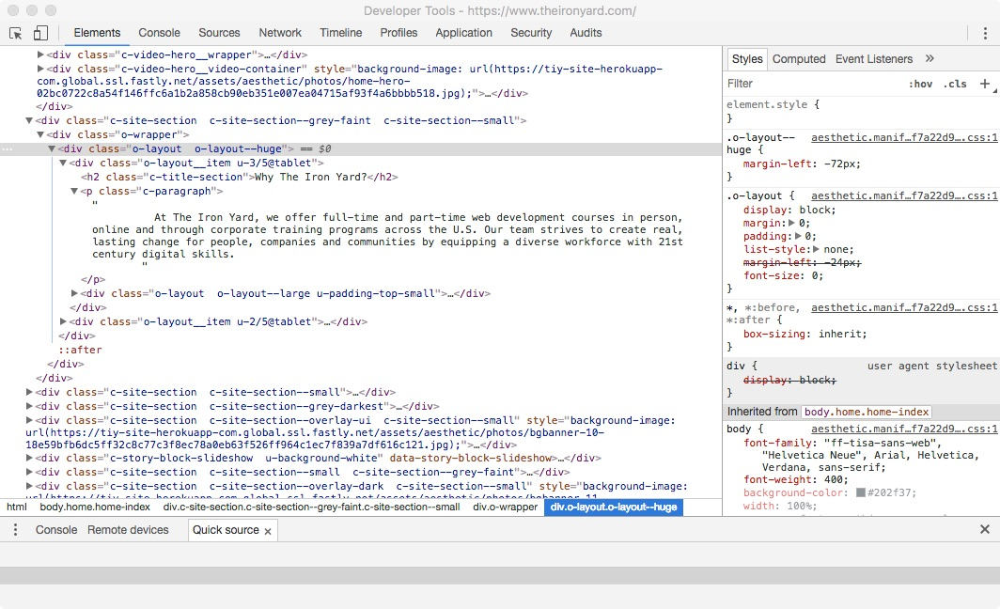
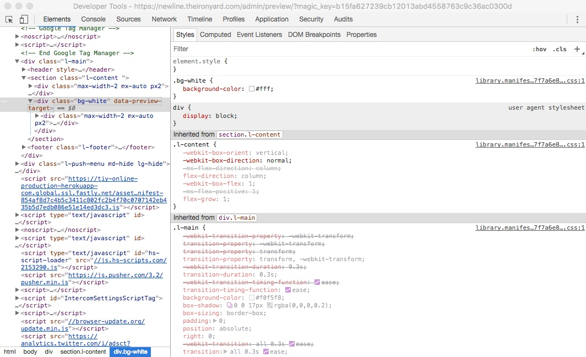
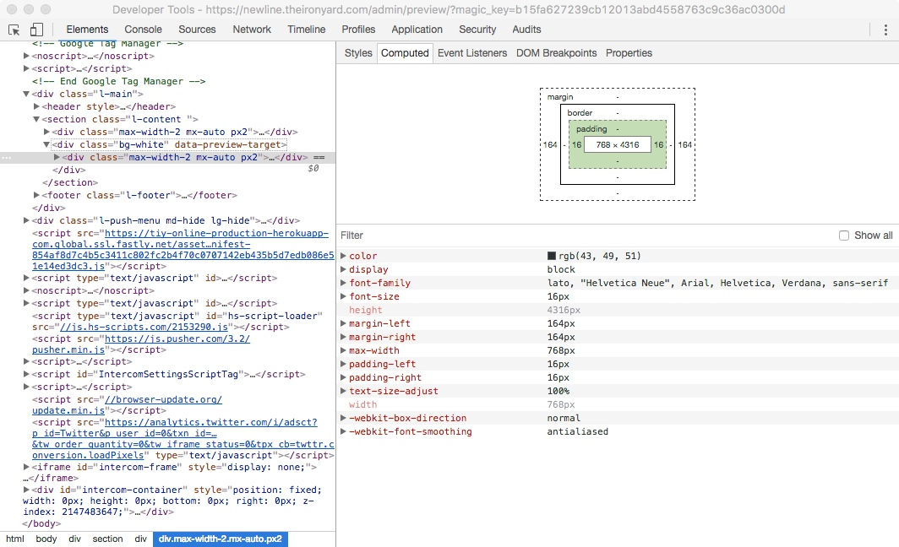

# Using Forms to Collect Data  

All applications work with data. On the web, this data is often collected from users. Every time you sign up for another social media account or enter your credit card information for an online purchase the web app is collecting data from you so that it can perform some action on that data.

We enter data into online services all the time for a myriad of reasons. Transacting data is an integral part of interacting with web-based services.

All this to say: **Knowing how to collect data on the web is *very* important if you intend to make a living building web apps.**

In this article, we will talk about the humble form element and all of the accompanying elements that allow us to collect data from users. This article doesn't explain how to handle the data that we collect, that topic goes well beyond HTML. This article is concerned only with the HTML elements themselves, the properties that accompany most form elements, and the appropriate use of each element to collect data.

## What is a Form?  

The `form` element is a container to house "input controls". Input controls are elements that users can enter data into. The form element determines where that data goes when the form is submitted.

Form elements have two main properties that should be set for the form to function properly:

* `action` - The `action` property specifies where the form data should be sent when the form is submitted. This is generally a script on the server specifically tailored to handle the data and process it. In the following example, the data is being sent to a PHP script called `process_form_data.php`

* `method` - The `method` property specifies the way that the data will be sent. The two principal values for `method` are "post" and "get". Generally speaking, any form should send its data via "post".

> Form methods are a little outside the scope of this article. When you start exploring JavaScript you will learn all about sending data back and forth to the server.

```html
<form action="./process_form_data.php" method="post">
    <!-- "Input controls go here" -->
</form>
```

---

# How Do Forms Work?  

Forms contain a set of input controls that users can enter data into. Examples of input controls might be:

* A field where a user enters some text, like their name.

* Drop-downs that allow users to select from a set of predetermined values, e.g. "Select your state..."

* Checkboxes to select or de-select options, e.g. "Do you agree to our terms of service..."

* etc.

Whatever the data, eventually a user will enter all of their data and press a button to complete the form. Lots of times, the button says something like "Submit".

The following example shows an example of a form that collects one data item: a first name. When the user clicked the "Submit" button, the form sends the data to `./process_form_data.php` via a POST method.

> Note: Nothing will happen when you submit this form. It's a dummy form intended to show you the basic structure of forms: Labels, inputs, and buttons.

```html
<!-- index.html -->
<!doctype html>
<html>
<head>
    <meta charset="UTF-8">
    <title>Name Form</title>
    <link rel="stylesheet" href="style.css" />
</head>
<body>
    <form action="./process_form_data.php" method="post">
        <label for="first_name">First Name:</label>
        <input type="text" name="first_name" id="first_name">
        <button type="submit" id="submit">Submit</button>
    </form>
</body>
</html>
``` 

```css
/* styles.css */
label, input{
    display: block;
}
#submit{
    padding: 10px 15px;
    background: orange;
    border: none;
    outline: none;
    margin: none;
    text-align: center;
    color: white
}
#submit:hover{
    color: red;
}
```

---

# Form Elements  

Forms can utilize several input controls, all of which are intended to gather a different type of information. Over the next several sections, we'll discuss each input control in detail, discussing the tag, attributes, and use case of each element.

## Input  

The `input` element is the workhorse of any form. Most of the input controls will be `input` elements. `input` allows us to collect all sorts of data by specifying a "type" of data. The "type" attribute of an input will determine a couple things:

1. How the `input` is presented to the user

2. What data the `input` is intended to collect

**Use `input` if you need to collect a short string of characters or numbers. Use the proper type for the data being collected.**

We will discuss several `input` types, but not all. Some input types are poorly supported by browsers and should be avoided for accessibility and usability reasons. Generally speaking, the "text" type is, by far, the most stable. You can always set an `input` element's type to "text" to collect data, but other input types are more semantic for their intended use.

The following code snippet shows seven input types and gives a brief explanation for when they should be used:

```html
<!--
The default type for
collecting generic text content
-->
<input type="text">

<!--
An HTML 5 input type for
collecting and validating email addresses
-->
<input type="email">

<!--
An HTML 5 input type for
collecting numbers, usually presents with
small incrementing and decrementing controls
The value attribute designates the
default number for the field
-->
<input type="number" value="5">

<!--
An HTML 5 input type for
the selection of a number between a certain range
The `min` attribute sets the minimum value and the
`max` attribute sets the maximum value for the input.
This example will select a number between 1 and 10
-->
<input type="range" min="1" max="10">

<!--
An HTML 5 input type for entering search strings.
This removes line breaks from the entry.
-->
<input type="search">

<!--
An HTML 5 input type for entering telephone numbers.
This removes line breaks from the entry.
-->
<input type="tel">

<!--
An HTML 5 input type for entering a URL.
This input validates a valid absolute URL.
-->
<input type="url">
```

``` html
    <!doctype html>
    <html>
    <head>
        <meta charset="UTF-8">
        <title>Form Inputs</title>
    </head>
    <body>
        <form action="" method="">
            <!--
            The default type for
            collecting generic text content
            -->
            <div>
                <h3>Text Input</h3>
                <input type="text">
            </div>
            <!--
            An HTML 5 input type for
            collecting and validating email addresses
            -->
            <div>
                <h3>Email Input</h3>
                <input type="email">
            </div>
            <!--
            An HTML 5 input type for
            collecting numbers, usually presents with
            small incrementing and decrementing controls
            The value attribute designates the
            default number for the field
            -->
            <div>
                <h3>Number Input</h3>
                <input type="number" value="5">
            </div>
            <!--
            An HTML 5 input type for
            the selection of a number between a certain range
            The `min` attribute sets the minimum value and the
            `max` attribute sets the maximum value for the input.
            -->
            <div>
                <h3>Range Input</h3>
                <input type="range" min="0" max="10">
            </div>
            <!--
            An HTML 5 input type for entering search strings.
            This removes line breaks from the entry.
            -->
            <div>
                <h3>Search Input</h3>
                <input type="search">
            </div>
            <!--
            An HTML 5 input type for entering telephone numbers.
            This removes line breaks from the entry.
            -->
            <div>
                <h3>Telephone Input</h3>
                <input type="tel">
            </div>
            <!--
            An HTML 5 input type for entering a URL.
            This input validates a valid absolute
            URL before submitting.
            -->
            <div>
                <h3>URL Input</h3>
                <input type="url">
            </div>
        </form>
    </body>
    </html>
```
 
In addition to the type attribute, a couple other attributes can be (and should be) set, to control the input element's behavior. For instance, every input should have a unique name and id.

Pretty much every input needs the following three attributes, at a minimum.

```html
<!-- You should set "type", "id", and "name" at least -->
<input type="text" id="first_name" name="first_name">
```

> The `id` isn't strictly necessary but is a common pattern and highly recommended for usability reasons.

## Label  

Labels allow us to provide semantic text names for inputs to users. Often, inputs will be accompanied by some text to tell you what the input is for. That accompanying text is a `label` element.

Labels have the `for` attribute that should be set to connect them to the appropriate `input`. The `for` attribute can be set to the `id` of an input element (other elements as well) to increase usability. Once the `for` attribute has been set to the same value as the `id` of an input control, it will shift focus to that element when it is clicked.

The following code sample shows how to mark up a label and a related `input`. Notice that the `for` attribute of the `label` matches the `id` attribute of the text `input`.

```html
<!-- The label `for` attribute connects it to the following input -->
<label for="first_name">First Name:</label>
<input type="text" id="first_name">
```

Click on the label text ("First Name:") and the cursor will focus on the input area, creating a much larger clickable area.

```html
<!-- index.html -->
<!doctype html>
<html>
<head>
    <meta charset="UTF-8">
    <title>Form Inputs</title>
    <link rel="stylesheet" href="style.css">
</head>
<body>
    <form action="" method="">
        <!-- The label `for` attribute connects it to the following input -->
        <label for="first_name">First Name:</label>
        <input type="text" id="first_name">
    </form>
</body>
</html>
```

```css
/* style.css */
body{
    margin: 0;
    padding-top: 30px;
    background: #004444;
}
form{
    background: white;
    padding: 20px;
    border-radius: 5px;
    box-shadow: 0 5px 8px rgba( 0, 0, 0, 0.4 );
    text-align: center;
    width: 300px;
    margin: 0 auto;
}

``` 

## Select  

Select boxes allow us to create a finite list of options from which the user must select. The markup for this tag is somewhat more complex because it involves the `select` tag *and the `option` tag*.

**Use `select` if you want the user to choose one option from a list of predetermined values.**

```html
<label for="car">Car:</label>
<select name="car" id="car">
    <option value="volvo">Volvo</option>
    <option value="saab">Saab</option>
    <option value="mercedes">Mercedes</option>
    <option value="audi">Audi</option>
</select>
```

The `select` tag should have two attributes set: `name` and `id`. Generally, they will be the same value. `option` tags are nested in the `select` element and serve as the drop-down options when the user clicks on the `select` tag. The `option` tag should have at least the `value` tag set. The `value` tag is the data that will be sent to the server when the form is submitted.

For instance, if we select the first option in the following form ("Volvo") from the dropdown, then the data that will be sent to the server is something like `car:volvo`. If we select the second option, then the data sent to the server will be `car:saab`.

> You'll learn all about data being sent to the server. The above examples are intended to give you a sense for what is sent, not the exact syntax of the object that is sent from the form page to the server.

```html
<!-- input.html -->
<!doctype html>
<html>
<head>
    <meta charset="UTF-8">
    <title>Form Select and Option</title>
    <link rel="stylesheet" href="style.css">
</head>
<body>
    <form action="" method="">
        <label for="car">Car:</label>
        <select name="car" id="car">
            <option value="volvo">Volvo</option>
            <option value="saab">Saab</option>
            <option value="mercedes">Mercedes</option>
            <option value="audi">Audi</option>
        </select>
    </form>
</body>
</html>
```

```css
/* style.css */
body{
    margin: 0;
    padding-top: 30px;
    background: #004444;
}
form{
    background: white;
    padding: 20px;
    border-radius: 5px;
    box-shadow: 0 5px 8px rgba( 0, 0, 0, 0.4 );
    text-align: center;
    width: 300px;
    margin: 0 auto;
}
```

## Text Area  

The `textarea` element allows us to enter large blocks of content. Though `inputs` can be used to collect long blocks of content, they aren't as user-friendly because they don't expand downward like `textarea` and will only accommodate a single line of text. Use `textarea` if you need the user to enter a multi-line paragraph of content.

**Use `textarea` to collect long, multi-line blocks of content.**

```html
<label for="bio">Write Your Biography:</label>
<textarea name="bio" id="bio" cols="30" rows="10"></textarea>
```

The `textarea` tag should be set with four attributes. We've already discussed `name` and `id`. I won't belabor those. `textarea` also has two attributes that determine its default size.

* `cols` - specifies the width of the `textarea` by defining the number of characters that will fit in a row.

* `rows` - specifies the height of the `textarea` by defining the number of rows that will visibly fit within the `textarea`.

In the following code sample, the text area is 45 columns wide and 10 rows tall.

```html
<!-- input.html -->
<!doctype html>
<html>
<head>
    <meta charset="UTF-8">
    <title>Form Textarea</title>
    <link rel="stylesheet" href="style.css">
</head>
<body>
    <form action="" method="">
        <label for="bio">Write Your Biography:</label>
        <textarea name="bio" id="bio" cols="45" rows="10"></textarea>
    </form>
</body>
</html>
```

```css
/* style.css */
body{
    margin: 0;
    padding-top: 30px;
    background: #004444;
}
form{
    background: white;
    padding: 20px;
    border-radius: 5px;
    box-shadow: 0 5px 8px rgba( 0, 0, 0, 0.4 );
    text-align: center;
    width: 300px;
    margin: 0 auto;
}
textarea{
    text-align: left;
}
```

## Radio Buttons  

Radio buttons are another `input` type but deserve some special attention. I've pulled discussion of radio buttons out of the large list of `input` types found near the beginning of this article because the behavior is somewhat different and radio buttons are an important type.

**Similar to `select`, use radio buttons to select a single value from a short list of options.**

A unique feature of radio buttons is that they should be presented as groups. Each radio button becomes an option in the radio button group. To create a radio button group, each radio button should have the same value for the `name` attribute. In the following example, all four radio buttons are part of the same group because they share the `name` value of "income".

Each radio button should have a different `value` for the value attribute. When selecting from a radio button group, what is being selected and then sent to the server is whatever is in the `value` attribute of the selected radio button. In the following example, the available values for this radio button group are: "50000", "100000", "500000", and "1000000".

Labels can be attached to each button so that the radio buttons are easier to select and so the user knows what values are being selected.

```html
<p>Select your desired Salary:</p>

<label for="income_1">$50,000</label>
<input type="radio" name="income" id="income_1" value="50000">

<label for="income_2">$100,000</label>
<input type="radio" name="income" id="income_2" value="100000">

<label for="income_3">$500,000</label>
<input type="radio" name="income" id="income_3" value="500000">

<label for="income_4">$1,000,000</label>
<input type="radio" name="income" id="income_4" value="1000000">
```

In the following example, the `labels` and `inputs` have been rearranged to form a simpler, easier to understand layout. Click on the `input` or the labels to select elements.

```html
<!-- input.html -->
<!doctype html>
<html>
<head>
    <meta charset="UTF-8">
    <title>Form Textarea</title>
    <link rel="stylesheet" href="style.css">
</head>
<body>
    <form action="">
        <p>Select your desired Salary:</p>
        <input type="radio" name="income" id="income_1" value="50000">
        <label for="income_1">$50,000</label><br>
        <input type="radio" name="income" id="income_2" value="100000">
        <label for="income_2">$100,000</label><br>
        <input type="radio" name="income" id="income_3" value="500000">
        <label for="income_3">$500,000</label><br>
        <input type="radio" name="income" id="income_4" value="1000000">
        <label for="income_4">$1,000,000</label><br>
    </form>
</body>
</html>
```

```css
/* style.css */
body{
    margin: 0;
    padding-top: 30px;
    background: #004444;
}
form{
    background: white;
    padding: 20px;
    border-radius: 5px;
    box-shadow: 0 5px 8px rgba( 0, 0, 0, 0.4 );
    width: 300px;
    margin: 0 auto;
}
p{
    margin-top:0;
}
```

## Checkboxes  

Checkboxes are another special type of `input`. Like radio buttons, checkboxes should be presented in groups. Also like radio buttons, checkbox groups are created by giving each checkbox the same `name` attribute value.

Checkboxes allow users to *select multiple options from the group*, while radio buttons only allow one option to be selected. In the following code sample, all four checkboxes share the `name` value "qualities".

**Use checkboxes when the user should select one *or more* options from a preselected list of values.**

```html
<p>Select all that apply:</p>

<label for="carefree">I am carefree</label>
<input type="checkbox" name="qualities" id="carefree" value="carefree">

<label for="travel">I love to travel</label>
<input type="checkbox" name="qualities" id="travel" value="travel">

<label for="hobbies">I have lots of hobbies</label>
<input type="checkbox" name="qualities" id="hobbies" value="hobbies">

<label for="clowns">I'm afraid of clowns</label>
<input type="checkbox" name="qualities" id="clowns" value="clowns">
```

In the following example, the `labels` and `inputs` have been rearranged to form a simpler, easier to understand layout. Click on the `input` or the labels to select elements.

```html
<!-- input.html -->
<!doctype html>
<html>
<head>
    <meta charset="UTF-8">
    <title>Form Textarea</title>
    <link rel="stylesheet" href="style.css">
</head>
<body>
    <form action="">
        <p>Select all that apply:</p>
        <input type="checkbox" name="qualities" id="carefree" value="carefree">
        <label for="carefree">I am carefree</label><br>
        <input type="checkbox" name="qualities" id="travel" value="travel">
        <label for="travel">I love to travel</label><br>
        <input type="checkbox" name="qualities" id="hobbies" value="hobbies">
        <label for="hobbies">I have lots of hobbies</label><br>
        <input type="checkbox" name="qualities" id="clowns" value="clowns">
        <label for="clowns">I'm afraid of clowns</label><br>
    </form>
</body>
</html>
```

```css
/* style.css */
body{
    margin: 0;
    padding-top: 30px;
    background: #004444;
}
form{
    background: white;
    padding: 20px;
    border-radius: 5px;
    box-shadow: 0 5px 8px rgba( 0, 0, 0, 0.4 );
    width: 300px;
    margin: 0 auto;
}
p{
    margin-top:0;
}
```

## Button  

The button element is used to submit the form and send the form data to the path located in the `form` element's `action` attribute. This element should have a `type` attribute of "button" and a `name` value.

```html
<button type="button" name="submit">Submit</button>
```

## Fieldset  

The `fieldset` element isn't an input control. Rather it is a parent element for a group of related input controls and their labels. Some forms are fairly long and can cover several areas of information. The `fieldset` element can be used to break up that form into logical groupings so that it is easier to style and easier to parse by users.

The `legend` element provides a title for the `fieldset`.

**Use `fieldset` elements if the form is long and should be logically divided into related fields of data.**

In the following example, `fieldset` elements are used to divide the `form` element into two logical groups: personal information, and professional information. The `border` and inset `legend` are the default styles for a `fieldset`. The `div` elements aren't necessary but are included to help provide some additional structure to the doc.

```html
<!-- index.html -->
<!doctype html>
<html>
<head>
    <meta charset="UTF-8">
    <title>Form Textarea</title>
    <link rel="stylesheet" href="style.css">
</head>
<body>
    <form>
        <h3>ALL ABOUT ME!</h3>
        <fieldset>
            <legend>Personal Info</legend>
            <div>
                <label for="first_name">First Name:</label>
                <input type="text" name="first_name" id="first_name">
            </div>
            <div>
                <label for="last_name">Last Name:</label>
                <input type="text" name="last_name" id="last_name">
            </div>
            <div>
                <label for="birthday">Birthday:</label>
                <input type="date" name="birthday" id="birthday">
            </div>
            <div>
                <p>Gender</p>
                <input type="radio" name="gender" id="male" value="male">
                <label for="male">Male</label><br>
                <input type="radio" name="gender" id="female" value="female">
                <label for="female">Female</label><br>
                <input type="radio" name="gender" id="dont_answer" value="dont_answer">
                <label for="dont_answer">Refuse to Answer</label><br>
            </div>
        </fieldset>
        <fieldset>
            <legend>Professional Info</legend>
            <div>
                <label for="job">Job Title:</label>
                <input type="text" name="job" id="job">
            </div>
            <div>
                <p>Salary</p>
                <input type="radio" name="salary" id="less_20" value="less_20">
                <label for="less_20">Less than $20k</label><br>
                <input type="radio" name="salary" id="less_50" value="less_50">
                <label for="less_50">Less than $50k</label><br>
                <input type="radio" name="salary" id="greater_50" value="greater_50">
                <label for="greater_50">Greater than $50k</label><br>
            </div>
        </fieldset>
        <div>
            <button type="button" name="submit">Submit</button>
        </div>
    </form>
</body>
</html>
```

```css
/* style.css */
body{
    margin: 0;
    padding-top: 30px;
    background: #004444;
}
form{
    background: white;
    padding: 20px;
    border-radius: 5px;
    box-shadow: 0 5px 8px rgba( 0, 0, 0, 0.4 );
    width: 500px;
    margin: 0 auto;
}
p{
    margin-bottom: 0;
}
```

## Conclusion  

HTML `forms` are a complex subject and will take more than a couple lessons to master. You will need to put in time becoming familiar with the most common input controls (as seen in this article) and the attributes that are used to control their behavior. However, don't try to memorize every detail. Details are important, but *you can look them up*. Spend your time trying to understand the way the form elements relate, (e.g. labels and inputs) and soon you'll be marking up forms for all sorts of purposes.

---

# Form "Method" and "Action" Attributes  

A form is a powerful data collection tool and an integral part of the web. Form and HTML syntax are similar in that they both contain special instructions in their "heads" for processing. The `head` of an HTML document contains metadata required for rendering the document. A form contains `method` and `action` attributes in its opening tag in order to process and submit form-data. Without these, a form is useless.

## "Action" Attribute  

Have you ever wondered where form-data is sent? Is it processed by the page serving the form or by a remote server? The answer to this lies within the `action` attribute. This attribute determines where the form-data is sent. In most cases, form-data is sent to a remote server and processed by a script. A script is a piece of software programmed to do things such as inserting a record into a database or sending a confirmation email upon submission. Let's take a look at the syntax of the `action` attribute.

```html
<form action="get-user-login.php" method="POST">
<!--form content-->
</form>
```

This example form element will send its data to the "get-user-login.php"

## "Method" Attribute  

Now that we know where to send form-data, we must specify how the form-data will be sent. `method` refers to the HTTP method used to transmit the form data. You'll set this attribute to either "GET" or "POST".

* **GET**: Method which requests information from the web server.

  * The length of the URL is limited to about three thousand characters.
  
  * Better used to send non-secure data.
  
  * Allows the user to bookmark the page once the form has been submitted.
  
* **POST**: Method which submits new or changed information to the web server.

  * It appends form-data inside the body of the HTTP request.

  * Compared to GET, it does not have size limitations.

  * Does not allow the user to bookmark the page.

### Example

```html
<form action="http://foo.com" method="GET">
  <div>
    <label for="fullname">What your full name?</label>
    <input name="fullname" id="name" value="John">
  </div>
  <div>
    <label for="social">What is your social security number?</label>
    <input name="social" value="123-45-6789">
  </div>
  <div>
    <button>Take my identity!</button>
  </div>
</form>
```

The URL for this form would be:

`www.foo.com/?fullname=John&social=123-45-6789`

This is also a perfect example of what not to do in a `GET` request. **NEVER** use a `GET` request to send sensitive data. Using a `POST` request is the way to go in such situations since form-data is appended to the body of the HTTP request. The above form element should look like this:

```html
<form action="http://foo.com" method="POST">
<!--sensitive content-->
</form>
```

### Main Difference Between GET and POST  

The main difference between both types of requests is that `GET` is mean to be `idempotent`. This means that a request can be re-run multiple times without side-effects. It is important to note that browser can cache some of the response pages for this kind of request. In comparison, a `POST` request recontacts the server each time the page is rendered. This kind of request is better suited for response pages that change over time, such as a shopping cart page.

## Default Behavior  

Forms are commonly manipulated by Javascript to perform extra tasks (like formatting phone numbers or checking password requirements) but sometimes you just want a simple form without the added overhead. What happens when a form is submitted on an HTML web page with no `method` and/or `action` and other scripts involved?

The form first groups all the data in each field into a group of key-value pairs called the "form data set"1. In each case, the "key" will be the name attribute of the field (which is mandatory for ALL field elements) and the "value" will be the data from that field. That data is then sent, via the form's method attribute, to the location of the form's action attribute. If no `method` is specified, the default method is `GET`.

The action destination will usually contain code that gathers that data, stores or manipulates it in some way, and returns a response confirming that data was received. If the `action` is set to an empty string, i.e, `action=""`, then form-data will be linked to the page containing the form. If there are special response details needed (for example: a tracking number when you submit payment for a postage label) those details will be included in the "response" from the action. The form's action may also redirect your browser to another web page. This is usually where you'll see confirmation numbers or error reports (if there was an error). A redirect is common but not mandatory - it's perfectly acceptable to send your form data to the web page you're currently on, as long as it's set up to handle that data.

### Conclusion  

In conclusion, think of a `GET` request as a request for information, like using the Google search bar, and think of a `POST` as a request to add or change information. Remember not to use `GET` when submitting sensitive information, since it appends form-data to the URL. In such cases use `POST`, since it appends form-data to the body of the HTTP.

### Additional Resources  

[ProgrammerInterview.com - Difference Between GET and POST](http://www.programmerinterview.com/index.php/general-miscellaneous/html-get-vs-post/)

Lesson Footnotes
* 1: [W3 - Form Submission](https://www.w3.org/TR/html401/interact/forms.html#h-17.13)

---

# Creating A Form  

The vast majority of our interaction with the web and applications is through forms. Well made forms create a seamless and effective user experience because good forms ask the right questions and *use the appropriate input controls to collect data*.

In this article, we will discuss the thought process behind choosing an appropriate form element for the data that your form needs to collect. We will walk through the process of creating a profile page form for a social media site.

As we go through this process, we'll look at a few more useful attributes that can help us validate the content being entered into our input controls.

## Gathering Information  

The first step in authoring a great form is to evaluate what information needs to be collected. Our social profile needs to collect the following items of data:

```
- First name
- Last name
- Username
- Phone number (password recovery)
- Location (by state)
- Age
- Biography
- Interests
- Profile visibility
- Password
```

## Choosing an Appropriate Input Control  

Now that you have an understanding of what is being collected, you have to ask the right questions. The way we ask and collect this information can either make or break the user experience. Thankfully we have an array of elements that offer the right input for each particular type of question. Let's decide which elements to use for each piece of information.

### First name  

(required) This should be a "text" input since we don't have a more semantic tag to use. We'll also use the `required` attribute to make this field required. This will prompt the user to fill this field before the data can be submitted.

> The `required` attribute is a single word because HTML 5 allows something called "attribute minimization". In older versions of HTML `required` had to be written as `required="required"`. HTML 5 allows us to compress attributes where the key and value are the same things.

```html
<label for="first-name">First Name</label>
<input type="text" id="first-name" name="first-name" required>
```

### Last name  

(required) This should also be a "text" input. Just like the previous file, this one will also use the `required` attribute.

```html
<label for="last-name">Last Name</label>
<input type="text" id="last-name" name="last-name" required>
```

### Username  

(required) Again, this should be a "text" input, as a username could use lots letters, numbers, or special characters. This one is also required.

```html
<label for="username">Username</label>
<input type="text" id="username" name="username" required>
```

### Phone number  

(required) HTML 5 provides an input type specifically for phone numbers. The "tel" input type is much more semantic than "text", in this case. This field is also required, so we'll add the required keyword. We'll also add a couple attributes that are extremely useful for validating numbers.

The `pattern` attribute allows us to supply a "regular expression" against which the browser will compare the user's phone number entry. Regular expressions are a super powerful pattern matching tool but are also a deep and complex topic. For the purposes of this example, you'll have to trust that the following string of characters "^\d{3}-\d{3}-\d{4}$" matches any phone number that follows the pattern: "000-000-0000".

The last attribute we'll add is `placeholder` which allows us to supply the text that will fill the field by default.

```html
<label for="phone">Phone #</label>
<input type="tel" name="phone" id="phone" pattern="^\d{3}-\d{3}-\d{4}$" placeholder="format: xxx-xxx-xxxx" required>
```

### Location  

In this case, we'll define this value as the user's state of residence and we'll restrict that list to three states in the southeast of the United States. A good way of collecting this is by using the `select` input.

```html
<label for="location">Choose a State</label>
<select type="select" id="location">
    <option name="sc" value="sc">South Carolina</option>
    <option name="nc" value="nc">North Carolina</option>
    <option name="ga" value="ga">Georgia</option>
    <option name="fl" value="fl">Florida</option>
    <option name="al" value="al">Alabama</option>
</select>
```

### Age  

Age can be selected in several ways. We could use "number" or "text" types, or even a `select` element. We want to give the users a small selection of ranges to choose from. For demonstration purposes, we will use radio `inputs`.

Notice that each input has the same `name` so that they will create a radio button group. Each input needs a unique `id` and `value`.

```html
<label for="minor">Younger than 18</label>
<input type="radio" name="age" id="minor" value="<18">
<label for="adult">18-60</label>
<input type="radio" name="age" id="adult" value="18-60">
<label for="senior">Older than 60</label>
<input type="radio" name="age" id="senior" value=">60">
```

### Biography  

(required) We ask the user to create a short biography. Because this will likely involve multiple lines of text, the best way of collecting this data is with the `textarea` input.

```html
<label for="bio">Bio</label>
<textarea id="bio" name="bio" required></textarea>
```

### Interests  

(optional) The user chooses from a selection of interests. The best way to collect this is with the `checkbox` inputs since the user can select zero or more options. In this example, we'll provide the user with five options.

Notice that each input has the same `name` so that they will create a checkbox group. Each input needs a unique `id` and `value`.

```html
<label for="coding">Coding</label>
<input type="checkbox" id="coding" name="interests" value="coding">
<label for="running">Running</label>
<input type="checkbox" id="running" name="interests" value="running">
<label for="cooking">Cooking</label>
<input type="checkbox" id="cooking" name="interests" value="cooking">
<label for="reading">Reading</label>
<input type="checkbox" id="reading" name="interests" value="reading">
<label for="painting">Painting</label>
<input type="checkbox" id="painting" name="interests" value="painting">
```

### Profile Visibility  

We are giving the user a binary option to make their profile public. The `radio` input is a good option for this data because the user can only choose one of two options. For this item, we want to set a default value of "true". In this case, that means giving one of the radio buttons the minimized attribute "checked".

Each input has the same `name` so that they will create a radio button group. Each input needs a unique `id` and `value`.

```html
<label for="true">Yes</label>
<input type="radio" name="privacy" id="true" value="true" checked>
<label for="false">False</label>
<input type="radio" name="privacy" id="false" value="false">
```

### Password  

(required) The user provides a password. For privacy reasons, the `password` type is the best choice, since it masks the characters.

```html
<label for="password">Create a password:</label>
<input type="password" name="password" id="password" minlength="6" maxlength="12" size="12" required>
```

## Putting It All Together  

Now that we've identified how to mark up each input control, we need to put it all together within a form. The following code example shows a reasonable way of putting together this form.

You should take note of several things:

1. The inputs have been reordered and grouped to flow naturally from one body of data to another.

2. `br`, `fieldset`, `h3`, and `div` tags have been used within the form. While these tags aren't all form elements, they are useful for giving our form a little bit of structure.

3. Labels have been used in conjunction with virtually every field on the form. This is really important for accessibility and usability purposes.

4. We've used a semantically appropriate tag for every form field. This is also important for accessibility and usability, in addition to being semantic.

5. Each form field has appropriate attributes needed for that particular input.

6. I haven't bothered to shuffle the `label` and `input` tags to tidy up the form. You can do so for practice if you like.

```html
<form>
    <h2>myFacebook</h2>
    <fieldset>
        <legend>User Profile</legend>
        <h3>About Me</h3>
        <label for="first-name">First Name</label>
        <input type="text" id="first-name" name="first-name" required>
        <br>
        <label for="last-name">Last Name</label>
        <input type="text" id="last-name" name="last-name" required>
        <br>
        <label for="username">Username</label>
        <input type="text" id="username" name="username" required>
    </fieldset>
    <fieldset>
        <legend>Tell us about you!</legend>
        <label for="bio">Bio</label>
        <textarea id="bio" name="bio" required></textarea>
        <h3>Interests</h3>
        <label for="coding">Coding</label>
        <input type="checkbox" id="coding" name="interests" value="coding">
        <br>
        <label for="running">Running</label>
        <input type="checkbox" id="running" name="interests" value="running">
        <br>
        <label for="cooking">Cooking</label>
        <input type="checkbox" id="cooking" name="interests" value="cooking">
        <br>
        <label for="reading">Reading</label>
        <input type="checkbox" id="reading" name="interests" value="reading">
        <br>
        <label for="painting">Painting</label>
        <input type="checkbox" id="painting" name="interests" value="painting">
        <h3>Age Range</h3>
        <label for="minor">Younger than 18</label>
        <input type="radio" name="age" id="minor" value="<18">
        <br>
        <label for="adult">18-60</label>
        <input type="radio" name="age" id="adult" value="18-60">
        <br>
        <label for="senior">Older than 60</label>
        <input type="radio" name="age" id="senior" value=">60">
        <h3>Location</h3>
        <label for="location">Choose a State</label>
        <select type="select" id="location">
            <option name="sc" value="sc">South Carolina</option>
            <option name="nc" value="nc">North Carolina</option>
            <option name="ga" value="ga">Georgia</option>
            <option name="fl" value="fl">Florida</option>
            <option name="al" value="al">Alabama</option>
        </select>
    </fieldset>
    <fieldset>
        <legend>Privacy and Password</legend>
        <h4>Make profile private?</h4>
        <label for="true">Yes</label>
        <input type="radio" name="privacy" id="true" value="true" checked>
        <br>
        <label for="false">False</label>
        <input type="radio" name="privacy" id="false" value="false">
        <h4>Password</h4>
        <label for="password">Create a password:</label>
        <input type="password" name="password" id="password" minlength="6" maxlength="12" size="12" required>
        <h4>Phone Number</h4>
        <p>For account verification and password reset</p>
        <label for="phone">Phone #</label>
        <input type="tel" name="phone" id="phone" pattern="^\d{3}-\d{3}-\d{4}$" placeholder="format: xxx-xxx-xxxx" required>
    </fieldset>
    <div>
        <button type="submit">Create Profile!</button>
    </div>
</form>
```

```html
<!-- index.html -->
<!doctype html>
<html>
<head>
    <meta charset="UTF-8">
    <title>Profile Form</title>
</head>
<body>
    <form>
        <h2>myFacebook</h2>
        <fieldset>
            <legend>User Profile</legend>
            <h3>About Me</h3>
            <label for="first-name">First Name</label>
            <input type="text" id="first-name" name="first-name" required>
            <br>
            <label for="last-name">Last Name</label>
            <input type="text" id="last-name" name="last-name" required>
            <br>
            <label for="username">Username</label>
            <input type="text" id="username" name="username" required>
        </fieldset>
        <fieldset>
            <legend>Tell us about you!</legend>
            <label for="bio">Bio</label>
            <textarea id="bio" name="bio" required></textarea>
            <h3>Interests</h3>
            <label for="coding">Coding</label>
            <input type="checkbox" id="coding" name="interests" value="coding">
            <br>
            <label for="running">Running</label>
            <input type="checkbox" id="running" name="interests" value="running">
            <br>
            <label for="cooking">Cooking</label>
            <input type="checkbox" id="cooking" name="interests" value="cooking">
            <br>
            <label for="reading">Reading</label>
            <input type="checkbox" id="reading" name="interests" value="reading">
            <br>
            <label for="painting">Painting</label>
            <input type="checkbox" id="painting" name="interests" value="painting">
            <h3>Age Range</h3>
            <label for="minor">Younger than 18</label>
            <input type="radio" name="age" id="minor" value="<18">
            <br>
            <label for="adult">18-60</label>
            <input type="radio" name="age" id="adult" value="18-60">
            <br>
            <label for="senior">Older than 60</label>
            <input type="radio" name="age" id="senior" value=">60">
            <h3>Location</h3>
            <label for="location">Choose a State</label>
            <select type="select" id="location">
                <option name="sc" value="sc">South Carolina</option>
                <option name="nc" value="nc">North Carolina</option>
                <option name="ga" value="ga">Georgia</option>
                <option name="fl" value="fl">Florida</option>
                <option name="al" value="al">Alabama</option>
            </select>
        </fieldset>
        <fieldset>
            <legend>Privacy and Password</legend>
            <h4>Make profile private?</h4>
            <label for="true">Yes</label>
            <input type="radio" name="privacy" id="true" value="true" checked>
            <br>
            <label for="false">False</label>
            <input type="radio" name="privacy" id="false" value="false">
            <h4>Password</h4>
            <label for="password">Create a password:</label>
            <input type="password" name="password" id="password" minlength="6" maxlength="12" size="12" required>
            <h4>Phone Number</h4>
            <p>For account verification and password reset</p>
            <label for="phone">Phone #</label>
            <input type="tel" name="phone" id="phone" pattern="^\d{3}-\d{3}-\d{4}$" placeholder="format: xxx-xxx-xxxx" required>
        </fieldset>
        <div>
            <button type="submit">Create Profile!</button>
        </div>
    </form>
</body>
</html>
```

## Stepping through Forms  

Watch the following video to see how you can use Chrome Dev Tools to step through a form and inspect all of the fields. This video provides real-world examples of existing forms and the input controls used on live sites.


Wistia video thumbnail - input-only-forms-1080p


## Conclusion  

A good form is a powerful data collection tool, but to get the most out of your forms, you need to understand the nature of the data being collected. A form not only asks the right questions, but it collects data in a way that is intuitive and seamless for the user. A semantic approach to choosing which input controls to use will go a long way toward the creation of usable and functional web forms.

## Additional Resources  

[^1]:[MDN - Form Data Validation](https://developer.mozilla.org/en-US/docs/Learn/HTML/Forms/Form_validation)

[MDN - How To Structure An HTML Form](https://developer.mozilla.org/en-US/docs/Learn/HTML/Forms/How_to_structure_an_HTML_form)

---

# Inspecting & Editing The DOM with DevTools  

As we author an HTML document we may follow a simple wireframe, a detailed mockup, or just a mental image. Seeing a rendered version is invaluable. No matter what editor we use, there is a plethora of "live-view" plugins available to help us view development progress. Sometimes, though, we need more than just a "live-view". In these times, we will need to debug JavaScript, change the layout, fine-tune elements, etc., without wanting to change the actual code. Many browsers come with powerful `developer tools` that help us do just that. These tools offer features ranging from "network monitoring", a "JavaScript console", "DOM view" and more. In this lesson, we will focus on the developer tools offered by Google Chrome. Specifically, we will cover how to inspect HTML DOM elements and adjust content, classes, and styles.

## Accessing Developer Tools In Chrome  

Accessing `DevTools` is easy. There are three ways to do so:

* Right click on an element and select `Inspect Element`. This will not only open the tool, but it will take you exactly to the selected DOM node.

* Using the keyboard: On a Mac select `cmd + opt + i`. In Windows select `ctrl + shift + i`.

* Chrome browser: `menu` > `More Tools` > `Developer Tools`.

## Editing The DOM  

### DOM Live-view  



This view shows a live view of the DOM tree. From here we can inspect every node by simply clicking on it.

> If using JavaScript to modify the DOM, the browser will try to correct invalid markup. This might produce a different DOM tree from the origin.

### Editing a node  


Right-clicking on an element gives us access to element-specific tools, such as:

* `Add Attribute`: add attributes, such `class`, `src`, or `width`.

* `Edit Attribute`: edit current attribute(s).

* `Edit as HTML`: opens an HTML edit window. From here you can edit the *entire content* of the node as if you were using an editor. You can even add elements.

* `Copy`: lets you perform several different `copy` operations. The most useful being `copy outerHTML`. This copies the entire content of the node (tags and content).

### Element Placement


Sometimes it is necessary to rearrange elements. Doing so from the `element` pane is relatively easy. Just click and drag the element to the desired DOM tree location.

### Editing Styles  



From this window, we can edit the styles of a selected node, except the ones that are grayed out.

* Editing a style: Clicking on an element lets us edit the name and value of a style. To save (temporarily), press `Enter` or `Tab`.

* Adding a style: Click outside the `style` `name` or `value`. This adds a new `style` line to which you must provide a `CSS style`.

> If you like the modifications, you do not need to manually enter them in your editor. Copy all styles from the styles pane and paste them in your CSS file.

### Saving and undoing style changes

* Style modifications are not saved by default. Reloading the page resets all styling to its original state. In order to save styling changes, you must set up `persistent authoring`.

* `Persistent authoring undo`: `Cmd+Z` (Mac) or `Ctrl+Z` (Windows).

* Undoing all changes: Open `sources` panel and select `revert`.

### Inspecting and editing the box model  



Getting a hang of `margin` and `padding` can be a little tricky at first. Getting a visual of these makes fine-tuning these properties much easier. We can view the `box model` of a selected node by navigating to the `Computed pane`. From there we can view and edit all values of the `box model`.

* The `box model` shows the padding, border, and margin values (top, bottom, left and right) of the selected element. Double click on these to edit them.

* An additional rectangle is shown for non-statically positioned elements. These values are also editable.

> `offsetWidth x offsetHeight` is shown for `position: absolute` and `position: fixed` elements.

## Other Powerful DevTool Options  

The `Chrome Developer Tools` offer other great tools to help us debug, monitor performance, etc.

* `Console`: this will become your best friend. From here you can view and debug your JavaScript code.1

* `Network`: view network performance, what file is being loaded (including file type and size). Useful for troubleshooting network issues bad requests.

* `Timeline`: view loading time for each resource.

* `Sources`: view what scripts are being loaded and their source.

* `Resources`: view all loaded resources, such as application cache, cookies, etc.

* `Audits`: analyze a page's performance, such as "Network Utilization" and "Web Page Performance".

## Conclusion  

A browser's `developer tools` makes it possible to edit the current state of a web page's DOM. With tools ranging from "network monitoring", "JavaScript console" and "DOM view", `Chrome devTools` makes it easy to edit, debug, and monitor a web page from one central location.

#### Lesson Footnotes

* 1: [Chrome - DevTools: Console](https://developers.google.com/web/tools/chrome-devtools/console/?utm_source=dcc&utm_medium=redirect&utm_campaign=2016q3)
