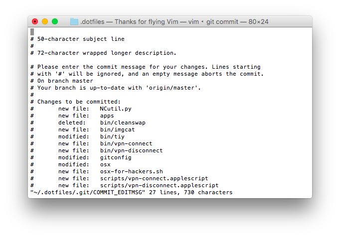
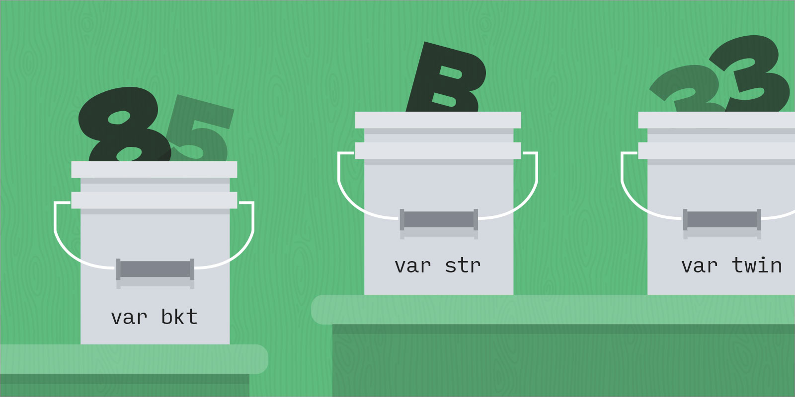
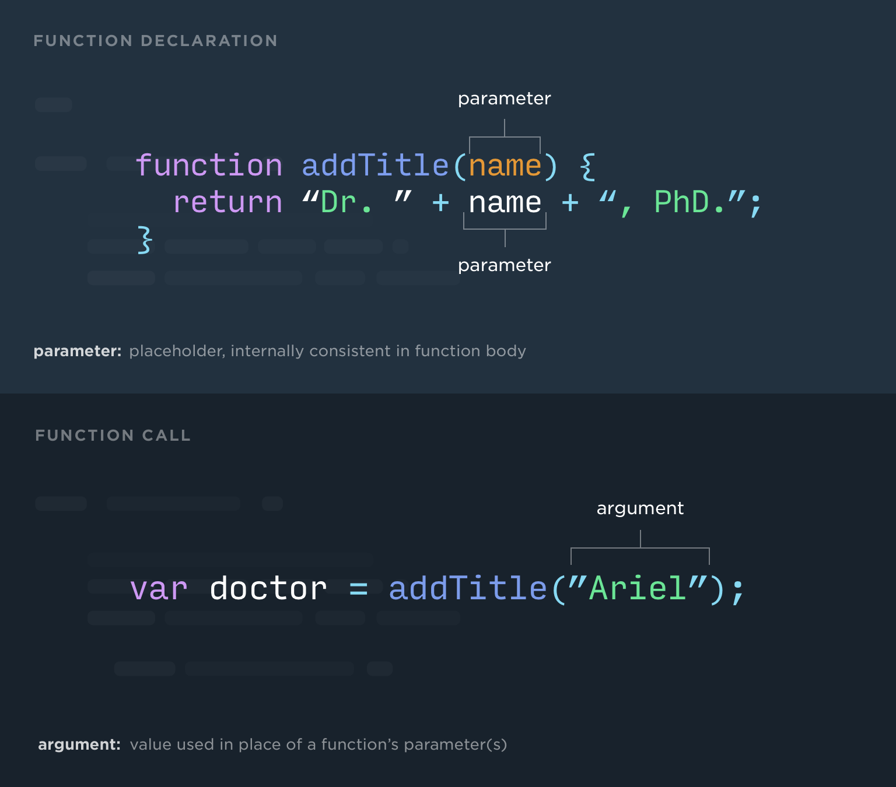
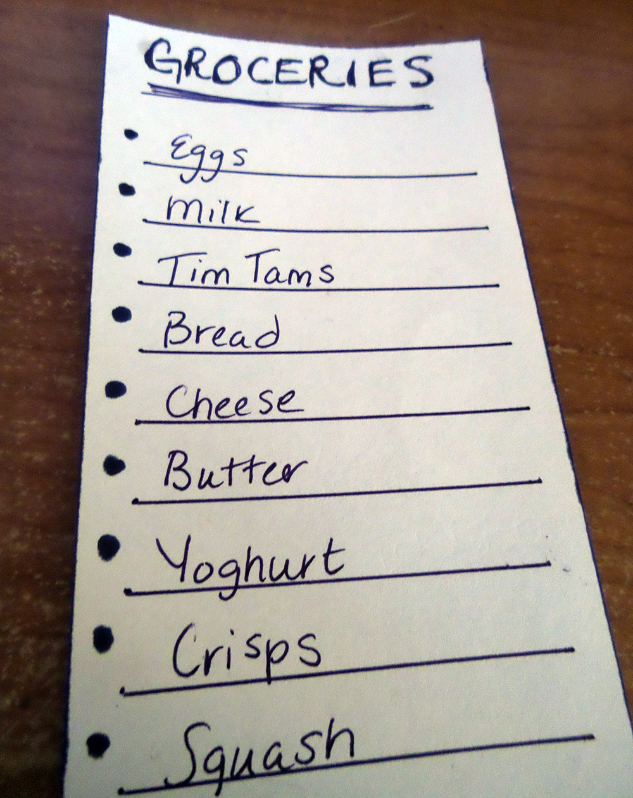
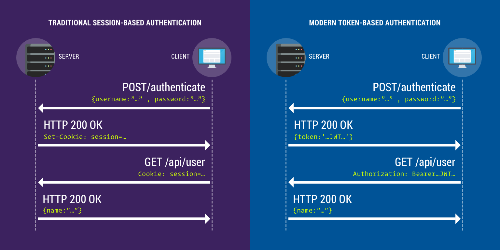

Front-End Fundamentals -
1. File System Traversal  
2. File manipulation  
3. Student can explain how to start, pause, and cancel script execution  
4. Finder File Management  
5. HTML Syntax Rules  
6. Tag Pairs  
7. Attributes  
8. Classifying Related Elements  
9. Common HTML Tags  
10. Element Relationships  
11. Creating Semantic HTML  
12. Basic Selectors  
13. Applying CSS Styling  
14. Declaration Precedence  
15. Style Inheritance  
16. Selector Specificity  
17. Padding, Margin and Border  
18. Compare Display Values  
19. CSS Background Images  
20. CSS Font-families and the Browser  
21. Font Character Rendering  
22. Importing Font Files  
23. Adjacent Values  
24. Determining Stacking Order with z-index  
25. Flexbox Multi-Column Layout  
26. Chrome Developer Tools  
27. Responsive Media Queries  
28. Responsive Breakpoints  
29. Form Input Types  
30. Action and Method Attributes  
31. Creating Web Forms  
32. Inspecting & Editing The DOM with DevTools  
33. Local Version Control Using Git  
34. Managing Remote Repositories  
35. Git Fetch And Pull  
36. Stashing  
37. Cloning A Remote Repository  
38. Merging Branches  
39. Git Team Best Practices  
40. JavaScript Dependencies  
41. JavaScript Data Types  
42. Using Variable  
43. Truthy vs Falsey  
44. Debugging Programs  
45. Conditional Statements  
46. Function Parameters  
47. Recap  
48. The this keyword  
49. Study Notes  
50. Logical Operators  
51. Arrays  
52. Accessing Elements of an Array  
53. Control Flow  
54. For Loops  
55. Query Selectors  
56. Creating, Updating, and Removing DOM Nodes  
57. Select Event Add Listener  
58. Run Code After a Delay or Periodically  
59. Math and Date  
60. Arithmetic Operators in JavaScript  
61. Hoisting  
62. Study Notes  
63. Algorithms  
64. Objects Containing Other Types  
65. Define Event Loop  
66. Promises and Callbacks  
67. FETCH: GET & POST  
68. Cookies & Tokens  
69. Understanding CORS  

Front-End Fundamentals - Encyclopedia

The Encyclopedia is a compilation of all the lesson study notes in this course. Use it to look up the a term or concept that you have covered.

---

[Basic Computer and Terminal Skills](BasicComputerAndTerminalSkills.md) 

# File System Traversal 

## Terminology  

* **Command Line Interface**: A user interface to a computer's operating system in which a user types a command and receives a response back from the system. Also known by its acronym, "CLI".

* **Traversal**: To pass or move over, along, or through.

* **Directory**: A folder.

* **Path**: The general form of the name of a file or directory, specifies a unique location in a file system.

* **Absolute Path**: A path that starts at the root is an absolute path. Path starts with `/`.

* **Relative Path**: If you don't use a leading `/`, the directory is a relative path: You start from your current working directory.

* **Separators**: The slashes (`/`) are called separators - they break apart a path into the hierarchy of directories to get to the file or directory.

* **Working Directory**: The current directory you are in while traversing.

* **Home Directory**: The default working directory when you open a new terminal window is your home directory (`$ ~`).

* **Root**: The root of the filesystem. No directories or files exist before the root, they all extend from root.

## Examples  

Print Working Directory:

```sh
$ pwd
/Users/<your username>
```

List Directory:

```sh
$ ls
Applications    Documents   Library     Music       Public
Desktop     Downloads   Movies      Pictures    projects
```

Change Directory:

```sh
$ cd Downloads
$ ls
someFile.txt   anotherFile.jpg
```

Absolute v Relative:

```sh
$ cd Downloads                // Relative
$ cd /Users/jessie/Downloads  // Absolute
```

## References  

[IBM - UNIX tips and tricks for a new user](https://www.ibm.com/developerworks/aix/tutorials/au-unixtips1/)

[Wikipedia - Path (Computing)](https://en.wikipedia.org/wiki/Path_(computing))

---

[Basic Computer and Terminal Skills](BasicComputerAndTerminalSkills.md)

# File manipulation  

## Terminology  

* **Tape Archiver**: The tape archiver method, `tar`, can quickly group files together into a single archive (file).

## Examples  

Make Directory

*`$` represents the placement of the cursor before input through the command line*

```sh
$ mkdir tiy
$ cd tiy
$ pwd
/Users/jessie/tiy
$ ls
$ # Nothing here yet because this directory was just created
```

Remove Directory

```sh
$ pwd
/Users/jessie
$ ls
Applications Documents    Library      Music        Public
Desktop      Downloads    Movies       Pictures     repos
$ rmdir repos
$ ls
Applications Documents    Library      Music        Public
Desktop      Downloads    Movies       Pictures
```

Make File

```sh
$ touch newfile.txt
$ ls
newfile.txt
```

Remove File

```sh
$ ls
newfile.txt
$ rm newfile.txt
$ ls
$ # Nothing here
```

Write to file

```sh
$ echo "Hello world" > newfile.txt
$ ls -la
-rw-r--r--     1 jessie  staff     22 May 11 11:13 newfile.txt
```

Open a file

```sh
$ open newfile.txt
```

Print File Contents

```sh
$ cat newfile.txt
Hello world
```

Print File Contents (Shortened)

```sh
$ less newfile.txt
```

Copy Files or Directories

```sh
$ cp <filename> <directory-it-should-be-copied-to>
$ cp -R <directory> <directory-it-should-be-copied-to>
```

Moving Files

```sh
$ mv newcopy.txt ../
$ cd ..
$ cat newcopy.txt
Hello world
```

Renaming

```sh
$ mv newcopy.txt specialfile.txt
$ cat specialfile.txt
Hello world
```

Tape Archiver

```sh
$ cd ~
$ tar cvf tmp/repos.tar repos
$ cd tmp
$ ls
repos.tar
```

Extract TAR

```sh
$ cd ~/tmp
$ ls
$ tar xvf repos.tar
$ ls
```

Compressing

```sh
$ cd ~/tmp
$ gzip repos.tar
$ ls
```

Uncompress

```sh
$ gzip -d repos.tar.gz
```

## References  

[IBM - UNIX tips and tricks for a new user](https://www.ibm.com/developerworks/aix/tutorials/au-unixtips1/)

---

[Basic Computer and Terminal Skills](BasicComputerAndTerminalSkills.md)

# Student can explain how to start, pause, and cancel script execution  

## Terminology  

* **Shell**: A shell is a user interface which accesses an operating system's services. In general, operating system shells use either a command-line interface (CLI) or graphical user interface (GUI).

* **Bash**: The Bash shell is a command language interpreter that executes commands read from the standard input or from a file.

* **Shell Script**: A shell script is simply a program, typically text in a file, written in a language designed to be interpreted by a shell such as Bash.

## Examples  

### Writing a shell script  

The syntax for writing shell scripts is identical to entering commands right into the command-line. For example, I might have a shell script in a file called `script.sh` that looks like this:

```sh
#!/bin/bash
echo 'A man a plan a canal panama'
```

The `#!` symbol is known as a hashbang and tells the command-line interpreter (in this case, `sh`) what shell to use.

## Executing  

*Note: If you have trouble executing a script, check permissions.*

*`$` represents the placement of the cursor before input through the command line*

```sh
$ ls -l
-rw-r--r--   1 jessie  admin    35 Apr 10 15:14 script.sh
$ chmod u+x script.sh
$ ls -l
-rwxr--r--   1 jessie  admin    35 Apr 10 15:14 script.sh
```

### Start a Script  

Now you can run this file via the sh command like so:

```sh
$ sh script.sh
A man a plan a canal panama
```

You can do a lot with shell scripts. Here's a simple example of storing fruit in a `.txt` file and printing only the fruits with `'apple'` in the name.

In `fruits.sh`:

```sh
#!/bin/bash
echo 'apple' >> fruits.txt
echo 'banana' >> fruits.txt
echo 'pineapple' >> fruits.txt
cat fruits.txt | grep apple
```

From your terminal:

```sh
$ sh fruits.sh
apple
pineapple
```

*Note: If there was no `fruits.txt` file before, one will be created by executing `fruits.sh`.*

### Pause a Script  

A script can be told to pause for a specified time with the `sleep` command. `sleep` is followed by a number and an optional suffix.

Suffix options:

* `s` for seconds (the default)

* `m` for minutes.

* `h` for hours.

* `d` for days.

```sh
sleep 2   # Sleep for 2 seconds
sleep 3s  # Sleep for 3 seconds
sleep 5m  # Sleep for 5 minutes
sleep 2d  # Sleep for 2 days
```

In `script.sh`:

```sh
#!/bin/bash
echo 'A man a plan a canal panama'
sleep 2s
echo 'Never odd or even'
```

### Pause and Await User input  

A script can be written to pause at a given point and await user input. Consider the following

In `fruits.sh`:

```sh
#!/bin/bash
echo 'apple' > fruits.txt
echo 'banana' >> fruits.txt
echo 'pineapple' >> fruits.txt
read -p "Press [Enter] key to start show results..."
cat fruits.txt | grep apple
```

The `read` command followed by the `-p` option pauses the script. A message is displayed prompting the user to press [Enter] key to continue. When the user presses [Enter] the results are printed.

### Cancel a Script  

The `exit` command exits the shell.

In `script.sh`:

```sh
#!/bin/bash
echo 'A man a plan a canal panama'
sleep 2s
echo 'Never odd or even'
exit 0
echo 'Lisa Bonet ate no basil'
```

In the terminal:

```sh
sh script.sh
```

Notice the sentence 'Lisa Bonet ate no basil' was not printed and the script stopped running.

---

[Basic Computer and Terminal Skills](BasicComputerAndTerminalSkills.md)

# Finder File Management  

## Terminology  

* **Graphical User Interface**: A way of interacting with a computer using items such as windows, icons, and menus, used by most modern operating systems. Also known by its acronym, "GUI". Sometimes pronounced "gooey" /ˈɡo͞oē/.

* **Traversal**: To pass or move over, along, or through.

* **Directory**: A directory is a file system cataloging structure which contains references to other computer files, and possibly other directories. On many computers, directories are known as folders or drawers.

## References  

* [Directory (computing) - Wikipedia](https://en.wikipedia.org/wiki/Directory_(computing))

* [Get to know the Finder on your Mac](https://support.apple.com/en-us/HT201732)

---

[HTML Overview and Basic Elements](HTMLOverviewAndBasicElements.md)

# HTML Syntax Rules  

## Terminology  

* **Valid syntax**: Content was written acceptably according to a specification.

* **Invalid syntax**: Content was not acceptable as defined by the standard specification. Unanticipated results may occur.

* **W3C**: World Wide Web Consortium. A standards body which decides what HTML rules apply.

* **Syntax**: Rules for written text.

* **Void Tags**: Tags which do not have an ending tag, but end on their own and have no content.

## Examples  

* Run the following code using the 'validate by direct input' (copy and paste the entire code) and fix the errors.

  * Syntax validator: https://validator.w3.org/
  
```html
<!DOCTYPE html>
<html>
  <head>
    <meta charset="utf-8">
    <title>The Title</title>
  </head>
  <body>

    <h1><p>The Title Is Here</h1></p>

    <p>Lorem ipsum dolor sit amet, consectetur adipisicing elit, sed do eiusmod tempor incididunt ut labore et dolore magna aliqua. Ut enim ad minim veniam, quis nostrud exercitation ullamco laboris nisi ut aliquip ex ea commodo consequat. Duis aute irure dolor in reprehenderit in voluptate velit esse cillum dolore eu fugiat nulla pariatur. Excepteur sint occaecat cupidatat non proident, sunt in culpa qui officia deserunt mollit anim id est laborum.</p>
    <hr>
    <p>
    <p>
    <input type=text class=bold far placeholder="Hi"/>

  </body>
</html>
```

  * Run the following code using the 'validate by direct input' (copy and paste the entire code) and fix the errors.

```html
[p]Lorem ipsum dolor sit amet, consectetur adipisicing elit, sed do eiusmod tempor incididunt ut labore et dolore magna aliqua. Ut enim ad minim veniam, quis nostrud exercitation ullamco laboris nisi ut aliquip ex ea commodo consequat. Duis aute irure dolor in reprehenderit in voluptate velit esse cillum dolore eu fugiat nulla pariatur. Excepteur sint occaecat cupidatat non proident, sunt in culpa qui officia deserunt mollit anim id est laborum.[/p]
[p]Lorem ipsum dolor sit amet, consectetur adipisicing elit, sed do eiusmod tempor incididunt ut labore et dolore magna aliqua. Ut enim ad minim veniam, quis nostrud exercitation ullamco laboris nisi ut aliquip ex ea commodo consequat. Duis aute irure dolor in reprehenderit in voluptate velit esse cillum dolore eu fugiat nulla pariatur. Excepteur sint occaecat cupidatat non proident, sunt in culpa qui officia deserunt mollit anim id est laborum.[/p]
[p]Lorem ipsum dolor sit amet, consectetur adipisicing elit, sed do eiusmod tempor incididunt ut labore et dolore magna aliqua. Ut enim ad minim veniam, quis nostrud exercitation ullamco laboris nisi ut aliquip ex ea commodo consequat. Duis aute irure dolor in reprehenderit in voluptate velit esse cillum dolore eu fugiat nulla pariatur. Excepteur sint occaecat cupidatat non proident, sunt in culpa qui officia deserunt mollit anim id est laborum.[/p]
```

> *For future reference. When using the 'validate by direct input', make sure to include the following:*

```html
<!DOCTYPE html>
    <html>
    <head>
      <title>html syntax rules exercise</title>
      <script src="https://newline.theironyard.com/assets/exercise-tests.js"></script>
      <script src="tests.js"></script>
    </head>
        <body>
        <!--Your content for validation goes here-->
        </body>
    </html>
```

### References  

[Syntax validator](https://validator.w3.org/)

---

[HTML Overview and Basic Elements](HTMLOverviewAndBasicElements.md)

# Tag Pairs  

## Terminology  

**Tag**: Elements have a starting tag and an ending tags.

**Element**: Elements contain the starting tag, the optional content, and the ending tag. Elements are the entire thing, whereas the "tag" is just a part of the element.

**Content**: Items between the tags; in a paragraph element, the text itself (and any other elements such as images) is the content.

**Void Element**: Elements which do not have content, and therefor should not have an ending tag.

## Examples  

An element can optionally contain content. Below, the "hello world" is the content:

```html
<p>hello world</p>
```

If we were to remove the content, the tags can be written in either of the two ways:

```html
<p></p>
<!--or-->
<p />
```

(note the space before the / which is required for compatibility with older browsers)

A void element, however, never has content. The primary example is an image -- there is no content inside the image. The `src` (source) attributes point to where the image is located.

```html
  
```

The most common void elements are `hr`, `img`, `input`, `link`, `meta`. Since the void element has no content, it also has no closing tag. An HR (horizontal rule) is written as:

```html
<p>Text below the horizontal rule</p>
<hr>
<p>Text after the horizontal rule</p>
```

Note that browsers will render `<hr/>` without problem, but it is more correct syntax to write it as `<hr>`

Void Tag Examples:

```html
  <br>
  <hr>
  
```html

## References  

* [MDN - Empty Elements](https://developer.mozilla.org/en-US/docs/Glossary/Empty_element)

* [MDN - HTML Elements Reference](https://developer.mozilla.org/en-US/docs/Web/HTML/Element)

---

[HTML Overview and Basic Elements](HTMLOverviewAndBasicElements.md)

# Attributes  

## Terminology  

`attribute`: an HTML element modifier that changes default functionality or adds functionality to an element. It consists of a `key` and a `value`, called `key-value pairs`.

* **Key-value pairs**: a set of two linked data objects.

* **Key**: the name of the attribute, such as `src` in an `img` element.

* **Value**: the value of the attribute, such as "/images/icon.png" in the `src` of an `img`.

## Syntax  

```html
<tag-name key="value"></tag-name>
```

## Attribute Rules  

* **Every attribute has one key (attribute name).**

* **Every attribute has one value (attribute value).**

  * class attributes may contain more than one value.

* **Keys are not wrapped in quotes.**

* **Values are wrapped in quotes.**

* **You should not duplicate a key inside an element.**

## Attribute Types  

There are three types of attributes: `element specific`, `global` and `event handler content attributes`.

**Element specific attributes**: Attributes needed by a particular element in order to function or for rendering. For a complete list, visit [MDN](https://developer.mozilla.org/en-US/docs/Web/HTML/Attributes).

**Global attributes**: Attributes that are common to all HTML elements, but they may have no effect on some elements. For a complete list, visit [MDN](https://developer.mozilla.org/en-US/docs/Web/HTML/Global_attributes).

**Event Handler Content Attributes**: Script invoking attributes triggered by a certain 'event'. For a complete list, visit [Quackit](https://www.quackit.com/html_5/tags/html_5_event_handler_content_attributes.cfm).

> `flag attributes`: an attribute with a `key`, but no `value`. For example: `required`, `checked` or `hidden`. You can use this when requiring or preselecting a value in a form.

## Examples  

```
<!--Paragraph element containing a nested anchor tag.-->
<p>Click <a href="www.theironyard.com">here</a> to visit The Iron Yard's homepage.</p>

<!--image element. Contains two attributes, a source and an alternate data attribute.-->


<!--An image element wrapped in an anchor tag in order to link the image to an external source.-->
<!--The anchor tag contains a href attribute, which used to specifiy a link to an external/internal page-->
<a href="cool-site.com"></a>

<!--A button element with an 'onClick' event handler content attribute. When the button is clicked, "myFunction" is executed.-->
<button onclick="myFunction()">Click me</button>

<!--A form element with a text input. In this case, it is a required input because of the 'flag-attribute'-->
<form>
  <fieldset>
      <label for="name">Your Name</label>
      <br>
      <input type="text" id="name" name="name" placeholder="Your Name" required>
  </fieldset>
</form>
```

> In an anchor tag, an `<href>` may contain either a URL or a URL fragment. A URL fragment is preceded by a hash mark (#), specifying an internal target location, using an `id` within the current document.

---

[HTML Overview and Basic Elements](HTMLOverviewAndBasicElements.md)

# Classifying Related Elements  

## Terminology  

* **Id** - a unique identifier attribute for an HTML element.

* **Class** - a re-usable classification for an HTML element.

## Examples  

### IDs  

Often, you may have multiple elements but want to add significance to a particular element. For example, if you have 4 images, but want to have the main image appear larger than the others, you could add an id attribute giving that image an identifier. **Each id should be unique on a page.**

```html


```

### Classes  

`Classes` take the idea of an id, where you want to be able to do "something" with an element, but allow you to reuse it multiple times.

Let's say you want to be able to easily make a thumbnail out of an image (give it a border and set a certain width). You would use a class to do this. `class` is the key, and the value is wrapped in quotes.

```html


```

---

[HTML Structure and Layout](HTMLStructureAndLayout.md)

# Common HTML Tags  

## Terminology  

**Tags**: They indicate a unit of content, such as `<title>MovieName</title>`. Tags wrap content. In the prior example, the content for the title tag is "MovieName".

**Word Processing Tags**: Tags used to display and format text. Think of the format bars for a word processing program (Word, Google Docs, etc)

* Tags: h1, h2, h3, h4, h5, h6, p, strong (and b), em (and i), br, hr

**Semantic Tags**: Tags used to give context clues about the relative importance of their content.

* Tags: article, section, header, footer, aside

**Tables Tags**: Used to display tabular data (like a spreadsheet)

* Tags: table, thead, tbody, tr, th, td

**Forms Tags**: Labels, information, and fields used to gather information from the user and submit it for processing.

* Tags: form, fieldset, label, input, select, button

**Media Tags**: Tags used to display audio and visual content embedded in the HTML.

* Tags: img, canvas, figure, audio, video.

## Examples  

### Example Word Processing Tags  

```html
<article class="">
  <header>
    <h2>Title</h2>
  </header>
  <p>Lorem ipsum dolor sit amet, <strong>consectetur adipisicing elit</strong>, sed do eiusmod tempor incididunt ut labore et dolore magna aliqua. Ut enim ad minim veniam, quis nostrud exercitation ullamco laboris nisi ut aliquip ex ea commodo consequat.</p>
  <p>Duis aute irure dolor in <em>reprehenderit in voluptate velit</em> esse cillum dolore eu fugiat nulla pariatur. Excepteur sint occaecat cupidatat non proident, sunt in culpa qui officia deserunt mollit anim id est laborum.</p>
</article>
```

### Example HTML Table  

```html
<table>
  <thead>
    <tr>
      <th>Year</th>
      <th>Movie Name</th>
    </tr>
  </thead>
  <tbody>
    <tr>
      <td>2015</td>
      <td>Spotlight</td>
    </tr>
    <tr>
      <td>2014</td>
      <td>Birdman</td>
    </tr>
    <tr>
      <td>2013</td>
      <td>12 Years a Slave</td>
    </tr>
    <tr>
      <td>2012</td>
      <td>Argo</td>
    </tr>
  </tbody>
</table>
```

### Example HTML Form  

```html
<!-- index.html -->
<!DOCTYPE html>
<html>
  <head>
    <meta charset="utf-8">
    <title></title>
    <script src="app.js"></script>  
  </head>
  <body>
  <form id="form">
    <fieldset>
      <div class="">
        <label for="your-name">Your Name</label><br>
        <input  type="text" name="your-name" id="your-name" value="">
      </div>

      <div class="">
        <input type="submit" value="Submit Form">
      </div>
    </fieldset>
  </form>
</body>
</html>
```

```js
// app.js
var form = document.getElementById("form");
var nameEl = document.querySelector("#your-name");
form.addEventListener("submit", function(event){
    event.preventDefault();
    console.log("Hi there " + nameEl.value);
});
```

### Example Media Tags  

```html
Image Sample:<br>


<hr>

Audio Sample:<br>

<audio src="https://archive.org/download/WilhelmScreamSample/WilhelmScream.mp3" preload="auto" controls></audio>
<cite>http://archive.org</cite>

<hr>

Video Sample:<br>

<video src="http://html5demos.com/assets/dizzy.webm" controls>
  Your browser does not support the <code>video</code> element.
</video>

<cite>http://html5demos.com</cite>
```

## References  

[Quackit - HTML tags](https://www.quackit.com/html/tags/)

[MDN - HTML element reference](https://developer.mozilla.org/en-US/docs/Web/HTML/Element)

---

[HTML Structure and Layout](HTMLStructureAndLayout.md)

# Element Relationships  

## Terminology  

* **Ancestor**: An ancestor is an element in the lineage starting from the element's parent, and continuing to move up that 
parent's parent, and so forth until the `html` is reached

* **Parent**: An element containing `child` elements.

* **Child**: If an element is directly nested inside the content of an element, the element is a child.

* **Sibling**: If two elements have the same parent, they are siblings.

## Examples  

The HTML tag has two children, the `head` and `body` tag.

```html
<html>
  <head></head>
  <body></body>
</html>
```

Below, from the main-image perspective, the other elements are either a sibling, parent, or ancestor. The images themselves are child of the element with a class of parent.

```html
<!DOCTYPE html>
<html>
  <head>
    <meta charset="utf-8">
    <title>The Title</title>
  </head>
  <body>

    <div class="ancestor">
      <div class="parent">

        
        
        


      </div>
    </div>


  </body>
</html>
```

---

[HTML Structure and Layout](HTMLStructureAndLayout.md)

# Creating Semantic HTML  

## Terminology  

* **Inside-out**: Developing the html structure starting at the most important and moving higher in the hierarchy from there.

* **Outside-in**: Developing the html structure from the body and developing the semantic html as children.

* **Wireframe**: Developing a visual guide that depicts the general layout and structure of a website.

## Examples  

### Example 1  

Here is a simple markup for an `h2`, `p` and a sidebar `div`

```html
<h2>title</h2>
<p>text</p>
<div>Sidebar!</div>
```

Below we take the previous markup and we create something more semantic. Notice the improved structure.

```html
<section>
  <article>
    <h2>title</h2>
    <p>text</p>
  </article>
  <aside>
    Sidebar!
  </aside>
</section>
```

### Example 2  

```html
<!-- index.html -->
<html>
  <head>
    <link rel="stylesheet" href="style.css">
  </head>
  <body>
    <header>
      <h1>Site Titles</h1>
      <nav>
        <a href="">Home</a>
        <a href="">About</a>
        <a href="">Contact</a>
      </nav>
    </header>
    <section>
      <article>
        <h2>Article Title</h2>
        <p>Lorem ipsum dolor sit amet, consectetur adipisicing elit, sed do eiusmod tempor incididunt ut labore et dolore magna aliqua. Ut enim ad minim veniam, quis nostrud exercitation ullamco laboris nisi ut aliquip ex ea commodo consequat. Duis aute irure dolor in reprehenderit in voluptate velit esse cillum dolore eu fugiat nulla pariatur. Excepteur sint occaecat cupidatat non proident, sunt in culpa qui officia deserunt mollit anim id est laborum.</p>

        

        <p>Lorem ipsum dolor sit amet, consectetur adipisicing elit, sed do eiusmod tempor incididunt ut labore et dolore magna aliqua. Ut enim ad minim veniam, quis nostrud exercitation ullamco laboris nisi ut aliquip ex ea commodo consequat. Duis aute irure dolor in reprehenderit in voluptate velit esse cillum dolore eu fugiat nulla pariatur. Excepteur sint occaecat cupidatat non proident, sunt in culpa qui officia deserunt mollit anim id est laborum.</p>
      </article>
      <aside>
        <h6>Sidebar!</h6>
        <ul>
          <li><a href="">Link!</a></li>
          <li><a href="">Link!</a></li>
          <li><a href="">Link!</a></li>
        </ul>
      </aside>
    </section>
    <footer>
      <copy>Copyright 2016</copy>
    </footer>
  </body>
</html>
```

```css
/* style.css */
header {
  border: 2px solid grey;
}
footer {
  border: 2px solid grey;
  text-align: center;
}
article, aside {
  display: inline-block;
  vertical-align: top;
}
article {
  width: 66%;
}
aside {
  width: 33%;
  border: 2px solid grey;
}
```
      
---

[Applying Style with CSS](ApplyingStyleWithCSS.md)

# Basic Selectors  

## Terminology  

**CSS** - A simple declarative language used to define the visual styling of HTML.

**Cascade** - The concept that CSS styles cascade one after another. style declarations are read from top to bottom by the browser. This means that styles declared later in the document will override styles written earlier in the document.

**Selector** - A text string that specifies which HTML element will be styled.

**Declaration** - The combination of a property and the value applied to it within a style block.

**Property** - The visual attribute being styled by a declaration.

**Value** - The specific quantity or quality assigned to a property.

## Examples  

```html
<!-- code sample -->
<p id="first">Paragraph with no class</p>
<p class="colored second">Paragraph with class attribute value</p>
<p class="colored slanted">Second paragraph with class</p>
<p>Paragraph with no class</p>
```

### Tag Selector  

```css
/* styles all paragraphs */
p{
    background: #ddd;
    padding: 20px;
}
```

### Class Selectors  

```css
/* will style the second and third paragraphs */
.colored{
    color: green;
}
/* styles the third paragraph */
.slanted{
    font-style: italic;
}
```

### Id Selectors  

```css
/* will style the first paragraph */
#first{
    font-weight: bold;
}

/* will hide the second paragraph */
#second{
    display: none;
}
```

---

[Applying Style with CSS](ApplyingStyleWithCSS.md)

# Applying CSS Styling  

## Terminology  

**Selector** - A keyword which references an HTML element.

**Declaration** - A styling rule applied to an element using a property / value pair.

**Declaration block** - A group of declarations surrounded by curly braces and preceded by a selector. Each declaration is separated by semicolons. Although the last semicolon within a declaration block is optional, it’s good practice to include it, as it’ll help you avoid syntax errors in the future. As you start to add declarations to a block, it’s all too easy to forget the semicolon.

**Property** - The first part of a declaration - a key which accepts a value or multiple values and describes the visual state of a specific aspect of an element.

**Value** - The second part of a declaration - a single value or set of adjacent values can be applied to a property and thus describe the visual state of a specific aspect of an element.

## Examples  

```html
<head>
  <style>
    .selector { /* declaration block start */
      display: inline-block;
      width: 50%;
      height: 50px;
      background-color: #BADA55;
    }
  </style>
</head>

<body>
  <div class="selector"></div>
</body>
```

## References  

[W3 Brief History of CSS](https://www.w3.org/Style/CSS20/history.html)

[MDN CSS Reference](https://developer.mozilla.org/en-US/docs/Web/CSS/Reference)

[SitePoint Declaration Blocks](https://www.sitepoint.com/html-css/css/)

[HTML Dog - CSS Properties](http://www.htmldog.com/references/css/properties/)

---

[Applying Style with CSS](ApplyingStyleWithCSS.md)

# Declaration Precedence  

## Terminology  

**Cascading** - CSS is interpreted from top to bottom.

**Precedence** - Due to CSS's cascading nature, styles at the bottom overwrite styles which are applied using selectors with the same levels of specificity above them.

## Examples  

```html hostable group:cssauthoringstudy_notes name:index.html

```

```css hostable group:cssauthoringstudy_notes name:styles.css

background-color: red; }

.selector { /* declaration block start */ display: inline-block; width: 50%; height: 50px; background-color: #BADA55; border-left: 2px solid grey; }

.special { /* declaration block start */ border-left: 2px solid #000000; }

/* The second box appears with a red background and white border left */

```

## References  

[CSS Cascade](https://developer.mozilla.org/en-US/docs/Web/CSS/Cascade)

[CSS Tricks - Precedence](https://css-tricks.com/precedence-css-order-css-matters/)

---

[Applying Style with CSS](ApplyingStyleWithCSS.md)

# Style Inheritance  

## Terminology  

* **Inheritance**: Inheritance in CSS is the mechanism through which certain properties are passed on from a parent element down to its children.

## Examples  

```html
<!-- index.html -->
<!DOCTYPE html>
<html>
  <head>
    <meta charset="utf-8">
    <title></title>
    <link rel="stylesheet" href="styles.css">
  </head>
  <body>
    <p>Startup pitch holy grail metrics twitter scrum <span>project</span>.</p>
    <div class="no-show">
      <p>Traction niche market stealth customer long tail deployment validation backing hackathon freemium partner network business-to-consumer.</p>
    </div>
  </body>
</html>

```

```css
/* styles.css */
.no-show {
  visibility: hidden;
}

p {
  font-size: 24px;
  line-height: 36px;
  color: red;
}
```
 
## References  

[W3 Inheritance and Cascade](https://www.w3.org/wiki/Inheritance_and_cascade)

[W3 Property Table](https://www.w3.org/TR/CSS21/propidx.html) (Reference whether a property is inherited or not)

---

[Applying Style with CSS](ApplyingStyleWithCSS.md)

# Selector Specificity  

## Terminology  

* **Specificity**: The means by which browsers decide which CSS property values are the most relevant to an element and, therefore, will be applied. Specificity is based on the matching rules which are composed of different sorts of CSS selectors.

## References  

[MDN Specificity](https://developer.mozilla.org/en-US/docs/Web/CSS/Specificity)

---

[CSS Layout & Fonts](CSSLayout&Fonts.md)

# Padding, Margin and Border  

## Terminology  

**Padding**: allows you to specify how much space should be *between the content of an element and it's border*

**Margin**: this property sets *the gap between elements*

**Border**: allows you to specify the width, style, and color of a border for an element.

## Examples  

### Padding  

In the example below, the red box has no padding, but the blue box as a padding of 20px. Notice the difference:

```html
<!-- index.html -->
<!DOCTYPE HTML>
<html>
  <head>
    <link ref="stylesheet" type="text/css" href="style.css">
  </head>
  <body>
     <p class="first">It was the best of times, it was the worst of times...</p>
     <p class="second">it was the age of wisdom, it was the age of foolishness, it was the epoch of belief...</p>
  </body>
</html>
```

```css
/* style.css */
p.first {
  font-size: 20px;
  width: 275px;
  border: 2px dotted red;
  padding: 0px;
}
p.second {
  font-size: 20px;
  width: 275px;
  border: 2px dotted blue;
  padding: 20px;
}
```

### Margin  

Here we have to take the same example from above and set the padding for both boxes equal to 0. In this case, the red box now has a margin set for 40px. Whereas the blue box has a margin of 0px. Notice the difference:

```html
<!-- index.html -->
<!DOCTYPE HTML>
<html>
  <head>
    <link ref="stylesheet" type="text/css" href="style.css">
  </head>
  <body>
     <p class="first">It was the best of times, it was the worst of times...</p>
     <p class="second">it was the age of wisdom, it was the age of foolishness, it was the epoch of belief...</p>
  </body>
</html>
```

```css
/* style.css */
p.first {
  font-size: 20px;
  width: 275px;
  border: 2px dotted red;
  padding: 0px;
  margin: 40px;
}
p.second {
  font-size: 20px;
  width: 275px;
  border: 2px dotted blue;
  padding: 0px;
  margin: 0px;
}
```

### Border  

In this example, you can see the different ways that you can create borders around your elements. Take a look at the CSS to see how it differs from box to box.

```html
<!-- index.html -->
<!DOCTYPE HTML>
<html>
  <head>
    <link ref="stylesheet" type="text/css" href="style.css">
  </head>
  <body>
     <p class="first">It was the best of times, it was the worst of times...</p>
     <p class="second">it was the age of wisdom, it was the age of foolishness, it was the epoch of belief...</p>
     <p class="third">it was the season of Light, it was the season of Darkness...</p>
  </body>
</html>
```

```css
/* style.css */
p.first {
  margin: 30px;
  font-size: 20px;
  border-width: 15px;
  border-style: groove;
  border-color: #dadada;
}
p.second {
  margin: 30px;
  font-size: 20px;
  border-width: 5px;
  border-style: dotted;
  border-color: purple;
}
p.third {
  margin: 30px;
  font-size: 20px;
  border-width: 5px 10px 15px 5px;
  border-style: solid;
  border-color: #bbbbaa #ffffff #ee3380 red;
}
```

---

[CSS Layout & Fonts](CSSLayout&Fonts.md)

# Compare Display Values  

The `display` CSS property specifies the type of rendering box used for an element. In HTML, default `display` property values are taken from the HTML specifications or from the browser's user agent stylesheet.

The default value for all elements is `inline`. Most user agent stylesheets (the default styles the browser applies to all sites) reset many elements to `block`. This is why plain HTML documents tend to stack elements vertically.

### Inline  

Inline elements can be placed adjacent to one another horizontally if there is enough space.

* `display: inline;`

### Block  

Block level elements do not sit inline but break past them, stacking vertically. By default (without setting a width) they take up as much horizontal space as they can.

* `display: block;`

### Inline Block  

Inline block elements will be placed adjacent to one another horizontally if there is space for them to fit. They are much like inline elements except they can have a width and height.

* `display: inline-block;`

## Comparison  

| Display |	More than one per line |	Can have height |	Can have width |	Can have margin |	Can have padding |
| :--- | :--- | :--- | :--- | :--- | :--- |
| `display: inline;` |	yes |	no |	no |	left and right only |	padding will be applied but the element will overlap other | like elements vertically |
| `display: inline-block;` |	yes |	yes |	yes |	yes |	yes |
| `display: block;` |	no |	yes |	yes |	yes |	yes |

## Examples  

```html
<!-- index.html -->
<!DOCTYPE html>
<html>
  <head>
    <meta charset="utf-8">
    <title>Display Compare</title>
    <link rel="stylesheet" href="styles.css">
  </head>
  <body>
    <div class="i">
      <p><em>Inline:</em> Lorem ipsum dolor sit amet, <span style="color: #6320EE;">consectetur</span> adipiscing el1it.</p>
    </div>
    <div class="b"><em>Block</em></div>
    <div class="b"><em>Block</em></div>
    <div class="b"><em>Block</em></div>
    <div class="ib"><em>Inline Block</em></div>
    <div class="ib"><em>Inline Block</em></div>
    <div class="ib"><em>Inline Block</em></div>
    <div class="ib"><em>Inline Block</em></div>
    <div class="ib"><em>Inline Block</em></div>
    <div class="ib"><em>Inline Block</em></div>
    <div class="ib"><em>Inline Block</em></div>
  </body>
</html>
```

```css
/* styles.css */
div.b {
  height: 30px;
  border: 2px solid #6320ee;
}

div.ib {
  display: inline-block;
  width: 30%;
  height: 30px;
  border: 2px solid #6320ee;
}

div.ib:nth-of-type(2) {
  width: 20%;
}

div.ib:nth-of-type(3) {
  width: 10%;
}

div.ib:nth-of-type(4) {
  width: 70%;
}

div.ib:nth-of-type(5) {
  width: 20%;
}

div.ib:nth-of-type(6) {
  width: 40%;
}

div.ib:nth-of-type(7) {
  width: 55%;
}
```

## References  

[MDN - Display](https://developer.mozilla.org/en-US/docs/Web/CSS/display?v=control)

---

[CSS Layout & Fonts](CSSLayout&Fonts.md)

# CSS Background Images  

## Terminology  

**background**: shorthand for setting the individual background values in a single place in the style sheet.

**background-image**: sets one or several background images for an element. 

**background-position**: sets the initial position for each defined background image, relative to the background position layer defined by background-origin. 

**background-size**: specifies the size of the background images. 

**background-repeat**: defines how background images are repeated; either across a y-axis, across an x-axis, across both, or not repeated at all. 

**background-origin**: determines the position of the origin of an image. 

**background-clip**: specifies whether an element's background extends underneath its border. 

**background-attachment**: determines whether the background image's position is fixed within the viewport or scrolls along with its containing block. 

**background-color**: sets the background color of an element, either through a color value or the keyword transparent.
  
---

[CSS Layout & Fonts](CSSLayout&Fonts.md)

# CSS Font-families and the Browser  

## Terminology  

**web safe** - Web safe fonts are fonts that are already installed on most computers. These fonts don't need to be downloaded by the user to appear in the browser.

**font stacking** - Refers to listing several fonts to be displayed in the event that the first font is not available.

## Examples  

These examples include typefaces that are installed on most computers. They are group by type.

* Serif:

```css
body {
font-family: Georgia, Times, Times New Roman;
}
```

* Sans-Serif:

```css
body {
  font-family: Arial, Veranda, Helvetica;
}
```

* Monospace

```css
body {
  font-family: Courier, Courier New;
}
```

* Cursive

```css
body {
  font-family: Comic Sans MS, Monotype Corsiva;
}
```

* Fantasy

```css
body {
  font-family: Impact, Haettenschweiler;
}
```

---

[CSS Layout & Fonts](CSSLayout&Fonts.md)

# Font Character Rendering  

## Examples  

```html
<div>
    <h1>Page Title</h1>

    <p>Lorem ipsum dolor sit amet, consectetur adipisicing elit. Deserunt, excepturi, blanditiis quae cumque qui repellendus placeat iusto totam repellat repudiandae quam neque laudantium ex nemo distinctio beatae. Eius, alias, earum!</p>

    <p>Lorem ipsum dolor sit amet, consectetur adipisicing elit. Deserunt, excepturi, blanditiis quae cumque qui repellendus placeat iusto totam repellat repudiandae quam neque laudantium ex nemo distinctio beatae. Eius, alias, earum!</p>
</div>
```

```css
p {
  /*Expects a list of fonts to try from left to right*/
  /*Will attempt to load Helvetica from the user's computer. If that fails, the browser will attempt to load Arial. If that fails, the browser will find any sans-serif font on the user's computer and use that.*/
  font-family: Helvetica, Arial, sans-serif; /*font, initial, inherit*/

  /*Sets the font size to the relative measure of 2em.*/
  font-size: 2em; /*medium, xx-small, x-small, small, large, x-large, xx-large, smaller, larger, length, initial, inherit*/

  /*Selects the italic font from the current family. Rarely used for anything other than to make the font italic*/
  font-style: italic; /*normal, italic, oblique, initial, inherit*/

  /*Forces the browser to display a small caps version of the font. VERY UGLY STUFF. The weights of the small caps can be awkward when Glyphs are sized inconsistently*/
  font-variant: small-caps; /*normal, small-caps, initial, inherit*/

  /*Selects the bold version of the current font of the current font family. Can be combined with font-style to select a bold and italic font. */
  font-weight: bold; /*normal, bold, bolder, lighter, number, initial, inherit*/
}
```

---

[CSS Layout & Fonts](CSSLayout&Fonts.md)

# Importing Font Files  

## Terminology  

**@font-face** - A CSS directive that will import font information from a source file for use on a website.

## Examples  

The fontface rule requires three things: A declaration of the font-family name, the location of the source font file (local or remote), and the weight of the font.

```css
@font-face {
  font-family: WebUnsafeFont;
  src: url("font/location/WebUnsafeFont.otf");
  font-weight: 400;
}

/* Can be used later as */
p {
  font-family: WebUnsafeFont, Helvetica, Arial, sans-serif;
}
```

To use a font that is cross-browser compatible, you must define multiple source files in different font formats. Don't try to generate all of the font formats yourself. If you have a web font that is licensed for distribution and can be safely converted into derivative formats, the use FontSquirrel to convert it online.

```css
/*  FontSquirrel will produce code that looks like this. It generates all the fonts and declares them as a list in the css*/
@font-face {
  font-family: 'WebUnsafeFont';
  src: url('WeUnsafeFont.eot');
  src: url('WeUnsafeFont.eot?#iefix') format('embedded-opentype'),
    url('WeUnsafeFont.woff') format('woff'),
    url('WeUnsafeFont.ttf') format('truetype'),
    url('WeUnsafeFont.svg#open_sansregular') format('svg');
  font-weight: normal;
}
```

---

[CSS Layout and Flexbox](CSSLayoutAndFlexbox.md)

# Adjacent Values  

## Terminology  

**Value** - The second part of a declaration - a single value or set of adjacent values can be applied to a property and thus describe the visual state of a specific aspect of an element.

**Adjacent Values** - Shorthand properties allow for multiple values or "adjacent values".

## Examples  

```html
<head>
  <style>
    .box {
      width: auto;
      /* or */
      width: 50px;
      border-left: 1px solid #000000;
    }
  </style>
</head>
<body>
  <div class="box">content</div>
</body>
``` 

## References  

[MDN CSS Shorthand Properties](https://developer.mozilla.org/en-US/docs/Web/CSS/Shorthand_properties)

[HTML Dog - CSS Properties](http://www.htmldog.com/references/css/properties/)

[CSS Values](http://cssvalues.com/)

---

[CSS Layout and Flexbox](CSSLayoutAndFlexbox.md)

# Determining Stacking Order with z-index  

Elements in CSS can be positioned in three dimensions. There is top to bottom, left to right and front to back. Z-index is the property that allows for positioning of an element from the front to the back. This is essentially the visual appearance of stacking elements. If x-index and y-index are the horizontal and vertical lines, then z-index is the depth of the page, essentially the 3rd dimension.

## Terminology  

**z-index**: determines the order of positioned elements that stack on top of each other from front to back
*Remember!* z-index only works on positioned elements (position:absolute, position:relative, or position:fixed).

## Syntax  

*auto*: sets the stack level for z the same as the parent element

```css
z-index: auto;
```

*integers*: z-index can also be determined by integer. The element with the highest z-index is on top. Those with a negative number will be sent to the bottom of the stack. The default integer for z-index is 0.

```css
z-index: 0;
z-index: 5;
z-index: 99;
z-index: -1;
```

## Examples  

The example below shows two elements, an `h1` and `p` element. They both currently have a `z-index` of 0. Go to the `style.css` doc and change the `z-index` to 10 for the `h1`. Hit the `preview` button to see your change update the browser view.

```html
<!-- index.html -->
<!DOCTYPE HTML>
<html>
  <head>
    <link ref="stylesheet" type="text/css" href="style.css">
  </head>

  <body>
    <h1>This is a header for the page</h1>
    <p>Tempora iste ducimus id aut numquam ut error. Occaecati ullam tempora ut. Expedita nesciunt sed quia itaque aut sit.
       Harum sunt a explicabo est velit molestiae. Sit ut modi sapiente perspiciatis. Perspiciatis rerum et voluptatem. Sapiente eveniet velit omnis placeat officia aut voluptatem.</p>
   </body>

</html>
```

```css
/* style.css */
h1 {
  position: fixed;
  top: 0px;
  left: 0px;
  margin: 0px;
  padding: 30px;
  width: 100%;
  background-color: #efefef;
  z-index: 0;
}
p {
  position: relative;
  top: 70px;
  left: 70px;
  background-color: #cfffff;
  font-size: 20px;
  z-index: 0;
}
```

Notice how the `h1` elements moves in front of the `p` when its `z-index` is higher than `p`.

---

[CSS Layout and Flexbox](CSSLayoutAndFlexbox.md)

# Flexbox Multi-Column Layout  

Getting started with flexbox is easy. Start with a container element and several nested elements.

Next, add `display: flex;` to the outer container. Doing so defines the element as a flex container. Its children are defined as flex items. The flex container a block-level element.

Apply `flex-wrap: wrap;` to the flex container. The CSS flex-wrap property specifies whether flex items are forced into a single line or can be wrapped onto multiple lines. If wrapping is allowed, this property also enables you to control the direction in which lines are stacked.

If we add content to our flex items (nested `<div>` elements) we can see that even if the content is varied in length, the flex items all have the same height. This is the default behavior with flexbox.

## Terminology  

* Display flex

* Flex wrap

* Equal heights

* Further capabilities

  * Justify content
  
  * Flex direction

  * Align self

  * Flex

## Examples  

```html
<!-- index.html -->
<!DOCTYPE html>
<html>
  <head>
    <meta charset="utf-8">
    <title>CSS Syntax Study Notes</title>
    <link rel="stylesheet" href="styles.css">
  </head>
  <body>
    <section>
      <div>Skateboard health goth austin fanny pack venmo +1 fap hashtag.</div>
      <div>Four dollar toast forage la croix next level beard godard authentic lo-fi wayfarers man bun fingerstache banjo four dollar toast. Stumptown jean shorts.</div>
      <div>Pickled tofu cardigan enamel pin migas fap ennui biodiesel aesthetic.</div>
      <div>Gluten-free ennui cray master cleanse activated charcoal.</div>
      <div>Organic banh mi kitsch, drinking vinegar fashion axe DIY four dollar toast vexillologist iceland bespoke actually kombucha bicycle rights kickstarter slow-carb.</div>
      <div>Af echo park pabst franzen, la croix.</div>
    </section>
  </body>
</html>
```

```css
/* styles.css */
html {
  box-sizing: border-box;
}

*,
*:before,
*:after {
  box-sizing: inherit;
}

body {
  margin: 0;
  font-size: 18px;
  line-height: 32px;
}

section {
  display: flex;
  flex-wrap: wrap;
}

div {
  background-color: #98dfaf;
  border: 1px solid #ffffff;
  width: 25%;
}
```

## References  

[MDN - Using Flexible Boxes](https://developer.mozilla.org/en-US/docs/Web/CSS/CSS_Flexible_Box_Layout/Using_CSS_flexible_boxes)

---

[CSS Layout and Flexbox](CSSLayoutAndFlexbox.md)

# Chrome Developer Tools  

## Terminology  

### Developer Tools:

The Chrome Developer Tools (DevTools for short), are a set of web authoring and debugging tools built into Google Chrome. The DevTools provide web developers deep access into the internals of the browser and their web application. Use the DevTools to efficiently track down layout issues, set JavaScript breakpoints, and get insights for code optimization.

[source](https://developer.chrome.com/devtools)

## Examples  

Attached: resources/completed.html

## References  

[Inspect and Edit Pages and Styles - Chrome Developer Tools](https://developers.google.com/web/tools/chrome-devtools/inspect-styles/)

---

[Responsive Web Design](ResponsiveWebDesign.md)

# Responsive Media Queries  

## Terminology  

* **Media Query**: A CSS module that uses expressions to define tailored styling for specified ranges of output devices, dimensions and settings.

## Examples  

```css
@media screen and (min-width: 640px) and (max-width: 1024px) {
    /* styles */
}
```

## References  

[MDN - Using Media Queries](https://developer.mozilla.org/en-US/docs/Web/CSS/Media_Queries/Using_media_queries)

[MDN - Media Features](https://developer.mozilla.org/en-US/docs/Web/CSS/@media#Media_features)

[MDN - Logical Operators](https://developer.mozilla.org/en-US/docs/Web/CSS/Media_Queries/Using_media_queries#Logical_operators)

[CSS-Tricks - All Stylesheet Media Types](https://css-tricks.com/snippets/css/all-stylesheet-media-types/)

---

[Responsive Web Design](ResponsiveWebDesign.md)

# Responsive Breakpoints  

## Terminology  

* **Responsive**: A web application responds to various device outputs by rendering a tailored experience for all.

* **Media Query**: A CSS module that uses expressions to define tailored styling for specified ranges of output devices, dimensions and settings.

* **breakpoint range**: a defined range of window width in which certain styles are applied.

* **min-width**: A minimum width at which to start implementing a described set of declarations within a media query.

* **max-width**: A maximum width at which to stop implementing a described set of declarations within a media query.

## Examples  

attached

## References  

[MDN - Using Media Queries](https://developer.mozilla.org/en-US/docs/Web/CSS/Media_Queries/Using_media_queries)

---

[Creating HTML Forms and Inspecting Your Code](CreatingHTMLFormsAndInspectingYourCode.md)

# Form Input Types  

## Terminology  

**Controls**: used by users to interact with the form.

* input (text) - standard

* input (email) - displays email keyboard on mobile

* input (number) - displays number keyboard on mobile

* input (password) - masks the entry with *

* input (file) - allow the user to select a file to upload

* input (tel) - one-line plaintext edit control for entering a phone number

* select - drop down

* textarea - multiple line entry

* checkboxes - can select multiple values for the same name

* radio buttons - can select one value for the same name

* name - the name of the control, submitted with the form data and used by the server to identify fields when submitting. **Note: only elements with a name attribute will have their values passed when the form is submitted!.**

## Examples  

```html
<form>
  <fieldset>
    <legend>Radio Buttons</legend>

    <label>
      <input type="radio" name="chooseone" value="HTML" checked>
      HTML
    </label>

    <label>
      <input type="radio" name="chooseone" value="CSS">
      CSS
    </label>

    <label>
      <input type="radio" name="chooseone" value="JS">
      JavaScript
    </label>
  </fieldset>

  <fieldset>
    <legend>Check Boxes</legend>
    <label>
      <input type="checkbox" id="checkboxes" value="hi" checked required>
      Hi there!
    </label>
    <label>
      <input type="checkbox" id="checkboxes" value="bye">
      See ya later!
    </label>
  </fieldset>

  <fieldset>
    <legend>Select (Drop Down)</legend>
    <label for="dropdown">Select</label>
    <select type="select" id="dropdown">
      <option value="">Please select a greeting</option>
      <option value="Hello">Hello</option>
      <option value="Goodbye">Goodbye</option>
    </select>
  </fieldset>
</form>

<style media="screen">
  label {
    display: block;
  }
  fieldset {
    margin-bottom: 1em;
  }
</style>
```

---

[Creating HTML Forms and Inspecting Your Code](CreatingHTMLFormsAndInspectingYourCode.md)

# Action and Method Attributes  

## Terminology  

* **Action**: An attribute which determines where the form-data is sent. The value must be a valid URL.

* **Method**: refers to the HTTP method used to transmit the form data.

* **GET**: Method which requests information from the web server.

  * Data is appended to the URL.

  * The length of the URL is limited to about three thousand characters.

  * Better used to send non-secure data.

  * Allows the user to bookmark the page once the form has been submitted.

* **POST**: Method which submits new or changed information to the web server.

  * It appends form-data inside the body of the HTTP request.

  * Compared to GET, it does not have size limitations.

  * Does not allow the user to bookmark the page.

* **Idempotent**: A request which can be re-run multiple times without side-effects. Example: If I submit an order multiple times, it is idempotent if only one order is created.

* **Script**: A server side program which processes the form and acts accordingly. An example could be inserting a record in a database, or sending a confirmation email.

## Examples  

Say we wanted to create a guest list of visitors to our website. The guest list would be displayed at "guestlist.html" -- so we'd link to it with something like:

```html
<a href="guestlist.html">View our Guest List</a>
```

On that page, we'd see a table of visitors. If we wanted to add ourselves to this guest list, we'd need a form. And we'd need to tell the form where to submit it. That location of where to submit the form is very similar to the `href` location of where a link gets submitted.

If our web server had a script named "processguestlist.php" in the "scripts" directory, we would set the action attribute value to `/scripts/process_guest_list.php`.

Next, we would need to set the "method" for the form. There are two main methods used in HTML:

1. **GET**: used to retrieve information. Like an a link, a GET form should not change information. It's used in search engines.

2. **POST**: used to add or change information. Most forms are 'post' forms.

Since we want to add our name to the guest list, we'd use a POST action.

```html
<form action="/scripts/process_guest_list.php" method="POST">
  <label for="name">Your Name</label>
  <input type="text" name="name">
</form>
```

If we only wanted to search for a name on the guest list, our form would look like the following. Note the action is GET because we are searching for information.

```html
<form action="/scripts/process_guest_list.php" method="GET">
  <label for="name">Your Name</label>
  <input type="text" name="name">
</form>
```

---

[Creating HTML Forms and Inspecting Your Code](CreatingHTMLFormsAndInspectingYourCode.md)

# Creating Web Forms  

## Terminology  

**Web form**: A section of a document made up of content, markup, controls, and labels. Users complete the form by modifying the controls.

**Controls**: Utilized by users to interact with the form. Some of these controls are checkboxes, menus, radio buttons, etc. The value of these controls are strings and each control has an initial and current value.

* The initial value 'may' be specified with the element's value attribute and it does not change after a form reset.

* The current value 'may' be modified through user interaction or scripts and it changes back to the initial value after a form reset.

## Examples  

Sample Good Practices Form:

Things to note:

1. Marking the email field as type 'email'. This will bring up an email keyboard on a mobile device.

2. Adding a placeholder which appears inside the text field.

3. Adding a required attribute which will force browsers to have a value inside them before submitting.

4. Wrapping related inputs inside a fieldset

5. Using labels which are links to inputs

```html
<form>
  <fieldset>
    <div>
      <label for="name">Your Name</label>
      <br>
      <input type="text" id="name" name="name" placeholder="Your Name" required>
    </div>

    <div>
      <label for="email">Your Email</label>
      <br>
      <input type="email" id="email" name="email" placeholder="Your Email" required>
    </div>

    <div>
      <input type="submit" value="Sign Up!">
    </div>
  </fieldset>
</form>
```

## References  

[MDN - Form Data Validation](https://developer.mozilla.org/en-US/docs/Learn/HTML/Forms/Form_validation)

[MDN - How To Structure An HTML Form](https://developer.mozilla.org/en-US/docs/Learn/HTML/Forms/How_to_structure_an_HTML_form)

---

[Creating HTML Forms and Inspecting Your Code](CreatingHTMLFormsAndInspectingYourCode.md)

# Inspecting & Editing The DOM with DevTools  

## Terminology  

**Developer Tools**: (DevTools) Web-authoring and debugging tools.

## Using The Tools  

Google Chrome specific. Other browsers offer similar tools and features.

### Accessing DevTools  

* Right click on an element and select `Inspect Element`. This will not only open the tool, but it will take you exactly to the selected DOM node.

* Using the keyboard: On a Mac select `cmd + opt + i`. In Windows select `ctrl + shift + i`.

* Chrome browser: `menu > More Tools` > `Developer Tools`.

### Editing a node  

* Right click on an element to:

  * `Add Attribute`: add attributes, such `class`, `src`, or `width`.

  * `Edit Attribute`: edit current attribute(s).

  * `Edit as HTML`: opens an HTML edit windows. From here you can edit the *entire content* of the node as if you were using an editor. You can even add an element(s).

  * `Copy`: lets you perform several different `copy` operations. The most useful being `copy outerHTML`. This copies the entire content of the node (tags and content).

* Click and drag an element to rearrange.

* Style pane

  * Editing a style: Clicking on an element lets us edit then name and value of a style. To save, press `Enter` or `Tab`.

  * Adding a style: Click outside the `style` `name` or `value`. This adds a new `style` line to which you must provide a `CSS style`.

  * Style modification is not saved by default. Reloading the page reverts all styling. Set up `Persistent authoring` to save changes.

* `Computed pane`


  * Access to `box model`. All properties are editable.

---

[Version Control with Git](VersionControlWithGit.md)

# Local Version Control Using Git  

## Terminology  

`git`: A Distributed Version Control System used to track changes to and coordinate work on code. With git, a developer's working copy of code serves as a repository with a full history of changes.

## Installing And Setting Up Git  

### Install Git  

* Add SSH key to GitHub https://help.github.com/articles/generating-ssh-keys/

* [Download and install Git](https://git-scm.com/download/mac).

Also, install hub with brew:

```sh
brew install hub
```

### Configure Git  

```sh
git config --global user.email "<Your email>"
git config --global user.name "<Your name>"
```

## Creating A Local Repository  

> Important: replace `<project>`, and `<"description">`

1. `$ mkdir <project>` Creates a folder in local machine with the name <project>.

2. `$ cd <project>`

3. `$ git init`. Creates a git repository in the current directory.

## Staging  

1. Add a file(s) to staging.

  * `$ git add <file-name>`. Add single file.

  * `$ git add .` To track all files in the current directory. You can do this by adding the current directory.

2. `$ git status`. See the current status of your directory and repository.

3. `$ git commit -m <description>`. Saves a snapshot of the staging area.

### Example

A `commit` output might look something like this.

```sh
$ git commit
[master 7b84c79] Fix font in index.html
1 file changed, 12 insertions(+), 2 deletions(-)
```

> * use `$ git reset <file-name>` to remove file from staging.
> * It is good practice to check the `status` of the repository after adding a file(s).
> * Think of a `commit` as saving a game. You want to save and save often.

## Using Vim To Edit A Commit  

1. `$ git commit`

2. Type `i` to enter insert mode.

3. Type your message.

4. Hit the esc key to enter command mode.

5. Type `:wq` to save the message

### Example



## Git Practice  

> *Practice makes perfect! Go to [try.github.io](https://try.github.io/levels/1/challenges/1) and complete the challenges 1-9.*

---

[Version Control with Git](VersionControlWithGit.md)

# Managing Remote Repositories  

## Terminology  

`git remote add`: Add a new remote repository of to project.

`git remote`: View remote alias.

`git remote -v`: View alias's URL.

`git remote rm [ALIAS]`: Remove an existing remote alias.

`git remote rename [old-alias] [new-alias]`: Rename remote aliases.

`git remote set-url`: Change an existing remote URL

`git push`: Push changes to remote repository.

## Adding, Listing And Removing Remote Repositories  

### Adding Remote Repository  

#### Syntax

`$ git remote add origin git@github.com:<USERNAME>/<REPO-NAME>.git`

#### Example

```sh
$ git remote
$ git remote add github git@github.com:supercoder/code.git
$ git remote -v
github  git@github.com:supercoder/code.git (fetch)
github  git@github.com:supercoder/code.git (push)
```

### Listing Remote Repository  

#### Syntax

```sh
$ git remote
```

#### Example

```sh
$ git remote
origin
```

`$ git remote -v`

```sh
$ git remote -v
origin  git@github.com:github/code.git (fetch)
origin  git@github.com:github/code.git (push)
```

### Removing Remote Repository  

#### Syntax

`$ git remote rm [ALIAS]`

#### Example

```sh
$ git remote -v
github  git@github.com:supercoder/code.git (fetch)
github  git@github.com:supercoder/code.git (push)
$ git remote add origin git://github.com/hipercoder/code.git
$ git remote -v
github  git@github.com:supercoder/code.git (fetch)
github  git@github.com:supercoder/code.git (push)
origin  git://github.com/hipercoder/code.git(fetch)
origin  git://github.com/hipercoder/code.git(push)
$ git remote rm origin
$ git remote -v
github  git@github.com:supercoder/code.git (fetch)
github  git@github.com:supercoder/code.git (push)
```

### Renaming Remote Repository  

#### Syntax

`git remote rename [old-alias] [new-alias]`

#### Example

```sh
$ git remote add github git@github.com:supercoder/code.git
$ git remote -v
github  git@github.com:supercoder/code.git (fetch)
github  git@github.com:supercoder/code.git (push)
$ git remote rename github origin
$ git remote -v
origin  git@github.com:supercoder/code.git (fetch)
origin  git@github.com:supercoder/code.git (push)
```

### Changing An Existing Remote URL  

#### Syntax

`$ git remote set-url`

#### Example

```sh
$ git remote -v
github  git@github.com:supercoder/code.git (fetch)
github  git@github.com:supercoder/code.git (push)
origin  git://github.com/hipercoder/code.git (fetch)
origin  git://github.com/hipercoder/code.git (push)
$ git remote set-url origin git://github.com/github/git-reference.git
$ git remote -v
github  git@github.com:supercoder/code.git (fetch)
github  git@github.com:supercoder/code.git (push)
origin  git://github.com/github/git-reference.git (fetch)
origin  git://github.com/github/git-reference.git (push)
```

### Pushing Changes to Remote Repository  

#### Syntax

`git push [alias] [branch]`

#### Example

```sh
$ git push origin my-dev-branch
```

> * We can `push` to any branch we have 'write' access to.
> * If the branch is not in the server, one will be created.

## Git Practice  

> *Practice makes perfect! Go to [try.github.io](https://try.github.io/levels/1/challenges/10) and complete challenges 10-12.*

---

[Version Control with Git](VersionControlWithGit.md)

# Git Fetch And Pull  

## Terminology  

`$ git fetch`: It pulls down any data not found locally and it does not merge the data.

`$ git pull`: Runs a `git fetch` immediately followed by a `git merge`.

## When To Use Fetch And Pull  

`Fetch`: This is a good one to use when working in a collaborative environment. Performing a `fetch` will pull down the data and let you see what has changed.

`pull`: It is recommended to use `pull` when starting with a **clean working copy**. There should be no uncommitted local changes before performing a `pull`. Keep in mind that `git pull` might cause a `merge conflict` when merging remote changes with local ones.

### How To Use Fetch  

#### Syntax

`$ git fetch [alias]`

#### Example

```sh
$ git fetch example-branch
remote: Counting objects: 4006, done.
remote: Compressing objects: 100% (1322/1322), done.
remote: Total 2783 (delta 1526), reused 2587 (delta 1387)
Receiving objects: 100% (2783/2783), 1.23 MiB | 10 KiB/s, done.
Resolving deltas: 100% (1526/1526), completed with 387 local objects.
From github.com:supercoder/code
   8e29b09..c7c5a10  master     -> example-branch/master
   0709fdc..d4ccf73  javascript -> example-branch/javascript
   6684f82..ae06d2b  ruby       -> example-branch/ruby
 * [new branch]      css        -> example-branch/css
 * [new branch]      html       -> example-branch/html
```

### How To Use Pull  

#### Syntax

`$ git pull [alias] [branch]`

```sh
$ git pull origin test-branch
From github.com:myproject/content
 * branch              test-branch -> FETCH_HEAD
Already up-to-date.
```

## Git Practice  

> *Go to [learngitbranching.js.org](https://learngitbranching.js.org/) and complete exercises 3 and 4 under the 'remote' tab.*

---

[Version Control with Git](VersionControlWithGit.md)

# Stashing  

## Terminology  

`git stash`: Adds current changes to the stack for later use. Gives back a clean working directory based on the last commit.

* Untracked files **will not** be included.

* Use `git stash -u` (version 1.7.7 and later) to stash untracked files.

`git stash list`: View stashes currently on the stack.

`git stash apply`: Applies an item from the stash list to current working directory.

`git stash drop`: Removes an item from the stash list.

## Git Stash  

#### Syntax

`$ git stash`

#### Example

```sh
$ git status -s
M hello-world.html
$ git stash
Saved working directory and index state WIP on master: 5857ac1 we are trying git stash
HEAD is now at 5857ac1 we are trying git stash
$ git status
# On branch master
nothing to commit (working directory clean)
```

> `git status -s` shows the output in the short-format.

## Git Stash List  

#### Syntax

`$ git stash list`

#### Example

```sh
$ git stash list
stash@{0}: WIP on master: 5857ac1 we are trying git stash
```

Incremental stashes will be noted inside the `{ }`. `stash@{0}` represents the **last** stashed item.

```sh
$ git stash list
stash@{0}: WIP on master: ee2d2c6 we added one stash
stash@{1}: WIP on master: 5857ac1 we added two stashes
```

## Git Stash Apply  

#### Syntax

`$ git stash apply`

#### Example

```sh
$ git stash apply
# On branch master
# Changes not staged for commit:
#   (use "git add <file>..." to update what will be committed)
#   (use "git checkout -- <file>..." to discard changes in working directory)
#
# modified:   hello-world.html
#
no changes added to commit (use "git add" and/or "git commit -a")
```

## Git Stash Drop  

#### Syntax

`$ git stash drop stash@{#}`

#### Example

```sh
$ git stash drop stash@{1}
Dropped stash@{1} (0b1478540189f30fef9804684673907c65865d8f)
```

---

[Using Git Remotely with a Team](UsingGitRemotelyWithATeam.md)

# Cloning A Remote Repository  

## Terminology  

`clone`: Copy a git repository in order to collaborate.

`checkout`: Switch to a new branch.

`checkout -b`: Create and immediately switch to a branch.

## How To Clone A Remote Repository  

> Important: replace `[project]`, and `[branch-name]`

### Cloning a remote repository  

1. `$ mkdir <project>` Creates a folder in local machine with the name `[project]`.

2. `$ cd [project]`

3. Navigate to the main page of the repository on Github.

4. In the `Clone with SSH` section, copy the code URL for the repository.

5. Type `git clone` and paste the url.

#### Example

```sh
$ git clone https://github.com/USERNAME/REPOSITORY
```

#### Output Example

```sh
$ git clone git://github.com/schacon/simplegit.git
Initialized empty Git repository in /private/tmp/simplegit/.git/
remote: Counting objects: 100, done.
remote: Compressing objects: 100% (86/86), done.
remote: Total 100 (delta 35), reused 0 (delta 0)
Receiving objects: 100% (100/100), 9.51 KiB, done.
Resolving deltas: 100% (35/35), done.
```

> It is highly unlikely that you will be making changes to the code in the master branch. Think of this branch as the finished product. You will also be working in a collaborative environment where you will be assigned responsibility over a portion of the project. In order to keep the master branch intact, you will create your own working branch. Once your work is done, the changes from your branch will be merged into the master branch.

### Creating a branch and switching into it  

#### Syntax

`$ git checkout -b [branch-name]`

#### Example

```sh
$ git checkout -b branching-out
Switched to a new branch 'branching-out'
```

> Another way of creating a branch and switching into it is to: `$ git branch [branch-name]` and then `$ git checkout [branch-name]`

#### Going back to the master branch

#### Syntax

`$ git checkout master`

#### Example

```sh
$ git checkout master
Switched to branch 'master'
```

#### Deleting a branch

#### Syntax

`$ git branch -d [branch-name]`

#### Example

```sh
$ git branch -d delete-this-branch
Deleted branch delete-this-branch (was 78b2670).
```

## Git Practice  

> *Got to [learngitbranching.js.org](https://learngitbranching.js.org/) and complete exercise 1 under the 'remote' tab.*

---

[Using Git Remotely with a Team](UsingGitRemotelyWithATeam.md)

# Merging Branches  

## Terminology  

`git merge:` Merges a branch context into a current branch.

`merge conflict`: When the same block of code is edited in different branches and Git cannot complete a merge automatically without first resolving the conflict manually.

`git merge --abort`: Returns to state prior to merge.

`git reset --hard`: Rolls back to the commit before the merge.

## Merging Two Files  

#### Syntax

`$ git merge [branch]`

#### Example

```sh
$ git branch
* master
  merge-example
$ ls
README   index.html contact.html products.html
$ git merge merge-example
Updating 8bd6d8b..8f7c949
Fast-forward
 contact.html |    1 -
 products.html |    1 -
 2 files changed, 0 insertions(+), 2 deletions(-)
 delete mode 100644 contact.html
 delete mode 100644 products.html
$ ls
README   index.html
```

> The Git `ls` command lists all branches.

## Merging Conflict  

When a merge conflict is detected, you will get a merge conflict message in the console.

#### Example

```sh
Auto-merging index.html
CONFLICT (content): Merge conflict in index.html
Automatic merge failed; fix conflicts and then commit the result.
```

The error message denotes the location of the conflict. Open the file in your editor and notice that Git has very nicely marked the merge conflict as follows.

#### Example

```sh
Please visit us here
<<<<<<< HEAD
<a href="https://theironyard.com">The Iron Yard</a>
=======
<a href="https://theironyard.com">theironyard.com</a>
>>>>>>> branch-a
```

The conflict is wrapped between `<<<<<<<` and `>>>>>>>` and divided by `========`. To resolve the conflict, delete the conflicting code (It is always best to discuss this with the other developer) and makers. After you have done so, simply save your work and stage the changes, i.e., `$ git add index.html` and commit, `$ git commit -m 'resolve Iron Yard link merge conflict'`.

You can also simplify the above commands by combining both as follows:

`$ git commit -a -m 'resolve Iron Yard link merge conflict.'`

The `-a` switch simplifies things by automatically adding all known files as well as removing all files that have been removed from the working tree before performing the actual commit.

At this point you can either push or continue working and push at a later time (remember, `$ git add <filename>`, `$ git commit -m 'message'` and `$ git push`.) The merge conflict has been resolved!

## Git Practice  

> *Got to [learngitbranching.js.org](https://learngitbranching.js.org/) and complete exercise 2 under 'To Origin And Beyond' found in the 'remote' tab.*

---

[Using Git Remotely with a Team](UsingGitRemotelyWithATeam.md)

# Git Team Best Practices  

## Terminology  

`Github-flow`: A lightweight, branch-based workflow revolving around regular deployments.

`Vincent Driessen's branching model`: Branch model well suited for collaboration and scaling. It revolves around a `master` and `develop` branch, with other supporting branches, such as `hotfix`, `feature`, and `release`.

## Github-flow  

1. Create a single feature branch with a descriptive name.

2. Commit changes keeping messages short, descriptive and in the present tense.

3. Push changes.

4. Pull Request and code review.

5. Merge/deployment.

## Vincent Driessen's Branching Model  

* Installing `git-flow` will make using Driessen's high-level repository operations a breeze.

* **[Review Driessen's branch model](http://nvie.com/posts/a-successful-git-branching-model/)**

## Tips  

### DO's  

* Pull the master branch daily. Other people's branches most likely will be merged while you are working on your code. This might affect your current/future code. Therefore, pull in the master branch. Make sure to commit and push your branch changes and checkout into the master branch before pulling. Once you are ready to start new work, go back to the beginning of the Github-flow cycle by creating a branch, etc.

* Test your code thoroughly. Make sure there are no side effects.

* Commit related code changes. An HTML change and a JavaScript change should produce two separate commits.

* Commit small changes. Large commits make it hard to track down issues.

* Be careful when using `git reset --hard`. This will throw away all your uncommitted changes.

* Keep your repository synced by performing a `git pull` daily and/or starting a new branch when needed.

### DON'Ts  

* Do not develop on the master branch.

* Do not merge the upstream master branch with your branch. Remember your code must be tested, reviewed and approved in order to be merged. You merging your branch does not conform with the `Github-flow` model. Rely on Pull Requests for code integration.

* Do not create a branch to track more than one code change. Each code change should have its own branch.

* Do not use Git as a backup tool.

* Do not use `git pull --rebase` in a public environment. Performing a git pull -rebase in a private branch is fine, but doing the same on a branch where many developers are working on in a bad idea. It changes the starting point of the branch to the newest commit, effectively removing everybody else's commits!

* Do not use `git push --force` in a public environment. When your local repository is out of sync with the authoritative repository `git push` will fail. **Do not be tempted to do a** `git push --force`. This will override the structure and sequence of commits of the authoritative repository, deleting other people's commits.

> Other branching workflow worth exploring; `long-running branches` and `topic branches`.

## Git Lifecycle Review  

1- Create a repo by cloning or initting (only done once per project)

```sh
cd <projectsDirectory>
git init .

# if it exists already on GitHub and you need to pull files
hub remote add <projectname>
git pull

# if it doesn't exist on GitHub (default -- new project)
hub create <projectname>
```

2- Always check the status before each step.

```sh
git status
```

3- If you add files to the directory... nothing is stored in Git until you add it to the staging area.

```sh
git add <filename> <filename>

# or add everything in the directory

git add .
```

4- Nothing in the staging area is logged into Git until you commit.

```sh
git commit -m "a message about the commit"
```

5- Nothing will be on GitHub until you push.

```sh
git push origin master
```

6- You can create publicly visible websites on GitHub with `gh-pages`.

GitHub allows you to create a branch called `gh-pages`. These files (like an index.html file) will then be accessible at `<github-username>.github.io/<projectname>/index.html`.

Here's a Bookmark URL you can use to easily convert project page URLs to gh-pages URLs:

```
javascript: (function() {    var s = location.href;    var r = /^((http[s]?|ftp):\/)?\/?([^:\/\s]+)((\/\w+)*\/)([\w\-\.]+[^#?\s]+)(.*)?(#[\w\-]+)?$/g;    location.href = s.replace(r, "http:/$5.github.io/$6");})();
```

7- Pushing to `gh-pages`.

```sh
# first time pushing to gh-pages
git branch gh-pages
git fetch . master:gh-pages
git push origin --all

# after first time...
git fetch . master:gh-pages
git push origin --all
```

8- Always modify your README.md file and the GitHub link and description of your repos.

If someone has to type out the gh-pages link to visit it, they won't (including employers). Always put your gh-pages link in the Website field at the top of your repo page.

## Git immersion  

We highly encourage you to put all these new skills into practice by doing the following:

* Got to [gitimmersion.com](http://gitimmersion.com/).

* Complete Labs 1-12, 24, and 25.

* Create a repository on GitHub named `git-immersion` and push your local repository to GitHub.

---

[Getting Started with JavaScript](GettingStartedWithJavaScript.md)

# JavaScript Dependencies  

## Terminology  

`<script>`: the `<script>` tag is used for declaring a script from within the HTML document.

**CDN**: a system of distributed servers that deliver web content based on the geographic locations of the user, of the content delivery server, and of the origin of the web page.

## Including JavaScript  

### Including JavaScript Code From Body  

#### Example

```html
<head>...</head>
<body>
 <!--Document content -->
 <script type="text/javascript">
    console.log("I'm running from within the HTML body!")
 </script>
</body>
```

### Linking To An External JavaScript File  

#### Example

```html
<body>
 <head>...</head>
 <!--Document content-->
 <script type="text/javascript" src="scripts/main.js"></script>
</body>
```

### Including Other Dependencies  

Include jQuery from the body of the HTML document.

#### Example

```html
<body>
  <head>...</head>
  <!--Load jQuery first. This will make jQuery syntax available when JS loads-->
  <!--Make sure to download jQuery. http://jquery.com/download/-->
  <script src="scripts/jquery-1.11.1.min.js"></script>
  <!--Then load JS-->
  <script type="text/javascript" src="scripts/main.js"></script>
</body>
```

Include jQuery in the `<head>`.

```html
<head>
  <title>Title</title>
  <link type="text/css" rel="stylesheet" href="styles/main.css"></link>
  <!--Make sure to download jQuery. http://jquery.com/download/-->
  <script src="scripts/jquery-1.11.1.min.js"></script>
</head>
```

Include jQuery using a CDN.

#### Example

```html
<head>
  <title>Title</title>
  <link type="text/css" rel="stylesheet" href="styles/main.css"></link>
  <script src="//code.jquery.com/jquery-1.11.0.min.js"></script>
</head>
```

---

[Getting Started with JavaScript](GettingStartedWithJavaScript.md)

# JavaScript Data Types  

## Terminology  

* **Data Type**: a particular kind of data item. It is defined by the values it can take, the programming language used, or the operations that can be performed on it.

* **Boolean**: a binary variable, having two possible values called “true” and “false".

* **Null**: a representation of the intentional absence of any object value.

* **Undefined**: a variable that has not been assigned a value.

* **Number**: a wrapper object allowing you to work with numerical values.

* **String**: a sequence of characters surrounded by quotation marks.

* **Escape sequence**: Combining `\` with another character enables that character to be represented in a string. This is called an `escape sequence`. It allows you to 'escape' from the normal string interpretation.

## Examples  

```js
var boolean = true;
var foo = null;
var bar = undefined;
var number = 123;
var string = "string";

console.log(typeof boolean, typeof foo, typeof bar, typeof number, typeof string);
```

### Null And Undefined  

The equality operator, `==`, considers them equal. To distinguish them, use the strict equality operator, `===`.

#### Example

```js
typeof null        // "object" (not "null" for legacy reasons)
typeof undefined   // "undefined"
null === undefined // false
null  == undefined // true
null === null //true
null == null //true
!null // true
isNaN(1 + null) //false
isNaN(1 + undefined) //true
```

## Strings  

#### Example

```js
//String concatenation below.

var concat = "My name is" + " " + "Joe" // evaluates to My name is Joe
```

## Escape sequence  

#### Example

```js
// Writing a string on 5 lines.

"This\
string\
has\
five\
lines"

// Using `\` makes it possible to include an apostrophe since the string was wrapped in single quotes.

'I\m always right. I can\'t be wrong.'
```

---

[Getting Started with JavaScript](GettingStartedWithJavaScript.md)

# Using Variable  

## Terminology  

`var`: (variable) keyword used to create a variable.

`const`: (constant) keyword used to declare a variable that is immutable. Cannot be reassigned or redeclared. `const` can be a `global` or `local` variable. Another variable in the same scope *cannot* have the same `const` name.

`let`: keyword used to declare a variable that is strictly limited in scope to the code block or expression that it is being used within.

`bucket`: Variables are named "buckets" that hold data and make that data available for reuse later. A variable can hold data of any type.

`=`: It is the `assignment operator`. We will discuss operators in a future lesson. For now, know that the assignment operator takes the value on its right and assigns it to the variable on its left.

`;`: the semicolon at the end of the line tells JavaScript that the *statement* is complete. A JavaScript statement is a single, complete instruction to be executed.

## buckets  



## Declaring Variables  


### Assigning Variables  

Let's look at the difference between variable **declaration** and variable **assignment**. Notice what happens when we assign a new value to `basket`:

```js
// we declare the variable and assign a value to it
var basket = 1;
console.log(basket);

// now, we assign a new value to basket
basket = 2
console.log(basket);
```

`basket = 2;` is an example of a variable assignment. The value `2` overwrites the existing value of `1`, and it is now stored in the variable `basket`.

A variable without a value returns `undefined`.

```js
var chair; // This is a variable declaration. No value assigned.
console.log(chair);
```

Let's take a closer look with an example:

```js
var favoriteAnimal = "llama";
console.log(favoriteAnimal);

favoriteAnimal = "river otter";
console.log(favoriteAnimal);
```

### var usage  

Single `variable` declaration:

```js
var x = "hi there!";
var concat = "hi" + " " +  "awesome" + " " + "you!";

console.log(x);
console.log(concat);
```

Multiple `variable` declaration:

```js
var x = 1, string = "hello", array = [1, 2, 3];
console.log(x, string, array);
```

Combining `variable` declarations and `variable initializations`:

```js
var x = "hi", y = 1, z = ["cat", "dog"];
var sum = 2 + 3 + 4;

console.log(x, y, z);
console.log(sum);
```

In a `for loop` and `for/in loop`:

```js
for (var i = 0; i < 5; i++);
console.log("for loop:", i);

var a = 2;
var b = 1;
for ( var a in b);
console.log("for/in loop:", a);
```

#### Example

In this example, we create a 'magicNumber' `variable` with a value of '1'. Then we create a 'sum' `variable` that adds `magicNumber` onto itself.

```js
var magicNumber = 1;
var sum = magicNumber + magicNumber;
console.log(sum);
```

## Const  

Run some examples of `const` to see what happens:

```js
const bestFood = 'beans';
bestFood = 'sushi';
```

This should throw an error!

```js
const bestFood = 'beans';
console.log('Sit down and have yourself some ' + bestFood);
```

This should offer some great advice.

```js
const bestFood = 'beans';
const bestFood = 'sushi';
```

This should also throw an error. Once a variable name has been taken, you can't alter it like you could when you used `var`.

## Let  

`let` can be used:

* In `for loop` or `for/in loop`. `let` variables do not exist outside the loop.

* As a variable declaration, just like var.

* When defining variables scoped to a single expression.

* In a `block statement` to define new variables. This would explicitly limit their scope to that block.

#### Example

`for loop`

```js
function iterationDoubler (x) {
  let total = 0, output = [];
  for (let y = 1; y <= x; y++) {
    let double = y * 2;
    total = double;
    output.push(total);
  }
  return output;
}
iterationDoubler();
console.log(iterationDoubler(10));
```

#### Example

`for/in loop`

```js
a  = { b:1, c:2 };
for (let d in a)
console.log(d);
for each (let e in a)
console.log(e);
console.log(d);
```

---

[Getting Started with JavaScript](GettingStartedWithJavaScript.md)

# Truthy vs Falsey  

## Terminology  

**Falsey**: A `falsey` expression in JavaScript is considered to be `false` in logical statements.

**Truthy**: A `truthy` expression in JavaScript is considered to be `true` in logical expressions. In a nutshell, anything that isn't a `falsey` value is true.

### Falsey  

#### False

```js
if(false){
    console.log("The logical expression is true!");
} else {
    console.log("The logical expression is false...");
}
```

#### 0

```js
if(0){
    console.log("The logical expression is true!");
} else {
    console.log("The logical expression is false...");
}
```

#### Empty String

```js
if(""){
    console.log("The logical expression is true!");
} else {
    console.log("The logical expression is false...");
}
```

#### Undefined

```js
var x;

if(x){
    console.log("The logical expression is true!");
} else {
    console.log("The logical expression is false...");
}
```

#### Null

```js
if(null){
    console.log("The logical expression is true!");
} else {
    console.log("The logical expression is false...");
}
```

#### NaN

NaN is a special value in JavaScript that indicates something that is not a number. For example

```js
// this expression will set x to NaN
var x = 1 * undefined;

if(x){
    console.log("The logical expression is true!");
} else {
    console.log("The logical expression is false...");
}
```

### Truthy  

A `truthy` expression in JavaScript is one considered to be true in logical expressions. In a nutshell, anything that isn't a `falsey` value is `true`.

#### Numbers Other Than 0

```js
if(-5 && 5){
    console.log("The logical expression is true!");
} else {
    console.log("The logical expression is false...");
}
```

Both -5 and 5 are `truthy` values. `true` and `true` equals `true`, so the logical expression evaluates to `true`.

#### Non-empty Strings

```js
if("Hello World!"){
    console.log("The logical expression is true!");
} else {
    console.log("The logical expression is false...");
}
```

#### Objects

Any type of object in JavaScript evaluates to true.

```js
if({}){
    console.log("The logical expression is true!");
} else {
    console.log("The logical expression is false...");
}
```

```js
if({name: "Wangchuk Cleophas"}){
    console.log("The logical expression is true!");
} else {
    console.log("The logical expression is false...");
}
```

```js
if(new Date()){
    console.log("The logical expression is true!");
} else {
    console.log("The logical expression is false...");
}
```

---

[Getting Started with JavaScript](GettingStartedWithJavaScript.md)

# Debugging Programs  

## Terminology  

`Developer tools`: These tools allow developers to interact with the front-end of their website.

`console`: The `console` object is available through a web API. It provides access to the browser's debugging console, and it is attached to the global `window` object.

`console.log`: The `log` method is used to output a message to the web console. The `log` method can take unlimited arguments.

### Console Log Method  

#### Example

```js
var name = "Jeff";

console.log(name); // logs "Jeff"
```

You can also specify multiple pieces of data like this.

```js
var name1 = "Jeff";
var name2 = "Martha";
var name3 = "Stacy"
var name4 = "Gwen";

console.log(name1, name2, name3, name4); // Logs "Jeff, Martha, Stacy, Gwen"
```

Lastly, you can also specify a message as a string first and use [string substitution](https://developer.mozilla.org/en-US/docs/Web/API/console#Outputting_text_to_the_console) following it.

```js
var name = "Jack";

console.log("%s and Jill went up a hill", name); // Jack and Jill went up a hill
```

---

[Getting Started with JavaScript](GettingStartedWithJavaScript.md)

# Conditional Statements  

Conditional statements are code that executes specific blocks of code under particular circumstances. You can think of conditional statements like a series of dams on a river. The dams can control and redirect the flow of the river as needed.

### Conditional Expressions  

Conditional expressions are the code that goes in the parenthesis of a conditional statement. The conditional expression must evaluate to truefor the associated block of code to run.

## Examples  

### if  

An `if` statement is the simplest type of conditional statement in JavaScript. It executes a block of code if the conditional expression in parenthesis evaluates to `true`.

Here's a super simple example of conditional statements:

```js
if(true){
    console.log("This will be printed out!");
}

if(false){
    console.log("This will NOT be printed out!");
}
```

The conditional examples above are rather useless. Why bother writing a conditional statement like `if(false){...}` where the body can never run? Luckily we can combine conditional statements with expressions that produce boolean values. For example:

```js
var quantity = 13;

if(quantity < 12){
    console.log("Quantity is less than a dozen");
}

if(quantity == 12){
    console.log("Quantity is a dozen!");
}

if(quantity == 13){
    console.log("Quantity is a baker's dozen");
}

if(quantity > 13){
    console.log("Quantity is more than a dozen");
}
```

### if/else  

If/else statements are conditional expressions similar to the basic `if` statement. If/else statements allow you to specify another block of code to run if the conditional expression evaluates to `false`.

An `else` block is tacked onto the end of an `if` statement. The block of code after the `else` keyword is executed if the original conditional expression evaluates to `false`.

```js
var milk = true;
var cream = false;
var soyMilk = false;

var caffeinatedEspresso = false;
var decaffeinatedEspresso = false;

var darkChocolate = false;
var lightChocolate = false;

if( (milk || cream || soyMilk) &&
        (caffeinatedEspresso || decaffeinatedEspresso) &&
        (darkChocolate || lightChocolate) ){
    console.log("This is a mocha!");
} else {
    console.log("I don't know what this is, but it's not a mocha!");
}
```

Because the conditional expression is `not` true this code outputs:

> I don't know what this is, but it's not a mocha!

### if/else if/else  

Often you will want to make decisions based on more than only one conditional statement. In this case, you can use *else if* statements. `else if` statements are similar to `else` statements in that they are appended to the original `if` statement. For example:

```js
var milk = true;
var cream = false;
var soyMilk = false;

var caffeinatedEspresso = false;
var decaffeinatedEspresso = false;

var darkChocolate = false;
var lightChocolate = false;

// is this a mocha?
if( (milk || cream || soyMilk) &&
        (caffeinatedEspresso || decaffeinatedEspresso) &&
        (darkChocolate || lightChocolate) ){
    console.log("This is a mocha!");

// is this a latte?
} else if( (milk || cream || soyMilk) &&
        (caffeinatedEspresso || decaffeinatedEspresso) &&
        !(darkChocolate || lightChocolate) ) {
    console.log("This is a latte!");

// is this just milk?
} else if(milk && !cream && !soyMilk &&
        !caffeinatedEspresso && !decaffeinatedEspresso &&
        !darkChocolate && !lightChocolate ) {
    console.log("This is just milk!");

// who knows what the heck this is?!...
} else {
    console.log("I don't know what this is.");
}
```

JavaScript will evaluate the first `if` statement. If that's `false`, it will check the next `else if` statement. If that's `false`, it will continue checking `else if` statements until one evaluates to `true`. If none of them evaluate to `true` the else block will be executed if provided. Only one block of code in the entire statement can be executed.

---

Functions and Complex Expressions](FunctionsAndComplexExpressions.md)

# Function Parameters  

### Parameters and Arguments  

Parameters are variables that are only accessible inside the function and are used to represent any values that are passed in as **arguments** when the function is called. As we've already seen, parameters first appear inside the parentheses in a function declaration. That same parameter can then be used like a variable inside the function body as a placeholder for the actual value you that will used in the function call.



Notice that when we call the function, we specify a value that the parameter will be set to. Each time you call a function you have an opportunity to provide a new value to use in the parameters.

## Examples  

### Multiple Parameters  

JavaScript functions can accept more than one parameter (or none at all). The order of the arguments will relate directly to the order of the parameters. Additional parameters and arguments (sometimes shortened to **params** and **args**) should be separated by commas.

```js
function announceParams(a, b, c){
  console.log("Param a is " + a);
  console.log("Param b is " + b);
  console.log("Param c is " + c);
}

announceParams("root beer", 24, "$3.40");
```

Above, the first argument is stored in the first parameter, and the pattern continues with the second and third arguments.

You may be curious about what happens if you don't call the function with the same number of arguments as parameters. Run the code below to find out:

```js
function announceParams(a, b, c){
  console.log("Param a is " + a);
  console.log("Param b is " + b);
  console.log("Param c is " + c);
}

// a function call with too few arguments
announceParams("root beer");

// and a function call with too many arguments
announceParams(5, 10, 15, 20);
```

It may surprise you that the first function call doesn't throw an error, but instead considers params `b` and `c` to have `undefined` as their value. This is actually quite useful, in that we can write functions that have "optional" parameters. Many functions in JavaScript accept extra arguments, but don't strictly require them. In the second example, we can see that there's also no error for providing too many arguments.

## Recap  

Functions are a *huge* part of JavaScript. They let you encapsulate a process so you can repeat it with little effort. This is one thing computers are great at - performing repetitive tasks quickly!

JavaScript functions are also syntactically complex. Make sure you're comfortable with writing simple functions, including those with multiple parameters, before moving on to our last lesson in this unit. We'll be looking at the "global scope" in JavaScript.

---

[Functions and Complex Expressions](FunctionsAndComplexExpressions.md)

# The `this` keyword  

## Terminology  

`this`: Refers to the value of the object that invokes the function, the "antecedent object" (parent object).

* `this`, in a `function invocation`, is the invocation context.

  * `this` is the `window` in 'non-strict mode'. It refers to the outer most global object.

  * `this` is undefined in a function invocation in `strict mode`.

* `this` is the value of the object that owns the method in a `method invocation`.

* `this` is the value of the newly created object in a `constructor invocation`.

* `this` is the value of the first argument of .call() or .apply() in an `indirect invocation`.

* `this` is the value of the first argument of .bind() when invoking a `bound function`.

* `this` is the value of the enclosing context where the `arrow function` is defined.

`self`: When a nested function is invoked as a function, then `this` is either the global object (non-strict mode) or undefined (strict-mode). In order to obtain the invocation context of the *outer function* using `this`, the value needs to be stored into a variable in the scope of the inner function, for example, `self`. In comparison, when a nested function is invoked as a method, `this` is the value of the object it was invoked on.

## Examples  

### Function Invocation  

#### Example 1.a

```js
function address(streetNumber, streetName){
    console.log(this === window); // Logs: true
    this.myAddress = "My address is";
    return myAddress + " " + streetNumber + " " + streetName;
}
// address() invoked as function.
// "this" in address is a global object.
address();
console.log(address("100", "North Main St.")); //Logs: My address is 100 North Main St.

window.myAddress;
console.log(window.myAddress); // Logs: My address is
```

Above: when address() is called, `this` is set to the window (global object), therefore the windows gets assigned "My address is".

#### Example 1.b

```js
console.log(this === true); //Logs: true
this.contextExample = "This is set to the global object";
console.log(window.contextExample); //Logs: This is set to the global object
```

### Function Invocation, Strict Mode  

#### Example

```js
function address(streetNumber, streetName){
    'use strict'; // Enable strict mode
    console.log(this === window); // Logs: false
    return streetNumber + " " + streetName;
}
// address() invoked as function.
// "this" in address is undefined
address();

console.log(address("100", "North Main St.")); //Logs: 100 North Main St.
```

Above: when address is called, `this` is set to undefined.

### Method Invocation  

#### Example

```js
var greeting = {
    say: "Hello",
    name: function(firstName, lastName){
      var combine = " " + firstName + " " + lastName;
      this.say;
      return this.say + combine;
}
};
greeting.name();
console.log(greeting.name("John", "Smith"));
```

Above: when the method is invoked, `this` is "greeting", so this.say target the value of "hello".

### Constructor Invocation  

#### Example 1.a

```js
function constructorExample () {  
  console.log(this instanceof constructorExample); // => true
  this.property = "'this' is assigned with a value, in this case a string";
}
// Constructor invocation
var constructorInstance = new constructorExample();  
console.log(constructorInstance.property); //Logs: 'this' is assigned with a value, in this case a string.
```

Above: `this` is the newly created object, "constructorInstance", in the "new constructorExampe()" invocation.

#### Example 1.b

```js
class constructorExample {  
    constructor() {
        console.log(this instanceof constructorExample); // => true
        this.property = "'this' is assigned with a value, in this case a string";
    }
}
// Constructor invocation
var constructorInstance = new constructorExample();  
console.log(constructorInstance.property); //Logs: 'this' is assigned with a value, in this case a string.
```

Above: example 1.a rewritten using the ES2015 `class` syntax.

### Indirect Invocation, .call() or .apply()  

#### Example

```js
var car = { model: "Camry" };
function printName(string) {
    console.log(this === car); Logs: true
    return string + this.model;
}

printName.call(car, "Toyota" );
console.log(printName.call(car, "Toyota" + " ")) // Logs: Toyota Camry

printName.apply(car, ["Toyota", " "]);
console.log(printName.apply(car, ["Toyota" + " "])) // Logs: Toyota Camry
```

### Indirect Invocation, .bind()  

#### Example

```js
var words = {
    array: ["I", "code", "JavaScript"],
    getWords: function() {
        return this.array;
}
};

var bindGetWords = words.getWords.bind(words);
console.log(bindGetWords()); // Logs: ["I", "code", "JavaScript"]
```

Above: `this` is the first argument of .bind() when invoking a bound function.

### Arrow Function  

#### Example

```js
class Address {  
  constructor(streetNumber, streetName) {
    this.streetNumber = streetNumber;
    this.streetName = streetName;
  }
  log() {
    console.log(this === myAddress); // => true
    setTimeout(()=> {
      console.log(this === myAddress);      // => true
      console.log(this.streetNumber + " " + this.streetName); // => '100 Main St'
    }, 1000);
  }
}
var myAddress = new Address("100", "Main St");  
myAddress.log();
```

Above: setTimeout calls the arrow function with the same context, myAddress object, as the log() method. The arrow function inherits the context from the parent function.

## Self  

#### Example

```js
var selfExample = {
    methodExample: function() {
        var self = this;
        console.log(this === selfExample); // Logs: true
        helperFunction();

        function helperFunction() {
            console.log(this === selfExample); // Logs: false
            console.log(self === selfExample); // Logs: true
        }

    }
};
selfExample.methodExample();
```

Above: In order to obtain the invocation context of the outer function using `this`, the value needs to be stored into a variable in the scope of the inner function.

---

# Study Notes  

## Terminology  

`this`: Refers to the value of the object that invokes the function, the "antecedent object" (parent object).

* `this`, in a `function invocation`, is the invocation context.

  *`this` is the `window` in 'non-strict mode'. It refers to the outer most global object.
  
  *`this` is undefined in a function invocation in `strict mode`.

* `this` is the value of the object that owns the method in a `method invocation`.

* `this` is the value of the newly created object in a `constructor invocation`.

* `this` is the value of the first argument of .call() or .apply() in an `indirect invocation`.

* `this` is the value of the first argument of .bind() when invoking a `bound function`.

* `this` is the value of the enclosing context where the `arrow function` is defined.

`self`: When a nested function is invoked as a function, then `this` is either the global object (non-strict mode) or undefined (strict-mode). In order to obtain the invocation context of the outer function using `this`, the value needs to be stored into a variable in the scope of the inner function. In comparison, when a nested function is invoked as a method, `this` is the value of the object it was invoked on.

## Examples  

### Function Invocation  

#### Example 1.a

```js
function address(streetNumber, streetName){
    console.log(this === window); // Logs: true
    this.myAddress = "My address is";
    return myAddress + " " + streetNumber + " " + streetName;
}
// address() invoked as function.
// "this" in address is a global object.
address();
console.log(address("100", "North Main St.")); //Logs: My address is 100 North Main St.

window.myAddress;
console.log(window.myAddress); // Logs: My address is
```

Above: when address() is called, `this` is set to the window (global object), therefore the windows gets assigned "My address is".

#### Example 1.b

```js
console.log(this === true); //Logs: true
this.contextExample = "This is set to the global object";
console.log(window.contextExample); //Logs: This is set to the global object
```

### Function Invocation, Strict Mode  

#### Example

```js
function address(streetNumber, streetName){
    'use strict'; // Enable strict mode
    console.log(this === window); // Logs: false
    return streetNumber + " " + streetName;
}
// address() invoked as function.
// "this" in address is undefined
address();

console.log(address("100", "North Main St.")); //Logs: 100 North Main St.
```

Above: when address is called, `this` is set to undefined.

### Method Invocation  

#### Example

```js
var greeting = {
    say: "Hello",
    name: function(firstName, lastName){
      var combine = " " + firstName + " " + lastName;
      this.say;
      return this.say + combine;
}
};
greeting.name();
console.log(greeting.name("John", "Smith"));
```

Above: when the method is invoked, `this` is "greeting", so this.say target the value of "hello".

### Constructor Invocation  

#### Example 1.a

```js
function constructorExample () {  
  console.log(this instanceof constructorExample); // => true
  this.property = "'this' is assigned with a value, in this case a string";
}
// Constructor invocation
var constructorInstance = new constructorExample();  
console.log(constructorInstance.property); //Logs: 'this' is assigned with a value, in this case a string.
```

Above: `this` is the newly created object, "constructorInstance", in the "new constructorExampe()" invocation.

#### Example 1.b

```js
class constructorExample {  
    constructor() {
        console.log(this instanceof constructorExample); // => true
        this.property = "'this' is assigned with a value, in this case a string";
    }
}
// Constructor invocation
var constructorInstance = new constructorExample();  
console.log(constructorInstance.property); //Logs: 'this' is assigned with a value, in this case a string.
```

Above: example 1.a rewritten using the ES2015 `class` syntax.

### Indirect Invocation, .call() or .apply()  

#### Example

```js
var car = { model: "Camry" };
function printName(string) {
    console.log(this === car); Logs: true
    return string + this.model;
}

printName.call(car, "Toyota" );
console.log(printName.call(car, "Toyota" + " ")) // Logs: Toyota Camry

printName.apply(car, ["Toyota", " "]);
console.log(printName.apply(car, ["Toyota" + " "])) // Logs: Toyota Camry
```

### Indirect Invocation, .bind()  

#### Example

```js
var words = {
    array: ["I", "code", "JavaScript"],
    getWords: function() {
        return this.array;
}
};

var bindGetWords = words.getWords.bind(words);
console.log(bindGetWords()); // Logs: ["I", "code", "JavaScript"]
```

Above: `this` is the first argument of .bind() when invoking a bound function.

### Arrow Function  

#### Example

```js
class Address {  
  constructor(streetNumber, streetName) {
    this.streetNumber = streetNumber;
    this.streetName = streetName;
  }
  log() {
    console.log(this === myAddress); // => true
    setTimeout(()=> {
      console.log(this === myAddress);      // => true
      console.log(this.streetNumber + " " + this.streetName); // => '100 Main St'
    }, 1000);
  }
}
var myAddress = new Address("100", "Main St");  
myAddress.log();
```

Above: setTimeout calls the arrow function with the same context, myAddress object, as the log() method. The arrow function inherits the context from the parent function.

### Self  

#### Example

```js
var selfExample = {
    methodExample: function() {
        var self = this;
        console.log(this === selfExample); // Logs: true
        helperFunction();

        function helperFunction() {
            console.log(this === selfExample); // Logs: false
            console.log(self === selfExample); // Logs: true
        }

    }
};
selfExample.methodExample();
```

Above: In order to obtain the invocation context of the outer function using `this`, the value needs to be stored into a variable in the scope of the inner function.

---

Functions and Complex Expressions](FunctionsAndComplexExpressions.md)

# Logical Operators  

Logical operators are used to create complex logical expressions. Logical expressions in english are made up of the words and, or, and not. For example, consider this statement that describes the circumstances under which you will go out to eat:

> You will go out to eat if you are hungry and your fridge is empty or there's not something in it you want to eat.

For you to go out to eat two things must must be true:

* You are hungry

* The fridge is empty or there's not something in it you want to eat

The first expression is simple. You are either hungry or not. If not, you don't go out to eat. If you are hungry, then you'll need to evaluate the second expression.

The second expression is more complex than the first. For it to be true, at least one of two things must be true:

* The fridge is empty

* The fridge does not contain something you want to eat

If the fridge is empty you don't need to consider whether or not there is something in it you wish to eat.

But, again, the second statement here is complex. It's a negation of:

* The fridge contains something you want to eat

So, if the fridge doesn't contain something you want to eat, the statement is true. If the fridge does contain something you want to eat, the statement is false.

Either way, the fridge has to be empty or there's not something you want to eat and you have to be hungry to go out to eat.

Ultimately, logical expressions evaluate to true or false. In JavaScript we have operators to perform this logic.

## Examples  

### And operator  

#### Operator: `&&`

The and operator returns true if both operands are true, otherwise it returns false. As with comparison operators and operators on two values, the value on the left of the operator and the value to the right.

```
true && true // this is true
true && false // this is false
false && true // this is false
false && false // this is false
```

### Or operator  

#### Operator: `||`

The or operator returns true if at least one operand is true. It also operates on two values on each side.

The logical or operator is similar to the and operator, but is only false if both operands are false.

```
true || true // this is true
true || false // this is true
false || true // this is true
false || false // this is false
```

### Not operator  

#### Operator: `!`

The not operator returns the opposite of the value to the right.

In English the word "not" negates what comes next. The not operator in JavaScript does the same thing. You can make something not-true or not-false using the ! operator. The not operator only acts on the value to its right.

```
!false // this is true
!true // this is false
```

You might want to note that there a few ways that people refer to the ! symbol. Non-programmers would call this an exclamation point. Some programmers like to call it "bang". In this class we'll call it "not" as in, "not true" or "not false".

### Logical operators order of operations  

As with arithmetic operators, logical operators have an order of operations they adhere to. In order these are:

* `()` - parenthesis

* `!` - not

* `&&` - and

* `||` - or

Knowing this, lets write some code that determines if a given combination of ingredients add up to a latte:

```js
// milks
var milk = true;
var cream = false;
var soyMilk = false;

// expressos
var caffeinatedEspresso = true;
var decaffeinatedEspresso = false;

// chocolates
var darkChocolate = false;
var lightChocolate = false;

// this is a latte!
var isLatte = (milk || cream || soyMilk) &&
        (caffeinatedEspresso || decaffeinatedEspresso) &&
        !(darkChocolate || lightChocolate); 

// print if this is a latte
console.log(isLatte);
```

First we define a few booleans to indicate the presence of different types of milks. Next we do the same thing for types of espresso and chocolate.

The conditional statement's conditional expression is this:

```js
(milk || cream || soyMilk) &&
    (caffeinatedEspresso || decaffeinatedEspresso) &&
    !(darkChocolate || lightChocolate)
```

When JavaScript runs this code it will substitute in the actual values for each of the variables in the expression:

```js
(true || false || false) &&
    (true || false) &&
    !(false || false)
```

JavaScript will first evaluate the parenthesis, left to right. The first set of parenthesis contains `true || false || false`. Since all of the operators are ors, they will be processed left to right:

* `true || false || false`

* `true || false`

* `true`

JavaScript will do the same thing with the next two sets of parenthesis:

* `true || false`

* `true`

And:

* `false || false`

* `false`

This leaves us with:

```js
true && true && !false
```

Since `!` has a higher precedence than than `&&` we get:

```js
true && true && true
```

Which evaluates like this:

* `true && true && true`

* `true && true`

* `true`

As such, our program will determine that we have a latte.

---

[Creating Arrays and Loops](CreatingArraysAndLoops.md)

# Arrays  

## Terminology  

### Arrays  

As a programmer you will often have to work with sets of related data or objects. Think about websites like Amazon, or Twitter, or Netflix. These sites show lists of data all over the place.

Amazon shows lists of...

* search results

* related purchases

* reviews

* your order history

* your kindle library

Twitter shows lists of...

* tweets from the people you follow

* people to follow

* trending topics

* notifications

Netflix shows lists of...

* movies

* tv shows

* more movies

* other tv shows

Let's ruminate on grocery lists for a while. A grocery list contains a list of items to purchase.



We can see that the first item in this list is eggs. The fourth is Bread. We can see that there are nine items in the list. When we go to the store we can start at the top of the list work our way down as we put items in our basket.

In JavaScript we make lists of things using *arrays*. Arrays are just numbered lists. Another way of saying this is that arrays are ordered lists indexed by numbers.

Arrays allow you to add items to the list, remove items, retrieve items at specific indexes (such as the third item), reorder items, and iterate over the items one at a time, and much more.

### Zero Indexed  

As humans, when we write down a numbered list of information, we usually start the list at 1. For example:

1. Learn about arrays

2. ???

3. Profit!

We can see that item 2 in our list stills needs additional thought.

However, JavaScript and most other programming languages start counting at 0. Arrays in JavaScript count from zero, so the first item in the list is at index 0. That is to say, arrays are *zero indexed*. Here's that same list, as JavaScript would see it:

0. Learn about arrays

1. ???

2. Profit!

Because the array is zero indexed we can see that item #1 (the second in the list) in our list still needs additional thought.

---

[Creating Arrays and Loops](CreatingArraysAndLoops.md)

# Accessing Elements of an Array  

## Terminology  

### Bracket Notation  

Arrays in JavaScript provide a special syntax called bracket notation. Bracket notation allows you to reference a specific element in an array to either read its value or set its value.

In bracket notation you follow a variable name immediately with a set of square brackets that contains the index of the element you want to access. For example, assuming you have a variable named `todo`, you can access the third item in the array using `todo[2]`. Remember, arrays are zero indexed, so the first item is at index 0, the second at index 1, etc.

In general, you can think of bracket notation as being a variable that points to a particular place in an array.

## Examples  

### Reading From Arrays Using Bracket Notation  

```js
var characters = ["Iron Man", "Thor", "Captain America", "Hulk", "Black Widow"];

// output the character at index 0
console.log(characters[0]);

// output the character at index 3
console.log(characters[3]);
```

This example shows how we can read elements from an array at the specified index using bracket notation.

Take note, if you try to read an element in an array that doesn't exist you will receive an `undefined` value.

```js
var characters = ["Iron Man", "Thor", "Captain America", "Hulk", "Black Widow"];

// this logs "undefined"
console.log(characters[99]);
```

### Writing To Arrays Using Bracket Notation  

We can add and update items to in arrays using bracket notation.

```js
// create an array
var characters = [];
characters[0] = "Iron Man";
characters[1] = "War Machine";
characters[2] = "Thor";
characters[3] = "Captain America";
characters[4] = "Hulk";
characters[5] = "Black Widow";

// output the array to the console.
console.log(characters);

// update an item in the array
characters[1] = "Iron Patriot";

// output the array to the console again.
console.log(characters);
```

This example shows how we can add items to an array using bracket notation. It also shows how we can change the value at an index.

Take note, any time you add an element to an array, any missing elements before that item become `undefined`. For example:

```js
// create an array
var characters = [];

// add at index 0
characters[0] = "Iron Man";

// add at index 5
characters[5] = "Black Widow";

// output the array to the console.
// note that indexes 1 to 4 are "undefined"
console.log(characters);
```

---

[Creating Arrays and Loops](CreatingArraysAndLoops.md)

# Control Flow  

Programs don't usually execute top to bottom in a straight line. Instead, a program may execute a section of code many times over or only run some code under certain circumstances.

### Block  

A block is multiple lines of code (often including other blocks) that are grouped together. Blocks of code can be run multiple times using loops or only under certain conditions.

### Loops  

Loops are used to execute a block of code multiple times. They often rely on counters to control how many times a block is executed. For example, you could execute a block of code ten times by counting from 1 to 10.

You can also loop over a collection of things. For example, if you have a list of employees, you can loop over the list, and execute code for each individual employee.

### Conditionals  

Conditionals are used to control the circumstances under which a block of code is executed. Conditionals are used to tell code "if this then that". For example, if a user of your application has not filed their TPS report, then send them an email reminding them to.

---

[Creating Arrays and Loops](CreatingArraysAndLoops.md)

# For Loops  

### Initialization expression  

An initialization expression is the first item in a for loop's parenthesis. It sets up a control variable for use in the loop's body.

### Conditional expression  

The conditional expression is the second item in a for loop's parenthesis. The conditional expression is evaluated before each execution of the loop. The loop's body is only executed if the conditional expression evaluates to true. If it's not true JavaScript ends the loop and moves to the next line of code.

The conditional expression often checks the value of the variable defined in the initialization expression.

If the conditional expression never evaluates to false then the loop will continue forever, causing your program to hang.

### Afterthought expression  

The afterthought expression is the third item in a for loop's parenthesis. It is evaluated after each execution of the loop's body.

The afterthought expression usually increments the variable defined in the initialization expression and checked in the conditional expression.

### Nesting  

Nesting is a technique where a block of code is placed within another block of code. Loops can be nested within each other to create loops that run in entirety once for each step through another loop.

## Examples  

### for  

Let's break down an example for loop:

```
for(var x = 0 ; x <= 10 ; x = x + 1){
    console.log(x);
}
```
 
The for keyword tells JavaScript that this is a loop. Inside the parenthesis we have three distinct expressions separated by semicolons.

In our example above, the initializing expression is `var x = 0`. We are telling JavaScript that when we start the loop to create a variable named x and set its initial value to 0. This variable `x` will act as a counter, being incremented each time we complete the loop.

The conditional expression is `x <= 10`. JavaScript will repeatedly execute the body of our loop while x, the variable we defined in the initialization expression, is less than or equal to 10.

The afterthought expression is `x = x + 1`. This tells Java to set x to `x + 1` after each iteration. Remember that x is the variable we defined in the initializing expression and what we're checking after each iteration through body of the for loop.

### Putting it together

Putting all of this together, our example loop from above will follow this flow:

1. **Initialization**: Define a variable named x and set its value to 0.

2. **Conditional**: Is x less than or equal to 10? Yes.

3. **Body**: Output 0 to the console.

4. **Afterthought**: Increment x, setting it to 1.

5. **Conditional**: Is x less than or equal to 10? Yes.

6. **Body**: Output 1 to the console.

7. **Afterthought**: Increment x, setting it to 2.

8. **Conditional**: Is x less than or equal to 10? Yes.

9. **Body**: Output 2 to the console.

10. **Afterthought**: Increment x, setting it to 3.

... ect, etc ...

11. **Afterthought**: Increment x, setting it to 10.

12. **Conditional**: Is x less than or equal to 10? Yes.

13. **Body**: Output 10 to the console.

14. **Afterthought**: Increment x, setting it to 11.

15. **Conditional**: Is x less than or equal to 10? No.

We're done with our loop!

### Nested Loops  

The last thing to note about loops - or really any other blocks of code - is that they can be *nested* within each other.

Let's say I wanted to output the numbers from 1 to 10 the number of times of their value. For example:

* 1

* 2

* 2

* 3

* 3

* 3

* 4

* 4

* 4

* 4

* etc ...

I can accomplish this by writing nested loops. The outer loop will iterate from 1 to 10 and will have a control variable named `n` (for number). Each time we step through the loop, `n` will increase by 1.

```js
// loop from 1 to 10
for(var n = 1 ; n <= 10 ; n++){
    // print n, n times
}
```

I need to print `n`, `n` times. I know that the body of a loop is executed once for each iteration through the loop. So, if I place another loop inside this loop, it will run entirely, once for each iteration through the outer loop.

I must give the inner loop its own control variable so that it knows what step it's on, separate from the outer loop. I'll call this `t` for "times", as in the number of times `n` has been printed. I'll default this to 0. Because `t` only exists within the inner loop, it will be reinitialized to 0 on each iteration through the outer loop.

Since I want to print `n` a variable number of times, I'll write the conditional expression of the inner loop to be limited by `n`.

Finally, I'll have to increment `t` each time we complete an iteration of the inner loop.

```js
// loop from 1 to 10
for(var n = 1 ; n <= 10 ; n++){
    // print n, n times
    for(var t = 0 ; t < n ; t++){
        // print n
        console.log(n);
    }
}
```

Running this gives us the desired output!

---

[Using JavaScript to Modify HTML](UsingJavaScriptToModifyHTML.md)

# Query Selectors  

## Terminology  

* `document.querySelector()`: Returns a reference to *any single element* in the DOM. This function takes a CSS selector and returns the *first element* that matches. If more than one element matches, it returns only the first. If the query matches no element, it returns `null`. `document.querySelector( "p" )` would return the first `p` tag in the document.

* `element.querySelector()`: Returns a reference to the *first descendant* of the base element on which it is invoked. This function takes a CSS selector and returns the *first element* that matches. `element.querySelector( "a" )` would return the first `a` tag that is a descendant of `element`.

* `document.querySelectorAll()`: Returns *a group of elements* in the DOM. This function takes a CSS selector and *returns an array* containing all elements selected, even if only one element was found with the query. `document.querySelectorAll( ".special" )` would contain all page elements with a class of `.special`.

* `element.querySelectorAll()`: Returns *a node list* of the elements on which it is invoked. This function takes a CSS selector and *returns an array* containing all elements selected, even if only one element was found with the query. It does not return the base element. `element.querySelectorAll( "li" )` will return a node list of all `li` elements that are descendants of `element`.

## Query Selectors in Action  

```html
<!DOCTYPE html>

<html>
  <head>
    <title>Introduction to the DOM</title>
  </head>
  <body>
    <p id="first-paragraph">This is a paragraph.</p>
    <p>This is a second paragraph.</p>
    <ul class="favorite-foods">
      <li class="beef">Steak</li>
      <li class="seafood">Shrimp</li>
      <li class="poultry">Wings</li>
    </ul>
    <ul class="favorite-sodas">
      <li>Dr Pepper</li>
      <li>Coke</li>
      <li>IBC Root Beer</li>
    </ul>
  </body>
</html>
```

### document.querySelector( )  

#### Example

```js
var firstParagraph = document.querySelector('#first-paragraph');
console.log('first paragraph', firstParagraph);
// logs: first paragraph: <p id="first-paragraph">This is a paragraph.</p>

var firstParagraph = document.querySelector('p');
console.log('first paragraph (again)', firstParagraph);
// logs: first paragraph (again): <p id="first-paragraph">This is a paragraph.</p>

var favoriteFoodsList = document.querySelector('.favorite-foods');
console.log('favorite foods list', favoriteFoodsList);
// logs: favorite foods list: <ul class="favorite-foods">...</ul>

var firstFavoriteFood = document.querySelector('.favorite-foods li');
console.log('first favorite food', firstFavoriteFood);
// logs: first favorite food: <li>Steak</li>

var nonExistentElement = document.querySelector('ol');
console.log('non-existent element', nonExistentElement);
// logs: non-existent element: null
```

### document.querySelectorAll( )  

#### Example

```js
var allParagraphs = document.querySelectorAll('p');
console.log('all paragraphs', allParagraphs);
// Logs: all paragrapsh: [p#first-paragraph, p]

var singleParagraph = document.querySelectorAll('#first-paragraph');
console.log('the first paragraph', singleParagraph);
// Logs: the first paragraph: [p#first-paragraph]

var allSodas = document.querySelectorAll('.favorite-sodas li');
console.log('all sodas', allSodas);
// Logs: all sodas: [li, li, li]

var nonExistentElements = document.querySelector('ol');
console.log('non-existent elements', nonExistentElements);
// Logs: non-existent elements []
```

### Iterating over selected elements  

#### Example

```js
var favoriteFoodsList = document.querySelector('.favorite-foods');

for (var i = 0; i < favoriteFoodsList.children.length; i++) {
  console.log(favoriteFoodsList.children[i].textContent);
// This for loop gets the text out of the children.
// Logs: steak, shrimp, wings
}
```

### Element Query Selectors  

```js
var selectedItem = document.querySelector('.favorite-foods').querySelector('.seafood');
console.log('selectedItem', selectedItem);
// Returns "selectedItem" "<li class='seafood'>Shrimp</li>"

var favoriteFoodsList = document.querySelector('.favorite-foods');
var children = favoriteFoodsList.querySelectorAll('li');

for (var i = 0; i < children.length; i++) {
  console.log(children[i].textContent);
}
// Returns the content of all 'li' items from 'favorite-foods'
```

---

[Using JavaScript to Modify HTML](UsingJavaScriptToModifyHTML.md)

# Creating, Updating, and Removing DOM Nodes  

## Terminology  

`createElement()`: creates a new HTML element, attaches it to the document, and returns it.

`appendChild()`: adds a child element on the node it's invoked upon.

`ChildNode.remove()`: removes a node object from its parent.

`element.innerHTML`: sets or returns HTML content. Style aware.

`element.textContent`: set HTML content. Not style aware.

`element.setAttribute`: sets or changes element attribute.

`element.classList`: returns a list of class attributes.

* `element.classList.add()`: adds a class to an element.

* `element.classList.toggle()`: toggles the class of an element.

* `element.classList.remove()`: removes the class of an element.

## Examples  

The following examples are based upon this HTML example.

```html
<!DOCTYPE html>

<html>

  <head>
    <title>Introduction to the DOM</title>

    <style>
      .highlighted {
        background-color: yellow;
      }
    </style>
  </head>
  <body>

    <p id="first-paragraph">This is a paragraph.</p>

    <p>This is a second paragraph.</p>

    <a class="link" href="https:www.google.com">I'm a link to The Iron Yard</a>

    <ul class="favorite-foods">
      <li>Steak</li>
      <li>Shrimp</li>
      <li>Wings</li>
    </ul>

    <ul class="favorite-sodas">
      <li>Dr Pepper</li>
      <li>Coke</li>
      <li>IBC Root Beer</li>
    </ul>

    <script src="scratchpad.js" type="text/javascript"></script>
  </body>

</html>
```

### Creating And Appending An Element  

```html
var element = document.querySelector('.favorite-sodas');

//create the element
var listItem = document.createElement('li');
listItem.textContent = 'Sprite'; // Add text content to the 'li' item. Notice no style was added to content.

//adds the element to the DOM
element.appendChild(listItem); // Appends the 'li' to the parent 'ul' node.

console.log(element.children.length); //4
```

### Removing An Element  

```html
var element = document.querySelector('.favorite-sodas');
element.remove()
//Completely removes the element with class of 'favorite-sodas'
```

### Setting and Changing Attributes  

```html
var link = document.querySelector('.link');
link.setAttribute("href", "http://www.theironyard.com");
//Changes the "href" attribute from http://www.google.com to http://www.theironyard.com
//If the element did not have an href attribute, it would have added it.
```

### Manipulating classes with the classList method  

```html
var element = document.querySelector('#first-paragraph');

//adds the class
element.classList.add('highlighted');

//adds multiple classes
element.classList.add("highlighted", "important");

//removes the class
element.classList.remove('highlighted');

//adds it back since it no longer has it
element.classList.toggle('highlighted');

//removes it since it was just added.
element.classList.toggle('highlighted');
```

### Changing Classes with the classname method  

```html
var element = document.querySelector('#first-paragraph');
element.className = 'highlighted';

//We can use the className method to append classes.
var element = document.querySelector('#first-paragraph');
element.className += " highlighted";
//Notice that a space is used between the opening quote and the class name.
// The updated class is now "first-paragraph highlighted"
```

### Changing HTML Content  

```html
var element = document.querySelector('.favorite-sodas');
element.innerHTML = '<li>Pepsi</li><li><b>Sprite</b></li>';

console.log(element.children.length); //was 3 before the change, now 2. Adds bold style to 'Sprite.'
```

---

[Using JavaScript to Modify HTML](UsingJavaScriptToModifyHTML.md)

# Select Event Add Listener  

## Terminology  

**Event**: Any event which takes place in the DOM; an event can be user generated, such as a click or mouse event, or generated by an API, such as an animation ending.

**Event Listener**: The object that receives a notification (an object that implements the Event interface) when an event of the specified type occurs.

## Examples  

```html
var alertHello = function() {
  alert("Hello World!");
}

var buttonEl = document.querySelector('button');
// Add event listener to 'button'
// Event lister listens for a 'click' event
buttonEl.addEventListener('click', alertHello);
```

```html
var buttonEl = document.querySelector('button');

// Add event listener to 'button'
buttonEl.addEventListener('click', function(event) {
  // Print the event target (the DOM node the event listener is bound to)
  console.log(event.target);
  // Print the type of event emitted (click)
  console.log(event.type);
});
```

## References  

[MDN - Creating and Triggering Events](https://developer.mozilla.org/en-US/docs/Web/Guide/Events/Creating_and_triggering_events)

[MDN - JavaScript Event](https://developer.mozilla.org/en-US/docs/Web/API/Event)

[MDN - JavaScript Event Reference - list of events that can be sent](https://developer.mozilla.org/en-US/docs/Web/Events)

---

[Using JavaScript to Modify HTML](UsingJavaScriptToModifyHTML.md)

# Run Code After a Delay or Periodically  

## Examples  

### Run Code After a Delay  

From time to time you will want to run code after a delay. This can be accomplished using the `setTimeout()` function. The simplest way to use `setTimeout()` is to pass two arguments, an anonymous function to execute, and the number of milliseconds to wait before executing it.

This example shows how you can use `setTimeout()` to cause a cartoon bomb to explode after a delay of three seconds.

{==see resources/bomb==}

When invoked, the `setTimeout()` function returns a timerId. This is a number that identifies the specific timeout. You can pass this value to `clearTimeout()` timeout to stop a timer. Here's the same bomb example with an option to defuse it.

{==see resources/bomb_defuse==}

### Run Code Periodically  

You can run code periodically using the `setInterval()` function. The `setInterval()` works just like `setTimeout()`. You can pass it an anonymous function to run and an number indicating a number of milliseconds. However, `setInterval()` will run the specified function every time the specified number of milliseconds has passed.

The `setInterval()` function also returns a timerId which can be used to cancel the timer.

This example changes the color of a box every half second. You can pause on a color by clicking the "stop" button. When stopped you can restart it by clicking the "go" button.

{==see resources/color_clock==}

---

[Building Objects and Maintaining Proper Scope](BuildingObjectsAndMaintainingProperScope.md)

# Math and Date  

## Terminology  

* Arguments to `new Date()`:

  * **value**: This `integer` represents the number of milliseconds since 1 January 1970 00:00:00 UTC.

  * **dateString**; This `string` represents a date.

  * **year, month, date, hours, minutes, seconds, milliseconds**: These `integers` correspond to the namespace they represent.

## Examples  

### The Date Constructor  

The `Date` object creates an instance that represents a specific moment in time. It does this in an "odd" way. Each instance created using the `Date` object calculates based upon the amount of milliseconds that have occurred since 1 January, 1970 UTC.

The `Date` object is a constructor, so you can call it by initializing the `new` keyword and calling on the date object. You can instantiate a `Date` object in four different ways.

```js
new Date();
new Date(value);
new Date(dateString);
new Date(year, month[, date[, hours[, minutes[, seconds[, milliseconds]]]]]);
```

### Creating Date Objects  

```js
// Example #1
var date = new Date();

console.log("New Date: ", date); // current date and time in Unix time
```
 
```js
// Example #3
var date = new Date("November 6, 1987");

console.log("New Date: ", date); // Fri Nov 06 1987 00:00:00 GMT-0500 (EST)
```

### Math  

The `Math` object functions differently than our `Date` object. Unlike the `Date` object, the `Math` object isn't initialized through a constructor, but by accessing the properties and methods located on the object itself. The methods located on the `Math` object, as you might expect, relate to common mathematical functions and equations.

### Math.pow()  

```js
// Returns base to the exponent power, that is, base^exponent.
Math.pow(6, 2); // 36
Math.pow(3, 3); // 27
Math.pow(-7, 2); // 49 (squares are positive)
Math.pow(-7, 3); // -343
```

### Math.round()  

```js
// Returns the value of a number rounded to the nearest integer.
Math.round(25.49); // 25
Math.round(20.5);  // 21
Math.round(19);  // 19
Math.round(-25.5);  // -25
Math.round(-25.51); // -26
```

### Math.ceil()  

```js
// Returns the smallest integer greater than or equal to a number.
Math.ceil(.89); // 1
Math.ceil(5); // 5
Math.ceil(20.001); // 21
Math.ceil(-.98); // 0
Math.ceil(-10.678); // 10
```

### Math.floor()  

```js
// Returns the largest integer less than or equal to a number.
Math.floor(25.46); //  25
Math.floor(25.99); //  25
Math.floor(-25.46); //  26
Math.floor(-25.99); //  26
```

### Math.sqrt()  

```js
// Returns the positive square root of a number.
Math.sqrt(9); // 3
Math.sqrt(1); // 1
Math.sqrt(0); // 0
```

## References  

* [The Date Object- MDN](https://developer.mozilla.org/en-US/docs/Web/JavaScript/Reference/Global_Objects/Date)

* [The Math Object- MDN](https://developer.mozilla.org/en-US/docs/Web/JavaScript/Reference/Global_Objects/Math)

---

[Building Objects and Maintaining Proper Scope](BuildingObjectsAndMaintainingProperScope.md)

# Arithmetic Operators in JavaScript  

## Terminology  

### Arithmetic Operators  

Computers excel at arithmetic. After all, that's what they're designed to do! JavaScript comes with a standard compliment of mathematical operators.

Operators are special bits of syntax that take action on operands. For example, arithmetic operators are used to perform mathematical operations such as addition, multiplication, subtraction, and division.

### Order of Operations  

Do you remember [PEMDAS](https://www.mathsisfun.com/operation-order-pemdas.html) from math class? PEMDAS is an acronym used to remember the order that operations must be performed in a mathematical expression. JavaScript follows the same rules for arithmetic. This would be:

* Parenthesis

* Exponents

* Multiplication (and Modulo) and Division (left to right)

* Addition and Subtraction (left to right)

Using this, we know that `42 - 8 * 34 = -230` because the `*` multiplication operator has higher precedence than the `-` subtraction operator. `8 * 34 = 272` and `42 - 272 = -230`. If we didn't follow the correct order of operations, we might have incorrectly found the answer to be `1156`.

You may remember a mnemonic from school: **P**lease **E**xcuse **M**y **D**ear **A**unt **S**ally.

## Examples  

### Addition operator  

**Operator**: `+`

**Syntax**: `<a value> + <another value>`

**Returns**: The sum of the two values.

The addition operator adds two values together. The value to the left of the `+` sign is added to the value on the right. This works more or less as you would think it should.

```js
4 + 8
```

This code returns `12`, as expected.

Now consider this expression:

```js
4 + 8 + 5
```

Running this expression returns 17, also as expected.

JavaScript evaluates arithmetic operators by applying the operation to the value to the left of the operator and the value to the right of the operator. That leads one to wonder, in the example above, is `8` to the right of the first `+` operator or to the left of the second one?

The answer is that it's to the right of the first one. JavaScript will process this expression by first adding `4` and `8`. This evaluates to `12`. JavaScript will next replace `4 + 8` with `12` (this is called *referential transparency*, by the way). This means that we're left with a new expression `12 + 5`. This is easier to understand and evaluates to the expected `17`.

### Subtraction operator  

**Operator**: -

**Syntax**: <a value> - <another value>

**Returns**: The difference of the two values.

Similar to the addition operator, the subtraction operator subtracts the value to the right of the `-` symbol from the value on the left and returns the result.

```js
6 - 15
```

This evaluates to `-9`.

### Multiplication operator  

**Operator**: `*`

**Syntax**: `<a value> * <another value>`

**Returns**: The product of the two values.

The multiplication operator multiplies the value to the left of the `*` symbol by the value on the right and returns the result.

```js
9 * 5
```

This evaluates to `45`.

### Division operator  

**Operator**: `/`

**Syntax**: `<a value> / <another value>`

**Returns**: The quotient of the two values.

The division operator divides the value to the left of the `/` symbol by the value on the right and returns the result.

```js
9 / 3
```

### Remainder operator  

**Operator**: `%`

**Syntax**: `<a value> % <another value>`

**Returns**: The remainder left when dividing the two values.

Remember long division from elementary school?


The remainder operator, often called the *modulo operator* or *mod*, returns the remainder left over when dividing the value to the left of the `%` symbol by the value to the right.

Imagine you run a breakfast restaurant that makes three-egg omelets and have 116 eggs. You want to know how many eggs will be left over if you sell all the omelets you can make.

```js
116 % 3
```

This tells us there will be two eggs left over once we've made all of our three-egg omelets.

### Parenthesis  

Just like in math, you can use parenthesis in JavaScript to explicitly indicate order of operations. JavaScript treats each set of parenthesis as a separate expression. JavaScript evaluates parenthesis starting from the innermost pair, and works outward. Each set of parenthesis is replaced with its evaluated value before the outer set of parenthesis are evaluated.

Imagine we have this expression in JavaScript:

```js
(42 - (8 + 24)) * ((7 + (4 + 3)) / 2)
```
 
JavaScript would step through this like so:

1. `(42 - (8 + 24)) * ((7 + (4 + 3)) / 2)`

2. `(42 - 32) * ((7 + 7) / 2)`

3. `10 * (14 / 2)`

4. `10 * 7`

5. `70`

### Arithmetic Operator Precedence  

Let's take a look at an example expression and determine how JavaScript would evaluate it. This is the same expression as before, just without parenthesis:

```js
42 - 8 + 24 * 7 + 4 + 3 / 2
```

JavaScript starts by looking for multiplication, division and remainder operators. Since JavaScript reads left to right, the first operator found is a `*` multiplication operator. The value immediately to the left of the `*` operator is 24 and to the right is 7.

```js
42 - 8 + 24 * 7 + 4 + 3 / 2
```
 
Effectively becomes...

```js
42 - 8 + (24 * 7) + 4 + 3 / 2
```

... and evaluates to:

```js
42 - 8 + 168 + 4 + 3 / 2
```

Continuing to the right, JavaScript next finds the `/` division operator. The value to the left of the `/` operator is 3 and to the right is 2.

```js
42 - 8 + 168 + 4 + 3 / 2
```
 
Effectively becomes...

```js
42 - 8 + 168 + 4 + (3 / 2)
```

... and evaluates to:

```js
42 - 8 + 168 + 4 + 1.5
```

Having completed evaluating multiplication, division and remainder operators, JavaScript starts looking for addition and subtraction. Again, this is done left to right. JavaScript will first find the `-` operator followed by an `+` operator followed by two more.

```js
42 - 8 + 168 + 4 + 1.5
```
 
Effectively becomes...

```js
(42 - 8) + 168 + 4 + 1.5
```
 
... and evaluates to:

```js
34 + 168 + 4 + 1.5
```

The pattern continues.

```js
34 + 168 + 4 + 1.5
```

... becomes ...

```js
(34 + 168) + 4 + 1.5
```

... becomes ...

```js
202 + 4 + 1.5
```

... etc...

```js
(202 + 4) + 1.5
```

... etc...

```js
206 + 1.5
```

At last we reach the final expression and evaluate that to 207.5! Therefore, the original expression...


```js
42 - 8 + 24 * 7 + 4 + 3 / 2
```

... is logically the same as this expression with parenthesis:

```js
((((42 - 8) + (24 * 7)) + 4) + (3 / 2))
```

My advice to you is to always make judicious use of parenthesis. Be explicit in your expressions. This not only helps reduce difficult to debug errors, it also makes your code easier for humans to understand.

## References  

[MDN - Expressions and operators](https://developer.mozilla.org/en-US/docs/Web/JavaScript/Guide/Expressions_and_Operators#String_operators)

---

[Building Objects and Maintaining Proper Scope](BuildingObjectsAndMaintainingProperScope.md)

## Terminology  

**Window Object**: The window object represents a window containing a DOM document; the window.document property points to the DOM document loaded in that window. 

**global scope**: Available throughout the entire application. 

**IIFE**: Immediately Invoked Function expression.

## Examples  

```js
(function(window) {
    var prop = 'new property';
    window.prop = prop;
})(window);
```

## References  

[MDN - Window](https://developer.mozilla.org/en-US/docs/Web/API/Window)

[MDN - Scope](https://developer.mozilla.org/en-US/docs/Glossary/Scope)

[Wikipedia - IIFE](https://en.wikipedia.org/wiki/Immediately-invoked_function_expression)

[Isolate Variables in JS](http://www.nicoespeon.com/en/2013/05/properly-isolate-variables-in-javascript/)

---

[Building Objects and Maintaining Proper Scope](BuildingObjectsAndMaintainingProperScope.md)

# Hoisting  

## Terminology  

**Hoisting**: A JavaScript declaration is lifted to the top of its scope.

* Variable hoisting:

  * Variable must be defined in a function.

  * If outside a function, a variable must be defined at the top of the global scope.

  * **Only** variable declarations are hoisted, not the variable initialization or assignment.

* Function hoisting:

  * Function declaration vs variable declaration.

    * Function declaration takes precedence over variable declaration. **NOTE**: It does not take precedence over variable assignment.

  * Function expressions are not hoisted.

  * Function hoisting also allows us to call the function before the function declaration. The benefit is that it allows for high-level logic to be expressed at the beginning of the code. Therefore, we can communicate our intentions more clearly.

  * Since variables are hoisted before function, naming conflicts might happen. Pay close attention to variable and function naming in order to avoid conflicts!

* Strict mode: error will occur when a variable is assigned a value without first declaring the variable.

## Examples  

### Hoisting  

#### Example 1

```js
// Variable hoisting
function hoistingExample() {
    console.log(hoistedVar);
    var hoistedVar = "Hoist me!";
}

hoistingExample();

//Logs: undefined.
```

In the example above, the variable declaration alone gets hoisted, not the declaration and value. Therefore, since 'var hoistedVar' has no value attached to it, we get 'undefined'. Below is how the JavaScript interpreters runs the function.

#### Example 2

```js
function hoistingExample() {
    var hoistedVar //<--var declaration hoisted
    console.log(hoistedVar);
    hoistedVariable = "Hoist me!" //<-- variable assignment
}
```

Changing the order of the functions will yield the desired result.

```js
// Variable hoisting
function hoistingExample() {
    var hoistedVar = "Hoist me!";
    console.log(hoistedVar);
}

hoistingExample();

//Logs: Hoist me!
```

#### Example 3

```js
// function hoisting

hoistedFunction();

function hoistedFunction(){
    console.log("Function is hoisted")
}

//Logs: Function is hoisted!
```

Above: the function is hoisted to the top by the JavaScript interpreter.

#### Example 4

```js
//Function expressions are not hoisted!

hoistedDefinition();
//Logs: Definition is hoisted!

functionExpression();
//Logs: undefined is not a function.

function hoistedDefinition(){
    console.log("Definition is hoisted!")
}

var functionExpression = function(){
    console.log("Expression not hoisted!")
};
```

Above: notice how the function expression is not hoisted.

#### Example 5.a

```js
// Naming conglict and variable precedence.

function hoistedFunction() {
    var namingConflict = "I take precedence over functions";
    console.log(namingConflict);
    function namingConflict() {
        return "Huston, we have a problem!";
    }
  console.log(namingConflict());
    return namingConflict(); // results in a TypeError

}
hoistedFunction();
// Logs: I take precedence over functions.
// Logs: error.
```

Above: variable hoisting takes precedence, but poor naming convention creates an error. Below is how the interpreter runs the code.

#### Example 5.b"

```js
function hoistedFunction(){
    //Hoisted code
    var namingConflict;
    function namingConflict(){
        return namingConflict();
    }
    //Remaining code
    namingConflict = "I take precedence over functions";
    return namingConflict();
}
hoistedFunction()
// Logs: I take precedence over functions.
// Logs: error.
```

---

[Building Objects and Maintaining Proper Scope](BuildingObjectsAndMaintainingProperScope.md)

# Study Notes  

## Terminology  

**Object**: an object groups together a set of variables and functions to create a model. This model takes on a new name and represents a concept.

*Remember* that in an object, variables become known as properties. Functions become known as methods. These methods represent tasks that are associated with the object.

Like variables and named functions, properties and methods have a name and value. In an object, that name is a **key**. Each key within an object is unique and can be used to access a corresponding value.

**Dot notation**: using the name of the object, followed by a period. Then the name of the property or method that you want to access.

**Square bracket**: a notation that uses brackets next to the name of the object to access and edit data.

## Accessing an object  

You can access the properties of a object using either `dot notation` or `square bracket notation`. Only methods can be accessed using the `dot notation`.

*Remember*, square bracket notation is useful for properties that contain special characters. Square bracket notation is also useful for properties where a variable is being used.

### Examples  

This example shows an object in literal notation with keys, values and a method.

```js
var hotel = {
name: 'Hilton',
room: 224,
checkAvailability: function() {
  return this.rooms - this.booked;
};
}
```

In the above example the keys are:

* name

* room

* checkAvailablity

The values are:

* Hilton

* 224

* `function() { return this.rooms - this.booked; }`

Where

```js
checkAvailability: function() {
  return this.rooms - this.booked;
};
```

is a method.

If you wanted to access the hotel name using `dot notation` that would be shown as:

```js
var hotelname = hotel.name;
```

Where `hotel.name` is the object name + `.` + variable name.

Accessing the same property using `square bracket` notation would be shown as:

```js
var hotelname = hotel['name']
```

Where `hotel['name']` is the object name + `[` + `'` + variable name + `'` + `]`.

## Updating an Object  

You can update the value of properties using either `dot notation` or `square bracket notation`.

### Examples  

Updating a property is the same technique as adding a property. Using `dot notation`, it looks like:

```js
var hotel.name = 'Marriott';
```

Using `square bracket notation`, looks like:

```js
var hotel['name'] = 'Marriott'
```

You can only update a method using the `dot notation`.

---

[Algorithms and Data Modeling](AlgorithmsAndDataModeling.md)

# Algorithms  

## Terminology  

*algorithm*: an explicit and sequential step-by-step set instructions for performing a specific task

*Big O*: a notation used to show algorithm complexity

## Examples  

### An algorithm to calculate tips - O(n)  

```js
function calculateTips(tipPercentage, checks) {
  // Step 1: Create an empty array for tips.
  const tips = [];

  // Combines step 2 and 6: starts with the first check and iterates through.
  for (var idx = 0; idx < checks.length; idx++) {
    const check = checks[idx];
    // Step 3: Calculate the tip by multiplying the total by the tip percentage.
    const tipAmount = check.amount * tipPercentage;
    // Step 4: Store the tip percentage and check name in a new object.
    const tip = {
      name: check.name,
      amount: tipAmount
    };
    // Step 5: Put this object in the tip array.
    tips.push(tip);
  }

  return tips;
}
```

### Binary search algorithm - O(log n)  

```js
function averageRoundDown(x, y) {
  return Math.floor((x + y) / 2);
}

function binarySearch(searchItem, arrayToSearch) {
  let firstIdx = 0;
  let lastIdx = arrayToSearch.length - 1;
  let midpoint;

  while (firstIdx <= lastIdx) {
    midpoint = averageRoundDown(firstIdx, lastIdx);
    if (arrayToSearch[midpoint] === searchItem) {
      return true;
    } else if (arrayToSearch[midpoint] > searchItem) {
      lastIdx = midpoint - 1;
    } else {
      firstIdx = midpoint + 1;
    }
  }

  return false;
}
```

### Generate pairs of students - O(n2)  

```js
function generatePairs(students) {
  const pairs = [];
  let student1, student2;

  for (let idx1 = 0; idx1 < students.length; idx1++) {
    student1 = students[idx1];
    for (let idx2 = 0; idx2 < students.length; idx2++) {
      if (idx1 != idx2) {
        student2 = students[idx2];
        pairs.push([student1, student2])
      }
    }
  }

  return pairs;
}

const students = ["Blake", "Emerson", "Sam", "Ariel", "Quinn"];

console.log(generatePairs(students));
```

---

[Algorithms and Data Modeling](AlgorithmsAndDataModeling.md)

# Objects Containing Other Types  

## Terminology  

**Object literal**: A comma-separated list of name-value pairs wrapped in curly braces

**Dot notation**: The object is referenced first, followed by a dot (`.`), followed by a property name, optionally followed by another dot (`.`), then another nested property name (continuing this pattern as deeply into the object as desired).

**Bracket notation**: The object is referenced first, followed by opening and closing square brackets containing a string matching the name of a property on the object.

**Method**: A object's property whose value is a function

**Chaining**: Using dot notation to reference an object's property or to attach a property to an object

## Examples  

### Object literal with a method attached  

```js
var personObject = {
  name: "Jesse",
  age: 35,
  lovesTacos: true,
  introduce: function() {
    return 'Hi, my name is ' + this.name;
  },
  favoriteFoods: ['tacos', 'pho', 'pizza'],
  appearance: {
    hair: {
      length: 'short',
      color: 'brown'
    },
    height: '69in'
  }
}

personObject.introduce() // "Hi, my name is Jesse"
```

### Dot Notation  

Chain nested properties

```js
console.log( personObject.appearance.hair.length ); // short
```

### Bracket Notation  

Pass in a string matching the name of a property.

```js
console.log( personObject['appearance']['height'] ); // 69in
```

### Combination  

Combine dot notation and bracket notation to access a property.

```js
console.log( personObject.appearance.hair['color'] ); // brown
```

---

[Working with Remote Data](WorkingWithRemoteData.md)

# Define Event Loop  

## Terminology  

**Event**: Any event which takes place in the DOM; an event can be user generated, such as a click or mouse event, or generated by an API, such as an animation ending.

**Concurrency**: Concurrency is the ability of a program to execute out of order, or in partial order, without effecting the outcome. Multiple actions being executed in parallel allows for faster overall execution.

**Single Threaded**: JavaScript is single-threaded which means it processes one thing at a time.

**Call Stack**: Function calls form a stack of "frames".

**Queue**: A JavaScript runtime contains a message queue, which is a list of messages to be processed. A function is associated with each message. When the stack has enough capacity, a message is taken out of the queue and processed. The processing consists of calling the associated function (and thus creating an initial stack frame). The message processing ends when the stack becomes empty again.

**Event Loop**: The event loop consists of the queue waiting synchronously for a message to arrive if there is none. When an event triggers a function it is added to the queue as a message. When a message reaches the queue it waits for the call stack to be empty. When the call stack is empty the message is invoked and moves from the queue into the call stack. When a message reaches the stack with multiple callbacks the first message (outer-most function) is processed last while the last message to enter (inner-most function) is processed first. Each message is processed completely before another message is processed.

**Non-blocking**: The JavaScript event loop is non-blocking. This means that if the application is waiting for an IndexedDB query to return or an XHR request to return, it can still process other things.

**Heap**: A large mostly unstructured region of memory where objects are stored.

## Examples  

```js
var functionOne = function() {  
  console.log(1);
};

var functionTwo = function() {  
  functionOne();
  console.log(2);
};

functionTwo();
// 1
// 2
```

## References  

[MDN - JavaScript Event Loop](https://developer.mozilla.org/en-US/docs/Web/JavaScript/EventLoop)

---

[Working with Remote Data](WorkingWithRemoteData.md)

# Promises and Callbacks  

## Terminology  

* **synchronization**: The coordination of events to operate a system in unison.

* **asynchrony**: The occurrence of events independently of the main program flow. Events take place concurrently with program execution, without the program blocking to wait for results.

* **promise**: A promise responds to an asynchronous event, synchronizing program execution. It is an object that acts as a proxy for a result that is initially unknown, usually because the computation of its value is yet incomplete.

* **executor**: An executor is a function that is passed to the `Promise` object constructor when it is instantiated.

* **resolve**: `resolve `is called when the asynchronous operation succeeds.

* **reject**: `reject` is called when the asynchronous operation fails.

* **first-class**: a first-class object is an entity which supports all the operations generally available to other entities. These operations typically include being passed as an argument, returned from a function, modified, and assigned to a variable (just like any string, array, number or other data-type).

* **callback**: Callbacks are functions passed as arguments to other functions.

## Examples  

A Promise passing a string as an argument to `resolve()`:

```js
var myPromise = new Promise( function(resolve, reject) {
  setTimeout(function(){
    resolve("It Worked!");
  }, 200);
});

myPromise.then( function(successMessage) {
  console.log("Woohoo! " + successMessage);
});
```

Callback:

```js
var doLater = function(num) {
  console.log( 'The sum is: ' + num );
}

var doFirst = function(callback) {
  var sum = 4 * ( 35 / 7 );
  callback(sum);
}

doFirst(doLater);
```

A Promise passing a callback as an argument to `resolve()`:

```js
var onSuccess = function() {
  console.log('Boom!');
}

var myPromise = new Promise( function(resolve, reject) {
  setTimeout( function() {
    resolve(onSuccess);
  }, 200);
});

myPromise.then( function(callback) {
  callback();
});
```

## References  

* [Asynchrony - Wikipedia](https://en.wikipedia.org/wiki/Asynchrony_(computer_programming))

* [Synchronization - Wikipedia](https://en.wikipedia.org/wiki/Synchronization)

* [Futures and Promises - Wikipedia](https://en.wikipedia.org/wiki/Futures_and_promises)

* [First Class Citizen - Wikipedia](https://en.wikipedia.org/wiki/First-class_citizen)

---

[Working with Remote Data](WorkingWithRemoteData.md)

# FETCH: GET & POST  

## Terminology  

* `Fetch API`: a library use to access and manipulate HTTP requests and responses.

* `fetch()`: global method. Fetches resources asynchronously.

* `polyfill`: allows for backward compatibility of a particular functionality with older browsers.

### Advantages  

* By default the Fetch API uses the GET method.

* `then` method provides as `response`.

  * Resulting `response` has a `.json()` method.

* Uses promises to handle `callbacks` and `results`.

### Disadvantages  

* Cutting edge technology. Not all browsers support it.

### Usage  

Only the first parameter is required, the `url`.

### Fetch: GET  

`GET` is the default method.

#### Example

This is a simple GET request using `fetch`.

```js
function fetchGET(url) {
    fetch(url)
            .then(function (response) {
                if (response.headers.get("content-type").indexOf("application/json") !== -1) {// checking response header
                  //.json() parses the response.
                  return response.json();
                } else {
                    throw new TypeError('Response from "' + url + '" has unexpected "content-type"');
                }
            })
            .then(function (data) {
              //Do something with data.
                console.log('JSON from "' + url + '" parsed successfully!');
                console.log(data);
            })
            .catch(function (error) {
              // If error, throw error.
                console.error(error.message);
            });
}

fetchGET('https://api.github.com/users/theironyard');
```

### Fetch: POST  

The following is a simple `POST` request using `fetch`.

#### Example

```js
fetch(url, {  
    /*Specify method*/
    method: 'POST',
    /*Advanced options below*/
    headers: {  
      "Content-type": "application/x-www-form-urlencoded; charset=UTF-8"  
    },  
    body: 'foo=bar&lorem=ipsum'  
  })
  .then(json)  
  .then(function (data) {  
    console.log('Request succeeded with JSON response', data);  
  })  
  .catch(function (error) {  
    console.log('Request failed', error);  
  });
```

---

[Working with Remote Data (Part 2)](FrontEnd/WorkingWithRemoteDataPart2.md)

# Cookies & Tokens  

## Terminology  

`Cookie`: a piece of data used to hold `state` information. A `cookie` is most server side generated. It is stored in the user's web browser and the server.

`Token`: a unique identifier used alongside an authentication method used to make authenticated requests.

`XSRF`: cross-site request forgery. Used to transmit unauthorized commands.

## Usage  

`Cookies` and `tokens` are used to hold `state` between web-apps and servers.

### Cookies  

`Cookie` based authentication is `stateful`. Authentication record must be store client-side and server-side.

There are three types of cookies, `session cookies`, `permanent cookies` and `secure cookies`

* A `session cookie` holds session specific data and are removed once the session end.

* A `permanent cookie` holds session specific data and it is not removed once the session end. It does have an expiration (`expire`).

* A `secure cookie` (also `http-only cookie`) is only sent using the `SSL` and `HTTPS` protocols. These are impossible to be read on client side.

Cookies are used for:

* Tracking

* Personalization

* Session Management

### tokens



`Tokens` are used for authentication. `Token` based authentication is `stateless`. Authentication records are not stored in the server, but in the client.

## Pros/Cons  

### Cookies  

* A `cookie` is sent with every request. Even for request that do not require authorization. This may decrease performance.

* Cannot be used across domains- domain specific.

* No client-side code needed for implementation.

* Stored on the server side.

* Extra steps needed to protect agains XSRF.

### tokens  

* A `token` is sent with *every* authentication request, not *all* requests like with `cookies`.

* Can be used across multiple platforms and domains.

* Immune to XSRF.

* Client-side code needed for implementation, such as `JSON Web Token`.1

* Must be stored locally (Not stored in the server, `stateless`) using either `localStorage` or `sessionStorage`.

##### Lesson Footnotes

[1: JSON Web Token](https://jwt.io/)

---

[Working with Remote Data (Part 2)](FrontEnd/WorkingWithRemoteDataPart2.md)

# Understanding CORS  

## Terminology  

* `Same-origin policy`: allows resources to be shared and interact *only within the same domain*. `CORS`: Stands for `Cross-origin resource sharing`. Allows web resources, such as scripts, to be accessed on different domains, therefore improving integration between web services.

### Details  

* `CORS` bypasses the `Same-origin policy` in order to make it possible to share resources between different domains.

* Compatible with both `XMLHttpRequest` and `Fetch APIs`.

* When working with `CORS-enabled` cross-origin requests:

  * The request must contain appropriate headers in the HTTP request.
  
  * The request can be either a `simple request` or a `preflight`.
  
  * When a request for resources is received by a domain, it validates the first domain in order to determine whether or not to share the resource.
  
    * The second domain's server configuration must be set to allow `CORS` by setting this in the `Access-Control-Allow-Origin header`.
    
    * No special coding is needed on the `request`.
    
    * The browser must support `CORS`.
    
  * `CORS` does not support passing user name/password through the `XMLHttpRequest open ()`.
  
  * If `cookies` are received as part of the `response`, they are discarded.
  
  * If these are a requirement, use the `withCredentials` (set to `true`) property on the request before the `send()` method.
  
  * More complicated request, as security sensitive request, use something called `preflighting`. This methods validates a `request` before it is executed.
  
  * This kind of request include custom HTTP headers.
