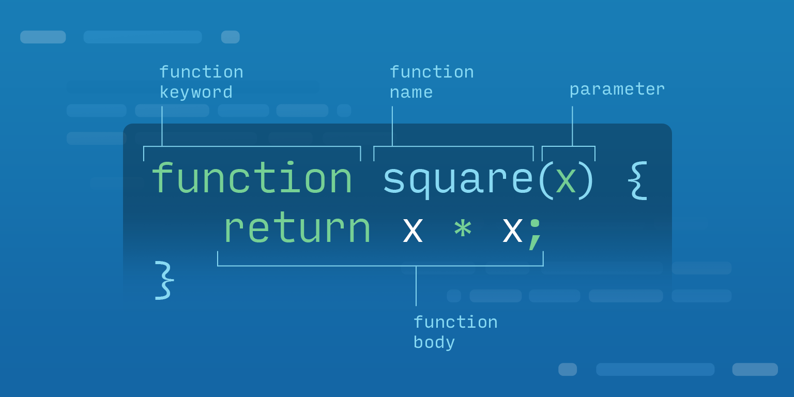

# Functions  

In programming, functions allow you to write multiple lines of code and assign them to a variable that can be called (or run) at a later time. They are essentially "mini programs" that you use in a larger program, and they help you avoid repeating things.

For instance, if you had a few names, and you wanted to print a greeting to each name, your code might look like this:

```js
1 let name1 = 'Jessica';
2 let name2 = 'Blake';
3 let name3 = 'Meridith';
4 
5 console.log('Good morning ' + name1 + ', how are you doing today?');
6 console.log('Good morning ' + name2 + ', how are you doing today?');
7 console.log('Good morning ' + name3 + ', how are you doing today?');
```

While this doesn't look terrible, imagine if we had 100 or even 1000 names we needed to print greetings to. That would be a nightmare to manage. Also, what if we wanted to change "Good morning" to "Good evening" based on the time of day. This is where functions come in.

## Function Syntax  

Let's take a look at what a fairly simple function looks like, then we'll break it down.

```js
function greeting (timeOfDay, firstName) {
  console.log('Good ' + timeOfDay + ' ' + firstName + ', how are you doing today?');
}
```

Functions start with the `function` keyword, followed by a name for the function. Essentially we are creating a variable name to hold the value of our `function`. After you name the function, you can define some parameters that the function takes. This is where the real power of functions shines through. This way we can have our code run against different sets of data. Lastly, inside of the function, we have the **function body**, which is where you can write the code that this function performs.



## Calling a Function  

Once you have a function written, you can now call it. To call a function, you simply write the name of the function followed by the `()` characters and include any arguments inside of the parentheses that are needed.

```js
1 // Our Greeting Function
2 function greeting (timeOfDay, firstName) {
3   console.log('Good ' + timeOfDay + ' ' + firstName + ', how are you doing today?');
4 }
5 // Calling Our Function
6 greeting('morning', 'Teddy');
```


## Parameters and Arguments  

When you are creating a function and writing the syntax for it, the variables you put inside of the parentheses are called **parameters**, however, when *calling* the function, you put **arguments** inside of the parentheses. This is important, because getting the terminology straight can help you discuss this with other programmers.

```js
function sum (num1, num2) { // num1 and num2 are parameters
  return num1 + num2;
}

sum(5, 10); // 5 and 10 are arguments
```

Also, note that if a function takes 3 parameters and you only pass in 2 arguments, the third parameter will just be set to  `undefined`. Run the code below to see an example of this.

```js
1 function people (person1, person2, person3) {
2   console.log('Person 1:', person1);
3   console.log('Person 2:', person2);
4   console.log('Person 3:', person3);
5 }
6 people('Jessica', 'Brad');
```

## Return Keyword  

When writing a function in JavaScript, if you wish for a piece of data to come back from the function, you **must** use the `return` keyword. This will allow you to set a variable that stores the value of the response of the function.

```js
1 function sum (num1, num2) {
2   num1 + num2;
3 }
4 
5 let answer = sum(10, 20);
6 console.log(answer);
```

If you run the code above, you'll see that the result is `undefined` because we did not specify that we wanted the data **returned** from our `sum` function. Let's try this again:

```js
1 function sum (num1, num2) {
2   return num1 + num2; // Added Return Keyword
3 }
4 
5 let answer = sum(10, 20);
6 console.log(answer);
```

##cConclusion  

Functions give us the ability to group bits of code together. These functions help us reduce duplicated code, can take in values, can return values, and in general are a very helpful way for us to organize our code. They give us a tremendous amount of power and are an important part of helping us solve our problems.

## Additional Resources  

* [Eloquent JavaScript Functions](http://eloquentjavascript.net/03_functions.html)

* [JavaScript Functions - MDN](https://developer.mozilla.org/en-US/docs/Web/JavaScript/Guide/Functions)

---

# The Global Scope and Compartmentalized Code  

In JavaScript it is important that you write effective code that serves its purpose but does not override global variables upon execution. We'll examine how to write specific **compartmentalized code** that doesn't make changes to the entire project or pollute the global scope.

> **Compartmentalization**: Code is often complex and made up of many components which contain many functions which contain many objects. Compartmentalization of code divides content into separate and distinct blocks with common functionality so that a program runs smoother, is easier to read, and can be reused.

Proper isolation of variables is key, especially as your code becomes longer and more complex. Let's dial the microscope back two notches and first examine the `window` object, as well as the term "scope". We'll then take a look at some ways to construct function expressions that are self-contained, and therefore do not affect the global scope.

## The Window Object  

The `window` object represents a browser's window. It is the petri dish that all global items grow inside of, including:

* Global JavaScript objects

* Global functions

* Global variables

> Global variables are *properties* of the window object whereas global functions are *methods* of the window. The `window.document` property points to the DOM document loaded in that window.

## Scope  

Scope refers to the accessibility of functions and variables within a part of code during runtime, essentially determining the visibility of variables in code. There are two types of scope: `global scope` and `local scope`.

A variable that's been defined *outside* of a function is considered to be in the `global scope`, while a variable defined *inside* of a function is in the `local scope`. In other words, **all** variables in a JavaScript project are in the `global scope` unless they're defined inside a function.

### Global Scope  

```js
1 const pet = 'dog';
2 
3 //The variable "pet" is in the global scope, and may be used within any other function. For example:
4 
5 function printPet() {
6 console.log(pet);
7 }
8 
9 printPet();
```

...logs "dog" because it was defined in the global scope.

### Local Scope  


 1 const pet = 'dog';
 2 
 3 //The variable "pet" is in the global scope, defined here as "dog".
 4 
 5 function printPet() {
 6   const pet = 'cat';
 7 
 8 //Here, the variable "pet" is in the local scope, and defined as "cat".
 9 
10   console.log(pet);
11 }
12 
13 printPet();

 
...logs "cat" because it was defined within the function, or in the local scope, and overrides the global variable "dog".

## Immediately-Invoked Function Expressions  

An Immediately-invoked-function-expression, or an IIFE (pronounced like "iffy") is essentially what it sounds like: a function used in JavaScript that runs right after being defined. They allow you to isolate a script environment and they don't pollute the global scope by overriding global variables.

The basic template for an IIFE is as such:

```js
(function () {
    // main content
})();
```

Sounds crazy, no? Well here in our little village of programming you might ask yourself how did we get here? Well, let's walk the path. Think about functions in JavaScript. There are two ways that they can be created: as a function *declaration* or a function *expression*. Function declarations are often the more routine method and look something like:

```js
function myDeclaration () {/* Insert logic please */};
```

A Function expression is when you take a function and assign a property or variable to it. That takes us to this:

```js
const myExpression = function () { /* Insert logic please */ };
```

Function expressions are also functions that are created within the *context* of an expression. So:

```js
(function () { /* Insert logic please */ });
```

Okay we're in the home stretch now. We're looking for a way to invoke the function expression immediately. JavaScript expressions return a value, and in the above example the return value of the expression is the function. So really all we need to do to create an IIFE is tack on a pair of parenthesis at the end of our last example, which gives us the template for an IIFE that you saw at the start of this section.

And why do we want this? Well it's for the same reason schools have lockers. We want data privacy and any variable declared inside that IIFE is safe from being unintentionally accessed elsewhere in our code.

```js
(function () {
  const ice = 'cream';

  console.log(ice);
})(); //logs "cream"

console.log(ice); //logs ReferenceError: ice is not defined
```

You can see from the above example, the variable "ice" is contained within the IIFE so the second attempt to log "cream" returns an error because it is outside of the expression.

We can even test how we've limited the scope by using the same variable name and console logging inside and outside of the IIFE.

```js
const ice = 'cream';

(function() {
  const ice = 'skate'

  console.log(ice); // -> This logs skate
})();

console.log(ice); // -> This logs cream
```

### Passing Arguments into an IIFE  

Another benefit of immediately invoked expressions is that arguments can be passed through them as follows:

```js
const ice = 'ice';

(function (innerIce) {
    console.log(innerIce);
})(ice);
```

This logs ice, as it's been passed through the IIFE.

## Conclusion  

When asked what the greatest challenge of writing code is, a coder will often tell you that it's coming up with names; names for variables, functions, DIV's, and much more. As a piece of code grows, more names are required and that creates a higher risk of a single piece of code throwing off the entire project. If you're not careful, a name may be accidentally used in more than one space within the global scope. The compartmentalization of code that Immediately-invoked function expressions facilitates is a great way to prevent this error.

### References  

* [Window - MDN](https://developer.mozilla.org/en-US/docs/Web/API/Window)

* [Scope - MDN](https://developer.mozilla.org/en-US/docs/Glossary/Scope)

* [Properly Isolate your Variables in JavaScript](http://www.nicoespeon.com/en/2013/05/properly-isolate-variables-in-JavaScript/)

---

# `this` Keyword

Before we begin examining `this`, and how it gets used within a given function, first a bit of housekeeping: The word "this", as in "this lesson" will be written normally, whereas the keyword `this` will always be identified as such.

Okay, now that that's out of the way, what purpose does `this` serve in JavaScript? (It varies from language to language). Put simply, `this` refers to the value of the object that invokes the function, the "antecedent object" (parent object).

## Different Uses  

The way we use `this` depends on the scenario. For such a common word, there's a whole bunch of different uses for `this` and it can be a very powerful tool. Here's a list of the uses for `this` we'll examine:

* `this`, in a function invocation,

  * `this` is the `window` in non-strict mode. It refers to the outer most global object.

  * `this` is undefined in a function invocation in strict mode.[^1]

* `this` is the value of the object that owns the method in a method invocation.

* `this` is the value of the newly created object in a constructor invocation.

* `this` is the value of the first argument of `.call()` or `.apply()` in an indirect invocation.

## Function Invocation  

Very quickly, `function invocation` is essentially what it sounds like - it is the process by which a function object is called.

So if given:

```js
function welcome(planet) {
  return 'Welcome to ' + planet + '!';;
}
```

The `function invocation` simply calls it into action...

```js
const willSmith = welcome('Earth')
console.log(willSmith);
```

...And would cause the console to produce "Welcome to Earth!"

### Non-Strict Mode  

In a function invocation, `this` is referred to as the `global object`, which in turn is established by the execution environment. So under those conditions `this` is the `window` object. Take a look at the example below to get a feel for what this means:

```js
function sum(x, y) {
  console.log(this===window);
  this.theNumber = 42;
  return x + y;
}
sum(12, 14); // = 26
window.theNumber; // = 42
```

So to examine that a bit, when finding the sum `this` is set as the `global object`, and within a browser that would be `window`.

The same goes for when `this` is used outside of the context of a function; it still refers to the global object.

```js
console.log(this===window);
this.smithString = 'Welcome to Earth!';
console.log(window.smithString);
```

In ths case the console will read "Welcome to Earth!", as specified.

## Strict Mode

In function invocation in strict mode, `this` is *undefined* because its value stays at what it was set at upon entering the execution context.

So to run in strict mode would look something like this:

```js
function bears() {
  'use strict';
  return this;
}

bears() === undefined;
```

The only reason the result would come out differently is if `this` had been defined by the execution context.

## Other Invocations  

`This` is one of about four different ways a JavaScript function can be invoked. Within that there are many ways that `this` can be used in function invocation.

### Method Invocation  

Essentially a method is when an object contains a function as a stored property.

For example:

```js
var greeting = {
    say: "Hello",
    name: function(firstName, lastName){
      var combine = " " + firstName + " " + lastName;
      this.say;
      return this.say + combine;
}
};
greeting.name();
console.log(greeting.name("John", "Smith"));
```

Above: when the method is invoked, `this` is "greeting", so `this.say` target the value of "hello". The result should be "Hello John Smith". The main different between function and method invocation is that the latter requires the function or object to be called by a property accessor. Function invocation doesn't have those requirements.

### Indirect Invocation, .call() or .apply()  

An `indirect invocation` is the term for calling a function using: (name-of-function)`.call()` or (name-of-function)`.apply()`. These two methods are inhereted by al functions from `Function.prototype`. The difference between call and apply are `.call()` takes the items inside the parenthesis as the context of the invocation and as *a list of arguments* passed to the called function as arguments, whereas `.apply()` takes the items as an *array-like object of values*.

Let's look at the difference between the two:

```js
const album = { type: "Mixtape" };
function printDisc(string) {
    console.log(this === album); Logs: true
    return string + this.type;
}

printDisc.call(album, "Hamilton" );
console.log(printDisc.call(album, "Hamilton" + " "))

printDisc.apply(album, ["Hamilton", " "]);
console.log(printDisc.apply(album, ["Hamilton" + " "]))
```

Both of these result in a console log of "Hamilton Mixtape" (which you should listen to, PS).

## Conclusion  

For such a simple word, `this` packs a huge punch and is absolutely one of the fundamental building blocks of JavaScript it almost makes you ask yourself why didn't they pick a less common word or even make one up, like `flerbot` for example. `flerbot.type`. I don't know, just throwing it out there.

A great way to determine if `this` is involved (more likely *how* `this` is involved) it makes sense to as yourself how a function is being invoked. That should provide some guidance about how to move forward with your use of this `this` keyword.

### References  

* [^1] [More on Strict Mode](https://developer.mozilla.org/en-US/docs/Web/JavaScript/Reference/Strict_mode)

* [this - MDN](https://developer.mozilla.org/en-US/docs/Web/JavaScript/Reference/Operators/this)

* [Understand JavaScript’s “this” With Clarity, and Master It](http://javascriptissexy.com/understand-JavaScripts-this-with-clarity-and-master-it/)

---

# Logical Operators  

Logical operators are used to evaluate an expression and return either a `true` or `false` value. As a developer, you will use logical operators and expressions to solve logical problems. In this lesson, you will learn how to use each operator and how their order of operation affects evaluations.

Here are some you might see:

* `&& `- and

* `||` - or

* `!` - not

* `===` - equal

* `!==` - not equal

* `>` - greater than

* `<` - less than

Note: Often, you'll see both `===` and just `==` used when testing equality. You can read more about that [here](https://developer.mozilla.org/en-US/docs/Web/JavaScript/Equality_comparisons_and_sameness), but it's *extremely* rare for there ever to be a use case for using `==`. Therefore, you should ALWAYS use `=== `when testing for equality.

## Logical Operators in the Real World  

In the English language, logical operators are used with the words **and**, **or**, and **not**. For example:

> *You will do the dishes `IF` you have no clean plates `AND` your kitchen smells.*

For you to clean your dishes, two components must be true:

* You have no clean plates

* Your kitchen smells

This real world example of using logical operators to evaluate an expression is like using JavaScript's logical operators.

## If Statement  

Before we jump into these three operators, let's take a quick look at the `if` statement.

An `if` statement is comprised of a few different parts. First, we must evaluate a condition.

```js
if (condition) {
  // Run this code
}
```

In the sample above, the code inside the `if` statement will only run if the value of `condition` is true or "truthy", otherwise it will be skipped entirely. We can also add in the keyword `else` and chain them together as much as we'd like.

```js
1 if (5 > 3) {
2   console.log('5 is greater than 3');
3 } else {
4   console.log('5 is not greater than 3');
5 }
```

## And Operator  

The `&&` operator is used to evaluate an expression that has two or more components. For the entire logical expression to return true, all components that connect the `&&` operator must also be true. Using the real world example above, let's see how we write that in JavaScript:

```js
var hasCleanPlates = false; // We don't have clean dishes
var doesKitchenSmell = true; // The kitchen smells

if (hasCleanPlates === false && doesKitchenSmell === true) {
  console.log('We should clean our dishes');
} else {
  console.log('Nah, we will wait till next time');
}
```

In this example, the `&&` operator requires that both expressions return a `true` boolean. The first expression, `hasCleanPlates === false` is true and the second expression, `doesKitchenSmell === true` also returns true.

## Or Operator  

The `||` operator is used to evaluate an expression that has two or more components. It will return true if either component of the logical expression are true.

Let's say that you have a roommate, and your roommate is much more strict with their home upkeep. They aren't as lenient as you when it comes to dishes and will clean the dishes if there are no clean plates **OR** the kitchen smells.

```js
1 let hasCleanPlates = false; // We don't have clean dishes
2 let doesKitchenSmell = false; // The kitchen doesn't smell (yet)
3 
4 if (hasCleanPlates === false || doesKitchenSmell === true) {
5   console.log('We should clean our dishes');
6 } else {
7   console.log('Nah, we will wait till next time');
8 }
```
 
In this example, we will print out "We should clean our dishes" whenever the kitchen smells OR we have no clean plates.

## The `NOT` Operator  

Syntax: `!`

The `!` operator is used to invert the desired expression evaluation to the opposite returned boolean. This means that when we use the `!` operator placed in front of an expression, we are asking the expression to return true if a specific expression already equates to false.

Let's refactor our example to accept this new operator.

```js
let hasCleanPlates = false;
let doesKitchenSmell = false;

if (!hasCleanPlates || doesKitchenSmell) {
    cleanDishes();
}
```

Did you notice we didn't use the `==` operator? This is because `hasCleanPlates` and `doesKitchenSmell` already returns a boolean, so our `if` statement will still work as intended. So `doesKitchenSmell` is equal to `doesKitchenSmell === true`.

As for `hasCleanPlates`, we placed the `!` right before to declare we are inverting the boolean. This means if `hasCleanPlates` is equal to **FALSE**, return `true`.

If this concept is difficult for you to grasp, try thinking of it in English.

> *You will do the dishes `IF` you do `NOT` have clean plates `OR` your kitchen smells.*

The JavaScript syntax `!` represents the English word `NOT` in this example.

## Order of Operations  

You might remember in math class that arithmetic operators have an order of operations. The same is true for our JavaScript logical operators.

1. `()` - parenthesis

2. `!` - not

3. `&&` - and

4. `||` - or

Let's take a look at a complex logical expression and use the order of operations to break it down:

```js
 1 // milks
 2 let milk = true;
 3 let cream = false;
 4 let soyMilk = false;
 5 
 6 // expressos
 7 let caffeinatedEspresso = true;
 8 let decaffeinatedEspresso = false;
 9 
10 // chocolates
11 let darkChocolate = false;
12 let lightChocolate = false;
13 
14 // this is a latte!
15 
16 var isLatte =
17         (milk || cream || soyMilk)
18     &&
19         (caffeinatedEspresso || decaffeinatedEspresso)
20     &&
21         !(darkChocolate || lightChocolate)
22     ;
23
24 // print if this is a latte
25 console.log(isLatte);
```

Let's walk through this using the correct order of operations. First we will need to evaluate everything that is within `()`.

```js
        (milk || cream || soyMilk) // (true || false || false)
    &&
        (caffeinatedEspresso || decaffeinatedEspresso) // (true || false)
    &&
        !(darkChocolate || lightChocolate) // !(false || false)
    ;
```

Moving left to right, JavaScript will simplify this boolean value expressions within the `()` into a single boolean by reading each `()` as a single boolean value.

```js
        (true) // Returns true since an inside boolean was true.
    &&
        (true) // Returns true since an inside boolean was true.
    &&
        !(false) // Returns false since no inside boolean was true.
    ;
```

Before continuing our quest to solve this complex logical expression, we must first address `!` which is next up for our order of operations. Since `!(false)` will invert the boolean within the `()`, the returning boolean value will be `true`.

Now it's time for the `&&` operator to take its turn. We are left will a simple expression that looks like this:

```js
    (true && true && true) // This will return true!
```

This means that when we run this code, we will console log `true`!

## Conclusion  

We use logical operators to evaluate important logical expressions that will return a boolean value. These operators are all used very frequently in the code we write, so it is important to keep their syntax, functionality, and order of operations in mind when using them.

## Additional Resources  

* [Logical Operators - MDN](https://developer.mozilla.org/en-US/docs/Web/JavaScript/Reference/Operators/Logical_Operators)
