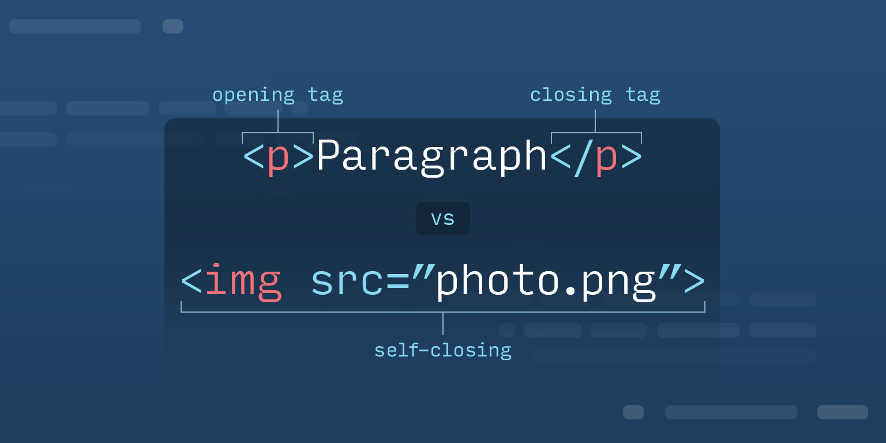
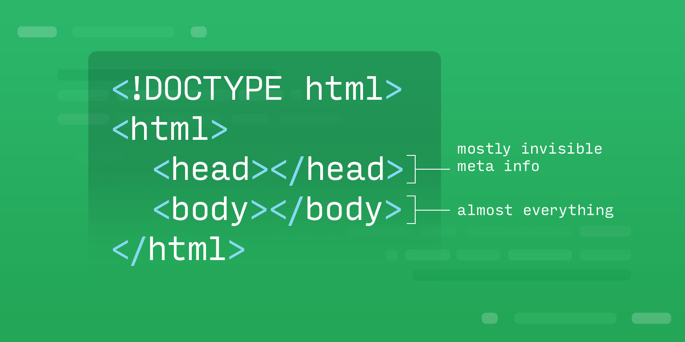
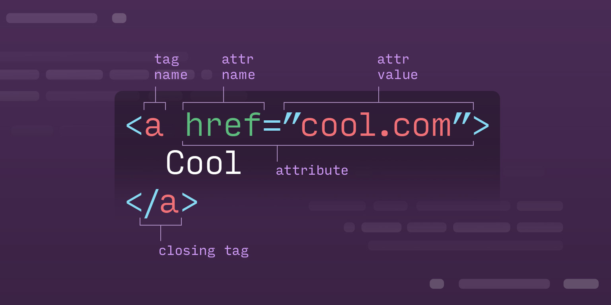

# Introduction

If you've been to websites, then you've interacted with HTML, it's unavoidable. Browsers read HTML to interpret all of the content on the page. Writing clean and semantic HTML is a useful skill for any developer and an essential skill for any web developer. HTML has a few core rules that you should master first to set you on the right path to writing great HTML.

In the following lesson you'll learn a few things:

* How to write and interpret the syntax for HTML markup
* How to use attributes to give your HTML
* How to use ids and class attributes to group and identify your HTML elements

---

# HTML Syntax  

Welcome to the world of syntax. Right now you are reading content that follows certain grammatical rules. Syntax determines the structure of sentences and their arrangement into coherent phrases. The goal of syntax is to create a common method of writing and understanding language. As with any language, HTML syntax enables us to create `coherent` and `valid` digital content. Reading, understanding and authoring HTML is fundamental to front-end development.

## HTML Defined  

HTML stands for "HyperText Markup Language". It acts as the skeleton of a web page, providing the underlying structure. HTML does not define either decorative or functional qualities of your page (like colors or animations). Instead, it uses `elements` to build up a scaffold that you can style and interact with using other languages. Think of elements as content holders.

## Intro to "Tags" and "Elements"  



In HTML, `tags` are special words surrounded by triangle brackets. Tags let the browser know what type of content they contain and how they should be rendered.

Wrapping content with a starting tag and a closing tag creates an `element`. There are different types of tags, each with their own syntax and purpose.

The difference between `tag` and `element` can be confusing. A `tag` is the idea of a paragraph, but an `element` is the specific paragraph in HTML. So each paragraph in an article are elements, and they are all the `p` tag.

> NOTE: A browser does not render `tags` - they simply tell the browser what type of content they hold and how to they need to be rendered.

## HTML Document Structure  



The example above demonstrates the basic HTML document structure syntax. This represents the minimal amount of code a browser needs to render an HTML document. An HTML document has two distinct parts, a `head` and a `body`. These two sections are wrapped by HTML tag pairs.

### Example

```html
<html>
  <head></head>
  <body></body>
</html>
```

## DOCTYPE  

The first important piece of HTML syntax is declaring the document type. The `doctype` (sometimes capitalized as "DOCTYPE") is a required part of HTML syntax. It let's the browser know what type of document it is about to process . It must be declared exactly as follows:

### Normal Doctype

(In adherance to HTML5)

1. <!DOCTYPE

2. Space character.

3. html - case sensitive.

4. > character

### Example

```html
<!DOCTYPE html>
<!--HTML doc below the doctype declaration-->
```

> Many modern browsers will be forgiving if you don't use a <!doctype> or forget to close the <html> tag, but some older browsers will fail if these are incorrect. Always make sure you take a few moments to add these to each page you work on!
In the early days of HTML, doctype elements were long and confusing. They also created subtle changes in browser behavior when they were malformed or not present. It was common to see doctype declarations (technically, doctype isn't a "tag") like this:

```html
<!DOCTYPE html PUBLIC "-//W3C//DTD XHTML 1.0 Transitional//EN" "http://www.w3.org/TR/xhtml1/DTD/xhtml1-transitional.dtd">
```

Now that the browser knows that it is about to process an HTML document, we must create such document and establish both parts of the document, the `head` and the `body`.

## What does the "head" do?  

```html
<!DOCTYPE html>
<html>
   <head>
      <title>The Iron Yard</title>
   </head>
</html>
```

The first part of the document is the `head`. It contains the metadata needed by the browser in order to render the page. The `head` also contains data needed by search engines to find, index and deliver the content of the HTML document.

> Every HTML document must have a `title` element to identify the content of the document. This `title` element must be content-rich in order to provide contextual background. For example, 'Introduction' does not provide as much background as 'Introduction to HTML syntax'.

This is a list of some important meta data attributes:

* `charset`: Specifies the character encoding for the HTML document

* `viewport`: User's visible area of a web page

* `author`: A document's author.

* `description`: A brief description of the page. Should be no longer than 155 characters (including spaces).

### Example

```html
<!doctype html>
<html>
  <head>
    <meta charset="utf-8">
    <meta name="viewport" content="width=device-width, initial-scale=1">
    <title>The Iron Yard</title>
    <meta name="description" content="The best coding school in the world" />
    <meta name="author" content="The Iron Yard Prod Team">
    <link rel="stylesheet" href="css/app.css">
  </head>
</html>
```

The `link` element is used to instruct the browser where to find files needed for rendering, such as CSS file, fonts, styling libraries, etc.

## Content Lives In The "Body"  

The document's content resides in the body of the page. This includes all content that must be rendered, such as `nav`, `header`, `article`, `p`, `footer`, etc. It may also include `script` elements depending on the nature of the document. Script elements embed or reference executable scripts such as JavaScript.

### Example

```html
<!doctype html>
<html>
  <head>
    <meta charset="utf-8">
    <meta name="viewport" content="width=device-width, initial-scale=1">
    <title>The Iron Yard</title>
    <meta name="description" content="The best coding school in the world" />
    <link rel="stylesheet" href="css/app.css">
  </head>
  <body>
    <nav>
      <!--nav elements-->
    </nav>
    <main>
      <section>
        <article>
          <!--article content-->
        </article>
        <aside>
          <!--aside elements-->
        </aside>
      </section>
    </main>
    <footer>
      <!--nav elements-->
    </footer>
    <script type="text/javascript" src="https://code.jquery.com/jquery-2.1.1.min.js"></script>
  </body>
</html>
```

## General Syntax Rules And Tips  

* Use soft-tabs with two spaces.

* Use double quotes on attributes.

* Use lowercase tag names.

* Use lowercase attribute names.

* Use quotes around values. HTML5 makes this optional, but it is recommended since it makes values easier to read. If a value has spaces, quotes are required.

* Use lowercase file names.

* Include a space between attributes.

### Example

```html
<!--Wrong-->
<link rel="stylesheet"href="css/app.css">
<!--Correct-->
<link rel="stylesheet" href="css/app.css">
```

* Do not include a trailing slash in self-closing elements.

* Indent nested elements once (two spaces).

* Add an alt attribute to images. This provides an alternate image description if the image does not load.

### Example

```html

```

* Close all elements.

### Example

```html
<article>
<!--Not ideal-->
  <p>The Iron Yard is Awesome.
<!--Recommended-->
  <p>The Iron Yard is Awesome.</p>
</article>
```

* It's optional to close empty elements.

### Example

```html
<!--allowed-->
<meta charset="utf-8" >
<!--allowed-->
<meta charset="utf-8" />
```

* Avoid spaces between attributes and values. HTML5 allows it, but this makes it harder to read and group entities.

### Example

```html
<!--Allowed-->

<!--Recommended-->

```

* Even though HTML5 allows for the `<html>` and `<body>` to be omitted,1 they are highly recommended. Not doing so can crash DOM and XML software.

  * The `lang` attributes goes in the `<html>` opening tag!

### Example

```html
<html lang="en-US">
```

The character encoding should be defined at the top of the head. This ensures proper interpretation, and correct search engine indexing.

### Example

```html
  <!DOCTYPE html>
  <html lang="en-US">
  <head>
    <meta charset="UTF-8">
    <title>The Iron Yard</title>
  </head>
```

* Use comments as a communication tool or as reference.

### Example

```html
 <!--The code below is optional. It may be deleted without breaking current features.-->
     <script src="https://cdnjs.cloudflare.com/ajax/libs/materialize/0.97.8/js/materialize.min.js"></script>
```

## Finding Errors In HTML Syntax  

HTML can be notoriously hard to debug, especially when you're getting started. To make things even more tricky, many browsers, including Chrome, will attempt to "fix" broken HTML when a page is loaded. If you forget to close a tag, Chrome may try to find a common-sense place to close the tag (this will only happen in-browser; Chrome won't make actual changes to your HTML file). While this is helpful most of the time, it can be a bit misleading.

Because HTML itself has no mechanism for reporting syntax errors, programmers have built tools and generally learned to keep an eye out for a few easy-to-make mistakes.

**The W3C Markup Validation Service**

The W3C is an organization that provides many important services to the community, from working on and organizing the HTML specifications to various tools to help programmers write better code.

One of the most useful tools they offer, at no cost, is the [W3C Markup Validation Service](https://validator.w3.org/). As you might have guessed, this site "validates" HTML submitted to it via URL, upload, or directly pasting HTML into it. If the submitted HTML isn't valid, it will print a list of problems you'll need to address.

For example, here's some HTML that looks correct at first glance, but actually contains a pretty big mistake. See if you can spot it.

```html
  <!DOCTYPE html>
  <html>
    <head>
      <title>My first HTML</title>
    </head>
    <body>
      <a href="https://www.wikipedia.org/">
        A link to Wikipedia
      </body>
    </a>
  </html>
```
  
The body tag is accidentally being closed too early, and the a tag is being closed after the end of the body. This isn't correct, and although some browser may make a guess at what you meant, the source of the problem can and should be fixed. If you submit this code to the W3C Markup Validator, it reports three problems:

* Error: End tag for body seen, but there were unclosed elements.

* Error: Unclosed element a.

* Error: Saw an end tag after body had been closed.

###  Troubleshooting Tips  

* When using an HTML tag you aren't familiar with, make sure to check out documentation from a trusted website. Mozilla Developer Network's HTML Element Reference2 has a list of every HTML element.

* Double-check your HTML for typos. Forgetting a closing tag and not correctly using triangle brackets and forward-slashes are just a few of the subtle typos you'll make from time to time.

* Nested HTML elements can end up closing and opening in odd places, causing a parent element to close itself inside of a child element, and vice-versa. Keep an eye out for zig-zagged nesting.

* Remember to use the [W3C validator tool](https://validator.w3.org/).

## Conclusion  

HTML syntax can look deceivingly simple, but there are a surprising number of places where things can go wrong. Understanding and implementing proper syntax is the main building block of front-end development.

Without proper HTML document structure, tag composition, and element composition, your HTML may not look or act as you expect.

## Additional Resources  

[MDN - Introduction to HTML](https://developer.mozilla.org/en-US/docs/Web/HTML)

[W3C - Detailed HTML syntax](https://w3c.github.io/html/single-page.html#syntax)

#### Lesson Footnotes

1: [Optional tags. W3C. HTML 5.2. (8.1.2.4. Optional tags)](https://www.w3.org/TR/html52/syntax.html#optional-tags)

2: [MDN Elements](https://developer.mozilla.org/en-US/docs/Web/HTML/Element)

---

# Authoring Tag Pairs And Void Elements  

HTML is a simple language with few rules. It's intended to be universally accessible and yet powerful enough to represent any content that an author wishes to publish. This article is concerned with the basic syntax of HTML tags. In the next few sections, you will learn the meaning of the terms tags pairs and void tags. You will also learn how to construct `tag pairs` and `void tags`.

## HTML Tags  

Tags are a combination of keywords and symbols that the browser can identify and use to make sense of the content. To see the impact that they can have on a web page, let's look at an example of content **without HTML tags**. Look at the "Editor" view. You'll see that I wrote the content in a sensible way. I've got a title (Hello Everyone!), followed by a short paragraph and a list of 3 items:

```html
Hello Everyone!

I've been in love with nature since I was a little girl and that's why I became a vet. I love all animals, but let me list my favorite 3:

Cats
Sugar Gliders
Geckos
```

However, when this is rendered, the browser smashes it all together and runs it onto one line. The question is, "Why does the browser do this?"

The answer is simple: For all their processing power and sophistication, computers are pretty stupid. They require instructions for everything or they can't make heads or tails of it. Our code sample is an example of the browser's limitations. It doesn't know that I want the last few items to be a list. It doesn't know that the first line is supposed to be a title. It doesn't know that the second line should be a paragraph. We have to tell it everything and we do so using HTML tags.

Let's try again. This time we'll rewrite the content using HTML.

```html
<h1>Hello Everyone!</h1>
<p>I've been in love with nature since I was a little girl and that's why I became a vet. I love all animals, but let me list my favorite 3:</p>
<ul>
    <li>Cats</li>
    <li>Sugar Gliders</li>
    <li>Geckos</li>
</ul>
```

Now the document has some structure. The browser is able to recognize that certain pieces of content are surrounded by HTML tags. Those tags give the browser enough information to know how to separate the content elements and how to give them a few default styles.

Now that we've seen what tagging content can do, let's break down the tags themselves and dissect the syntax of the HTML language.

## Tag Pairs  

HTML tags are special keywords surrounded by angle brackets. You remember these symbols from math class as the `<` and `>` symbols. In HTML syntax, they have no mathematical meaning. Instead, they are special characters meant to mark the beginning and ending of a tag. Most importantly, they tell the browser what type of content they hold and how to they need to be rendered.


Let's dissect the title from our previous example:

```html
<h1>Hello Everyone!</h1>
```

Our content is the words "Hello Everyone!" between the "opening tag" and "closing tag". The opening tag comes before the content and has a particular construction. Opening tags require 3 things: an opening angle bracket `<`, the keyword that determines which tag is being constructed (in this case "h1"), and a closing angle bracket `>`.

```html
<h1>
```

The closing tag is the same as the opening tag, but also includes a forward slash `/` before the keyword.

```html
</h1>
```

Most HTML tags require an opening and closing tag. We "wrap" content with the two tags. The opening tag indicates the beginning of a piece of content. The closing tag indicates the end of a piece of content. Consider the following example, which contains a page title, a paragraph, and a quote:

```html
<h1>This is a main page title</h1>
<p>This is a paragraph</p>
<blockquote>This is a quote</blockquote>
```

> It's important to note that the term "element" refers to a set of tag pairs and the content they wrap.2 To help reinforce this distinction, it's good practice to avoid using the word "tag" by itself - refer to "opening tags", "closing tags" and "void tags" instead. This is a great way to reduce ambiguity when describing a problem to another developer.

## Void Element Syntax  

Most HTML elements require an opening and closing tag, but not all. Some content is pulled from an external source or isn't presented in the same way as text content. The content of this type is sometimes marked up with a single tag. The use of this type of tag creates a `void element` (empty element). A void element is self-closing, meaning that it only has an opening tag. Void elements are less common, but still important to recognize.

### Syntax

The void elements you'll use most often are `br`, `hr`, `img`, `input`, `link`, and `meta`. Void tags often require additional information from their attributes (more on that later).

```html
<br>
<hr>

<input type="text" id="username" name="username">
<link rel="stylesheet" href="style.css">
<meta>
```

In the following example, the `img` tag has 2 attributes `src` and `alt`. `src` tells the image tag where to find the image. `alt` tells the image what to display if the image doesn't appear. Notice, no closing tag. The `hr` tag creates a horizontal line. It doesn't have any attributes and doesn't get used that often. The `input` tag is usually included only in forms and also has several attributes.

```html


<hr>

<input type="text" id="username" name="username">
```

## Conclusion  

Remember that most content should be tagged with an opening and closing tag, but not all. `tag pairs` and `void tags` serve different purposes and each plays an important role in HTML syntax. They are the basic building blocks of elements and without them it would be impossible to scaffold the structure of an HTML document.

### References  

[MDN - Empty Elements](https://developer.mozilla.org/en-US/docs/Glossary/Empty_element) 

[^1]:[MDN - HTML Elements Reference](https://developer.mozilla.org/en-US/docs/Web/HTML/Element)

#### Lesson Footnotes

* 2: [W3C - HTML Intro](https://www.w3.org/TR/REC-html40/intro/sgmltut.html#h-3.2.1)

---

# HTML Attributes  

HTML syntax allows us to give elements more than just content. We may want to group elements in a certain way or define how they should respond to user behavior. To so, we must attach key/value pairs to the opening tag in the form of `attributes`.

## Attribute Syntax  

HTML attributes are straightforward. Let us look at a few HTML tags and then add attributes to them. In the example below, we add attributes to a meta tag.

```html
<meta>
```

Meta tags are void tags and therefore contain no content. To give the meta tag meaning, we apply attributes. Let us add a single attribute to this meta tag to give it meaning.

```html
<meta charset="UTF-8">
```

The attribute we've added, `charset` (the key), has been assigned "UTF-8" (the value). This particular tag/attribute combination tells the browser to use the "UTF-8" character set when interpreting the text in the document.

The next code sample shows two meta tags. Both of these tags are valid and widely used in the head of real web pages.

```html
<meta name="description" content="A demo for attributes">
<meta name="keywords" content="HTML,Attributes,Instruction,Semantics">
```

These two meta tags have two attributes each. Both have a "name" and a "content" attribute, but the values are different. The first meta tag provides a description of the page. It is telling the browser that the "description" for the site is "A demo for attributes." The second meta tag lists a set of keywords related to the page content. Both are meta tags, although different attribute values mean that they serve different purposes.



## Using Attributes  

All attributes follow the same rules:

* Every attribute has one key (attribute name)

* Every attribute has one value (attribute value)

* Keys aren't quoted

* An `=` sign separates the key and value

* Attributes are separated by a space

* Values get wrapped in quotes `""`

* Don't duplicate attributes on the same element

When deciding which attributes to add to an element, consider a couple of things:

* **Does the element require extra data to fulfill its purpose?** If so, then the element probably has mandatory attributes to provide that data. Be sure to add those attributes, at the least.

* **Should I provide attributes to clarify the purpose of the element?** Many HTML elements don't require attributes, but adding them can clarify what the element is doing.

## Element Specific Attributes  

Element specific attributes apply to only one or a few HTML elements. Most attributes are element specific. You haven't seen a lot of different HTML tags up to this point, but I'll show you a couple to illustrate the idea.

In the following example, we have a `<p>` (paragraph) tag and an `<a>` (anchor) tag. The `<p>` tag's purpose is to surround paragraphs of content. The `<a>` tag's designates text links to other pages.

`<p>` tags don't require attributes. It's enough to wrap content in the opening and closing `<p>` tags. That's enough to let the browser know which elements are paragraphs. On the other hand, `<a>` tags does require an `<href>` attribute. The `<href>` attribute tells the browser where to navigate to when clicked. In this case, when "Link" gets clicked, the browser navigates to Mozilla's Attribute documentation.

```html
<p>This is a neato paragraph. Look at all these sentences in one place! Words are cool.</p>
<a href="https://developer.mozilla.org/en-US/docs/Web/HTML/Attributes">Link</a>
```

This example shows that the `<href>` attribute is only relevant for one of the two tags. `<p>` tags can't do anything with the value of an `<href>` attribute. `<a>` tags make excellent use of `<href>` attributes. Hence, `<href>` is "element specific".

## Global Attributes  

On the other hand, some attributes can be applied to **any** valid HTML tag. These attributes are useful for setting global data, and for creating relationships between different page elements. The two most common global attributes are `class` and `id`. We will dig into these at length later. For now, look at this sample of HTML. It makes liberal use `classes` and `ids`.

```html
<!doctype html>
<html>
<head>
    <meta charset="UTF-8">
    <title>List App</title>
</head>
<body class="wrapper" id="home">
    <header class="page_section" id="intro">
        <h1>This is a list app</h1>
        <p>Enjoy the list app and all its listy goodness.</p>
    </header>
    <div class="page_section" id="lists">
        <h2 class="section_title">Behold, a list of my fears</h2>
        <ul>
            <li>Bacon</li>
            <li>Umbrellas</li>
            <li>Cats dander</li>
            <li>Space shuttle</li>
            <li>Small spaces between tall buildings</li>
            <li>A bad haircut</li>
            <li>Heights</li>
        </ul>
    </div>
    <footer class="page_section" id="related_content">
        <h2 class="section_title">Conclusion!</h2>
        <p>Just joshin' you. I don't fear bacon... I love bacon.</p>
    </footer>
</body>
</html>
```

Many of the elements on the page have classes and ids. Those classes and ids provide more information about what each element is supposed to be. You will become **very** acquainted with classes and ids, but you likely won't work much with many other global attributes. Still, it's worth knowing that global attributes exist.

## Event Handler Content Attributes  

**Event handler content attributes allow direct ties to JavaScript page elements via events.** Although some programmers use event handler attributes extensively, we won't use them much in this course. We will almost always use the `addEventListener` API to attach event handlers to elements. I know, you have no idea what that means. It's okay. We'll get to JavaScript in no time flat, and you'll be swimming in event listeners.

Say, for instance, you want a piece of code to run when the user clicks a button. The "onclick" attribute is an event handler content attribute. The value of this attribute should be the snippet of JavaScript that you want to run **when the button gets clicked**.

```html
<button onclick="someJavaScript()">Click me!</button>
```

What follows is an example of this type of attribute at work. This code sample contains JavaScript. Don't get frustrated if you don't understand all the details. This example is here to demonstrate `onclick`.

Review the HTML file in the "Editor" view. Look at the `onclick` attribute values and how they relate to the JavaScript functions listed in the script tag. Then, click "Preview" to see the page render. Click each of the buttons, "Red", "Blue", "Green" to see how each button responds to the "onclick" event:

```html
<!-- index.html -->
<!doctype html>
<html>
<head>
    <meta charset="UTF-8">
    <title>Document</title>
    <link rel="stylesheet" href="style.css">
</head>
<body>
    <div id="vis"></div>
    <button onclick="makeItRed()">Red</button>
    <button onclick="makeItBlue()">Blue</button>
    <button onclick="makeItGreen()">Green</button>
    <script>
        var vis = document.getElementById( "vis" );

        function makeItRed(){
            vis.style.backgroundColor = "red";
        }

        function makeItBlue(){
            vis.style.backgroundColor = "blue";
        }

        function makeItGreen(){
            vis.style.backgroundColor = "green";
        }
    </script>
</body>
</html>
```

```css
/* style.css */
body{
    text-align:center;
}
#vis{
    width: 80%;
    margin: 0 10%;
    height: 120px;
    background: gray;
    display: inline-block;
}
button{
    display: inline-block;
    padding: 20px;
    width: 25%;
}
```

> The JavaScript is included in the HTML document so that you can more easily see the relationship between HTML and JavaScript. Typically, all JavaScript would be contained in a separate `.js` text file and linked to the HTML via a `script` tag.

Each button has an `onclick` attribute. The values for each attribute differs based on which JavaScript runs when the button is clicked.

The first button's `onclick` attribute value is "makeItRed()". When the "Red" button is clicked, the browser will run the "makeItRed" function. That function changes the background color of the big rectangle to "red". The "Blue" and "Green" buttons function in the same way.

The browser supplies several event handler content attributes for a wide variety of events. They work much the same as shown here. The value for an Event Handler Content Attribute should always be a snippet of JavaScript to run in response to an event.

## Conclusion  

Attributes provide additional data in the form of `key/value pairs` to configure elements. Some attributes are element specific, and some are global. Attributes also let us adjust element behavior in a variety of ways. By keeping in mind the purpose of each element, one can decide which attributes are appropriate for that element and which are not.

You will eventually memorize lots of HTML tags and the attributes that accompany those tags. For now, you'll need to rely heavily on documentation and practice to know what is appropriate when authoring your HTML. Don't hesitate to look up elements and attributes. Even the most seasoned HTML author has to look things up from time to time. Practice makes perfect. The more you write, the more you'll remember.

[^3]:[MDN - Attributes Reference](https://developer.mozilla.org/en-US/docs/Web/HTML/Attributes)

[^5]:[QUAKIT - Individual event handler attribute explanations.](https://www.quackit.com/html_5/tags/html_5_event_handler_content_attributes.cfm)

[^7]:[W3C: URL Fragment](https://www.w3.org/Addressing/URL/4_2_Fragments.html)

---

# Ids and Classes  

The `class` and `id` attributes deserve some special attention because they are used **widely** in the creation of semantic HTML documents. They are also used to categorize and differentiate HTML elements for the purposes of styling. You will attach `class` and `id` attribute to gobs of HTML elements in every page you author.

In this lesson we'll discuss `id` and `class` attributes at length and provide some real world use cases for when and how to apply them.

> To demonstrate these concepts, you'll see a fair amount of CSS. If you aren't familiar with CSS just yet, don't worry. The point of this article is to illuminate the value of `id` and `class` attributes, so focus on that. CSS is covered at length elsewhere.

## Unique Identifiers with Ids  

Sometimes, we need to identify unique page elements. To do this, we attach an id attribute to that element. Ids can have any value that you wish so long as it doesn't start with a number or a special character. Ids also cannot have spaces. The only special characters that an Id should contain (at all) are hyphens - and underscores _.

> Technically, Ids (and classes) can contain other special characters. However, it's widely frowned upon. Stick to letters, numbers, underscores and hyphens and you can't go wrong.

```html
<p id="unique">This is just a normal paragraph, but now it has a unique identifier that other page elements cannot share.</p>
<p id="special_thing">Another paragraph with a unique identifier.</p>

<p id="3_thing">Don't do this.</p>
<p id="#identifier">Also, this is a no-no.</p>
<p id="my unique identifier">Finally, don't do this.</p>
```

### Using Id  

When authoring HTML, you'll often want to single out specific elements for the purposes of styling via CSS. For example, if you have 3 images, but want to have the main image appear larger than the others, you could add an `id` attribute to the image you want special control over. Giving that image a unique identifier, such as "main-image", will allow that image to be selected independently of other images.

```html


```

Let's look at a more involved example. This next code sample demonstrates how a unique id might help us style a single element in a grid. You may not understand what is occurring in the CSS, so I'll give a brief description. Of all the `div` elements on the page, one of them has an `id` of "center". All of the divs have some default styling applied to them to create the regular gird. The element with an `id` has additional styles applied (via the `id`) that allows us to customize the styling of that element. As you will see later in this course, creating styles like this would be extremely difficult without a way to uniquely select elements.

```html 
<!-- index.html -->
<!doctype html>
<html>
<head>
    <meta charset="UTF-8">
    <title>Id Grid</title>
    <link rel="stylesheet" href="style.css">
</head>
<body>
    <section>
        <div></div>
        <div></div>
        <div></div>
        <div></div>
        <div id="center"></div>
        <div></div>
        <div></div>
        <div></div>
    </section>
</body>
</html>
```

```css
/* style.css */
section{
    display: flex;
    flex-wrap: wrap;
    justify-content: space-between;
    width: 200px;
    margin: 0 auto;
}
div{
    flex: 0 1 30%;
    background: gray;
    padding-top: 30%;
    margin-bottom: 5%;
}

/*
This code changes the styles of the one
elements with an id value of "center"
*/
#center{
    background: red;
    flex: 0 1 65%;
}
```

## Grouping Elements with the Class Attribute  

Class attributes are intended to group multiple page elements. By giving a set of elements the same class value, they can be selected (in CSS or JS) at the same time, as a group. For instance, you may want to apply a set of visual styles through a single CSS selector. You might want to reference several page elements in your JavaScript or specify that a group of elements belong together.

Like Ids, you choose the class values that best suit your needs. The naming rules are the same as Ids.

In the following example, the first 3 elements share a common class and can be selected and manipulated as a group via CSS or JS. Similarly, the last 4 elements share a common class and can be selected together.

```html
<div class="cool-elements">This is some great DIV content.</div>
<div class="cool-elements">This is some great DIV content.</div>
<div class="cool-elements">This is some great DIV content.</div>

<div class="hot-elements">This is some great DIV content.</div>
<div class="hot-elements">This is some great DIV content.</div>
<div class="hot-elements">This is some great DIV content.</div>
<div class="hot-elements">This is some great DIV content.</div>
```

Elements can be assigned multiple classes by separating the class values with a space. In the following example, the `div` has been assigned two classes: "hot-elements" and "second-class". Applying multiple classes to elements is pretty typical and allows us to create complex groupings as needed.

```html
<div class="hot-elements second-class">This is some great DIV content.</div>
```

In this next example, the grid is structured much like the Id grid. However, instead of utilizing a single id attribute, this document uses two class attributes to create a variety of styles. Two elements don't have a class. Five elements have one class. Two elements use both classes.

All elements with a class attribute of `flashy` are red. All elements with a class attribute of `circle` are round. Elements with both classes are red and round. Elements with no classes are gray squares.

```html
<!-- index.html -->
<!doctype html>
<html>
<head>
    <meta charset="UTF-8">
    <title>Class Grid</title>
    <link rel="stylesheet" href="style.css">
</head>
<body>
    <section>
        <div class="flashy"></div>
        <div class="circle"></div>
        <div></div>
        <div></div>
        <div class="flashy circle"></div>
        <div class="flashy circle"></div>
        <div class="circle"></div>
        <div class="flashy"></div>
        <div class="circle"></div>
    </section>
</body>
</html>
```

```css
/* style.css */
section{
    display: flex;
    flex-wrap: wrap;
    justify-content: space-between;
    width: 200px;
    margin: 0 auto;
}
div{
    flex: 0 1 30%;
    background: gray;
    padding-top: 30%;
    margin-bottom: 5%;
}

/*
This code changes the background of elements with a
class value of "flashy"
*/
.flashy{
    background: red;
}

/*
This code changes rounds off the square corner of
elements with a class value of "circle"
*/
.circle{
    border-radius: 50%;
}
```

## Conclusion  

Grouping and classifying elements is an important aspect of HTML authoring. `class` attributes allow us to group sets of elements so that they can be manipulated en masse. `id` attributes enable us differentiate between elements by creating unique identifiers.

---

# Summary

This lesson was intended to give you a first look at HTML and the rules that govern markup. HTML has lots of tags, some of which we didn't cover in this lesson. As you progress through the next few weeks, you'll be introduced to more tags and attributes. In addition to these lessons, you should take the time to memorize as many tags as possible. It can be a bit of a slog to do, but knowing many tags will make you much faster at writing HTML and it will ensure that you know the correct tag to use in every situation.

Some great resources for learning about tags and their use are:

* [W3Schools HTML Page](https://www.w3schools.com/html/) is pretty comprehensive and will give you a strong footing on the intended use of tags and their semantic meaning

* [Hosting Facts HTML Cheatsheet](https://hostingfacts.com/html-cheat-sheet/) is a great quick reference for a *large* number of tags. It's a downloadable PDF, so you can take it with you as well. Doesn't give you a lot of detail, but has code samples.
