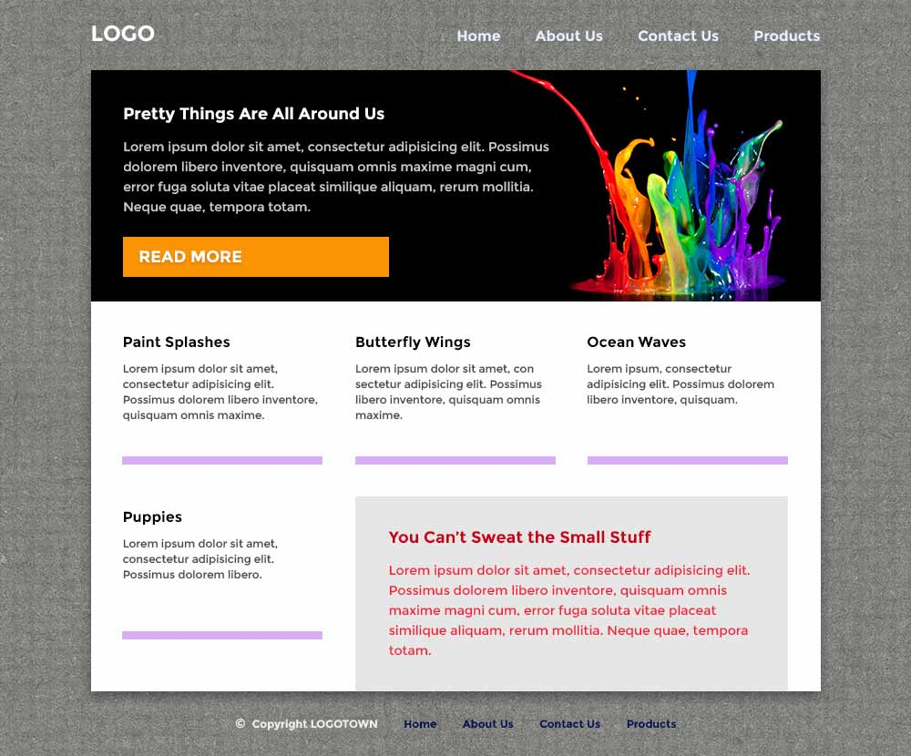
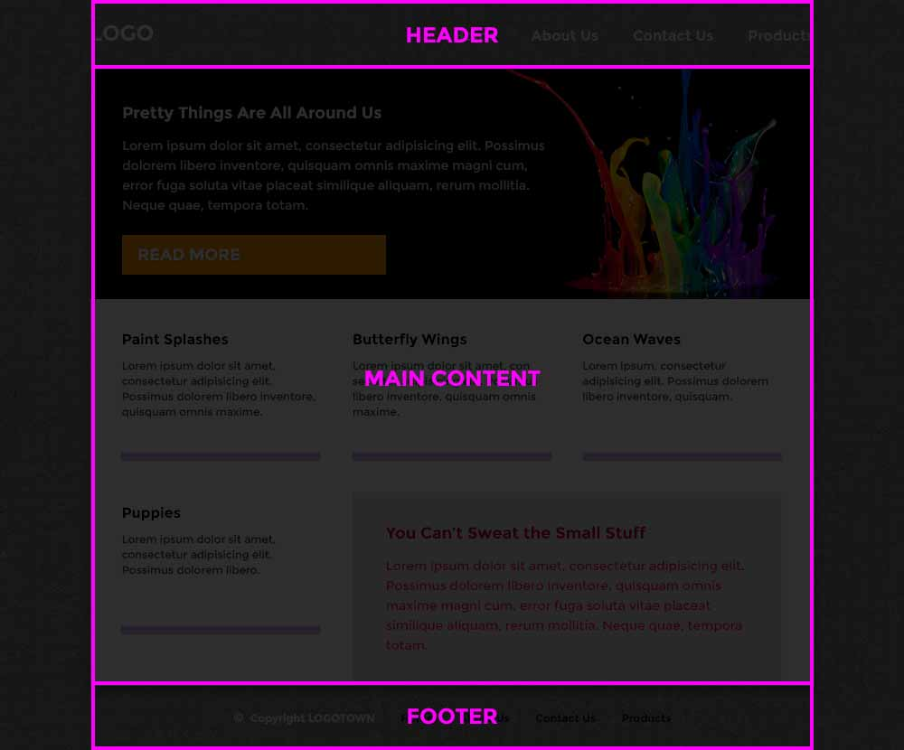
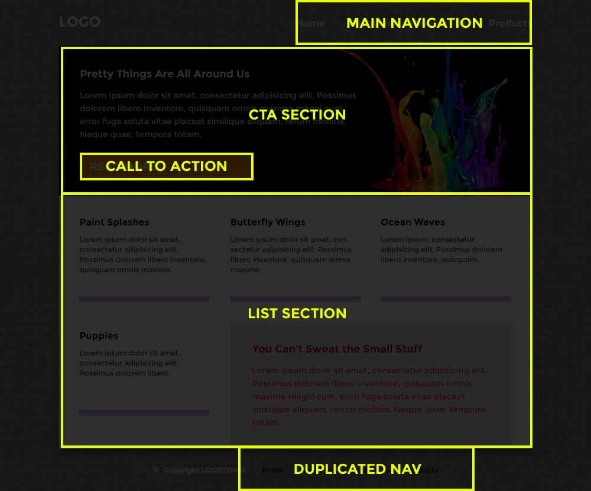

# Introduction

HTML is a simple language to understand and a difficult language to master. HTML is powerful because it is simple and because it allows us to tag content and data with semantic meaning. Over time, you'll become acquainted with many HTML tags of all types and your master of semantics will grow accordingly.

This lesson covers the basic concepts and many of the most common tags you'll encounter on a daily basis.

---

# Learning Some Common HTML Tags  

HTML includes a great number of tags. Each with specific applications including word processing, tables, and media. As you read about each type of tag, think about where you come across them on a daily basis and how you would use them when authoring HTML.

This lesson contains **a lot** of information. No one is expecting you to memorize all of these tags overnight. However, you should study them diligently and commit to memory as many as possible.

## Word Processing Tags  

`Word processing tags` are used to display and format text. Think of the format bars for a word processing program (Word, Google Docs, etc).

| Element	| Description |
| --- | --- |
| h1- h6 |	Header tags: use these tags when authoring headers, with h1 being the largest and h6 the smallest. |
| p |	Paragraph: use this tag when authoring a paragraph. |
| br |	Break: Use this tag to create a line break within a paragraph. |
| strong (and b) |	Use this tag to give importance to text (bold). |
| em (and i) |	Emphasize: use this tag to render text as emphasized (italics). |
| hr |	Horizontal rule: use this tag to create a horizontal line to divide content. |

Take a look at the example below, paying close attention to how the browser renders each tag.

```html
<h1>H1 heading</h1>
<h2>H2 heading</h2>
<h3>H3 heading</h3>
<h4>H4 heading</h4>
<h5>H5 heading</h5>
<h6>H6 heading</h6>
<br>
<hr>
<p>I'm some text rendered using the 'p' tag.</p>
<p>Each example is separated by a 'br'</p>
<br>
<b>I'm some bolded text using the 'b' tag.</b>
<br>
<i>I'm some italicized text using the 'i' tag.</i>
```

## HTML5 Semantic Tags  

The most recent version of HTML (v.5) has introduced a number of `semantic tags`, which help better define parts of the web page by improving the structure of the document, as well as providing contextually rich information to page readers, robots, and search engines.

| Element |	Description |
| --- | --- |
| article |	Self-contained content, e.g. blog posts, news articles, post comments. |
| aside |	Content that is related, but secondary to page content. |
| details |	Additional details that the user can view or hide, e.g. summaries, copyrights, bylines |
| summary |	A visible heading for a details element. |
| figure |	Self-contained visual content, e.g. illustrations, diagrams, photos, code listings, etc. |
| figcaption |	The caption for a figure element. |
| footer |	Footer for either document or section. Can have multiple per page. |
| header |	Header for either document or section. Can have multiple per page. |
| main |	Main content of a document. |
| mark |	Marked/highlighted text. |
| nav |	Navigation links. |
| section |	Section of a document, e.g. chapters, headers, footers |
| time |	Defines a date/time that is human-readable. |

All modern browsers will recognize HTML5 Semantic Tags. The following code sample demonstrates the use of some of these tags.

```html
<!doctype html>
<html>
<head>
    <meta charset="UTF-8">
    <title>Semantic Tag Examples</title>
</head>
<body>
    <!--
    This 'header' is for the entire site and contains
    the page title and principal navigation
    -->
    <header>
        <h1>The Best Site Ever</h1>
        <nav>
            <a href="index.html">Home</a>
            <a href="services.html">Services</a>
            <a href="contact.html">Contact</a>
            <a href="about.html">About Us</a>
        </nav>
    </header>
    <!--
    The 'main' tag contains all the core content for
    this document
    -->
    <main>
        <article>
            <header>
                <h2>Article Title</h2>
                <p>Published: <time datetime="2017-05-12">05/12/17</time></p>
            </header>
            <!-- Article content goes here -->
            <footer>
                <!--
                Meta information for the 'article'
                goes in the 'footer'
                -->
            </footer>
        </article>
        <article>
            <header>
                <h2>Article 2 Title</h2>
                <p>Published: <time datetime="2017-05-05">05/05/17</time></p>
            </header>
            <!-- Article content goes here -->
            <footer>
                <!--
                Meta information for the 'article'
                goes in the 'footer'
                -->
            </footer>
        </article>
    </main>
    <!--
    The site footer holds meta data about its container element,
    in this case, the body
    -->
    <footer>
        Footer information, links, etc.
    </footer>
</body>
</html>
```

## List Tags  

HTML includes two types of lists. The `ul` (unordered list) is used to create bulleted lists. The `ol` (ordered list) tag is used to create numbered lists. Both are used as parents for `li` tags.

### Example

```html
<ul>
  <li>HTML</li>
  <li>CSS</li>
  <li>JavaScript</li>
</ul>

<ol>
  <li>HTML</li>
  <li>CSS</li>
  <li>JavaScript</li>
</ol>
```

These two examples would render as follows. Notice that the `ul` tag produces bullets and the `ol` tag produces a numbered list:

```html
<!DOCTYPE HTML>
<html>
  <head>
    <link rel="stylesheet" type="text/css" href="styles.css">
  </head>
  <body>
    <ul>
      <li>HTML</li>
      <li>CSS</li>
      <li>JavaScript</li>
    </ul>

    <ol>
      <li>HTML</li>
      <li>CSS</li>
      <li>JavaScript</li>
    </ol>
  </body>
</html>
```

## Blockquotes  

We use a `blockquote` tag when we need to quote content from another source.

### Example

```html
<blockquote>
  Nature shows us only the tail of the lion. But there is no doubt in my mind that the lion belongs to it even if he cannot reveal himself to the eye all at once because of his huge dimension.
</blockquote>
```

The following example uses a small amount of CSS to make the block quote more apparent. Typically, block quotes have very little or no default styling provided by the browser. In this case, we've given the block quote a gray background so that it is easier to see.

```html
<!-- index.html -->
<!DOCTYPE HTML>
<html>
  <head>
    <link rel="stylesheet" type="text/css" href="styles.css">
  </head>
  <body>
    <p>Albert Einstein said the following about scope:</p>
    <blockquote>
      Nature shows us only the tail of the lion. But there is no doubt in my mind that the lion belongs with it even if he cannot reveal himself to the eye all at once because of his huge dimension.
    </blockquote>
    <p>That's a great quote!</p>
  </body>
</html>
```

```css
/* styles.css */
blockquote{
  padding: 10px;
  background: #eee;
}
```

## Form Tags  

We come across forms every day when we log into our email accounts, check our bank accounts, or create a user profile. Forms consist of several types of labels, inputs and containing elements. Forms make extensive use of attributes that dictate how these elements behave and what data they can receive.

**Form**: An element that contains `inputs controls` to submit data to a server.

**Fieldset**: An element used to group controls and elements within a form.

**Legend**: Adds a caption to a parent `fieldset` element.

**Label**: An element that provides a caption for an input field. Labels provide improved user experience by toggling input when a user clicks on the label.

**Input (controls)**: An element that declares an `input control` responsible for data collection. Input types are declared as attributes with the keyword, `type`. In the following example, `div` tags are used to group some of the elements together. This can help with styling and is generally a good practice for managing form inputs.

```html
<form action="index.php" method="post">
  <fieldset>
    <legend>Profile Information:</legend>
    <div>
        <label for="first_name">First Name:</label>
        <input type="text" id="first_name" name="first_name">
    </div>
    <br>
    <div>
        <label for="last_name">Last Name:</label>
        <input type="text" id="last_name" name="last_name">
    </div>
    <br>
    <div>
        <label for="email">Email Address:</label>
        <input type="email" id="email" name="email">
    </div>
    <br>
    <input type="submit" value="Submit">
  </fieldset>
</form>
```

This next example demonstrates how form data can be captured with JavaScript and redirected for other purposes. It's not necessary to understand everything that is occurring in this example, but it's fun to see an example of what can be done with forms. For now, just focus on getting used to the form elements themselves. We will cover forms extensively in a later lesson.

Enter your name in the field and press "Print My Name".

 ```html
<!-- index.html -->
<!DOCTYPE html>
<html>
    <head>
        <meta charset="utf-8">
        <title>Printing your name</title>
        <link rel="stylesheet" href="style.css">
    </head>
    <body>
    <form id="form">
        <div>
            <label for="name">Enter Your Name:</label>
            <input type="text" name="name" id="name">
        </div>
        <div>
            <input type="submit" id="submit_button" value="Print My Name">
        </div>
    </form>
    <script src="script.js"></script>  
</body>
</html>
```

```css
/* style.css */
body{
    background: #cdd;
    margin-top: 20px;
}
form{
    width: 300px;
    margin: 0 auto;
    padding: 20px;
    background: white;
    box-shadow: 0 5px 8px rgba( 0, 0, 0, 0.3 );
}
label, input{
    box-sizing: border-box;
    display: block;
    width: 100%;
}
input{
    padding: 10px;
}
#submit_button{
    margin-top: 10px;
    background-color: orange;
    border: none;
    color: white;
    padding: 15px 32px;
    text-align: center;
    text-decoration: none;
}
#submit_button:hover{
    background: red;
}
```

```js
// script.js
var btn = document.getElementById( "submit_button" );

btn.addEventListener( "click", function( e ){
    e.preventDefault();
    alert("Hi there " + document.getElementById( "name" ).value );
});
```

## Media Tags  

You also come across media tags on almost every page you visit. These tags are used to display audio and visual content embedded in the HTML.

### Image Elements  

Image elements are used to represent images in a document. Images come in several formats including .jpeg, .png, .gif, and .svg.

```html

```

The image tag requires two attributes:

* `src` specifies the relative or absolute path to the source image file

* `alt` specifies the text that will display should the image not load

### The Figure Element  

Figure elements define self-contained content visuals: such as photos, illustrations, code listing, etc. You should use this element if your media (image, audio, video, etc.) has a caption.

```html
<figure>
    
    <figcaption>I'm a caption</figcaption>
</figure>
```

### The Canvas Element  

The canvas element is a powerful tag accompanied by an equally powerful JavaScript drawing API. This gives us the ability to generate images on the fly with code. The canvas element is a deep topic that we probably won't cover in detail in this class.

### SVG Elements  

SVGs are an interesting image format. They can be referenced as the source for image elements, but can also be embedded directly into the HTML document. SVGs use a syntax and structure similar to HTML because they are both based on XML. The following example code can be dropped into any modern browser and it will draw a pink ellipse with a one-pixel orange stroke.

```html
<svg height="140" width="500">
    <style>
        ellipse{
            fill: pink;
            stroke: orange;
            stroke-width: 1;
        }
    </style>
    <ellipse cx="200" cy="80" rx="100" ry="50" />  
</svg>
```

SVG is a deep subject with lots of intricate details. Many SVG attributes are used to specify the details of what is being drawn. Digging into those details is beyond the scope of this article. This section is included to build your awareness of this powerful image format.

### The Audio Element  

Audio elements are used to define audio streams or other audio content. This element is one of only a few that allow for single word attributes. In the opening audio tag, you will see the word "controls". This is really shorthand for the attribute `controls="controls"`. Some media tags allow for this shorthand because they offer several `val=val` attributes and the shorthand syntax keeps things neat.

```html
<audio controls src="http://developer.mozilla.org/@api/deki/files/2926/=AudioTest_(1).ogg">
    Your browser does not support the <code>audio</code> element.
</audio>
```

Audio elements require one attribute:

* `src` specifies the relative or absolute path to the source audio file

### The Video Element  

Video elements specify a video stream or video clip. In a lot of ways, it's similar to the audio tag.

```html
<video controls poster="https://archive.org/download/WebmVp8Vorbis/webmvp8.gif" >
    <source src="https://archive.org/download/WebmVp8Vorbis/webmvp8.webm" type="video/webm">
    Your browser doesn't support HTML5 `video` tag.
</video>
```

### Video elements require two attributes:

* `src` specifies the relative or absolute path to the source video file

* `poster` specifies an image file that should display while the video is buffering (this isn't really required, but is highly recommended)

Video elements also have access to numerous other attributes for video control, including:

* autoplay

* buffer

* height

* etc. 1

## Table Tags  

Table tags are used to display tabular data (like a spreadsheet). The `table` element also has access to certain attributes for rendering, such as color, align, border, etc. 2

**Table tags and their use:**

* `table`: table element.

* `th`: table head.

* `tfoot`: table footer.

* `tbody`: table body.

* `tr`: table row.

* `td`: table cell.

### Example

```html
<table border="1">
  <thead>
    <tr>
      <th>Header content 1</th>
      <th>Header content 2</th>
    </tr>
  </thead>
  <tfoot>
    <tr>
      <td>Footer content 1</td>
      <td>Footer content 2</td>
    </tr>
  </tfoot>
  <tbody>
    <tr>
      <td>Body content 1</td>
      <td>Body content 2</td>
    </tr>
  </tbody>
</table>
```

## Conclusion  

Tags represent one of the basic building blocks of HTML syntax. Most tags come in pairs, in the form of `tag pairs`. When coupled with content, the end result is an `element`. Without tags, it would be impossible to author valid HTML content. The browser would not be able to distinguish and render different types of content.

### References  

#### Lesson Footnotes

* 1: [MDN - video tag](https://developer.mozilla.org/en-US/docs/Web/HTML/Element/video)

* 2: [MDN - table tag](https://developer.mozilla.org/en-US/docs/Web/HTML/Element/table)

---

# Understanding Element Relationships  

An HTML document is a complex arrangement of elements. These elements are organized in a hierarchy determined by element containment. This is better known as `nesting` and it is a "tree-like" structure consisting of ancestor/parent/child/sibling relationships.

## Parent Element  

A `parent` element is an element that contains other elements.

## Child Element  

This is an element that is directly contained by another element.

## Parents and Children  

In the following example `article` is the parent and `h1` is the child.

### Example

```html
<article><!--parent-->
    <h1>Breaking News</h1><!--child-->
</article>
```

## Sibling Elements  

These are elements that share the same parent.

### Example

```html
<!--h1 and p are siblings-->
<article><!--parent-->
    <h1>Breaking News</h1><!--child-->
    <p>Coding is awesome!</p><!--child-->
</article>
```

## Ancestor Element  

An element that contains other elements is an 'ancestor' of the elements that it contains.

### Example

```html
<!--"section" is the ancestor of h1, p, h3, ul, and li -->
<body>
    <section>
        <article>
            <h1>Breaking News</h1>
            <p>Coding is awesome!</p>
        <article>
        <aside>
            <h3>Languages</h3>
            <ul>
                <li>HTML</li>
                <li>CSS</li>
                <li>JavaScript</li>
                <li>Ruby</li>
            </ul>
        </aside>
    </section>
</body>
```

> Notice how `aside` is parent to `h3` and `ul`, but also notice how `ul` is parent to all the `li`.
> Notice how `aside` is the ancestor to the `li` within the `ul`.

The example above also exemplifies the structure of nesting at multiple levels. It also depicts the "tree-like" structure mentioned in the introduction, with each element representing a branch.

## Conclusion  

The concept of ancestor/parent/child/sibling relationships is important, because it helps us understand the structure of the HTML document as well as how these elements relate to each other. Having a good understanding of nesting and the relationships this creates will be key when working with CSS and JavaScript. Ancestor/parent/child/sibling relationships will be of the upmost importance when learning about event-bubbling in JavaScript. It will also help with authoring concise and precise CSS.

---

# Authoring Semantic HTML From Resources  

As a developer, you will likely be asked to create HTML documents using a wide variety of resources. The resources provided to you could differ greatly from one project to the next. Sometimes, you'll be given text files with written instructions. Sometimes, you'll be given visual mockups. Sometimes, you get lots of resources to help guide your decisions and sometimes you get next to nothing. Being a programmer is just like any other job that requires critical thinking skills.

Regardless of what resources you are given, you will need the ability to interpret those resources. Your ability to make appropriate interpretations will inform your decisions about how to implement interface features and content.

**This article will discuss approaches for doing two things:**

1. Interpreting written content and convert that content into semantic HTML

2. Evaluating a visual mockup and converting the content elements in the mockup into semantic HTML

# Converting Content into HTML  

The process for converting content into HTML is fairly straightforward because HTML is tailor-made for just this purpose. It can be reduced to 3 steps:

1. **Read all of the content so that you understand its meaning.** You won't be able to write any HTML until you know what you are marking up. Semantics are extremely important when authoring HTML, so you'll have to know what all the content is before you can mark it up.

2. **Decide which pieces of content belong together, so that you can structure your document appropriately.** After you've read the content, you'll have to break it down into its constituent parts. This is an important step because the way that you segment the content will determine the structure of any container elements, e.g. article, section, div, etc.

3. **Write up (or look up) the syntax for each of the elements you are marking up.** You'll have to look things up sometimes; it's normal. No one is expecting you to have memorized all of HTML in a couple days. If you can't remember how to mark up a table, look up some samples. If you come across a piece of content and don't know what tags to use, look it up. You'll find lots of reference in Newline and lots more by searching online.
These 3 steps will act as our general game plan when marking up content. With that said, let's walk through a content to HTML conversion.

## Content to HTML Case Study  

The following content sample is trivial and intended only to give us something to interpret. In your career, and in this class, the content you work with very often be much more complex, but the principles are the same. Read through the content and think about what tags you'd use to mark up this content.

```
Notes from Maria
1965

I really like raindrops on roses and kitten whiskers. I have a bright copper kettle thats pretty cool and warm woolen mittens that my dad gave me. I like the old school paper packages tied up with strings. Those are a few of my favorites.

Cool Things

- Cream-colored ponies
- Apple strudels
- Doorbells
- Sleigh bells
- Schnitzel

Thing to do

1. Win over the children
2. Fall in love with the Captain
3. Flee from a world at war
4. Live happily ever after
```

Some things should jump out at you straight away. We have some sort of title and date at the beginning of the document, then a long paragraph, and finally a couple lists.

In the next sample, I've added comments to the content sample to demonstrate how I might interpret this content.

```html
<!-- This seems like the page title -->
Notes from Maria

<!-- I'm guessing this is a date, probably a publishing date -->
1965

<!-- This is clearly the start of the main content. -->

<!-- This first element is a paragraph -->
I really like raindrops on roses and kitten whiskers. I have a bright copper kettle thats pretty cool and warm woolen mittens that my dad gave me. I like the old school paper packages tied up with strings. Those are a few of my favorites.

<!--
This looks like a title for the list below it
it's definitely a secondary title to the main page title
-->
Cool Things

<!--
This is a list of things
It's not numbered though, which should give us a hint
about which list tags to use
-->
- Cream-colored ponies
- Apple strudels
- Doorbells
- Sleigh bells
- Schnitzel

<!--
This looks like another secondary title.
I don't think its a sub sub title, meaning it's
not a subtitle to "Cool Things". It's a secondary title
to "Notes from Maria"
-->
Thing to do

<!--
Another list
This one is numbered, again giving us a hint
about which list tags to use
-->
1. Win over the children
2. Fall in love with the Captain
3. Flee from a world at war
4. Live happily ever after

<!--
Since this is the end of the doc,
it must be the end of the main content.
-->
```

After we've determined what each piece of content is, we need to determine the specific tags and code to use to convert it to HTML.

To start, we should sketch out the minimal HTML for a valid web page. I'll go ahead and duplicate the page title in the title element.

```html
<!doctype html>
<html>
    <head>
        <meta charset="UTF-8">
        <title>Notes from Maria</title>
    </head>
    <body>
    </body>
</html>
```

**Now, step though the content, line by line, and convert everything to HTML:**

The first element is the page title. Titles are `h` tags and the top level `h` tag is `h1`

```html
<!doctype html>
<html>
    <head>
        <meta charset="UTF-8">
        <title>Notes from Maria</title>
    </head>
    <body>
        <h1>Notes from Maria</h1>
    </body>
</html>
```

The next line of content is a date and should be marked up using the `time` tag.

```html
<!doctype html>
<html>
    <head>
        <meta charset="UTF-8">
        <title>Notes from Maria</title>
    </head>
    <body>
        <h1>Notes from Maria</h1>
        <time>1965</time>
    </body>
</html>
```

The next element is a paragraph, so we use a `p` tag.

```html
<!doctype html>
<html>
    <head>
        <meta charset="UTF-8">
        <title>Notes from Maria</title>
    </head>
    <body>
        <h1>Notes from Maria</h1>
        <time>1965</time>
        <p>I really like raindrops on roses and kitten whiskers. I have a bright copper kettle thats pretty cool and warm woolen mittens that my dad gave me. I like the old school paper packages tied up with strings. Those are a few of my favorites.</p>
    </body>
</html>
```

Continuing on, we come to a second level title. Our main page title was an `h1`, so the next level `h` tag is the `h2`.

```html
<!doctype html>
<html>
    <head>
        <meta charset="UTF-8">
        <title>Notes from Maria</title>
    </head>
    <body>
        <h1>Notes from Maria</h1>
        <time>1965</time>
        <p>I really like raindrops on roses and kitten whiskers. I have a bright copper kettle thats pretty cool and warm woolen mittens that my dad gave me. I like the old school paper packages tied up with strings. Those are a few of my favorites.</p>
        <h2>Cool Things</h2>
    </body>
</html>
```

The next element is a little more complex. It's clearly a list. As we stated in the HTML comments, our hint about how best to mark up this list is that it doesn't have numbers. Lists that aren't numbered are called "unordered lists" and require the `ul` tag.

Also, each item in the list needs to be marked up with `li` (list item) tags and nested within the `ul`.

```html
<!doctype html>
<html>
    <head>
        <meta charset="UTF-8">
        <title>Notes from Maria</title>
    </head>
    <body>
        <h1>Notes from Maria</h1>
        <time>1965</time>
        <p>I really like raindrops on roses and kitten whiskers. I have a bright copper kettle thats pretty cool and warm woolen mittens that my dad gave me. I like the old school paper packages tied up with strings. Those are a few of my favorites.</p>
        <h2>Cool Things</h2>
        <ul>
            <li>Cream-colored ponies</li>
            <li>Apple strudels</li>
            <li>Doorbells</li>
            <li>Sleigh bells</li>
            <li>Schnitzel</li>
        </ul>
    </body>
</html>
```

Finally, we come across another header. This one seems to be of the same importance as the other list header, so we'll mark it up with another `h2`.

The list is a little different than the last one. This list has numbers and should be marked up as an "ordered list", meaning that we'll us the `ol` tag this time.

```html
<!doctype html>
<html>
    <head>
        <meta charset="UTF-8">
        <title>Notes from Maria</title>
    </head>
    <body>
        <h1>Notes from Maria</h1>
        <time>1965</time>
        <p>I really like raindrops on roses and kitten whiskers. I have a bright copper kettle thats pretty cool and warm woolen mittens that my dad gave me. I like the old school paper packages tied up with strings. Those are a few of my favorites.</p>
        <h2>Cool Things</h2>
        <ul>
            <li>Cream-colored ponies</li>
            <li>Apple strudels</li>
            <li>Doorbells</li>
            <li>Sleigh bells</li>
            <li>Schnitzel</li>
        </ul>
        <h2>Thing to do</h2>
        <ol>
            <li>Win over the children</li>
            <li>Fall in love with the Captain</li>
            <li>Flee from a world at war</li>
            <li>Live happily ever after</li>
        </ol>
    </body>
</html>
```

And there you have it. This is a well marked up document. Each piece of content has been wrapped in the proper semantic tag and everything is nested correctly. We can, however, improve the document more by adding some container elements to help group related content items. We can easily add two elements to segment our content.

The main page title `h1` and the date `time` can be wrapped in a header tag. Semantically, this says that those two items are "introductory content" for the whole page, which makes sense. The main titles encapsulate all of the content, and the date states when it was drafted

The rest of the content can be wrapped in a `main` tag. This is the "main content" for the page and should generally be a top level element.

```html
<!doctype html>
<html>
    <head>
        <meta charset="UTF-8">
        <title>Notes from Maria</title>
    </head>
    <body>
        <header>
            <h1>Notes from Maria</h1>
            <time>1965</time>
        </header>
        <main>
            <p>I really like raindrops on roses and kitten whiskers. I have a bright copper kettle thats pretty cool and warm woolen mittens that my dad gave me. I like the old school paper packages tied up with strings. Those are a few of my favorites.</p>
            <h2>Cool Things</h2>
            <ul>
                <li>Cream-colored ponies</li>
                <li>Apple strudels</li>
                <li>Doorbells</li>
                <li>Sleigh bells</li>
                <li>Schnitzel</li>
            </ul>
            <h2>Thing to do</h2>
            <ol>
                <li>Win over the children</li>
                <li>Fall in love with the Captain</li>
                <li>Flee from a world at war</li>
                <li>Live happily ever after</li>
            </ol>
        </main>
    </body>
</html>
```

This is a live version of the HTML as rendered in a browser.

```html
<!doctype html>
<html>
    <head>
        <meta charset="UTF-8">
        <title>Notes from Maria</title>
    </head>
    <body>
        <header>
            <h1>Notes from Maria</h1>
            <time>1965</time>
        </header>
        <main>
            <p>I really like raindrops on roses and kitten whiskers. I have a bright copper kettle thats pretty cool and warm woolen mittens that my dad gave me. I like the old school paper packages tied up with strings. Those are a few of my favorites.</p>
            <h2>Cool Things</h2>
            <ul>
                <li>Cream-colored ponies</li>
                <li>Apple strudels</li>
                <li>Doorbells</li>
                <li>Sleigh bells</li>
                <li>Schnitzel</li>
            </ul>
            <h2>Thing to do</h2>
            <ol>
                <li>Win over the children</li>
                <li>Fall in love with the Captain</li>
                <li>Flee from a world at war</li>
                <li>Live happily ever after</li>
            </ol>
        </main>
    </body>
</html>
```

We could add additional attributes to many of these elements to improve the semantics of this document, but we'll leave that for another day.

**Whenever you are converting content to HTML, try to understand what each piece of content represents. That will help lead you to the tags that you need to use. Pay close attention to your nesting and be sure to wrap content in an opening tag and a closing tag.**

In the next section, we'll discuss how to interpret a visual mockup and determine the basic structure of your HTML document based on the design layout.

# Mockups  

**In order to interpret a mockup, you'll first need to know what a mockup is and what it attempts to communicate.**

Mockups are visual representations of what the final site/application should look like. They are usually produced by designers in visual editing tools like Photoshop, Illustrator, or Sketch. Basically, the are a "picture" of the final product.

In many production environments, mockups must be produced before coding the interface can occur. Generally, that means that by the time the mockup gets to you, many of the interface decisions have already been made. In that case, your job will be to create an HTML/CSS page that closely resembles the mockup visually.

The following is a mockup:



The mockup is just an image that looks like a complete web site. This particular example was created in Photoshop.

## Interpreting a Mockup  

To determine what HTML should be written, we have to do a few things:

1. **Visually evaluate the mockup.** Read all of the content and look for any page elements that might be tricky to implement. Knowing what might be a sticking point will take some time and practice. For now, use your best judgment.

2. **Determine which elements should be grouped together and create the containing elements.** Your life will be much easier if you wrap groups of content in semantic (or sometimes even non-semantic) elements.

3. **Go, element by element, and mark up the content.** Once you've sketched out a great site using the containing elements, fill in each element with all the details.

Even before we start evaluating the code, we need to sketch out a valid HTML doc with the minimum elements. That will give us a strong foundation for whatever we choose to do.

```html
<!doctype html>
<html>
    <head>
        <meta charset="UTF-8">
        <title>Pretty Things</title>
    </head>
    <body>
    </body>
</html>
```

Next, look over the mockup and try to determine what elements can be grouped under a common parent. This should help you see the larger sections of your document.

**When I look at this design, I see three main areas:**

* I see the header, with the logo and the main site navigation.

* I also see the main content, which contains the dark section with the button and the splash image, and the light section with the five smaller pieces of content.

* I see the site footer, which contains a duplication of the main navigation and a copyright notice.



All three of these large elements are *extremely* typical of websites, so you should be looking for them whenever you evaluate a mockup. Each of those large containers will also have children, but recognizing the big containers is essential to giving your doc some structure.

Lets mark up the header, main, and footer.

```html
<!doctype html>
<html>
    <head>
        <meta charset="UTF-8">
        <title>Pretty Things</title>
    </head>
    <body>
        <header></header>
        <main></main>
        <footer></footer>
    </body>
</html>
```

Now that we have some basic structure, we can start looking for the child elements in each of the big container elements. The header has a logo and navigation. The `main` has 2 sections, the first containing come copy and a call to action. The footer duplicates the navigation found in the header.



Let's add the code for the header. Remember, we found a logo and a navigation list. The logo is simple. We add a link and give it an ID of "logo". The ID isn't strictly necessary, but will give us a hook later when we want to style this link independently of other links on the page.

```html
<!doctype html>
<html>
    <head>
        <meta charset="UTF-8">
        <title>Pretty Things</title>
    </head>
    <body>
        <header>
            <a href="/" id="logo">LOGO</a>
        </header>
        <main></main>
        <footer></footer>
    </body>
</html>
```

The navigation link requires a `nav` element and a set of links. We'll keep the markup simple and just use anchor tags for the navigation links.

```html
<!doctype html>
<html>
    <head>
        <meta charset="UTF-8">
        <title>Pretty Things</title>
    </head>
    <body>
        <header>
            <a href="/" id="logo">LOGO</a>
            <nav>
                <a href="index.html">Home</a>
                <a href="aboutus.html">About Us</a>
                <a href="contactus.html">Contact Us</a>
                <a href="products.html">Products</a>
            </nav>
        </header>
        <main></main>
        <footer></footer>
    </body>
</html>
```

That's it for the header element. Let's move on to the `main` element, which contains two smaller `sections`. I'll also go ahead and interpret the Call to Action section (the first section). It contains a header, a paragraph, and a button.

I'm not going to include an image tag here (for the splash image), because I will probably make that the background image of the `section` element.

```html
<!doctype html>
<html>
    <head>
        <meta charset="UTF-8">
        <title>Pretty Things</title>
    </head>
    <body>
        <header>
            <a href="/" id="logo">LOGO</a>
            <nav>
                <a href="index.html">Home</a>
                <a href="aboutus.html">About Us</a>
                <a href="contactus.html">Contact Us</a>
                <a href="products.html">Products</a>
            </nav>
        </header>
        <main>
            <section id="call_to_action">
                <h1>Pretty Things Are All Abound Us</h1>
                <p>Lorem ipsum dolor sit amet, consectetur adipisicing elit. Possimus dolorem libero inventore, quisquam omnis maxime magni cum, error fuga soluta vitae placeat similique aliquam, rerum mollitia. Neque quae, tempora totam.</p>
                <a href="/readmore">Read More</a>
            </section>
            <section id="topic_list"></section>
        </main>
        <footer></footer>
    </body>
</html>
```

The next section in the site contains 5 smaller elements. Semantically, I'm not sure what each of these elements mean. They could represent important topics, or links to other pages, etc. Because I don't know what they mean *semantically*, I will mark them up with `div` tags. `div` is a generic tag that can be used as a non-semantic "division of content".

> Using `divs` is fine, if used appropriately. `divs` are great for giving you an additional parent element to use in CSS and JavaScript. Occasionally, using a non-semantic tag is the right thing to do. As you gain more experience, decisions about what tag to use and when will get easier. Practice, practice, practice...

```html
<!doctype html>
<html>
    <head>
        <meta charset="UTF-8">
        <title>Pretty Things</title>
    </head>
    <body>
        <header>
            <a href="/" id="logo">LOGO</a>
            <nav>
                <a href="index.html">Home</a>
                <a href="aboutus.html">About Us</a>
                <a href="contactus.html">Contact Us</a>
                <a href="products.html">Products</a>
            </nav>
        </header>
        <main>
            <section id="call_to_action">
                <h1>Pretty Things Are All Abound Us</h1>
                <p>Lorem ipsum dolor sit amet, consectetur adipisicing elit. Possimus dolorem libero inventore, quisquam omnis maxime magni cum, error fuga soluta vitae placeat similique aliquam, rerum mollitia. Neque quae, tempora totam.</p>
                <a href="/readmore">Read More</a>
            </section>
            <section id="topic_list">
                <div>
                    <h2>Paint Splashes</h2>
                    <p>Lorem ipsum dolor sit amet, consectetur adipisicing elit. Possimus dolorem libero inventore, quisquam omnis maxime.</p>
                </div>
                <div>
                    <h2>Butterfly Wings</h2>
                    <p>Lorem ipsum dolor sit amet, con sectetur adipisicing elit. Possimus libero inventore, quisquam omnis maxime.</p>
                </div>
                <div>
                    <h2>Ocean Waves</h2>
                    <p>Lorem ipsum, consectetur adipisicing elit. Possimus dolorem libero inventore, quisquam.</p>
                </div>
                <div>
                    <h2>Puppies</h2>
                    <p>Lorem ipsum dolor sit amet, consectetur adipisicing elit. Possimus dolorem libero.</p>
                </div>
                <div id="motivational_comment">
                    <h2>You can't sweat the small stuff</h2>
                    <p>Lorem ipsum dolor sit amet, consectetur adipisicing elit. Possimus dolorem libero inventore, quisquam omnis maxime magni cum, error fuga soluta vitae placeat similique aliquam, rerum mollitia. Neque quae, tempora totam.</p>
                </div>
            </section>
        </main>
        <footer></footer>
    </body>
</html>
```

You should notice that I've added a few id's to some of the elements. I've done this for a couple reasons:

1. Giving the section tags a unique identifier provides additional information about those page sections and the content that they contain. The first is `call_to_action` which references the main point of that section. Buttons and links are extremely important on websites and the "call to action" on this page is the big orange button.

2. Providing unique identifiers to certain elements makes selecting them with CSS and JS much easier.

Finally, we have to mark up the content for the footer, which is dead simple. We'll duplicate the HTML from the header navigation into the footer, and then tack on a copyright statement.

```html
<!doctype html>
<html>
    <head>
        <meta charset="UTF-8">
        <title>Pretty Things</title>
    </head>
    <body>
        <header>
            <a href="/" id="logo">LOGO</a>
            <nav>
                <a href="index.html">Home</a>
                <a href="aboutus.html">About Us</a>
                <a href="contactus.html">Contact Us</a>
                <a href="products.html">Products</a>
            </nav>
        </header>
        <main>
            <section id="call_to_action">
                <h1>Pretty Things Are All Abound Us</h1>
                <p>Lorem ipsum dolor sit amet, consectetur adipisicing elit. Possimus dolorem libero inventore, quisquam omnis maxime magni cum, error fuga soluta vitae placeat similique aliquam, rerum mollitia. Neque quae, tempora totam.</p>
                <a href="/readmore">Read More</a>
            </section>
            <section id="topic_list">
                <div>
                    <h2>Paint Splashes</h2>
                    <p>Lorem ipsum dolor sit amet, consectetur adipisicing elit. Possimus dolorem libero inventore, quisquam omnis maxime.</p>
                </div>
                <div>
                    <h2>Butterfly Wings</h2>
                    <p>Lorem ipsum dolor sit amet, con sectetur adipisicing elit. Possimus libero inventore, quisquam omnis maxime.</p>
                </div>
                <div>
                    <h2>Ocean Waves</h2>
                    <p>Lorem ipsum, consectetur adipisicing elit. Possimus dolorem libero inventore, quisquam.</p>
                </div>
                <div>
                    <h2>Puppies</h2>
                    <p>Lorem ipsum dolor sit amet, consectetur adipisicing elit. Possimus dolorem libero.</p>
                </div>
                <div class="motivational_comment">
                    <h2>You can't sweat the small stuff</h2>
                    <p>Lorem ipsum dolor sit amet, consectetur adipisicing elit. Possimus dolorem libero inventore, quisquam omnis maxime magni cum, error fuga soluta vitae placeat similique aliquam, rerum mollitia. Neque quae, tempora totam.</p>
                </div>
            </section>
        </main>
        <footer>
            <p>©Copyright</p>
            <nav>
                <a href="index.html">Home</a>
                <a href="aboutus.html">About Us</a>
                <a href="contactus.html">Contact Us</a>
                <a href="products.html">Products</a>
            </nav>
        </footer>
    </body>
</html>
```

And there you have it. Interpreting a Mockup isn't that difficult. Converting it to HTML takes some reasoning skills and a lot a familiarity with tags. Over time, you will become accustomed to the process and you'll be banging out static web pages in no time.

## Conclusion  

Authoring a semantic HTML document from a mockup is a methodical process. The use of semantic elements helps us better define parts of the web page by improving the readability and structure of the document. Additionally, the proper use of tags provides contextually rich information to page readers, robots, and search engines.

By following these simple guidelines, authoring a great looking and semantic webpage will become much easier and more intuitive. Practice makes perfect, so never stop marking up!

### References  

[^1]:[MDN - Semantics](https://developer.mozilla.org/en-US/docs/Glossary/Semantics)

[^2]:[Smashing Magazine - The Problem With Div](https://www.smashingmagazine.com/2013/01/the-importance-of-sections/#the-problem-with-div)

# Summary

It'll take some time to memorize all of the tags that you've seen today. Don't get frustrated if you cannot remember them all. The more you write HTML, the more you'll remember.

Once concept to pay special attention to is Semantics. Semantics can inform your naming conventions for classes, ids, and can make interpreting and maintaining your markup easier.
