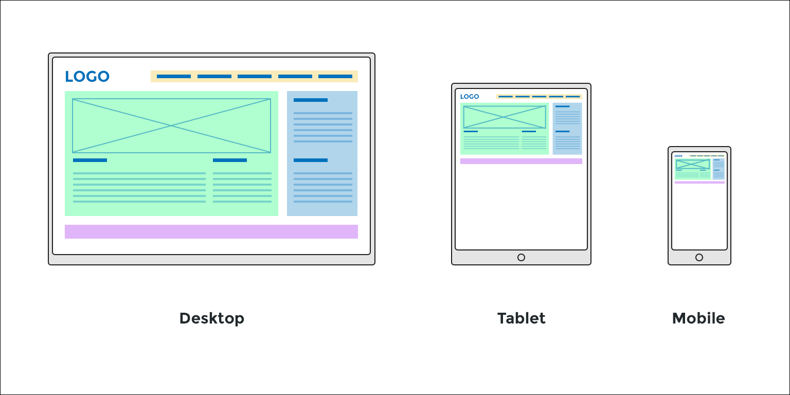
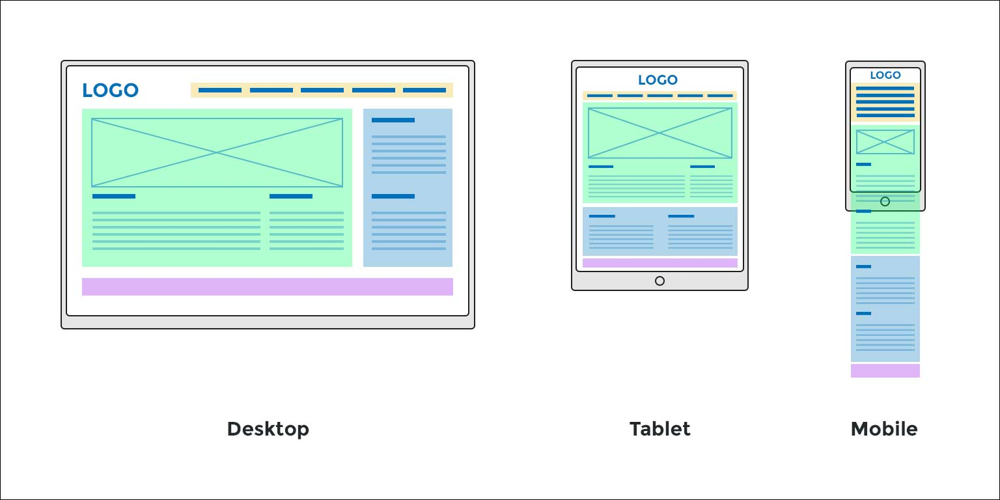
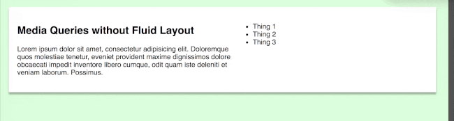

# Media Queries  

Media Queries are a CSS technique used in responsive web design. They set conditions that, when met, adjust specified aspects of a page (often sizing) without having to alter any of the content.

Take a look at a website on your laptop. Now pull it up on your phone. You'll probably notice quite a few differences. Go back to the desktop version and slowly resize the screen, making it smaller. If there's a noticeable "snap" to the website, guess what? You probably just hit the threshold of a media query, which is typically called a "breakpoint".

## Using Media Queries  

Media queries can potentially look at several different aspects of the device on which the website is currently being viewed, like resolution, aspect ratio, or color (see media feature below). However, by far the most common aspect of a screen on which to base a media query is width. This is generally the most important factor in making content work on both desktop and mobile.

There are two ways to go about setting a media query: **in your CSS Stylesheet** and, less commonly, as a **link** at the head of your `html`. Let's examine the more common way first.

### A Simple Query  

A basic media query consists of:

* The CSS rule `@media`

* A `media` feature (see below)

* The component being altered

* A list of one or more styles.

If the query is true, the items listed in the stylesheet are triggered.

A **media feature** is an attribute that is used to declare specific requirements of an output device. Though not required to, a `media feature` will often have a `min` or `max` prefix. Some examples of media features include:

* min-width

* max-height

* device width

* aspect-ratio

* resolution

* color

So for example...

```css
@media (min-width: 768px) {
  header {
    padding: 200px;
  }
} 
```

...dictates that if the screen-width is **at least** 768 pixels, the page `header` padding will be set at 200px.

### Link to a Specific Stylesheet  

Multiple media queries can be used in one stylesheet, and very often are. Another way of going about it is to create a specific stylesheet, `link` it at the top of your html, and set a media feature.

That would look something like this:

```html
<link rel="stylesheet" media="(min-width: 1000px)" href="linkMethod.css" />
```

You're then free to edit that stylesheet as usual, with the knowledge that it will trigger based on the above max-width specification.

### Media-Type and Multiple Expressions  

Let's journey down the rabbit hole a bit. You can also dictate a media type (like a TV), as well as multiple expressions, separated by `logical operators`. Like before, the declarations will only be applied if everything is true.

For instance:

```css
@media handheld and (min-width: 320px) and (orientation: landscape) {
  .wackyMenu {
    display: none;
  }
}
```

If the media type is a phone, the screen-width is at most 650px, and the display happens to be in landscape mode, then the specified declarations will apply.

As stated above, there are often multiple media queries in one CSS document. At the very least, a site will often have three, one for mobile, tablet, and desktop versions of the site. That would look something like this:

```css
@media only screen and (min-width: 768px) {
  .navbar-top {
    background: transparent;
    border-bottom: 1px solid transparent;
    color: grey;
    padding: 20px;
  }
}
@media screen and (min-width: 1200px) {
  .navbar-top {
    background: darkblue;
    border-bottom: 1px solid black;
    color: grey;
    padding: 45px;
  }
}
```

## Conclusion  

Media Queries weren't recommended as standard practice until recently, largely because they're so commonly used to create a seamless transition between a computer screen and a smartphone. For those of you who are young, a) enjoy it and b) smartphones are relatively new to the world. In the lifespan of computer coding, the same thing might be said of media queries.

### References  

* [Using media queries - MDN](https://developer.mozilla.org/en-US/docs/Web/CSS/Media_Queries/Using_media_queries)
* [Media Queries](https://en.wikipedia.org/wiki/Media_queries)

---
 
# Creating a Responsive Layout  

Responsive web design (RWD) has quickly become a standard practice, in large part due to the explosion of different devices that have web browsing capabilities.

Let's consider some of those devices:

**Smart Phones** are small hand held devices with high pixel density screens. They are narrow and tall and don't allow for widely varying page layouts. Users interact by touching the screen.

**Tablets** are slightly larger in form factor. They are often rotated to a "landscape" (on its side, so to speak) orientation for viewing things like movies. People often use them to read text heavy content like books and articles. Tablets are also touch screen devices, just like smart phones.

**Desktop Monitors** are large and almost always horizontal. They have a lower pixel density (think 'resolution') and users interact in a variety of ways. Some desktop computers have touch screens, many do not. Most users interact with desktop computers via a mouse and keyboard.

All of these devices have web browsers that can access websites. This presents a problem for any web designers who want their designs to function well on all of those devices.

In the illustration below, you can see how sites might appear if they aren't developed with responsive principles. The site looks great on on a desktop, with a logical layout and clear element. On a tablet, the content is scaled down and the horizontal layout is ill formed for the vertical device. On a mobile device, the effect is even worse. Text is too small to see and the whole site looks zoomed out.



> Without Responsive Design, sites can render strangely across devices. What works well on the desktop, may be very hard to deal with on a phone.

You've probably encountered sites like this at some point while browsing the web on your phone. It's a frustrating experience to pinch and zoom to see button names and to attempt to click on elements that are far too small.

## Is There a Better Way?  

Imagine that we can create alterations to the presentation of content to suit the form factor and aspect ratio of our user's devices. Responsive Web Design enables us to do exactly that. Before we get into the details, let's look at the same layout as before, but with RWD applied to improve a user's experience across devices.

The following image illustrates some typical responsive strategies for managing page layout across devices. Compare it with the previous illustration and ask yourself these questions:

* How do the layouts in these two images differ?

* What has changed from desktop to tablet to mobile?

* Why is the following illustration of layouts more user friendly?



This image shows a very typical responsive strategy for managing page layout. You'll notice that the desktop layout is exactly the same as our previous image, but that the tablet and mobile layouts have been adjusted.

Our desktop layout has 3 columns of content, with 2 areas (green for the main content and blue for the sidebar content). Navigation and the logo are on the same line. The footer (purple) spans the entire width of the site. This is a typical layout, you've probably seen it a million times.

Now, let's turn our attention to the mobile layout. Everything has been stacked vertically so that text size and readability have been maximized. The sidebar has been pushed under the main content area. Notice that the site is much taller and the user will need to scroll to get at content "below the fold".

The tablet layout is a good mix of both the desktop and mobile layouts. Some content has been stacked, but the layout still employs multiple columns and comfortably fills the space.

The point of this short discussion is to illustrate why responsive design is so important. Without the ability to make these layout and content adjustments, users would have a really tough time interacting with content across devices and web developers would have a tough time coding sites that work well across devices.

Now, let's talk about how to do Responsive Web Design.

# The Elements of Responsive Web Design  

Responsive Design was formally defined way back in 2010 by Ethan Marcotte. You can read [his seminal article](https://alistapart.com/article/responsive-web-design) on A List Apart. It provides a tremendous breakdown of the principles of Responsive Web Design and is a must read for any aspiring web developer.

To summarize that article, we can define Responsive Web Design as including two interdependent elements:

1. Media Queries

2. Fluid Layouts

> Most modern definitions of Responsive Web Design include "Responsive Media" as a third element in this definition. However, this is an area of some complexity and is beyond this article.

## Media Queries and Breakpoints  

Media queries are CSS statements that allow us to contextualize styling. This is discussed at length elsewhere, but I'll provide a quick review here. Media queries look like this:

```css
/*
Read the following example as:
"If the rendering device has a screen
and that screen is at least 300px wide,
then all p tags have a color of green"
*/
@media screen and ( min-width: 300px ){
    p{
        color: green;
    }
}
```

The above example demonstrates how media queries define the context for when styles should apply. The above examples simply say that if the device doesn't have a screen or if the screen width is less than `300px`, the browser should ignore the `p `styles contained in the media query.

In the following example, the `h1` tag is styled 3 times. That can be confusing at first, but bear with me on this and read through the comments to understand when each of those styles will apply. Imagine that the following code snippet is a simple CSS file used to set styles on `h1` tags.

```css
/*
The first style isn't in a media query.
It has no rules determining when it applies,
so it applies all the time.

Read it as:
'All h1 tags have a color of red'
*/
h1{
    color: red;
}


/*
The second `h1` style is applied inside a media query.

Read this statement as:
'If the rendering device has a screen and
it is at least 300px wide,
then all h1 tags have a color of blue'
*/
@media screen and ( min-width: 300px ){
    h1{
        color: blue;
    }
}


/*
The third `h1` style is also applied inside a media query.

Read this statement as:
'If the rendering device has a screen and
it is at least 600px wide,
then all h1 tags have a color of orange'
*/
@media screen and ( min-width: 600px ){
    h1{
        color: orange;
    }
}
```

In the above code snippet we've defined `h1` styles 3 times, so the question is: *What color is the `h1`?* The answer is: *It depends on the width of the screen.*

Consider this: Let's pretend that we are visiting a site with these `h1` styles. We visit the site using our phone and the width of the phone screen is `360px`. Which styles apply? Well, the first `h1` style certainly applies. It's at the top of our document and has no restrictions for when it applies. Right off the bat, we know that the default value of the `h1` will be red.

The next `h1` style is wrapped in a media query, so we'll need to determine if the query has been satisfied. Let's reiterate the media query. Interpreted into layman's terms, the media query states: *"If the rendering device has a screen and it is at least `300px` wide, then all h1 tags have a color of blue".*

We know that our phone has a screen, so that part of the query is true. And we know that the screen is `360px` wide, clearly wider than the `300px` stated in the query. This means that this media query is satisfied and the `h1` style it contains is active.

So, our second `h1` style applies as well. Because it is wrapped in a media query, it has a higher degree of specifiability than the first `h1` style and overrides the color red. At this point the `h1` tag is blue.

The third `h1` style is also wrapped in a media query and reads much the same as the first media query. It states: 'If the rendering device is a screen and it is at least `600px` wide, then all `h1` tags have a color of orange'.

We know that the device has a screen, so the first item in the media query is satisfied, but the screen width (`360px`) is clearly less then `600px`. Because of this, the media query *is NOT* satisfied and therefore the styles it contains do not apply.

Were we to look at our site through a desktop monitor with a screen width of `1200px`, then the third `h1` style would apply and `h1` tags would have a color of orange.

**Enough talk, lets see it in action:**

```html
// index.html


    <!doctype html>
    <html>
    <head>
        <meta charset="UTF-8">
        <title>Media Queries</title>
        <link rel="stylesheet" href="style.css">
    </head>
    <body>

        <h1>I am an H1 tag</h1>

    </body>
    </html>
``` 

```css
// styles.css
h1{
    color: red;
}

@media screen and ( min-width: 850px ){
    h1{
        color: blue;
    }
}

@media screen and ( min-width: 950px ){
    h1{
        color: orange;
    }
}
```

> I've changed the `min-width` pixel values of the demo so that it's easier to see the effects. Click on the "full screen" icon in the bottom left of the demo and resize the width of your browser window to see the responsive code take effect. Your `h1` tag should be red if the screen width is less than `850px`, blue if less than `950px`, and orange otherwise.

### Breakpoints  

The term **breakpoint** simply refers to the pixel width where the styles change. You can think of it as saying: *"Breakpoints specify when one layout "breaks" into a new layout"*.

The above demo has 2 breakpoints: `850px` and `950px`. When developers refer to breakpoints, they are referring to the pixel widths in their media queries.

### Common Breakpoints  

Practically speaking, most sites have media queries for three sizes:

* mobile (or "small", like an iPhone), 0-639px

* tablet (or "medium", like an iPad), 640px - 1024px

* desktop (or "large", like a computer), 1025px and up

> Exact pixel width for these sizes is up for debate. Most of the time, exact numbers are dictated by the project and the contents of the page.

Those three "sizes" require two breakpoints, `640px` and `1025px`

In this section, we discussed media queries and how to use them to create breakpoints in our design. In the next section, we'll layer fluid layout principles on top of our media queries to create our first simple layouts.

## Fluid Layouts  

Even with media queries, the experience of using sites can be a little clunky if we don't manage what happens **between the media queries**. For instance, if you have two media queries (`600px` and `900px`), what does the site look like at `700px`?

Lets look at an example. Every time the background color changes, a breakpoint has been reached. You should see the site snap between widths and snap between colors.



As you can see, the layout feels like its jumping all over the place. The space around the white card is constantly changing. The site feels like it **snaps**! from one break point to another. We can fix a lot of this with a fluid layout.

### Percentages for Widths  

Fluid layouts are simple to understand. All we have to do to convert values that affect width (e.g. width, padding-right, padding-left, margin-right, margin-left, etc.) into percentage values. We don't say "The width needs to be 600px", we say "The width needs to be 60% of its parent".

Lets now look at a fluid version of the previous example.


Notice that the layout feels much more stable as the screen is resized. The margins feels better and the width of the main card doesn't seem to jump from one value to another. The content inside the card still jumps from a single column to two columns, but its not as jarring because the card is stable and natural.

Layout is a complex subject and will take some practice, but the principle of a fluid layout isn't that hard to grasp. Just remember that you should use percentages for values that affect the horizontal dimensions of elements.

## Other Media Queries and Best Practices  

Media queries can target several points of data beyond screen width to create breakpoints. At the bottom of this article are links to a couple articles about other useful queries you might find useful when putting together your designs. Read through those articles.

## In Conclusion  

Play around with the above examples. Change the code to see what happens. The core concepts of Responsive Web Design aren't hard to grasp, but putting those concepts to practical use can take some practice. When planning a Responsive design, take your time and really think about what your layouts need to do to accommodate different use cases. Check your code often, and take your time.

And have fun!

### References  

* [^1] [Media Queries for Common Device Breakpoints](https://responsivedesign.is/develop/browser-feature-support/media-queries-for-common-device-breakpoints/)

* [The Ultimate Overview of Responsive Web Design Breakpoints](https://1stwebdesigner.com/responsive-design-breakpoints/)

* [Responsive Web Design](https://developer.mozilla.org/en-US/docs/Glossary/Responsive_web_design)
