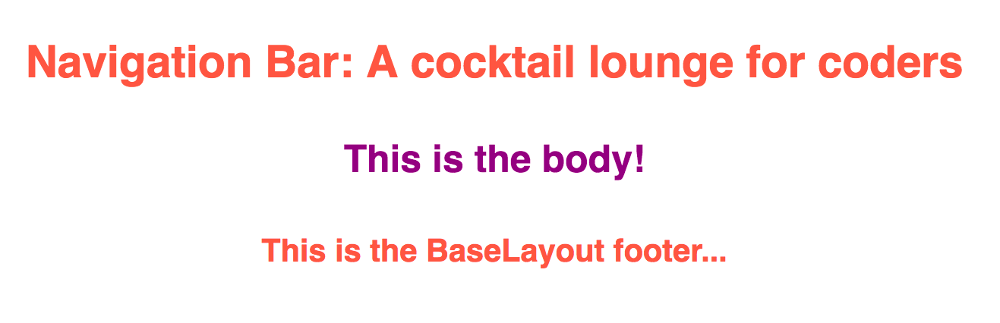

# Rendering Child Components in React  

Inheritance in React can be a tricky thing. Some components may not even be aware of the children components they will have later on. How do we tackle this problem? Let's take a look.

Consider a component that consists of our navigation bar and our footer that we would like rendered on almost every page.

```javascript
class BaseLayout extends Component {
  constructor(props) {
    super(props);
  }
  render() {
    return(
      <div>
        <nav>some stuff here</nav>

        <footer>some more stuff here</footer>
      </div>
    );
  }
}
```

This is a very simplistic view, but let's think about what's going on here. We've got a main `div` that holds both our `nav` and `footer` elements (which most certainly could be components on their own as well).

What if, at the same time, in our main `App.js` file we had something that looked like this?

```javascript
class App extends Component {
  render(){
    return (
      <BaseLayout>

      </BaseLayout>
    )
  }
}
```

How would `<BaseLayout></BaseLayout>` be able to render any other components that needed to go between (inside of) the navigation and footer elements? The majority of our content is likely to live there, but how?

### Use `props.children` 

`{this.props.children}` is used to pass components or *elements* into a parent component component. A parent component doesn't have any inherent awareness of nested components.

`{this.props.children}` allows for a component to render things passed into it, and doesn't require that the component even reside inside of the same script sheet.

Let's take a look at how this works and what it means. First, let's pretend that our `<BaseLayout />` component lives in a file called `baselayout.js`.

```javascript
// baselayout.js

import React, {Component} from 'react';

export default class BaseLayout extends Component {
  constructor(props) {
    super(props);
  }
  render(){
    return (
      <div className="base">
        <nav className="navbar">
          <h3>Navigation Bar: A cocktail lounge for coders</h3>
        </nav>

        {this.props.children}

        <footer>
          <h3>This is the BaseLayout footer</h3>
        </footer>
      </div>
    );
  }
}
```

Here is what we have for our `<BaseLayout>` component. A few things to take note of:

* We again are reminded that only one container (`<div className="base"> </div>`) may be returned in a component.

* We see in the portion that would equate to the "body" of the page that we use brackets {} and pass in `{this.props.children}`. We use the `constructor()` and `super()` functions in order to receive access to the `props` and the `this` object.

* Another reminder, We could have written this component as a function:

```javascript
function BaseLayout(props) {
  return (
    <div className="base">
      <nav className="navbar">
        <h3>Navigation Bar: A cocktail lounge for coders</h3>
      </nav>

      {this.props.children}

      <footer>
        <h3>This is the BaseLayout footer</h3>
      </footer>
    </div>
  );
}
```

> If we did write this as a function, we no longer are required to use `this` in front of `props.children`

Let's also take a look what is going on in our `App.js` file.

```javascript
// App.js

import React, { Component } from 'react';
import logo from './logo.svg';
import './App.css';

//import components
import BaseLayout from './Components/baselayout';

export default class App extends Component {
  constructor(props){
    super(props);
  }
  render() {
    return (
      <BaseLayout>
        <div className="main">
          <h4>This is the body!</h4>
        </div>
      </BaseLayout>
    )
  }
}
```

Inside of our `<App />` component, you can see we pass in `<BaseLayout>` from our import statement as a pair of tags (`<BaseLayout> </BaseLayout>`).

Inside of our `<BaseLayout>` tags we are able to pass elements or other components.

Our `baselayout.js` file tells the the `<BaseLayout>` component to expect children elements or components because of our `{this.props.children}` statement.

The output you would expect to see from this simple demonstration (plus very minor styling):



## Conclusion  

* We can render child components in React by using `{this.props.children}` or `{props.children}`, depending on if we are creating a `class` or `function`.

* `{this.props.children}` allows a component to receive other elements or components without really requiring the component to predict which or what will be rendered.

* We could use our `<BaseLayout>` tags in multiple pages and be able to render relevant material to each page because we are passing the `{this.props.children}` to the portion of the component we wish those children to be rendered in.

* This flexibility leads to more reusable code and the ability to keep our code DRY!

### References  

[React Components](https://facebook.github.io/react/docs/composition-vs-inheritance.html)

---

# Passing Data via Props to Child Components  

Let's examine how data is passed around between components. We've already been doing this in previous examples, but now we're going to go more in depth on *how* these processes work.

Each component should be responsible for a minimal number of elements and minimal functionality. Data management and distribution throughout a project should be handled by multiple components. We should have a lot of "presentational" (dumb) components that inherit their properties from "container" (smart) components. Each should be compartmentalized so that the code can be accessed and reused in the project multiple times if need be.

## The List App  

The following example will demonstrate passing props between components and the functionality we gain by doing so.

Let's envision an application that writes a list, maybe an attendance-list-maker for a teacher.

Before we even look at the code, let's think about some of the parts the application would need:

* It needs a way to enter a student's name with a button to submit that name to a list of students.

* It needs some visual representation of the list. We'll use a simple unordered list for this example.

* When a student's name is entered, it will be pushed into an array of students, and then the array will be passed down to the component that renders the list on our web page.

### The App Build  

Let's start with the name input form.

```javascript
export default class App extends Component {
  constructor(props){
    super(props);

    this.handleName = this.handleName.bind(this);
    this.handleSubmit = this.handleSubmit.bind(this);

    this.state = {
      students: [],
      name: "",
    };
  }
  handleName(e){
    this.setState({name: e.target.value});

  }
  handleSubmit(e) {
    e.preventDefault();
    this.state.students.push({studentName: this.state.name});
    this.setState({students: this.state.students, name: ""});

  }
  render() {
    return (
      <div className="class-maker">
        <h3>Create Your Class List Here: </h3>
        <form onSubmit={this.handleSubmit}>
          <input type="text" onChange={this.handleName} value={this.state.name}/>
          <input type="submit" value="Add Student" />
        </form>
        <StudentList students={this.state.students}/>
      </div>
    );
  }
}
```

There's a lot going on, so let's break this into bite size chunks and tackle them one at a time.

Lets start with the `render()` method on our `<App />` component.

```javascript
render() {
  return (
    <div className="class-maker">
      <h3>Create Your Class List Here: </h3>
      <form onSubmit={this.handleSubmit}>
        <input type="text" onChange={this.handleName} value={this.state.name}/>
        <input type="submit" value="Add Student" />
      </form>
      <StudentList students={this.state.students}/>
    </div>
  );
 }
}
```

Let's note of a few details:

* We have a `<form>` that contains a text `<input />` and a `<input type="submit" />` that functions as our submit button.

* On our form we have a `onSubmit` property and have given it a value of `{this.handleSubmit}`. We'll go more into this later. For now, just take note that this is happening.

* On our `<input type="text" />` we have an `onChange=` property that has a value of `{this.handleName}` and we've given the input itself a value of `value={this.state.name}`.

* We need that value from the input, because that is how we will grab the name that the teacher types into the input.

Now let's look at the methods we called on our `<App />` component. We've already defined where these methods will be used, now let's define what they do.

```javascript
export default class App extends Component {
  constructor(props){
    super(props);

    this.handleName = this.handleName.bind(this);
    this.handleSubmit = this.handleSubmit.bind(this);

    this.state = {
      students: [],
      name: " ",
    };
  }
  handleName(e){
    this.setState({name: e.target.value});
  }
  handleSubmit(e) {
    e.preventDefault();
    this.state.students.push({studentName: this.state.name});
    this.setState({students: this.state.students, name: " "});
  }
}
```

Some takeaways from this portion of our `<App />` component:

* We have a `constructor(props)` with `super(props)` called inside of it. This should be familiar as all components created as a `class` should have a base constructor that receives props.

* We provide reference to `this` (the component) with each of the handler methods: `this.handleName = this.handleName.bind(this);` and `this.handleSubmit = this.handleSubmit.bind(this);`.

The initial state is being set within the constructor:

```javascript
this.state = {
  students: [],
  name: " ",
};
```

That lets the component know which properties change in order to keep track of them. In this case, we want it to track an empty array called `students` and a string called `name` that is initially empty.

Next, let's look at our methods `handleSubmit` and `handleName`.

```javascript
handleName(e){
  this.setState({name: e.target.value});
}
handleSubmit(e) {
  e.preventDefault();
  this.state.students.push({studentName: this.state.name});
  this.setState({students: this.state.students, name: " "});
}
```

* Inside of `handleName` we pass an argument `e` that is our `event` object. The `onChange` property listens for changes to the value of the `<input />` and fires each time a key stroke is registered.

* We then take the `e.target.value` which gives us the value correlated to our input and store it in the `state` of `name`; `this.setState({name: e.target.value});`.

* This updates our `state` which can be retrieved throughout our component at any time.

* `handleSubmit` is also provided with an `event` object using the shorthand `e`.

* This allows us to call the `e.preventDefault()` method which prevents the form from trying to POST to the server.

* Next, we grab the current `state` value of our `name` and `push` that value into our `students` array:

```javascript
this.state.students.push({studentName: this.state.name});
```

We pass the array an object with the property `studentName` and the value `this.state.name`. This ensures that each time we hit submit, a new name will be added to our array.

After that, we update the `state` using `setState` to make sure our component is re-rendered.

```javascript
this.setState({students: this.state.students, name: ""});
```

* We also update the value of `state.name` back to an empty string. This clears our input box since its value is the value of `this.state.name`.

The `<App />` component is concerned with handling and updating the `state` of the student list. Now let's check out how we get that list to render on our application.

## Pass the Props  

Inside of our `return` statement:

```javascript
return (
  <div className="class-maker">
    <h3>Create Your Class List Here: </h3>
    <form onSubmit={this.handleSubmit}>
      <input type="text" onChange={this.handleName} value={this.state.name}/>
      <input type="submit" value="Add Student" />
    </form>
    <StudentList students={this.state.students}/>
  </div>
);
```

We placed our `<StudentList />` component. This component was given a property `students` and passed the value of `this.state.students`. This gives access to the state properties to `<StudentList />` component in the form of `props`. Now let's peek inside of our `<StudentList />` component and see how it works:

```javascript
class StudentList extends Component {
  constructor(props){
    super(props);

  }
  render(){
    let kids = this.props.students.map((student, index) => {
      return (
        <li key={index}>{student.studentName}</li>
      )
    })
    return(
      <div>
        <h4>My Class:</h4>
        <ul>
          {kids}
        </ul>
      </div>
    );
  }
}
```

What to note:

* Make sure to pass the `constructor()` and `super()` with `props` to the component.

* Inside of our render method, we declare a variable using the ES2015 `let` syntax: `let kids =`.

* We set the value of that to :

```javascript
this.props.students.map((student, index) => {
  return (
    <li key={index}>{student.studentName}</li>
  )
})
```

* We `map` over `this.props.students` (which was passed down from the `<App />` components in the form of `this.state.students`).

* We extract each student from that array and return an index and student as a list item: `<li key={index}>{student.studentName}</li>`.

* `student.studentName` references the `studentName` property of each `student` object in the `students` array.

* Each mapped item needs a unique `key`, so we use the `index` of each object being mapped over for simplicity sake. `key={index}`.

* We then insert the newly created array of list items (`kids`) using bracket notation with `{kids}`

And that's it! We have successfully taken data from a parent component and shared it down to a child component using `props`.

## Conclusion  

* `props` allow for the transfer of data, while protecting the `state` and management of `state` in the parent component.

* We looked at setting the `state` (`this.setState({})`), and how we can keep track of data within a component by using `state`.

* We looked briefly at binding `this` to the component's methods (`this.handleSubmit = this.handleSubmit.bind(this)`) which gave us access to `this` for the component.

* We examined how `e.target.value` (or `event.target.value`) can be used to get value from inputs. The input values can then be stored in the state for later use.

* We used the `event.preventDefault()` method to stop our form from trying to post to a server.

### References  

[React Docs](https://facebook.github.io/react/docs/state-and-lifecycle.html)

---

# Binding Functions in React  

It's important to remember that functions are special objects. Just as functions are passed around like objects, they can also be bound to the component and passed down as properties. When we made our form we wrote an event handler and bound it to the component.

## Explaining `this`  

In Javascript `this` functions differently based on the scenario it's used in. In a constructor, you use the `new` keyword to create a new object. In this case, `this` always refers to the new object being constructed. We've also talked about the reasons to use strict mode, as otherwise `this` gets set to the global object `window`. When a function is defined as a property of an object, it's called a method. In those cases, you can use `this` to bind properties to their parent component. The confusion arises because unlike regular variables, the `this` keyword does not have a scope, meaning nested functions do not inherit the `this` value of their parent function automatically. When you invoke a method inside of another function or component, the `this` value for the method is set to the object it was invoked upon, not the object it was invoked inside of.

We've dealt with this previously when creating event handlers. We added a line of code in the constructor function to bind the `this` in the event handler to the `this` of the parent component.

Let's look at an example similar to the one you've seen before:

```javascript
export default class List extends Component {
  constructor(props){
    super(props);

    this.handleTopping = this.handleTopping.bind(this);
    this.handleSubmit = this.handleSubmit.bind(this);

    this.state = {
      pizza: [],
      topping: "",
    };
  }
  handleTopping(e){
    this.setState({topping: e.target.value});
  }
  handleSubmit(e) {
    e.preventDefault();
    this.state.pizza.push({pizzaTopping: this.state.name});
    this.setState({pizza: this.state.pizza, topping: ""});
  }
  render() {
    return (
      <div className="pizza-maker">
        <h3>Favorite Pizza Toppings List: </h3>
        <form onSubmit={this.handleSubmit}>
          <input type="text" onChange={this.handleTopping} value={this.state.topping}/>
          <input type="submit" value="Add Topping" />
        </form>
        <ToppingsList pizza={this.state.pizza}/>
      </div>
    );
  }
}
```

In the above example, we're allowing the user to input their favorite toppings for pizza. We created an event handler to handle the user input of toppings called `handleTopping`. We invoked that handler on `this` inside the `render` method using the `onChange` function. We want the `this` context to come from the top level component. This is important because we want that handler (method) to have access to the properties, state and methods of the component. To ensure `this` is bound to the correct context, we explicitly write a line of code in the constructor method to bind our event handler to the `this` of the component: `this.handleTopping = this.handleTopping.bind(this);`.

## More Than One Solution  

The above code is the recommended way to bind functions to a component, however there are some other options that will work. Let's take a look at a few other solutions:

```javascript
<input type="text" onChange={this.handleTopping.bind(this)} value={this.state.topping}/>
```

Or we could use an arrow function:

```javascript
onChange={e => this.handleTopping(e)}
```

The issue with the solutions above is that you may run into performance issues since the function is reallocated on every render. This makes both solutions sub-optimal.

While the first solution is recommended in the React docs, there is a new technique surfacing that makes for cleaner code. This solution involves using class properties and the arrow function.

```javascript
handleTopping = (e) => {
  this.setState({topping: e.target.value})
}
```

By writing the code this way, we're taking a method and turning it into an expression. And by using the arrow function syntax we're gaining access to the `this` property of the component, saving us from needing to use the bind method. While this method is available in ES6 (ECMAScript 2015), it's experimental and may be removed in later iterations. **Please use with caution as it may be removed at a later date.**

## Conclusion  

`this` is not always what we think it is. Especially when invoking a function inside a method. In order to make sure `this` is bound to the right context in React components, we explicitly bind it in the constructor method. There's more than one solution to this problem, but binding in the constructor method is the recommended solution.

### References  

[Todd Motto](https://toddmotto.com/understanding-the-this-keyword-in-javascript/)
[GitHub Gist](https://gist.github.com/amitai10/adb66d6faa714e8c3cdb94946bb98356)

---

# Pass the Function  

We've looked at passing `props` from a parent component down to it's children components, but we haven't explored all of the different things that can be passed down as `props`. Not only can we pass data along from `state` but we can also pass along functions. We can even pass along functions that are executed on the parent component but fired from the child component.

## A Colorful Example  

React works by constantly checking the `state` against changes in the DOM. Let's create an app that changes the color of the background when we click a button. We will do so by passing down a function via `props` and firing from the child component but executing it on the parent component.

The first step is the parent component:

```jsx
//An array of colors for us to randomly sort through and apply to the background color
let colors = ["blue", "green", "red", "yellow", "orange", "purple", "pink", "tomato"];

export default class App extends Component {
  constructor(props){
    super(props);
    this.state = {
      color: ""
    }
    this.changeColor = this.changeColor.bind(this);
  }
  changeColor() {
    let num = Math.floor(Math.random()* colors.length);
    this.setState({color: colors[num]});
  }
  render(){
    return (
      <div className="main" style={{backgroundColor: this.state.color ? this.state.color : "red"}}>
        <h1>Color The Wind</h1>
        <ColorMaker changeColor={this.changeColor} />
      </div>
    );
  }
}

```

First we create an array, `colors`, that we could randomly pull from and apply that color to the background color of the desired `<div>`.

Next, we applied our base `constructor` with `super`, and both received `props`.

We then created a method `changeColor`:

```jsx
changeColor() {
  let num = Math.floor(Math.random()* colors.length);
  this.setState({color: colors[num]});
}
```

What we're doing is creating a variable `num` which will be a number between `0` and the length of our `colors` array. This means if we add colors or remove colors we will still be randomly picking from the entire array.

Inside of our `render` method we provided minimal elements to return, including the `<ColorMaker />` component.

In the `<ColorMaker />` component we pass an `changeColor` property with a value of `this.changeColor` (referencing our `changeColor` method in the `<App />` component).

```jsx
<ColorMaker changeColor={this.changeColor} />
```

With those simple steps we are set up to pass the functions down to `<ColorMaker />`

### Children with Prop Functions  

As we saw above, we were able to pass a function as a property attribute to a child component. Let's now take a look at the way we handle that function inside the child component.

```jsx
class ColorMaker extends Component {
  constructor(props) {
    super(props);
  }
  render() {
    return (
      <div className="color-change-div">
        <button onClick={this.props.changeColor}>Change Color</button>
      </div>
    )
  }
}
```

Inside of our `<ColorMaker />` component, we see `constructor` and `super`.

On our `<button>` we give it an `onClick` attribute and set its value to `{this.props.changeColor}`. The `props.changeColor` method that we are referring to is the `changeColor` method from the parent component.

[Here it is in action.](https://screencast-o-matic.com/watch/cbhZIsXkxP)

## Conclusion  

* Passing a function via `props` works exactly the same way the passing any other data via `props` would work.

* The child component can actually call and fire the function on the parent component.

* Using this method allows state to reside in the parent component and not be spread into more components than necessary.

### References  

[React Docs](https://facebook.github.io/react/docs/state-and-lifecycle.html)
