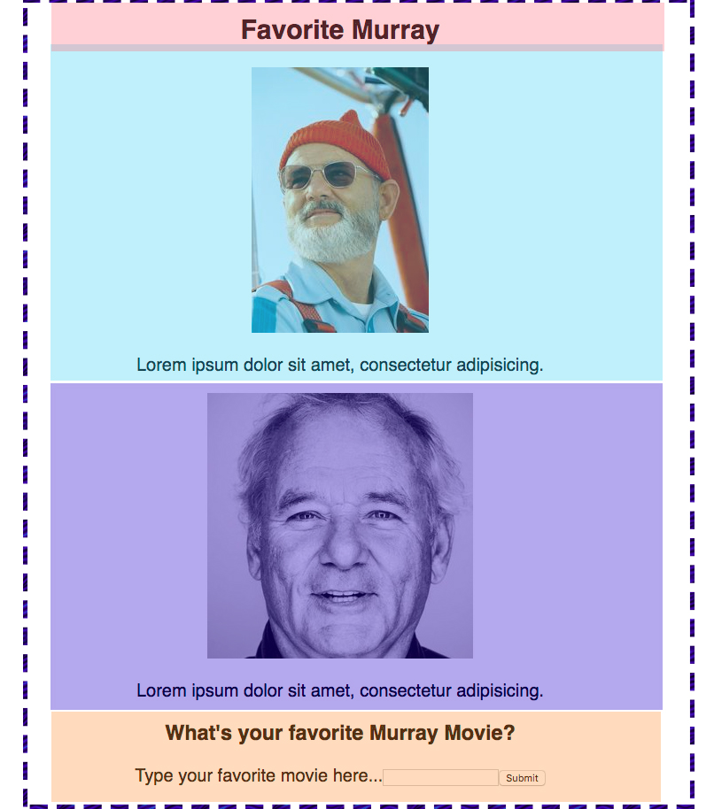
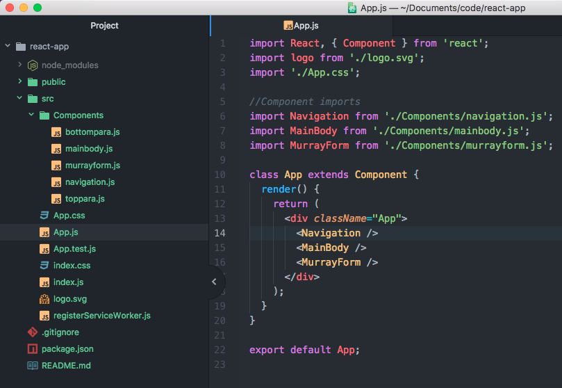
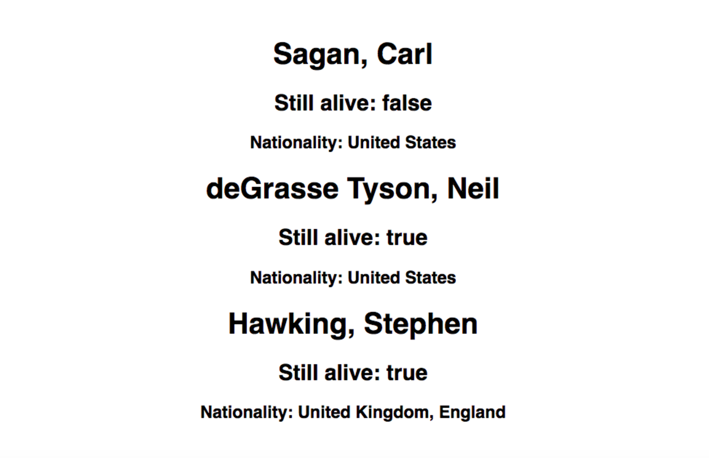

# Getting Started with React  

Getting started creating a React application is not too difficult when using the **Create React App** library available 
as a package on npm. We'll take a look at how install **Create React App** and generate an application. We will also take a 
look at a new language, *JSX*, which is used by most React applications to write markup.

## Create React App  

**Create React App** is a library that helps us build React projects. It contains all of the tools that will take our 
React application and translate it into something the browser can understand. It also provides us with a development 
server (A local server that hosts a web application in development on a set port and watches for changes made to the 
code base, refreshing in the browser.). All of the libraries we need to make an application in React will be included.

### Libraries included  

* **Create React App** includes Webpack for module bundling. 1Webpack takes modules with dependencies and emits static assets 
representing those modules.

* 2Babel is the library that **Create React App** includes to compile ES2015 and later JavaScript into a browser-ready version of JavaScript.

* 3Autoprefixer is included to parse CSS and add vendor prefixes to rules.

* 4ESLint is included as a JavaScript linting utility.

* 5Jest is included as a JavaScript testing solution.

### Installing  

If you've chosen this course to become a React developer, this will be the beginning of many projects. There are tons 
of ways to create React applications and install of the needed dependencies. Let's look at a simple way using 
**Create React App**. We'll install it "globally" so that we need not install it every time we want to make a new React app.

The first step is to open up our terminal. It will not matter the directory we are in since we will be installing 
globally. On your command line, enter the following code:

```
npm install -g create-react-app
```

It will take a few seconds to download all the tools. Once the download is done we're ready to start React.

### Generating  

Now that we've installed **Create React App** let's put it to use.

* The first step, **make sure you are now in your directory where you keep all of your projects**.

* There is no need to create a project folder, **Create React App** will do that for you, which is why we want to double 
check that we are in the directory that we want to create a project folder inside of.

* Once we are sure that we are in the right place, we can use the following command to initiate and create a React application.

```
create-react-app the-name-of-my-application-here
```

*Just to clarify, after we type* *Create React App*, *we provide a space, and the name of the folder that we wish our application to be created inside of*.

* After this builds, we must actually open our project folder. We do so with the following code:

```
cd the-name-of-my-application-here
```

* Once inside, we can open our project using our code editor, if using Atom, the following command will open our application. (Be sure you are inside of your project folder)

```
atom .
```

Once Atom is launched, you'll see the layout of what was installed in your project folder. It should look something like this:

```
my-app/
  README.md
  node_modules/
  package.json
  .gitignore
  public/
    favicon.ico
    index.html
  src/
    App.css
    App.js
    App.test.js
    index.css
    index.js
    logo.svg
```

> It is important to note that when the `create-react-app` command runs, the name given to the folder is also used as the `name` property for your project in the newly created `package.json`.

### Development Server  

We can now also open up our development server. The development server will track changes as we create our application. Each time we save our application the development server will automatically update in the browser and show us our changes.

To get the development server up and running we need to type the following command in the project folder:

```
npm start
```

* The above command should open up a browser window with your project ready to go and watching for changes. If it doesn't 
open automatically, however, you can enter the following address in your browser "http://localhost:3000". We're now ready 
to start building our React app.

### Monitoring Changes  

React creates something called the "Virtual DOM". The Virtual DOM is a lightweight version of the DOM detached from the browser-specific implementation details. React works by constantly comparing the Virtual DOM to the actual DOM of our application. When React sees a change it automatically re-renders the application for us. Data being received, data being given by a user, interface animations, all of these change the DOM. React listens and renders the application accordingly.

## Translating HTML into JSX  

Most common practice is to create an HTML page with one `<div id="root"></div>` inside the body of the HTML document. This `<div>` is the source for the entire application. That's really all of the HTML you are going to need to write. The rest of our project is going to be made up of components and JavaScript. The components are written in the language of JSX, which is XML syntax combined with JavaScript. It should be noted that you can use vanilla JavaScript to create components, but JSX makes the project much more streamlined, elegant and prevents us from directly incorporating vanilla HTML into our JavaScript files.

### Demo App  

Let's create a simple app to get started exploring React. We'll focus on the translation of HTML into JavaScript and how we tackle getting started with our **Create React App** format. Let's first look at boilerplate HTML below. This code is the beginnings of an application that allows you to input your favorite Bill Murray movie and displays something about it depending on what the input was.

```html
<body>
  <nav class="navbar">
    <h1 class="title">Favorite Murray</h1>
  </nav>
  <main class="main-body">
    <div class="top">
      <div class="image-one">
        
      </div>
      <p class="top-paragraph">
        Lorem ipsum dolor sit amet, consectetur adipisicing.
      </p>
    </div>
    <div class="bottom">
      <div class="image-two">
        
      </div>
      <p class="bottom-paragraph">
        Lorem ipsum dolor sit amet, consectetur adipisicing.
      </p>
    </div>
  </main>
  <div class="murrayinator">
    <h3>What's your favorite Murray Movie?</h3>
    <form class="murray-form" action="" method="">
      <label for="murray-movie">Type your favorite movie here.</label>
      <input type="text" id="murray-movie">
      <button>Submit</button>
    </form>
  </div>
  <div class="answer">
    <h4 class="murray-display"></h4>
  </div>
  <script src="js/bundle.js"></script>
</body>
```

## Setup and Writing JSX  

The three documents we'll focus on in our app are:

1. public/index.html

2. src/index.js

3. src/App.js

### public/index.html  

The only concern for us with HTML moving forward is the `<div></div>` in which our application will be inserted. **Create React App** has already provided us with HTML to get started and given us the following `<div>`:

```html
<div id="root"></div>
```

That's all we need to know about this page. We won't write anything else in this document, but just know this is where React will yield our application.

### src/index.js  

This is our main JavaScript file. Inside of this file you'll see very little written already by our **Create React App** setup. We won't touch this file any further, but let's examine what's going on inside below.

```jsx
import React from 'react';
import ReactDOM from 'react-dom';
import App from './App';
import registerServiceWorker from './registerServiceWorker';
import './index.css';

ReactDOM.render(<App />, document.getElementById('root'));
registerServiceWorker();
```

Let's take a look at a few of the `import` statements at the top of this file. The first line imports React into our project. All React projects will begin with this import. The second line imports ReactDOM. ReactDOM is the glue that holds our React project and the DOM together. We use the ReactDOM to render our application and tell it where to insert itself into the DOM.

In our ReactDOM statement above you can see that we call:

```
ReactDOM.render(<App />, document.getElementById('root'));
```

This line of code states that we want to use our `<App />` and insert it into the HTML page at the element with an ID of `root`. We've already looked at our HTML and saw the `<div id="root">` tag in the body. ReactDOM will render the `<App />` 
tag inside of the `<div id="root">`.

The 3rd line contains the importing of our app from the `src/App.js` file. This allows us to call our app inside the `index.js` and render it using ReactDOM.

### src/App.js  

The final piece of the puzzle is the `App.js` file. The `App.js` file has already been setup to get us started. Let's take a look at what's included below.

```jsx
import React, { Component } from 'react';
import logo from './logo.svg';
import './App.css';

class App extends Component {
  render() {
    return (
      <div className="App">
        <div className="App-header">
          
          <h2>Welcome to React</h2>
        </div>
        <p className="App-intro">
          To get started, edit <code>src/App.js</code> and save to reload.
        </p>
      </div>
    );
  }
}

export default App;
```

We're already familiar with classes and extending, as well as importing, so none of this should be too confusing. Let's break it down below so we can get started.

At the top, we import React, and the Component library from React in the first statement `import React, { Component } from 'react';`. We also import a logo and our style sheet, which we won't be covering in this lesson. The `App` class extends (inherits) from the React.Component library. We'll call a render method on that component, and return our first JSX.

* In a return statement a component can only render one div or piece of JSX. Everything must be contained within that div. Let's take a look below.

```jsx
return (
  <div></div>
  <div></div>
)
```

**The above code is invalid** because everything needs to be in one container. For what we're after, we can go ahead and delete everything so we're left with the following:

```jsx
import React, { Component } from 'react';
import logo from './logo.svg';
import './App.css';

class App extends Component {
  render() {
    return (
      <div className="App">

      </div>
    );
  }
}

export default App;
```

Since we are writing in JavaScript (JSX), reserved words such as class can not be used. If we want to give a `class` name to our JSX tags, they must be camelCased into `className`. In general, any HTML attributes will be camelCased in JSX. The HTML `for` attribute is also a reserved word in JavaScript, so it becomes `htmlFor`.

All single line tags such as `` and `<input >` must become self-closing tags in JSX. In JSX all tags must have a closing tag or be self-closing. The two examples above would now be written as `` and `<input />`. If you think back to our `index.js` file, you would notice that our `<App />` tag was self-closing too.

Let's see our app in JSX below.

```javascript
class App extends Component {
  render() {
    return (
      <div className="App">
        <nav className="navbar">
          <h1 className="title">Favorite Murray</h1>
        </nav>
        <main className="main-body">
          <div className="top">
            <div className="image-one">
              
            </div>
            <p className="top-paragraph">
              Lorem ipsum dolor sit amet, consectetur adipisicing.
            </p>
          </div>
          <div className="bottom">
            <div className="image-two">
              
            </div>
            <p className="bottom-paragraph">
              Lorem ipsum dolor sit amet, consectetur adipisicing.
            </p>
          </div>
        </main>
        <div className="murrayinator">
          <h3>What is your favorite Murray Movie?</h3>
          <form className="murray-form" action="" method="">
            <label htmlFor="murray-movie">Type your favorite movie here...</label>
            <input type="text" id="murray-movie" />
            <button>Submit</button>
          </form>
        </div>
        <div className="answer">
          <h4 className="murray-display"></h4>
        </div>
      </div>
    );
  }
}

export default App;
```

By exporting our `App` and then importing into our `index.js`, we can see the power of React in a Single Page Application. This lesson barely scratches the surface of what React has to offer, but hopefully, it demonstrates how easy it is to get started.

## Conclusion  

* **Create React App** is installed with the `npm install -g create-react-app` command.

* To get a project started simply use the `create-react-app my-app-folder-name` command.

* After naming the folder, use the `cd my-app-folder-name` command to change into that directory.

* Use `npm start` to spin up your development server and watch for changes to your application.

* React most commonly uses JSX language to take the place of HTML.

* All React components will be rendered in a singular `<div>` on your `index.html` page.

* JSX requires camelCasing and special words to take place for reserved words such as "`class`" and "`for`" in JavaScript.

### References  

[React Docs](https://facebook.github.io/react/docs/hello-world.html)

[Create React App Docs](https://github.com/facebookincubator/create-react-app)  

#### Lesson Footnotes

* 1: [Webpack](https://webpack.github.io/)

* 2: [Babel](https://babeljs.io/)

* 3: [Autoprefixer](https://github.com/postcss/autoprefixer)

* 4: [ESLint](https://eslint.org/)

* 5: [Jest](http://facebook.github.io/jest/)

---

# Nesting Components  

We grazed the tip of the iceberg in our introduction to React. We glossed over some huge chunks of information that really give React the power to do what it does. One of the big things that we barely touched on in our intro was Components in React. Let's think back to our Favorite Murray application... instead of writing HTML to display our website, we used JSX in a file called App.js. We exported something called the "App" which was a Component from React and then imported that file into our index.js and then rendered it inside of a `<div id="root">` tag on our HTML page. Well, that component concept is pretty huge in React, and the basis for the way we will organize our code and our applications when developing. Another big take-away is that components can be nested to increase the organization of our application. Let's take a deeper look...

## Components  

A component is a chunk of code that is responsible for rendering a specific portion of the UI (user interface). They function a lot like, well, JavaScript functions. They can accept inputs (called "props") and return elements describing what should appear on the screen.

In our App, we had just one component. In an ideal application, components are responsible for independent pieces of code and are often reusable when applicable.

Components can actually be defined as a function :

```jsx
function Welcome(props) {
  return (
    <h1>Hello, {props.name}</h1>
  );
}
```

The use of `{ }` allows for pure JavaScript to be inserted into the JSX, and in this case assumes that somewhere data with a name property is being passed along.

We can also write Components using the new ES2015 classes, that same function above would now be written as the following :

```jsx
class Welcome extends Component {
  render() {
    return (
      <h1>Hello, {this.props.name}</h1>
    );
  }
}
```

These two examples are the same essentially, but ES2015 classes give us a bit more functionality that we will visit later.

## Nesting Components - A look at Component hierarchy  

We've touched on the fact that our components should really be accountable for unique pieces of the application, but what does that mean?

The first step of building React applications requires looking at the big picture, a wireframe or something along those lines. Let's take a look at the Favorite Murray website again - we are looking only at the most simplistic of ideas to make sure the complicated concept of nesting will hatch some understanding.

```jsx
class App extends Component {
  render() {
    return (
      <div className="App">
        <nav className="navbar">
          <h1 className="title">Favorite Murray</h1>
        </nav>
        <main className="main-body">
          <div className="top">
            <div className="image-one">
              
            </div>
            <p className="top-paragraph">
              Lorem ipsum dolor sit amet, consectetur adipisicing.
            </p>
          </div>
          <div className="bottom">
            <div className="image-two">
              
            </div>
            <p className="bottom-paragraph">
              Lorem ipsum dolor sit amet, consectetur adipisicing.
            </p>
          </div>
        </main>
        <div className="murrayinator">
          <h3>"What's your favorite Murray Movie?"</h3>
          <form className="murray-form" action="" method="">
            <label htmlFor="murray-movie">Type your favorite movie here...</label>
            <input type="text" id="murray-movie" />
            <button>Submit</button>
          </form>
        </div>
        <div className="answer">
          <h4 className="murray-display"></h4>
        </div>
      </div>
    );
  }
}

export default App;
```

The way to think about Components is to divide your application into pieces - each of which should be responsible for a certain portion of the app and independent of the others. There also will be one main component that will be responsible for all of the other components.

Let's take a look at what would be rendered on the screen from our code above, and then break it in to separate pieces using colored boxes, and a dashed outer line to represent the entire main app component.



* In pink we have highlighted our very simple navigation bar.

* In light blue we highlighted our top `<div>`.

* In purple we highlighted our bottom `<div>`.

* And in orange we highlighted our `<div>` containing our form.

* Around the outside of all it, we have our dashed line. As our application stands right now, we currently are just using that dashed box to render our entire document with the `<App />` component.

So Let's see how we can break these into individual pieces. Let's first create our navigation `<div>`.

### The Nav  

If we want to create a component for our navigation we need to pull it out of the current App div.

Just above the App class, we can create a new class for our navigation.

```jsx
class Navigation extends Component {
  render() {
    return (
      <nav className="navbar">
        <h1 className="title">Favorite Murray</h1>
      </nav>
    );
  }
}

```

Now back inside of our App component we can **nest** our Navigation component back in...

* Remember all components must return only one container and all tags must be self closing or have a closing tag.

**To save space, let's look at only the portion of code where we would reinsert the Navigation component back into the App**

```jsx
class App extends Component {
  render() {
    return (
      <div className="App">
        <Navigation /> //added the Navigation component.
        <main className="main-body">
          <div className="top">
            <div className="image-one">
//the rest of the component below...
```

We now have a nested component! The `<Navigation />` component is now nested within our `<App />` component. Super cool, right!?

### Completing the Nest  

Let's finish what we started and take a look at the entire nesting of our application using our picture from earlier. A few slight changes to our `<App />` component will be necessary in order to return all of our components in singular containers.

```jsx
class Navigation extends Component {
  render() {
    return (
      <nav className="navbar">
        <h1 className="title">Favorite Murray</h1>
      </nav>
    );
  }
}

class TopPara extends Component {
  render() {
    return (
      <div className="top">
        <div className="image-one">
          
        </div>
        <p className="top-paragraph">
          Lorem ipsum dolor sit amet, consectetur adipisicing.
        </p>
      </div>
    );
  }
}

class BottomPara extends Component {
  render() {
    return (
      <div className="bottom">
        <div className="image-two">
          
        </div>
        <p className="bottom-paragraph">
          Lorem ipsum dolor sit amet, consectetur adipisicing.
        </p>
      </div>
    );
  }
}

class MurrayForm extends Component {
  render() {
    return (
      <div className="murrayinator">
        <h3>"What's your favorite Murray Movie?"</h3>
        <form className="murray-form" action="" method="">
          <label htmlFor="murray-movie">Type your favorite movie here...</label>
          <input type="text" id="murray-movie" />
          <button>Submit</button>
        </form>
        <div className="answer">
          <h4 className="murray-display"></h4>
        </div>
      </div>
    );
  }
}

class MainBody extends Component {
  render() {
    return (
      <div className="main-body">
        <TopPara />
        <BottomPara />
      </div>
    );
  }
}

class App extends Component {
  render() {
    return (
      <div className="App">
        <Navigation />
        <MainBody />
        <MurrayForm />
      </div>
    );
  }
}

export default App;
```

So how did we nest it?

* We created a `<Navigation />` Component

* We created a `<MainBody />` Component

* We created `<TopPara />` and `<BottomPara />` Components, and we then nested them inside of the `<MainBody />` Component.

* We created a `<MurrayForm />` Component

* Inside of our `<App />` Component, we then nested the above components where they were when completed as one whole component previously.

* It's a good idea to break out each component one at a time and plug them back in when looking at nesting components (like we first tackled the Navigation component). Just go down through your components and write each piece as it's own component one at a time.

### Nesting from different files.  

You can hopefully begin to see how we could pull each of these components out of the App.js file and give them their own component files, such as a navigation.js. Let's take a second to see how that may look.

* Inside of our `src` directory, let's create a folder called `Components`.

* We could then create a separate page for each of our components that we created.

* We would then import each file back into the "App.js" file.

* Let's look at how that would be completed for the Navigation Component.

```jsx
//############### navigation.js ####################
// Our newly created src/Components/navigation.js
// would look like this...
import React, { Component } from 'react';

export default class Navigation extends Component {
  render() {
    return (
      <nav className="navbar">
        <h1 className="title">Favorite Murray</h1>
      </nav>
    );
  }
}
// We used import to bring in React and React.Component
// We used export default to export our Navigation Component

//################## App.js ######################
import React, { Component } from 'react';
import logo from './logo.svg';
import './App.css';

//Component imports
import Navigation from './Components/navigation.js';

class App extends Component {
  render() {
    return (
      <div className="App">
        <Navigation />
//the rest of our components would still be listed below...
```

If we wanted to take this to maximum organization we would separate out each component from the main `<App />` Component file. (A couple important things to note... The `<MainBody />` Component would require importing the `<TopPara />` and `<BottomPara />` components ).

Let's take a look inside of the `<MainBody />` file to see how we handled the `<TopPara />` and `<BottomPara />` components.

```jsx
//############### mainbody.js ###############
import React, { Component } from 'react';

//importing Components
import TopPara from './toppara.js'
import BottomPara from './bottompara.js'

export default class MainBody extends Component {
  render() {
    return (
      <div className="main-body">
        <TopPara />
        <BottomPara />
      </div>
    );
  }
}
```

You can see that we imported the `<TopPara />` and `<BottomPara />` components inside of our `<MainBody />` Component, since they were being rendered within that specific component. We then exported just the `<MainBody />` component and were are able to just import that file alone in our App.js file.

Now let's take a look at the overall file structure of our App from inside of our `<App />` component file : "App.js"



On the left you can see the file tree, with the Components folder containing all of our new component files. Inside of App.js you can see how we imported those components back into our App.js file.

How much cleaner does that look! Pretty amazing, right?

## Conclusion  

* Nesting components is an amazingly efficient way of organizing your code into smaller manageable pieces, that can also be reused throughout a program.

* Nested components can be put into their own files and imported and exported wherever necessary.

* Don't forget to import React and Components into each additional Component file. `import React, { Component } from 'react';`

* Don't forget to export your components from their individual files: `export default class MainBody extends Component {...`

* Components are essentially just like JavaScript functions!

### References  

* [React Docs](https://facebook.github.io/react/docs/components-and-props.html)
 
---

# Iteration in React  

A huge part of React stems from the way that it handles data and re-renders the page according to that data. React components can have components that render data and elements after iterating over that data. One of the more common ways you will see this is using arrays.

## Map It!  

Let's pretend we have a **very** simple application that we can examine this process on. This application takes in an array of objects, and renders each object into it's own `<div>` on our website.

Alright, so we have this cool array of famous astrophysicists...

```jsx
let famousAstroPhysicists = [
  {
    id: 1,
    firstName: "Carl",
    lastName: "Sagan",
    alive: "false",
    nationality: "United States",

  },
  {
    id: 2,
    firstName: "Neil",
    lastName: "deGrasse Tyson",
    alive: "true",
    nationality: "United States",
  },
  {
    id: 3,
    firstName: "Stephen",
    lastName: "Hawking",
    alive: "true",
    nationality: "United Kingdom, England",
  },

];
```

We will pass that array into our `<App />` component. Using the map function we can then render individual `<div>` tags for each of our objects in the array... So let's look at how this would look in the App.js file and then break down what happened.

```jsx
import React, { Component } from 'react';
import logo from './logo.svg';
import './App.css';

let famousAstroPhysicists = [
  {
    id: 1,
    firstName: "Carl",
    lastName: "Sagan",
    alive: "false",
    nationality: "United States",

  },
  {
    id: 2,
    firstName: "Neil",
    lastName: "deGrasse Tyson",
    alive: "true",
    nationality: "United States",
  },
  {
    id: 3,
    firstName: "Stephen",
    lastName: "Hawking",
    alive: "true",
    nationality: "United Kingdom, England",
  },

];


export default class App extends Component {
  render() {
    let famedPhysicists = famousAstroPhysicists.map((physicist) => {
      return (
        <div key={physicist.id} >
          <h1>{physicist.lastName + ", " + physicist.firstName}</h1>
          <h2>Still alive: {physicist.alive}</h2>
          <h3>Nationality: {physicist.nationality}</h3>
        </div>
      )
    });
    return (
      <div className="App">
        {famedPhysicists}
      </div>
    );
  }
}
```

* Inside of our App component, just after our render method, but before our return statement, we create a new variable `famedPhysicists` using the ES2015 `let` syntax (which takes place of the `var` keyword).

* `famedPhysicists` takes the array from the top of our page `famousAstroPhysicists` and maps over it, returning the `physicist` from each iteration of the function.

* We then jump into a return statement (for the map function) and we return a `<div>` with an **EXTREMELY** important attribute called `key`. In this example we assign `<div key=physicist.id>`.

* The `key` attribute is what allows our React application to keep track of each newly created element against the real DOM. It allows for proper re-rendering from cues in the virtual DOM. The `physicist.id` simply grabs the "id" attribute from each object that is mapped over, in this case, just "1, 2, and 3".

* After we create a new div, we continue using brackets anywhere we want to assign a JavaScript value. We create the last name, first name `<h1>` by using the `{physicist.lastName + ", " + physicist.firstName}`.

* We continue doing this for whatever data we would like to extract from each object and organize it however we please.

* In the return statement for `<App />` component we then simply use bracket notation `{}` and put our variable name (the mapped array `famedPhysicists`) - like so:

```jsx
return (
  <div className="App">
    {famedPhysicists}
  </div>
);
```

The resulting product is pretty amazing, React renders each scientist in it's own `<div>` on our page!



## Conclusion  

* React is able to `map` over arrays and render elements for each part of the array we wish to include.

* The `key` attribute is the means that React uses to keep track of each rendered element when mapping over an array.

* The `key` attribute is extremely import and React would not be able to monitor changes to the DOM properly without it.

* JavaScript is placed within `{}` when using JSX.

* The return statement from our map function can still only return one container.

* The variable in which the map function was stored can then be used to render inside of the return statement for the component. i.e. (`{famedPhysicists}`)
