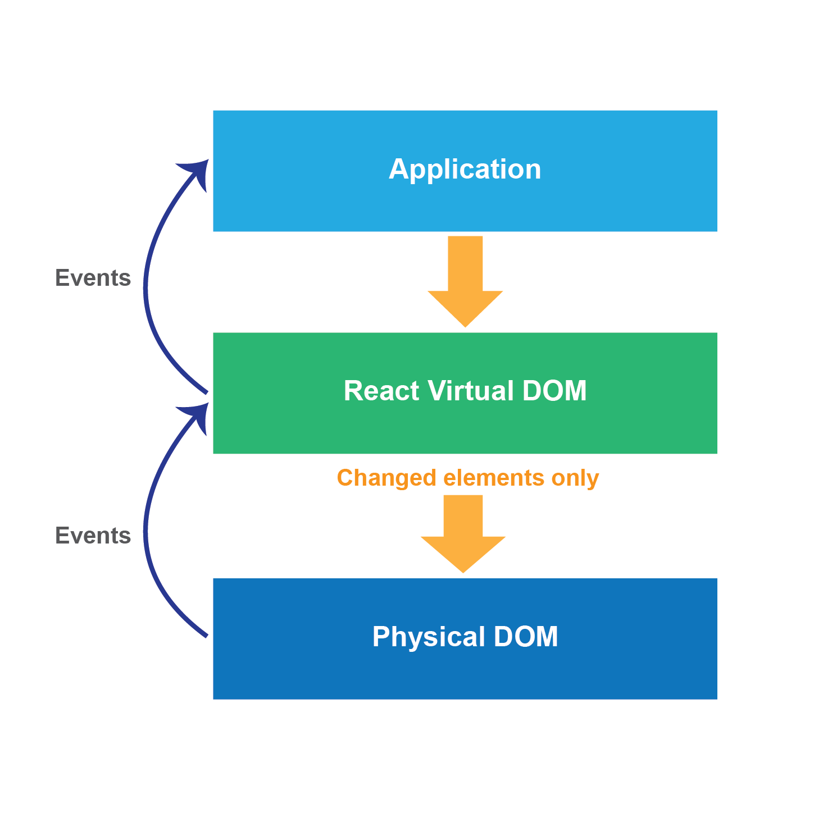
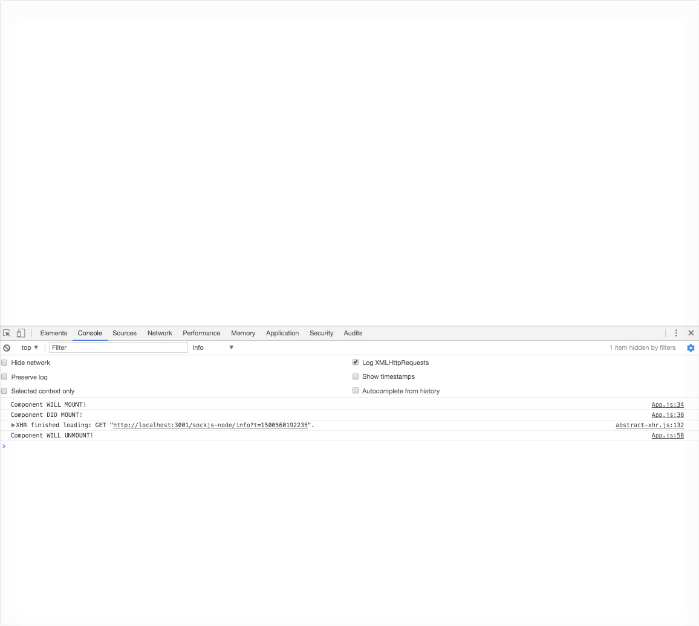
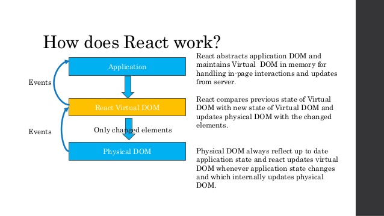

# Lifecycle of a React Component  

As you have been learning, in React you use **components** to organize everything that needs to be displayed. Most JavaScript view libraries and frameworks re-render the entirety of the application any time any state changes. This is similar to doing a full page refresh. React only re-renders the components necessary to the new state of the application.

Because components are constantly being re-rendered, there will be times when you want to do something before or after a component has rendered, or may want to avoid a re-render. This is where the component *lifecycle* comes into play. The **component lifecycle** describes the process of stages that every React component goes through. To understand these stages, you first to need understand the way React renders with a **virtual DOM**.

## React DOM  



React creates a **virtual DOM** by abstracting the **application DOM** and maintaining it in memory. React uses this Virtual DOM to handle in-page interactions and updates from the server. With that input, React then compares the *new state* of the Virtual DOM with the *previous state* of the Virtual DOM and updates the **physical DOM** with the changed elements. So the physical DOM always reflects the up-to-date application state.

## Component Lifecycle Methods  

In order to have more control over the stages the component is going through, React provides *methods* that denote when the different stages occur. These are called **component lifecycle methods** and proceed in a certain order. There are three major steps that the stages go through: mounting, updating and unmounting.

### Mounting  

Mounting is when the component is created (initialized) and then inserted into the DOM.

The following component lifecycle methods can be called in relation to component mounting.

* `constructor`

  * Called before the component is mounted. This is the place to initialize state and bind methods.
  
* `componentWillMount`

  * Invoked immediately before mounting occurs (before render).
  
  * **Use case**: App configuration in the root component.
  
  * **Should I call setState?**: Yes, but use default state, instead.

* `render`

  * The `render` method is required on a component, and it must return a *single React element* (either a native DOM component `<div />` or composite component you have defined). The `render` method should not modify the state.

* `componentDidMount`

  * Invoked immediately after a component is mounted.
  
  * **Use case**: Loading data, i.e., `fetch` or AJAX calls.

  * **Should I call setState?**: Yes.
  
### Updating  

A component is re-rendered because a props or state change occurs.

The following component lifecycle methods can be called when addressing changes.

* `componentWillReceiveProps`

  * Invoked before a mounted component receives new props. Use this method if you need to update the state in response to prop changes.
  
  * **Use case**: Triggering state transitions on prop changes.

  * **Should I call setState?**: Yes.
  
* `shouldComponentUpdate`

  * Invoked before rendering, when new props or state are being received. This method allows your component to exit the lifecycle and avoid unnecessary re-rendering. Useful when only a small amount of data has changed, if there is no update the component and all of its children will break from the lifecyle and the most recent virtual DOM from this component downward will persist.
  
  * **Use case**: Controlling when the component renders.

  * **Should I call setState?**: No.
  
* `componentWillUpdate`

  * Invoked immediately before rendering when new props or state are being received.
  
  * **Use case**: Used on a component that has `shouldComponentUpdate`. (use it instead of `componentWillUpdate`). Note: no access to previous props.

  * **Should I call setState?**: No.
  
* `render`

* `componentDidUpdate`

  * Invoked immediately after updating occurs.
  
  * **Use case**: Updating the DOM whenever state or props change.

  * **Should I call setState?**: Yes.
  
### Unmounting  

Unmounting is when a component is removed from the DOM.

The following method can be called in relation to component unmounting.

* `componentWillUnmount`

  * Invoked immediately before a component is unmounted and destroyed.
  
  * **Use case**: Removing a component after being used.

  * **Should I call setState?**: No.
  
### Other methods  

* `setState`

  * This is the primary method used to update the user interface in response to event handlers and server responses. `setState` causes the component and its children to be re-rendered. Note that changing state using `setState` is asynchronous, so it does not always immediately update the component.
  
* `forceUpdate`

  * Will cause the component to re-render. Use if your `render` method depends on other data and you want to force this component to render. You should try to avoid using this method.

## Code Example

```jsx
import React from 'react';

class App extends React.Component {

   constructor(props) {
      super(props);

      this.state = {
         data: 0
      }

      this.setNewNumber = this.setNewNumber.bind(this)
   };

   setNewNumber() {
      this.setState({data: this.state.data + 1})
   }

   render() {
      return (
         <div className="row">
           <div className="col-md-4 offset-md-4">
              <Content myNumber = {this.state.data}></Content>
              <button className="btn btn-primary" onClick = {this.setNewNumber}>Click It! {this.state.data}</button>
            </div>
         </div>
      );
   }
}

class Content extends React.Component {

   componentWillMount() {
      console.log('Component WILL MOUNT!')
   }

   componentDidMount() {
      console.log('Component DID MOUNT!')
   }

   componentWillReceiveProps(newProps) {
      console.log('Component WILL RECIEVE PROPS!')
   }

   shouldComponentUpdate(newProps, newState) {
      return true;
   }

   componentWillUpdate(nextProps, nextState) {
      console.log('Component WILL UPDATE!');
   }

   componentDidUpdate(prevProps, prevState) {
      console.log('Component DID UPDATE!')
   }

   componentWillUnmount() {
      console.log('Component WILL UNMOUNT!')
   }

   render() {
      return (
         <div className = "card col-md-6">
           <div className="card-block">
              <h2 className="card-title">Lifecycle Hooks</h2>
              <h3 className="card-title">Check the console</h3>
              <p className="card-text">After five seconds the component will unmount</p>
            </div>
         </div>
      );
   }
}

export default App;
```

### Live Example



## Conclusion  

The component lifecycle allows us to exert control over the way React applies updates to the DOM. Data flows downward, from parent component to its children. The three main steps of the lifecycle process are mounting, updating, and unmounting. The virtual DOM is re-rendered any time there is an update, but only with the changed elements. We have touched on props and state here, but will delve deeper into the differences in the next lesson.

### References/Resources  



[React Lifecycle](https://facebook.github.io/react/docs/react-component.html)

[React cheatsheet](https://reactcheatsheet.com/)

[React lifecycle cheatsheet](https://gist.github.com/monicao/243958d7498ed9fabe78)

---

# State and Props in React Components  

In React, a component is used to organize everything that needs to be displayed (rendered) in the DOM. By using component lifecycle methods, we can exert control over the way things are rendered. Component lifecycle methods all operate on either the props or state of a component. But what does that mean?

The main responsibility of a component is to translate raw data into rich HTML, so together the props and the state make up the raw data that the HTML output derives from.

You could say props + state = the input data for the `render` function of a component.

Simply put, **props are a way of passing data from parent to child. State is for data that changes over time.**

Of course, it's a little more complex than this, so lets dive deeper.

**Common ground**

Before separating props and state, let's also identify where they overlap.

* Both props and state are plain JavaScript objects

* Both props and state changes trigger a render update

**Does this go inside props or state?**

If a component needs to alter one of its attributes at some point in time, that attribute should be part of its state, otherwise it should just be a prop for that component.

## Props  

*props* (short for properties) are a component's configuration. They are received from above and immutable as far as the Component receiving them is concerned. Phrased differently, props are are the options of the component.

A component cannot change its props, but it is responsible for putting together the props of its child components.

## State  

The *state* starts with a default value when a component mounts, and then undergoes mutations with time (mostly generated from user events). It's a serializable representation of one point in time — a snapshot. Since it's common to pass down callback functions through props, props are not serializable.

A component manages its own state internally, but doesn't change the state of its children. You could say the state is private.

**Should this component have state?**

It's important to remember that *state* is optional. Since state increases complexity and reduces predictability, a component without state is preferable. Even though you clearly can't do without state in an interactive app, you should avoid having too many stateful components.

COMPONENT TYPES

* **Stateless Component** — A stateless component has only props, no state. There's not much going on besides the render() function and all their logic revolves around the props they receive. This makes them very easy to follow (and test for that matter). We sometimes call these *presentational or dumb components*.

* **Stateful Component** — A statefull component has both props and state. We also call these state managers. They are in charge of client-server communication, processing data and responding to user events. We sometimes call these *container or smart components*. These sort of logistics should be encapsulated in a moderate number of stateful components, while all visualization and formatting logic should move downstream into as many stateless components as possible.

## Conclusion  

Props and state both deal with relating information to the component. Props holds information that is set by the parent component, passed down to its children, and does not change. State holds information that changes over time, and the component has the ability to create, update and use state with the help of lifecycle methods.

### References  

[Lucy Bain](http://lucybain.com/blog/2016/react-state-vs-pros/)

---

# Implementing a Form on a React Component  

By now you should have a grasp on some basic fundamentals of React. How do we begin to add functionality to our app? We want to be able to capture the user's input and have the app react accordingly. Forms are a great tool to do this. Forms in React are a little different, in that the HTML form elements already hold some internal state. Let's start by making a simple form to collect the user's name. We'll go through the process of creating the form step by step, and then put it all together at the end.

## Collecting Input  

To collect input from the user you'll first you need to create a Form component. Since we expect the data to change, we will use *state* to manage the input (rather than *props*). When we first create the component we can initialize the state of the component. You'll remember from previous lessons and exercises that we create a React component by extending it on a `class`. We then use the `constructor` method to initialize the state and include the `super` function to ensure that the value of `this` points to the parent constructor class.

```jsx
class Form extends React.Component {
  constructor(props){
    super(props)
  }
}
```

Components must always have a `render` function. This tells React what to display in the DOM. The `render` function should return a single React element. We could write it like this:

```jsx
render(){
  return (
    <form>
      <input name="name" type="text" value="name" />
    </form>
  )
}
```

However, this would mean that the *value* is always set to `"name"` and cannot be changed by the user. To allow the user to change the value, we can make it dynamic by allowing it to be updated from the state:

```jsx
render(){
  return (
    <form>
      <input name="name" type="text" value={this.state.name} />
    </form>
  )
}
```

In order for React to know when a user changes the value of the state for that element, we need to add an event handler to capture the change:

```jsx
handleNameChange(event){
  this.setState({name: event.target.value})
}
```

The event handler is placed in the code above the `render` method. The event in this case is the user typing into the input form. The event is then passed into the handler and targets the value changed in the event by using the `setState` method to update the state with the changed value.

You can name event handlers whatever you'd like, but general best practice is to use the word 'handle' along with the change that it's dealing with. Ours is `handleNameChange`.

But wait, how is the `handleNameChange` function called? We need to use the `onChange` event listener to call the `handleNameChange` function when a `change` event is fired from our input field. The `handleNameChange` function will capture the change in input.

```jsx
render(){
  return (
    <form>
      <label>
        Your Name:
        <input name="name" type="text" value={this.state.name} onChange={this.handleNameChange}/>
      </label>
    </form>
  )
}
```

Now that we've added the `handleNameChange` function, we need to bind it to the scope of the component. If we forget to bind `this` to the handler being called on the component, it will cause an error as `this` will be `undefined`.

```jsx
this.handleNameChange = this.handleNameChange.bind(this);
```

The above code needs to be written inside the constructor method of the component. Since the constructor method is where we set the initial state, we can set the state of the `name` input to an empty string, as we are expecting the input to be text. Let's put those both into the constructor:

```jsx
class Form extends React.Component {
  constructor(props){
    super(props)

    this.handleNameChange = this.handleNameChange.bind(this);
    this.state = {name: ''};
  }
}
```

Our form is coming along nicely, but we're missing one thing. Since this is a form, a user should expect to submit upon hitting enter. Let's create an event handler to handle the form submission and show the user an alert when it happens:

```jsx
handleSubmit(event){
  event.preventDefault();
  alert('Thank you, ' + this.state.name + ' your name was submitted');
}
```

Note that we used the special `event.preventDefault()` method here. Most people's natural tendency is to hit the enter button after typing in some text. Most of the time you will have more than one input field in a form, and the default behavior when hitting the enter key is that the form is submitted. You would not want this to happen if there are fields the user still needs to fill out before submitting. It's best to get in the habit of placing this function in your `handleSubmit` to avoid submitting the form early.

Now that we have the `handleSubmit` method we need to add an event listener to our form. Using the React `onSubmit` event listener, we will call the `handleSubmit` method when the form is submitted via `<input type="submit" value="Submit" />`.

The last bit we need to add is the same thing we did with our other event handler. We need to bind `handleSubmit` to `this` in the constructor. We also need to add the submit button. Then our React component will be ready for the red carpet.

Here is the final version of the component in it's entirety:

```jsx
class Form extends React.Component {
  constructor(props){
    super(props);

    this.handleNameChange = this.handleNameChange.bind(this);
    this.handleSubmit = this.handleSubmit.bind(this);

    this.state = {name: ''};
  }
  handleNameChange(event){
    this.setState({name: event.target.value});
  }
  handleSubmit(event){
      event.preventDefault();
      alert('Thank you, ' + this.state.name + ' your name was submitted');
  }
  render() {
    return (
      <form onSubmit={this.handleSubmit}>
        <label>
          Your Name:
          <input onChange={this.handleNameChange} name="name" type="text" value={this.state.name}/>
        </label>
        <input type="submit" value="Submit" />
      </form>
    )
  }
}
```

## Conclusion  

When making a form in React, you can connect the input changes to the state. Initialize the state in the constructor method. Target any changes, as well as the submittal of the form, with an event handler. Use the `setState()` method to update the state and re-render. Make sure to bind the event handlers to `this` in the constructor method. Don't forget to use the `preventDefault()` function to avoid early submittal of the form.

### References  

* [Site point](https://www.sitepoint.com/work-with-forms-in-react/)

* [React Forms](https://facebook.github.io/react/docs/forms.html)
