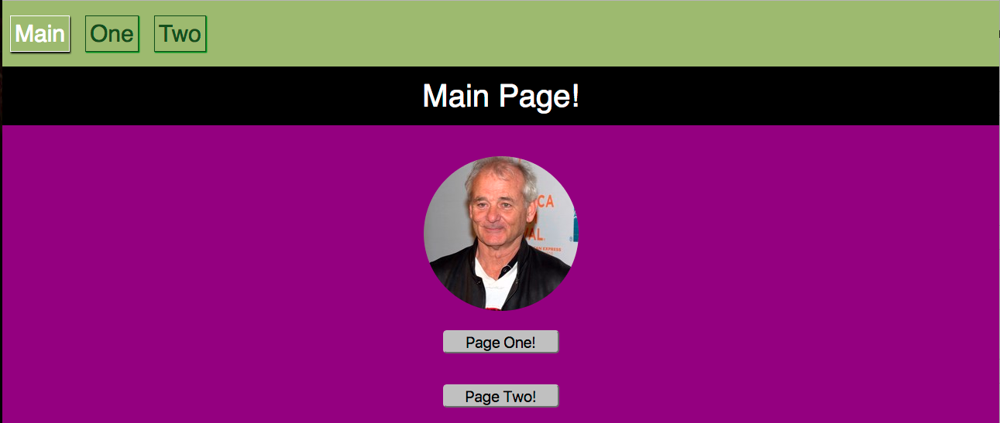
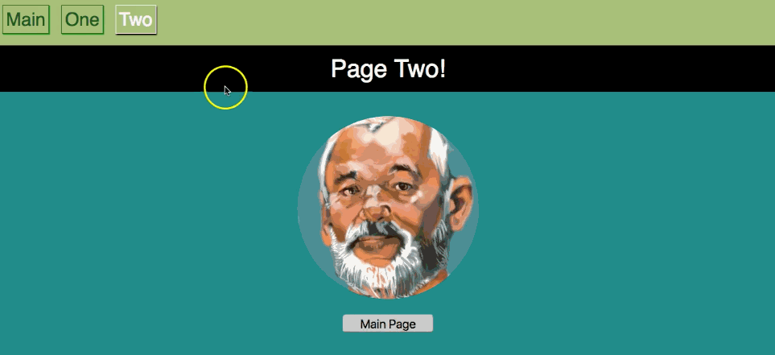

# How to Incorporate a Layout Component into Our React App  

Now that we have looked a very simple application using the React Router to navigate between views, let's dive deeper into common layouts within a React application.

It's a best practice to store often repeated elements in separate files to avoid duplication of code. A header or a sidebar element are simple examples of elements commonly displayed on multiple pages. These elements are called *layout components*.

Let's take a look at how we can insert a layout component at the top of an application.

## Layout Components  

First, create a component. This will our first layout component and the base of all pages on our application. Let's name it `<BaseLayout>` and store it in a file named `base-layout.js`.

```jsx
//############ base-layout.js ##############
import React, { Component } from 'react';

export default class BaseLayout extends Component {
  render() {
    return (
      <div>
        <header>
          <h1>Bill Murray</h1>
          <p className="bill">In Bill We Trust</p>
        </header>
        {this.props.children}
        <footer>
          <h5>Murray Rocks</h5>
        </footer>
      </div>

    )
  }
}
```

There isn't much complexity here. We are creating a container `<div>` to return from our `render` method and inside of that we have a `<div className="header">` and a `<footer>`. In between these two sections we are passing in `{this.props.children}` which will allow us to render components inside of this layout.

### Bringing It All Home  

Let's look at our `index.js` file.

```jsx
import registerServiceWorker from './registerServiceWorker';

//import React
import React from 'react';
import ReactDOM from 'react-dom';

//import Styles
import './styles/index.css';

//import React Router
import {BrowserRouter, Route, Switch} from 'react-router-dom';

//import Components
import App from './scripts/components/App';
import PageOne from './scripts/components/page_one';
import PageTwo from './scripts/components/page_two';
import BaseLayout from './scripts/components/base-layout';

ReactDOM.render(
  <BrowserRouter>
    <BaseLayout>
      <Switch>
        <Route path="/page_one" component={PageOne} />
        <Route path="/page_two" component={PageTwo} />
        <Route path="/" component={App}/>
      </Switch>
    </BaseLayout>
  </BrowserRouter>

  ,
  document.getElementById('root'));
registerServiceWorker();
```

Within `index.js`, our entire application is nested inside of `<BrowserRouter>`. We import our `<BaseLayout>` layout component the same way we import other components. Then we use `<BaseLayout>` to wrap the `<Switch>` component which wraps our `<Route>` components. By doing this we return one container inside of `<BrowserRouter>`. `<BaseLayout>` is ready for rendering child components because of the `{this.props.children}` included inside of itself.

Let's take a look how this would appear with minor styling. We expect to see the `<BaseLayout>` to be rendered on each page.

Here is our main `<App>` component page...


...and here is our `<PageOne>` component page.


We have successfully introduced a layout component and displayed it with nested child components in our web application.

## Conclusion  

* We can nest many pages within a component using React Router.

* Passing `{this.props.children}` inside the layout component ensures that it will always be able to render other components inside of itself.

* With React Router, we can use the layout component as a container to wrap all of our `<Route>` components and our `<Switch>` component.

---

# Use Exact Path to Render a Specific Route  

Often times in an application we rely on what is called an *index route*. An index route holds the base components for the application and generally is the place first visited by the user. Frequently, the route that corresponds to the index route is a simple `/`, this means that in the address bar of the browser, a user will simply see the base URL. For example, if we had a website `moviesite.com/` the trailing `/` would indicate that we were on our index route.

## Issues with the Index Route  

The index route is complicated by the fact that it matches ALL of the other routes for an application, at least partially, because they too contain the `/`. When we first set up our React Router application, we discussed the level of specificity needed to determine which route was rendered on a page. We discussed that we put our most complex routes at the top so as the router moves through each route it is able to determine if they match completely to the route path provided. This works for us. However, there is a better way to guarantee our route matches.

### Exact Path  

When we declare an index route, we can use the `exact` attribute to ensure that our path will be met only under strict and exact standards. Not only is this important for our index route but also in a route where exclusive and deliberate matching is needed. Let's take a look at this in action.

```jsx
class App extends Component {
  render() {
    return (
      <BrowserRouter>
        <BaseLayout>
          <Switch>
            <Route exact path="/" component={HomeMenu} />
            <Route path="/people/:actor" component={ActorInfo} />
            <Route path="/people" component={PeopleMenu} />
          </Switch>
        </BaseLayout>
      </BrowserRouter>
    );
  }
}
```

In the example above you can see we are no longer confined to leaving our least complex routes (like index route) down at the bottom of our `<Switch>`. Using `<Route exact path="/" component={HomeMenu} />`, the route is specifically a `/` that will render our `<HomeMenu />` component. This takes some of the confusion away from our program and also allows us to be sure of what route will render. As a note, using `exact` will not work for us when creating dynamic routes, such as the `/people/:actor` and `/people` paths above. We will discuss this in future lessons but it's important to know that we must use our most complex route `/people/:actor` above our `/people` or the `<ActorInfo />` component would never render. We can't use `exact` there because the path is dynamic and set change based on a user selection that our router can not predict.

## Conclusion  

* Using `exact` guarantees that a certain route will render when the endpoint matches exactly.

* `exact` is a means for rendering our index route of an application.

* We can't use `exact` for dynamic routes.

### References  

* [Exact Path](https://reacttraining.com/react-router/web/api/Route/exact-bool)

---

# Active Navigation Links with React Router  

Let's talk about active navigation links, and how we can style them in React Router easily and efficiently using `<NavLink>` components.
## The NavLink Component  

In the following example, we'll create a simple "SPA" with a navigation bar. This navigation bar will be present on all of our pages and should help direct us to the other portions of our application while also signaling the current page.

### The Set Up  

Notice in the `index.js` file we've added `NavLink` to our list of imported components from `react-router-dom`. We'll then call that component to create a navigation element that has some useful attributes available.

```jsx
//########### index.js ##############
import registerServiceWorker from './registerServiceWorker';

//import React
import React from 'react';
import ReactDOM from 'react-dom';

//import Styles
import './styles/index.css';

//import React Router
import {BrowserRouter, Route, Switch, NavLink} from 'react-router-dom';

//import Components
import App from './scripts/components/App';
import PageOne from './scripts/components/page_one';
import PageTwo from './scripts/components/page_two';

ReactDOM.render(
  <BrowserRouter>
    <div>
      <nav>
        <NavLink activeClassName="selected" className="nav-link" exact to="/">Main</NavLink>
        <NavLink activeClassName="selected" className="nav-link" to="/page_one">One</NavLink>
        <NavLink activeClassName="selected" className="nav-link" to="/page_two">Two</NavLink>
      </nav>

      <Switch>
        <Route path="/page_one" component={PageOne} />
        <Route path="/page_two" component={PageTwo} />
        <Route path="/" component={App}/>
      </Switch>
    </div>
  </BrowserRouter>

  ,
  document.getElementById('root'));
registerServiceWorker();
```

It's important to note that inside of our `<BrowserRouter>` we're limited to return one child element, the same with any of our component render methods. To make this style of code valid, we must wrap both our `<NavLink>` and `<Switch>` components in an outside `<div>`.

We will come back to the `NavLink` component later on, but first, let's take stock of what we have so far.

Inside of our `<nav>` we have passed some `<NavLink>` components. Each `<NavLink>` component has attributes that we are able to call upon to make our life easier.

We won't go over them all, but here are some of the attributes that `<NavLink>` has:

* `activeClassName`(takes a string as value): `<navlink>` will check against the URL in the browser and when it matches, will add on a special class name that you define (a common one would be "selected" or "active"). This allows us to set a CSS style for the active class, which will allow us to see the active link compared to the others.

* `activeStyle`: the `activeStyle` attribute will take an object `{}` filled with style key value pairs. For example, if we wanted our active link to change font color and background color we would pass `activeStyle` an object like so:

```jsx
<NavLink
  activeStyle={{
    color: "blue",
    backgroundColor: "white"
  }}>Main Page</NavLink>
```

* `exact` is a boolean value that we've seen before. The `exact` keyword appears before the `to=` path declaration. This means that in order for any of the other attributes to be true, the path URL must exactly match the `to=` attribute.

```jsx
<NavLink activeClassName="selected" className="nav-link" exact to="/">Main</NavLink>
```

The above snippet would mean that if, and only if, the path was just "/" would any of the attributes work.

```jsx
<NavLink activeClassName="selected" className="nav-link" strict to="/home/">Main</NavLink>
```

* Lastly, we have `isActive:`, which takes a function that's used if you want to do more than verify that the link's pathname matches the URL's pathname. You may only want a link to be active if an id number was odd, or some other similar scenario.

### NavLink `activeClassName` 

The `activeClassName` attribute gives us the JavaScript logic needed to check if our link is active without having to write utility functions to determine where we are in our app. This is a big time saver and makes our app even more efficient with out having to write extra code for styling. Simply add a class (in this example we will use `"selected"`) and give a path to match against (i.e. `to="/page_one"`). Then either use `activeStyle` or plain CSS to add some styling. When a user navigates to the provided path, the provided class will be applied to that `NavLink` element only.

Let's check the CSS and see what styles are being applied.

```jsx
nav {
  background-color: #a4ba70;
  padding: 25px 0;
}

.nav-link {
  color: #2d4f1c;
  text-decoration: none;
  border: 1px solid #2d4f1c;
  font-size: 30px;
  padding: 5px;
  margin: 10px;
  box-shadow: 1px 1px 1px green;
}

.selected {
  color: #ffffff;
  border: 1px solid #ffffff;
  box-shadow: 1px 2px 2px #000000;
}
```

We can see a normal (non-active) class called `nav-link`, which has default styling for our links in the `nav-bar` class. Then we add styling for the class `selected` (which differs from the default) and allows the link to the page we are on to stand out from the others. This helps for both user experience and ease of navigation.

Let's see what this looks like on the main page. We would expect our `NavLink` to take on the characteristics of the `selected` class and appear white, while the others remained green.



And it works! Amazingly simple solution for our navigation needs.

## Pulling It All Together  

Putting the NavLinks into their own, stand alone component is great for efficiency purposes. Let's clean up our code a little by creating a new component called `NavBar`, in a new file `namednav.js`.

```jsx
//############## nav.js ################
import React, { Component } from 'react';

import { NavLink } from 'react-router-dom';

export default class NavBar extends Component {
  render() {
    return (
      <div>
        <nav>
          <NavLink activeClassName="selected" className="nav-link" exact to="/">Main</NavLink>
          <NavLink activeClassName="selected" className="nav-link" to="/page_one">One</NavLink>
          <NavLink activeClassName="selected" className="nav-link" to="/page_two">Two</NavLink>
        </nav>
        {this.props.children}
      </div>

    )
  }
}
```

We extracted our `<NavLink>` components from the `index.js` file and put them into their own component. Now we can export and import this component to any other component we wish. We use `{this.props.children}` to allow this component to render all the other components inside of it when they're called.

Because we want this to appear on every page of our app it makes the most sense to render this component inside of our `index.js`. We could handle that by importing to each of our components but that would not be DRY programming.

Let's take a look back at our refactored `index.js` page now. (*You can scroll back up and look at what it looked like before the refactor to compare*).

```jsx
import registerServiceWorker from './registerServiceWorker';

//import React
import React from 'react';
import ReactDOM from 'react-dom';

//import Styles
import './styles/index.css';

//import React Router
import {BrowserRouter, Route, Switch, NavLink} from 'react-router-dom';

//import Components
import App from './scripts/components/App';
import PageOne from './scripts/components/page_one';
import PageTwo from './scripts/components/page_two';
import NavBar from './scripts/components/nav';

ReactDOM.render(
  <BrowserRouter>
    <NavBar>
      <Switch>
        <Route path="/page_one" component={PageOne} />
        <Route path="/page_two" component={PageTwo} />
        <Route path="/" component={App}/>
      </Switch>
    </NavBar>
  </BrowserRouter>

  ,
  document.getElementById('root'));
registerServiceWorker();
```

We added the `<NavBar>` components to our lists of imports and then we use the opening and closing `<NavBar></NavBar>` tags to wrap our `<Switch>` component. `<NavBar>` knows to expect child components because we passed it `{this.props.children}` inside of its opening and closing tags in the `nav.js` file. This is a nice and tidy solution for our simple app and demonstrates the capabilities of the `<NavLink>` component and the efficient means with which we are able to style our active links.

## Let's See It in Action  



## Conclusion  

* We can use the NavLink component from react-router-dom to have access to styling attributes for active links in our navigation bar.

* Active links help display the current page a user is on by differentiating the active link from the other links in the navigation bar.

* `<NavLink>` comes with some key attributes, the most commonly used are the `isActive` and `activeClassName`.

  * `activeStyle` takes an object with our styling wishes as a normal React element would receive.

  * `activeClassName` is a class that gets added on to the components classes when the link matches the pathname for the URL.

* We can use `exact` to ensure the pathname matches exactly to our URL (usually needed for our index route `/`).

### References  

* [React Training](https://reacttraining.com/react-router/web/api/NavLink/isActive-func)
